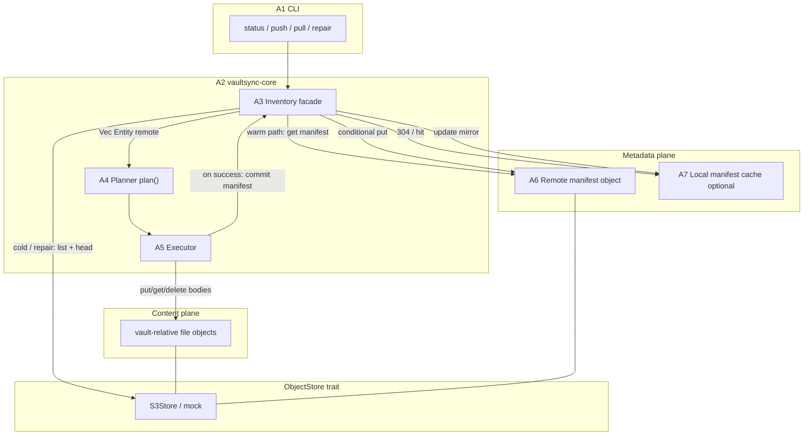

# Inventory manifest (design note)

**Status:** implemented (issue 45, W219-W246 landed on the worktree
`worktree-inventory-manifest-issue-45`; docs W247-W248). Q1-Q8 locked - see
[issue-45 plan](plans/issue-45.md) "Locked decisions" (mirrored to the issue).
**Context:** issue #42 (plan-build latency on large vaults); I15 head-on-list cost; vision "plain objects" softened only for a rebuildable index.
**Decision class:** option 1 from the S3 large-vault discussion - keep S3, add a metadata plane.

This note locks a concrete **remote manifest** format and the read / write / repair flows against today's `ObjectStore` trait (`src/store/mod.rs`). A **local cache of that remote manifest** is specified as a follow-on layer with fixed roles (remote = authority, local = cache).

Related docs: [vision.md](./vision.md), [object-store.md](./object-store.md), [sync-model.md](./sync-model.md), [architecture.md](./architecture.md), [roadmap.md](./roadmap.md).

---

## 1. Problem restatement

Every list-driven command (`status`, `push`, `pull`) builds a plan from a full remote inventory. On S3 that is:

1. sequential `ListObjectsV2` pages (`max_keys=1000`), then
2. **N** `HeadObject` calls so plans see client `vaultsync-mtime` (I15),

with no progressive UX until the plan exists (#42). Measured cost on a multi-thousand-object prefix is minutes of wall time under typical cross-region RTT. Transfers are fine; **inventory is the product bottleneck**.

Locked tension (pick three of four - we cannot keep all four on naked S3):

| Constraint | Today |
| --- | --- |
| Stateless (no local prev-sync DB) | yes |
| No remote control-plane object | yes |
| Exact client mtime identity (I15) | yes |
| Fast plan on 10k-20k files | **no** |

This design drops "no remote control-plane object" in a minimal, rebuildable way.

---

## 2. Goals and non-goals

### Goals

1. Daily `status` / `push` / `pull` plan build in a small number of RTTs when a warm manifest exists (target: **one** conditional or unconditional GET of the manifest body, plus local walk).
2. Preserve planner semantics: same `Entity` shape, same equal/newer/conflict rules, same `--delete` meaning.
3. Preserve plain file bodies at vault-relative keys; the manifest is **derived metadata**, not a second copy of file bytes.
4. Survive multi-device use: any machine with bucket access can plan quickly after another machine's successful push.
5. Crash and multi-writer safety: never publish a manifest that claims objects that were not stored; never silently clobber a newer writer's manifest.
6. Always retain a slow path (`repair` / bootstrap) that rebuilds the manifest from live `list` + `head` (today's I15 path).
7. Stay inspectable: manifest is readable JSON; `vaultsync` can print generation / entry count / source.

### Non-goals (this design)

- Bidirectional deletion journal / prev-sync history (still post-v1; see vision).
- Content checksum mode (`--checksum`) as the equality primary.
- Sharded manifests (may appear later if a single object becomes unwieldy; 10k-50k file JSON is expected to stay comfortably under tens of MB).
- Signed/encrypted manifests.
- Changing S3 page size or dropping I15 mtime identity on the repair path.
- Making local cache authoritative for `--delete`.

---

## 3. Architecture overview

Stable component ids below are for cross-reference in later plans (`A1`...`A7`).



### Layering rules

- **A3 Inventory** sits above `ObjectStore`. The planner (A4) still receives `local: &[Entity]` and `remote: &[Entity]`; it does not know whether remote came from manifest or list+head.
- **A6 Remote manifest** is an ordinary object addressed through the existing trait (`get_to` / `put_from` / `head` / `delete`), under a reserved key. No provider-specific API is required for the happy path except **conditional put** (see section 8 gap).
- **A7 Local cache** is optional and never authoritative.
- File bytes stay on vault-relative keys (content plane). Manifest keys never enter `plan()` action rows (reserved filter, same ethos as `.vaultsync-check-*`).

### Authority

| Data | Authority |
| --- | --- |
| File bytes at vault-relative keys | object store bodies |
| Remote inventory used for planning | **remote manifest** when present and accepted; else live list+head |
| Local cache file under the vault | cache of remote manifest only |
| Client mtime on a body | object user metadata `vaultsync-mtime` (I15); manifest **copies** it for inventory speed |

---

## 4. Reserved namespace and object keys

### 4.1 Remote keys (under the configured store prefix)

Single-object v1 layout (sharding deferred):

```text
s3://bucket/<prefix>.vaultsync/manifest/v1.json
```

Vault-relative key (planner/store key space):

```text
.vaultsync/manifest/v1.json
```

Optional future siblings under the same directory (not v1):

```text
.vaultsync/manifest/v1.json       # current committed inventory
.vaultsync/manifest/v1.schema     # only if we later split schema docs; avoid for now
```

**Commit strategy for v1:** overwrite the same key with a **conditional put** (`If-Match` on the base manifest's object ETag). No indirection pointer object in v1 (simpler repair and fewer RTTs). If conditional put proves too weak on a target provider, revisit a `HEAD` generation + unique object name scheme in a follow-up decision.

### 4.2 Reserved-key policy extension

Today reserved final-segment names cover:

- `.vaultsync-check-*` (connectivity probe)
- `.*.vaultsync-tmp-*` (temp siblings)

**Must extend** the reserved filter (local walk + remote ingest + pre-head partition) so control-plane keys never plan as downloads/uploads/deletes:

1. Any key equal to `.vaultsync/manifest/v1.json`, and
2. Any key under the prefix `.vaultsync/` (directory form: first path segment exactly `.vaultsync`).

Local tool state (cache) lives on disk at `<vault_root>/.vaultsync/` and **must** be excluded from the local walk via the same rule (and/or a built-in ignore), so the cache directory is never uploaded as vault content.

`check` probes stay on `.vaultsync-check-*` at the prefix root (unchanged); they must not be placed under `.vaultsync/manifest/`.

### 4.3 Local cache paths (optional layer)

```text
<vault_root>/.vaultsync/cache/manifest-v1.json
<vault_root>/.vaultsync/cache/manifest-v1.meta.json
```

`manifest-v1.meta.json` holds at least:

```json
{
  "remote_etag": "\"....\"",
  "fetched_at_ms": 0,
  "source_key": ".vaultsync/manifest/v1.json"
}
```

Owner-only file mode on Unix when creating (`0o600`), consistent with upload/download temps.

---

## 5. Manifest format (normative sketch)

### 5.1 Media and encoding

- UTF-8 JSON, object at top level (not a bare array).
- Compact or pretty: writers **should** emit compact JSON (smaller GET); pretty is allowed for debug dumps.
- Content-Type on put: `application/json` when the backend allows setting it; not required for correctness.
- Max size expectation: well under the 5 GiB single-PUT ceiling; implementations **may** refuse a parsed manifest above a configured soft cap (e.g. 64 MiB) to avoid pathological memory use.

### 5.2 Schema

```json
{
  "schema": "vaultsync.manifest.v1",
  "created_ms": 1735689600000,
  "generator": "vaultsync 0.x.y",
  "prefix": "optional/vault-prefix/",
  "entry_count": 2,
  "entries": [
    {
      "key": "notes/a.md",
      "size": 1204,
      "mtime_ms": 1735689000000,
      "etag": "\"abcedf123\""
    },
    {
      "key": "img/b.png",
      "size": 98011,
      "mtime_ms": 1735689100000,
      "etag": "\"99aabb\""
    }
  ]
}
```

| Field | Required | Meaning |
| --- | --- | --- |
| `schema` | yes | Constant `vaultsync.manifest.v1`. Unknown schema => reject manifest, fall through to cold path or error (mode-dependent). |
| `created_ms` | yes | Writer wall time (ms since epoch) when this manifest body was produced. Diagnostic only; not used for file equality. |
| `generator` | no | `vaultsync` version string. |
| `prefix` | no | Store prefix the writer believed it owned (documentation / mismatch warnings). |
| `entry_count` | yes | Must equal `entries.len()`; mismatch => corrupt. |
| `entries` | yes | Array of file entries. |

**Per-entry fields:**

| Field | Required | Meaning |
| --- | --- | --- |
| `key` | yes | Vault-relative file key; `ensure_valid_key` must pass; **must not** be a folder (`trailing /` forbidden in entries). |
| `size` | yes | Byte size (`u64`). |
| `mtime_ms` | yes | Client mtime ms; JSON number. Use `null` only if unknown (rare on a post-I15 push path; repair may copy head's `None`). |
| `etag` | no | Opaque remote body etag when known. Planner still ignores etag for equality (4d policy) unless a future checksum mode says otherwise; stored so repair/debug and future trust-etag can use it. |

### 5.3 Ordering and uniqueness

- Writers **must** sort `entries` by `key` ascending (byte-wise, same as today's listing sort).
- Writers **must** reject duplicate keys when building the body.
- Readers **must** fail closed on unsorted input only if they choose to verify; recommended: **accept any order, sort after parse**, fail on duplicate keys.

### 5.4 What is not in the manifest

- Folder entries (synthesize folder views from file keys exactly as `convert_listed` / `ObjectStore::list` does today).
- File bodies or content hashes (post-v1 checksum mode may add an optional field later without breaking `schema` if we bump to `v2`).
- Ignore-pattern snapshots (filters apply when building plans, as today).
- Per-device ids or deletion journals.

### 5.5 Mapping to `Entity`

```text
Entity {
  key:      entry.key,
  size:     entry.size,
  mtime_ms: entry.mtime_ms,   // Option
  etag:     entry.etag,       // Option
}
```

Then run the same folder-synthesis path used after a raw S3 list so planners see identical folder Skip behavior.

---

## 6. Read flow (plan build)

Used by `status`, `push`, `pull` (and `--dry-run` variants) before `plan()`.

```text
build_remote_entities(store, opts) -> (Vec<Entity>, InventorySource, warnings)

InventorySource =
  | Manifest { remote_etag: Option<String> }
  | LiveListHead
```

### 6.1 Algorithm

```text
1. If inventory.mode == "list_head":
     return live_list_head(store)     # today's path; source = LiveListHead

2. Try load remote manifest key `.vaultsync/manifest/v1.json`:
   a. Optional local cache (section 9):
        If cache meta has remote_etag, conditional GET (If-None-Match).
        On 304: parse cache body; source = Manifest { that etag }.
   b. Else unconditional get_to into memory (or cache file then parse).
        On NotFound: goto 3.
        On other errors: fail closed (do not silently plan empty).

3. Parse + validate schema / entry_count / keys.
   On corrupt:
     - mode "manifest" (strict): error, suggest `vaultsync repair`
     - mode "auto" (default): warning + goto 4

4. Cold path: live_list_head(store)  # ListObjectsV2 + enrich_with_head_mtimes
   source = LiveListHead
   Do not auto-write a new manifest here (read path has no write side effects
   except optional cache fill when a valid remote manifest was fetched).

5. Apply reserved-key partition + ignore filter (existing build_plan order).
6. Return file entities (+ synthesized folders) to build_plan.
```

### 6.2 Modes (`[inventory]` config sketch)

```toml
[inventory]
# auto      - use manifest when valid; else live list+head (default)
# manifest  - require valid manifest (fail if missing/corrupt)
# list_head - never read manifest (debug / bisect / #42 baseline)
mode = "auto"
```

No CLI flag required for v1 of the feature; config-only is enough (same spirit as `[transfer].concurrency`). A later `vaultsync status --full-inventory` can force `list_head` for one run.

### 6.3 Progress (interaction with #42)

Even with a warm manifest, emit a short stderr milestone on TTY, e.g. `inventory: manifest (12 403 entries)` vs `inventory: list+head (cold)`. Cold path **must** reuse the plan-phase progress work from #42 (page/head counters).

---

## 7. Write flow (commit after mutating remote)

### 7.1 When to write

| Command | Remote bodies change? | Commit manifest? |
| --- | --- | --- |
| `status` | no | no (Q3) |
| `status --write-manifest` (issue 48) | no | **yes**, explicit B1 opt-in on a cold auto store |
| `pull` / `pull --delete` | no | no |
| `push` (uploads only) | yes | **yes**, if any upload succeeded or planned remote set changed |
| `push --delete` | yes | **yes**, after successful uploads **and** successful remote deletes for this run |
| `push` cold bootstrap (issue 48) | no | **B1**: publishes a pre-transfer baseline (or adopts) |
| `repair` | no body requirement | **yes** (always writes a fresh snapshot) |
| `check` | probe only | no (probe key reserved; not inventory) |

If a push run had **zero** successful remote mutations, skip commit (manifest already matched the plan's view of remote for those keys).

### 7.2 Base snapshot

Planning must remember the inventory base:

```text
InventoryBase {
  source: InventorySource,
  entities: Vec<Entity>,          # file entities only, pre-ignore or post-ignore? see below
  manifest_etag: Option<String>,  # object etag of v1.json when source was Manifest
}
```

**Ignore interaction:** the manifest stores the full remote file set under the prefix (minus reserved keys), **not** the ignore-filtered view. Ignore remains a plan-time filter on both sides (D-both-sides). Reasons:

- changing ignore patterns must not require a manifest rewrite,
- two devices with different local ignore still share one remote truth,
- repair can rebuild without config.

Reserved `.vaultsync/**` keys are never stored as entries.

### 7.3 Applying a push result

After executor finishes remote-mutating actions:

```text
start from base file-entity map (key -> Entity)
for each successful Upload:
  upsert key with local size + local mtime_ms + etag from put_from result
for each successful DeleteRemote:
  remove key
for each failed Upload/DeleteRemote:
  leave base entry unchanged (body may be partial - see crash rules)
build sorted entries, wrap schema, put_from conditional
```

Failed uploads that may have left a partial/new remote object are an existing executor problem; manifest commit **must not** claim success for failed keys. If put returned Ok, upsert; if Err, do not upsert.

### 7.4 Conditional commit

```text
put manifest body to `.vaultsync/manifest/v1.json`
  WARM base (base.manifest_etag is Some):
    with If-Match: base.manifest_etag
  COLD base (base.manifest_etag is None - LiveListHead, missing, or forced
  mode): H1-V validate-before-overwrite against the LIVE object:
    head(MANIFEST_KEY)
      absent => If-None-Match: *                  (create)
      present with NO etag (etag-less backend) => unconditional put on the
        cold resolve path ONLY - multi-writer safety is lost there (design
        note: manifest mode assumes an etag-capable backend)
      present with etag => GET + parse/validate the live body (H1-V, issue
        48, F1/F1b): the conditional If-Match etag is the GET entity etag
        when the validate probe returns one (the generation we validated,
        matching the warm-load GET authority); a HEAD etag that DIFFERS from
        the GET etag means another writer changed the object between HEAD
        and GET - fail closed (Err; F2 policy decides abort/continue), never
        If-Match a mixed pair. Oversize-pre-GET and tripped-writer heals
        still If-Match the HEAD etag (no trustworthy GET body).
        VALID body => fold successes onto THEIR entries
          (apply(base.successes) onto their.file_entities) and If-Match
          THEIR etag - their untouched keys survive this commit (never a
          blind clobber of a concurrent-valid manifest)
        corrupt body  => heal via If-Match on the live etag with
          apply(base, successes)
```

A cold base means "resolve the live condition at commit time", NOT "always
If-None-Match: *" and NOT "always blind overwrite": a present corrupt body
or a manifest written under `list_head` planning must be overwritable, but a
concurrent-valid manifest must never be silently clobbered (H1-V, W291).
`list_head` forces cold PLANNING only - push still commits, so other devices
on `auto` keep a fresh control plane. A WARM base keeps If-Match on the base
etag with no extra head.

Outcomes:

| Result | Behavior |
| --- | --- |
| Ok | update local cache; done |
| Precondition failed | **do not overwrite**. Warn: `manifest not committed (lost race or changed under us); run vaultsync repair if status looks wrong`. Bodies from this push may still be live. Exit: prefer **0** if transfers succeeded (data ok) with warning, or **2** if we want scripts to notice - **proposal: warning + exit 0 when only commit lost the race; document**. |
| Other error | warning or hard error; transfers already done - same "bodies ahead of manifest" repair story |

### 7.5 Crash ordering (normative)

**Bodies first, manifest last.** Same ethos as "transfers first, deletes last" in the sync model.

```text
OK states after crash:
  - bodies behind manifest  => next push re-uploads missing; status shows dirty
  - bodies ahead of manifest => status may under-report remote until repair
                              or next successful commit from a push that re-reads live

Forbidden writer behavior:
  - publish manifest entries for keys whose put_from did not succeed this run
```

On lost conditional race: another writer committed first; their manifest may or may not include our bodies. **repair** is the convergence hammer.

### 7.6 Empty vault / first push

- No manifest + empty remote: a `push` on `auto` + `push-ensure` may B1 a **0-entry** baseline before transfers (warm empty baseline, IQ-empty); otherwise push uploads files, then the final commit creates the manifest with `If-None-Match: *`.
- If create loses race: warning (final commit) / abort (B1, see 7.7); repair.

### 7.7 Push-time inventory bootstrap (issue 48, B1 / C-PA)

A fresh `push` (or explicit `status --write-manifest`) can publish the remote
manifest from a COLD inventory instead of waiting for an upload to succeed.
This removes the "cold-lists every run until a file changes" wall: after one
cold inventory on an eligible push, later plans are warm even when transfers
failed or none were planned.

**B1 (`ensure_remote_manifest`)** publishes `base.file_entities` (the
pre-transfer remote file set, pre-ignore, post-reserved - D-body) as a new
manifest with the same conditional put rules as commit, OR **adopts** a
concurrent-valid live manifest without writing (H1-V, F1). It never re-lists
and never claims in-flight uploads: the final commit still applies successful
mutations last (7.5).

**Authority is unchanged (D-auth).** Planning still happens only from a valid
remote manifest or a live list+head; the local cache (section 9) is a 304
mirror and is never an authority. B1 simply makes the next plan warm sooner.

**Cache (D-cache / D-n5).** On `Written` the local cache mirror is refreshed
with the new body + etag; on `Adopted` no cache write is done in v1 (the next
warm load fetches/304s). After a `Written { etag: None }` on an etag-less
backend, the refreshed base is still a warm `Manifest { remote_etag: None }`
(warm for the B1 predicate; the final commit may H1 again on that backend)
- the residual multi-writer hole on etag-less backends is documented, not
closed (N5).

**Adopted refresh installs the winner snapshot (PR50-r1 H1).** After
`Adopted`, the in-memory base's `file_entities` are replaced by the parsed
adopted manifest's file set (not the stale cold list) and the source/etag
warm - so before any transfer the base already holds the winner's complete
snapshot, and the final commit folds our successes onto it without dropping
their untouched keys (review 5476323432).

**Failure policy (F2 split).** Push + `PreconditionFailed` (another writer
won) aborts before any transfer - without B1 for a warm baseline,
the final commitment could cascade-clobber the winner with a stale cold base
(F0). Push + a transient `Err` warns and continues cold (availability).
`status --write-manifest` fails closed (exit 1) on any bootstrap failure - the
write is the requested op.

**Stale-authority window (F7).** B1 advances the publish time of a snapshot
that is already ~list-duration old; concurrent readers between B1 and the
final commit plan from that (authoritative) manifest where they previously
cold-listed truth. Inherent to the manifest design; the next commit / repair
converges. Accepted.

---

## 8. `ObjectStore` trait impact

### 8.1 No change required for MVP read path

Manifest read = `get_to(MANIFEST_KEY, &mut buf)` then parse.  
Warm existence probe = `head(MANIFEST_KEY)` optional.

Live cold path = existing `list` (already list+head enriched on S3).

### 8.2 Gap: conditional put / conditional get

Today:

```text
put_from(key, r, size, mtime_ms) -> Entity
get_to(key, w) -> Entity
```

There is **no** If-Match / If-None-Match surface. Manifest commit and efficient local cache need it.

**Proposed additive extension** (minimal, backward compatible):

```rust
pub struct PutOpts {
    pub mtime_ms: Option<u64>,
    /// When Some, backend must put only if object's current ETag matches.
    pub if_match_etag: Option<String>,
    /// When true, backend must put only if the key does not exist.
    pub if_none_match_star: bool,
}

pub struct GetOpts {
    /// When Some, NotModified if object's ETag matches (HTTP 304 semantics).
    pub if_none_match_etag: Option<String>,
}

// Either extend put_from with PutOpts, or add:
fn put_from_with(&self, key: &str, r: &mut dyn Read, size: u64, opts: PutOpts)
    -> Result<Entity, Error>;
fn get_to_with(&self, key: &str, w: &mut dyn Write, opts: GetOpts)
    -> Result<GetOutcome, Error>;

enum GetOutcome {
    Body(Entity),
    NotModified(Entity), // head-like metadata when 304
}
```

Default `put_from` / `get_to` remain thin wrappers with empty opts.

New error variant (or structured `Other` until enum break is acceptable):

```text
Error::PreconditionFailed { key }
Error::NotModified { key }   // only if not using GetOutcome
```

**Mock store:** implement conditions against in-memory etag for tests.  
**S3 store:** map to AWS SDK conditional headers.  
**Providers without condition support:** document as "manifest commit is best-effort last-write-wins" and force single-writer ops note - not ideal; prefer requiring conditions on the S3 path.

### 8.3 Alternative without trait break (rejected as primary)

Special-case manifest IO inside `S3Store` only. Rejected as primary because:

- inventory facade would branch on backend type,
- mock tests could not lock race behavior,
- Azure/GCS later would re-do the same gap.

---

## 9. Local cache (phase 2 of this feature)

### 9.1 Role

- **Never** authority for planning deletes or equality if remote manifest fetch fails open.
- Speeds repeated `status` on the same machine when the remote object is unchanged (304).
- May be absent; behavior must match remote-only.

### 9.2 Flow

```text
read:
  meta = read manifest-v1.meta.json if present
  get_to_with(If-None-Match: meta.remote_etag)
  if NotModified: parse local manifest-v1.json
  if Body: write body + meta atomically (temp + rename), parse

write after successful remote commit:
  mirror new body + new etag into cache (temp + rename)
invalidate:
  any parse failure or schema mismatch deletes cache files best-effort
```

### 9.3 Security / privacy

- Cache contains the same path inventory as the bucket prefix (keys, sizes, mtimes). Anyone who can read the vault disk can read it - same as reading the notes.
- No credentials in cache files.
- Not a substitute for bucket IAM.

---

## 10. Repair flow

### 10.1 Command sketch

```text
vaultsync repair              # rebuild manifest from live list+head; conditional or force
vaultsync repair --dry-run    # show entry count / sample; write nothing
vaultsync repair --force      # overwrite manifest even if If-Match would fail
```

Exit codes: align with push (0 ok, 1 error). No plan table required; print a short summary:

```text
repair: listed 18390 objects via list+head in 210s
repair: wrote .vaultsync/manifest/v1.json (18390 entries, etag="...")
```

### 10.2 Algorithm

```text
1. live = live_list_head(store)   # full I15 path; show #42 progress
2. filter reserved keys out
3. build manifest body from live file entities
4. if --force: put_from without If-Match (overwrite)
   else if manifest exists: put with If-Match current etag (retry once on race)
   else: put with If-None-Match *
5. refresh local cache
```

### 10.3 When operators run repair

- First enablement on an existing bucket (bootstrap).
- After console/aws-cli uploads outside vaultsync.
- After repeated "manifest not committed" warnings.
- After suspected skew (`status` disagrees with raw `aws s3 ls` expectations).
- Migrating schema v1 -> v2 (future).

### 10.4 Does repair mutate file objects?

No. Repair only rewrites the control-plane object (and local cache).

---

## 11. End-to-end scenarios

### 11.1 Fresh bucket, first push

```text
status  -> no manifest -> cold list (empty) -> clean/dirty from local only
push    -> uploads -> create manifest (If-None-Match *)
status  -> GET manifest -> fast plan
```

### 11.2 Second machine pull

```text
pull    -> GET manifest -> plan downloads -> bodies only; manifest untouched
status  -> GET manifest -> fast
```

### 11.3 Two writers push concurrently

```text
A and B both planned against etag E0
A commits first (E1)
B finishes uploads, commit If-Match E0 fails
B warns; B's new objects may exist
repair on either machine (or next cold auto path) rebuilds truth from bodies
```

Single-writer-per-prefix remains the supported operational model (matches today's no distributed lock on S3). Conditional put is a safety net, not a multi-master session layer.

### 11.4 Manifest deleted by hand

```text
status (auto) -> NotFound -> cold list+head -> works, slow
repair -> recreates manifest
```

### 11.5 `push --delete`

```text
plan from manifest
uploads first, remote deletes last (existing executor order)
commit manifest reflecting successful deletes only
```

---

## 12. Interaction with existing locks

| Lock / issue | Interaction |
| --- | --- |
| I15 head-on-list | Cold/repair path **unchanged**. Warm path skips N heads. |
| I20 concurrency | Cold path still uses pool for heads; warm path irrelevant. |
| #27 transfer progress | Unchanged (executor). |
| #42 plan-phase progress | Still needed for cold/repair; warm path gets a one-line inventory source message. |
| W61 fail-closed partial list | Cold path keeps fail-closed. Corrupt manifest does not invent a partial file set in `manifest` mode. |
| W118 reserved partition | Extend for `.vaultsync/**`. |
| Ignore D-both-sides | Manifest unfiltered; ignore at plan time. |
| Vision "minimal remote intrusion" | One rebuildable JSON object; documented exception. |
| Vision "no local prev-sync DB" | Local cache is not a prev-sync deletion journal; optional and derived. |
| 4d etag policy | Manifest may store etags; planner still ignores them for equality in v1. |

---

## 13. Security considerations

1. **Confidentiality:** manifest reveals the key tree, sizes, and mtimes of the prefix. Anyone with `s3:GetObject` on the manifest key learns that inventory. Same class of disclosure as `ListObjects` + `HeadObject` today. No new secret material.
2. **Integrity:** without object-lock/signing, a writer with `s3:PutObject` can lie in the manifest. They can already overwrite bodies. Conditional put only prevents lost updates between cooperating vaultsync clients.
3. **Availability:** deleting the manifest forces cold path (degraded speed, not data loss).
4. **Local cache:** protect like the vault (disk permissions); do not put tokens in meta files.
5. **Path injection:** every entry key must pass `ensure_valid_key` before planning; reject `..`, absolute, control chars (existing rules).

No encryption claim is made; client-side crypt remains post-v1 and would wrap bodies (and likely the manifest) as a separate layer.

---

## 14. Performance expectations (order of magnitude)

Assume 18k files, ~1-5 MB manifest JSON, same RTT as #42's measurements.

| Path | Dominant cost |
| --- | --- |
| Warm manifest GET | 1 RTT + download ~few MB (~1-3 s typical) |
| Warm + local 304 | 1 small RTT (~0.5-2 s) + disk parse |
| Cold list+head | minutes (status quo #42) |
| Repair | same as cold + 1 put |
| Commit after push | 1 conditional put of ~few MB |

This meets the "daily driver CLI" bar when warm; cold remains acceptable for rare repair.

---

## 15. Testing plan (when implementing)

| Layer | Tests |
| --- | --- |
| Parse/validate | unit: schema, dup keys, entry_count mismatch, folder key rejected, sort |
| Map to entities | folder synthesis parity vs `convert_listed` |
| Mock conditions | If-Match success/fail; If-None-Match * create; 304 get |
| Commit apply | upsert upload, remove delete, failed action leaves base |
| build_plan integration | warm vs cold produce same plan on identical trees |
| Reserved | `.vaultsync/manifest/v1.json` never in plan rows; local `.vaultsync/` not walked |
| Race | two mock writers; loser surfaces warning, no clobber |
| Offline | no network in default `cargo test --lib --bins` |

Env-gated S3 integration: push -> status without N-head cost gauge (head count metric or timing band); repair bootstrap on pre-seeded prefix.

---

## 16. Rollout sequencing

| Step | Deliverable |
| --- | --- |
| S0 | This design note + tracking issue; decision log row when accepted |
| S1 | Reserved-key extension for `.vaultsync/**` (no behavior change elsewhere) |
| S2 | `PutOpts` / `GetOpts` (or `*_with`) on trait + mock + S3 conditionals |
| S3 | Manifest parse/serialize module + folder synthesis reuse |
| S4 | Inventory facade in `build_plan` read path (`auto` / `list_head` / `manifest`) |
| S5 | Commit path on successful `push` / `push --delete` |
| S6 | `vaultsync repair` (+ `--dry-run` / `--force`) |
| S7 | Local cache + conditional GET |
| S8 | Docs: README known behaviors, cli.md, object-store.md, roadmap decision |
| S9 | #42 plan-phase progress (can parallelize earlier; required for repair UX) |

**S1-S6** = "remote manifest first" (authority + usable product).  
**S7** = "local cache second".  
Do not ship S7 without S4-S5.

---

## 17. Open questions (resolve at implementation kickoff)

Record answers in the tracking issue "Locked decisions" before code.

| ID | Question | Proposal default |
| --- | --- | --- |
| Q1 | Default `inventory.mode` | `auto` |
| Q2 | Lost commit race exit code | warning + exit 0 if transfers ok |
| Q3 | Auto-write manifest after cold `status`? | **no** (read path side-effect free); only push commit + repair write |
| Q4 | Manifest `mtime_ms` null policy | allow null; classify via existing 4b unknown-mtime rules |
| Q5 | Soft cap on manifest bytes | 64 MiB parse cap |
| Q6 | Should `pull` ever write manifest? | **no** |
| Q7 | Trait extension shape | additive `put_from_with` / `get_to_with` |
| Q8 | GitHub issue vs packing into #42 | **separate** implementation issue; #42 stays latency/UX umbrella |

---

## 18. Summary

- **Remote manifest** at `.vaultsync/manifest/v1.json` is the **source of truth** for remote inventory when present and valid.
- **Local cache** is an optional mirror keyed by remote ETag; never authority for deletes.
- **Live list+head** remains the cold and repair path (I15 preserved where it matters).
- **Bodies first, manifest last**; conditional put prevents cooperating clients from clobbering each other.
- Trait needs a small conditional get/put extension; planner stays unchanged.

This is the concrete form of option 1 (S3 + metadata plane) without abandoning the rsync-like push/pull model.
