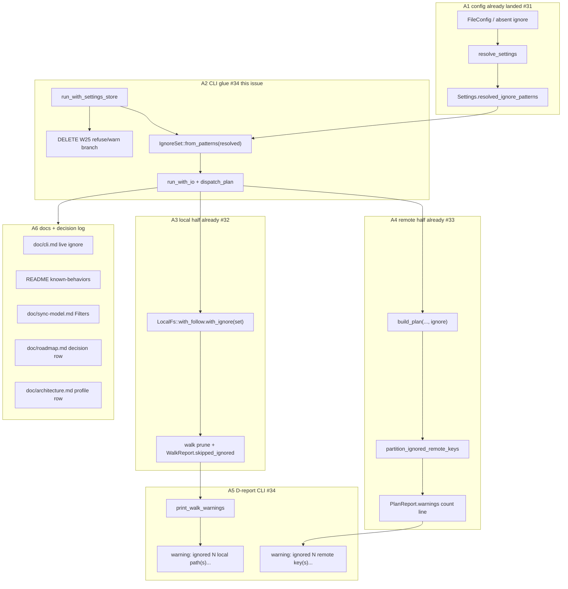

# Issue 34 plan: Wire ignores in CLI, retire W25, docs

**Status:** implemented (W203-W211 landed on
`worktree-wire-ignores-in-cli-retire-w25-docs`; full offline gate green:
`cargo test --offline --lib --bins` = 499 passed / 0 failed / 1 ignored at
W210, plus docs/comment sweep in W211)
**Issue:** https://github.com/tlkahn/vaultsync/issues/34 (OPEN; P2 of epic #9)
**Branch:** `worktree-wire-ignores-in-cli-retire-w25-docs` (this worktree; cut from
`main` tip `4d9f673` = #40 auto-assign fix after #33/#39 merge)
**Design refs:** issue #34 body (locked D-w25-retire, D-report CLI half,
default-profile activation, docs + decision log), epic #9,
sibling plans [issue-30.md](issue-30.md) (matcher), [issue-31.md](issue-31.md)
(profile/config), [issue-32.md](issue-32.md) (local walk),
[issue-33.md](issue-33.md) (remote filter), [cli.md](../cli.md),
[sync-model.md](../sync-model.md), [roadmap.md](../roadmap.md),
[architecture.md](../architecture.md), [README.md](../../README.md)
**Verified baseline (recorded at plan time):** tip `4d9f673`. Gate on this
worktree:
`cargo test --offline --lib --bins` = 489 passed / 0 failed / 1 ignored;
`cargo clippy --all-targets -- -D warnings` clean (assumed; re-confirm at
first RED);
`cargo fmt --check` clean (assumed; re-confirm at first RED).
**Blocker check:** depends on #30 + #31 + #32 + #33 - **all landed on
`main`**. This issue is glue + docs only. Closes epic #9 when done.

---

## Problem recap (from the issue, verified against the tree)

Epic #9 is complete in library/config form:

| Layer | Status | Source |
| ----- | ------ | ------ |
| Matcher | landed | `IgnoreSet` (`src/ignore.rs`, #30) |
| Profile + resolve | landed | `Settings.resolved_ignore_patterns`, `OBSIDIAN_DEFAULT_IGNORE_PATTERNS`, `profile = "none"` (#31) |
| Local walk prune | landed | `LocalFs::with_ignore`, `WalkReport.skipped_ignored` (#32) |
| Remote filter | landed | `build_plan(..., ignore: &IgnoreSet)`, PlanReport count warning (#33) |
| CLI wiring | **inert** | still `IgnoreSet::empty()` + W25/M3 refuse/warn |

Today (`src/cli.rs`):

| Site | Behavior |
| ---- | -------- |
| `run_with_settings_store` C1 | if `!settings.ignore_patterns.is_empty()`: push/pull/check **refuse** (exit 1, "Phase 3"); status **warns** and proceeds |
| Status `LocalFs` | `LocalFs::with_follow` only - **no** `with_ignore` |
| Status / `dispatch_plan` `build_plan` | always `&IgnoreSet::empty()` |
| `print_walk_warnings` | symlink / temp leftovers only - **no** `skipped_ignored` line |
| PlanReport warnings | already printed (`warning: {w}`) - remote ignore line works **once** a non-empty set is passed |
| `#31` resolve | `resolved_ignore_patterns` already carries Obsidian six (or user+profile union); W25 deliberately keys off **raw** `ignore_patterns` so defaults never refuse |

User-visible gap: absent `[ignore]` still walks everything; non-empty user
patterns still refuse push/pull/check; docs still say Phase 3 inert.

---

## Locked decisions (owned by #34; do not reopen in implementation)

| ID | Lock | Choice |
| -- | ---- | ------ |
| D-w25-retire | Gate | **Delete** the entire W25/M3 branch in `run_with_settings_store` (refuse + status warn). Old error/warning strings must be gone. |
| D-w25-retire | Tests | Rewrite the three W25 tests into positive application tests (names locked below). Do not leave "errors_loudly" / "warns_but_runs" corpses. |
| D-wire | Source of truth | Compile `IgnoreSet` from `settings.resolved_ignore_patterns` only (never raw `ignore_patterns` alone). Patterns already validated in `resolve_settings` via `IgnoreSet::from_patterns`; re-compile at CLI is `expect`-safe but prefer `match` + loud exit 1 if somehow invalid. |
| D-wire | Both halves | Same `IgnoreSet` instance (or `Clone`) feeds `LocalFs::with_ignore` **and** `build_plan(..., &ignore)`. Never wire one side only. |
| D-wire | Check | `check` does not walk or plan - after W25 removal it simply proceeds (store requirement still applies). No special ignore path. |
| D-report (CLI) | Local | When `WalkReport.skipped_ignored > 0`, always print exactly: `warning: ignored N local path(s) by ignore patterns` (N = count). Always-on (not `-v`-only). Do **not** dump keys. |
| D-report (CLI) | Remote | Keep printing every `PlanReport.warnings` line as `warning: {w}` (already done). Remote ignore wording stays the #33 lock: `ignored N remote key(s) by ignore patterns`. |
| D-report (CLI) | N == 0 | No local ignore line when `skipped_ignored == 0`. No remote ignore line when none dropped (already #33). |
| D3 e2e | Default | Absent `[ignore]` / empty section => Obsidian built-ins apply on status/push/pull end-to-end. |
| D3 e2e | Escape | `profile = "none"` lists everything except reserved vaultsync names. |
| D3 e2e | Extend | User `patterns` union with active profile (already #31); e2e proves `private/` + built-ins. |
| Delete invariant e2e | Both sides | CLI-layer pins: `push --delete` never plans `DeleteRemote` for remote-only ignored key; `pull --delete` never deletes local-only ignored path. |
| D-docs | Surfaces | Live `[ignore]` in `doc/cli.md` + README known-behaviors + `doc/sync-model.md` Filters + roadmap decision-log row + architecture one-liner (no CLI `--profile` flag). |
| D-scope | Non-goals | No CLI `--exclude` / `--include` / `--profile` flags. No new deps. No #10 depth cap. No matcher/walk/remote/config logic changes unless a real bug blocks glue. No S3-specific behavior (integration gate unaffected). |

### Normative warning strings (pin in tests via substring)

```text
warning: ignored {N} local path(s) by ignore patterns
warning: ignored {N} remote key(s) by ignore patterns
```

(Second already produced by `ignored_remote_drops_warning` + CLI `warning: `
prefix.)

### Test renames (issue-locked)

| Old (W25) | New |
| --------- | --- |
| `push_with_ignore_patterns_errors_loudly` | `push_with_ignore_patterns_applies` |
| `pull_with_ignore_patterns_errors_loudly` | `pull_with_ignore_patterns_applies` (or issue "apply/pull equivalent") |
| `status_with_ignore_patterns_warns_but_runs` | `status_with_ignore_patterns_applies` (no Phase 3 warning) |

Issue sketch names (use **exactly** so checkboxes map 1:1):

| Issue sketch | Plan home |
| ------------ | --------- |
| `status_default_profile_hides_workspace` | W206 |
| `push_with_ignore_patterns_applies` | W205 |
| `pull_delete_does_not_delete_local_ignored` | W208 |
| `push_delete_does_not_delete_remote_ignored_e2e` | W208 |
| `status_profile_none_lists_workspace` | W207 |
| `status_reports_skipped_ignored` | W209 |

---

## Architecture overview

Glue only: resolve once at the settings boundary, thread one `IgnoreSet`
through local walk + plan, print counts at the CLI stderr surface, retire the
inert gate, then docs.



### Component / boundary table (stable IDs)

| ID | Component | Boundary rule |
| -- | --------- | ------------- |
| A1 | Config resolve | Unchanged. CLI reads `resolved_ignore_patterns` only. |
| A2 | CLI glue | Single compile site in `run_with_settings_store` (or thin helper). Help/version keep empty set. |
| A3 | LocalFs | Ownership via `with_ignore(IgnoreSet)`; CLI must not re-implement match. |
| A4 | build_plan | Borrow `&IgnoreSet`; already filter-agnostic `plan()`. |
| A5 | stderr report | Library never prints; CLI always-on count lines only. |
| A6 | Docs | Product truth after GREEN e2e; no Phase 3 inert callouts for ignore. |

### Data flow (normative)

```text
resolve_settings
  -> resolved_ignore_patterns: Vec<String>
  -> IgnoreSet::from_patterns(&resolved)   // A2 compile once
  -> LocalFs::with_follow(vault, follow).with_ignore(ignore.clone())
  -> build_plan(&local, store, mode, opts, &ignore)
  -> for w in report.warnings { eprintln!("warning: {w}") }   // remote half
  -> print_walk_warnings(local):                              // local half
       if skipped_ignored > 0 {
         "warning: ignored {N} local path(s) by ignore patterns"
       }
```

### Signature / arg-count design (normative)

`run_with_io` is already at clippy's 7-arg threshold; `dispatch_plan` too.
**Do not** silently add an 8th bare argument and `#[allow]`. Prefer one of:

**Preferred:** extend `PlanFlags` with owned `ignore: IgnoreSet` (Clone is
cheap for the six built-ins) and introduce a small `DispatchCtx` (or reuse /
rename) bundling `tolerance_ms` + `concurrency` + `progress_mode` + `ignore`
for `run_with_io` so the public test seam stays callable without an arg
explosion:

```rust
struct DispatchCtx {
    tolerance_ms: u64,
    concurrency: u32,
    progress_mode: ProgressMode,
    ignore: IgnoreSet,
}

pub fn run_with_io(
    cmd: Command,
    store: &dyn ObjectStore,
    ctx: &DispatchCtx,
    out: &mut dyn Write,
    err: &mut (dyn Write + Send),
) -> i32
```

If bundling churns too many unrelated test call sites, acceptable fallback:
add `ignore: &IgnoreSet` to `run_with_io` / `dispatch_plan` and allow a
single documented clippy exception **only** if bundling is deferred to a
follow-up nit - prefer bundling in the same PR.

Help/version path: `DispatchCtx { ignore: IgnoreSet::empty(), ... defaults }`.

Direct `run_with_io` unit tests that do not care about ignores: empty set.

`run_with_settings_store` is the **only** production site that builds a
non-empty set from settings.

### Compile-failure policy

`resolved_ignore_patterns` is validated at resolve time. Re-compile failure
is defensive: print `error: {e}` and exit 1 (same shape as other settings
errors). Do not `unwrap` in production path.

---

## Method: strict fine-grained TDD

Same discipline as issue-30..33:

1. **RED** - named failing test first; confirm it fails for the right reason
   (compile failure for a missing type/fn/arg is an accepted RED form; once
   the symbol exists, assertion failures are the RED form).
2. **GREEN** - smallest implementation that passes that cycle's tests.
3. **Refactor** only while green; no behavior change without a new RED.
4. One logical behavior per work item. Prefer separate commits per item (or
   RED+GREEN pair collapsed only when RED is compile-fail on a brand-new
   seam and GREEN is the first body - still prefer separate when practical).
5. After each GREEN: `cargo fmt`, `cargo clippy --all-targets -- -D warnings`,
   and the focused test(s) plus a full
   `cargo test --offline --lib --bins` before the next RED.
6. **Mutation-check** on every apply / delete / profile / warning pin:
   temporarily break the wire (pass `IgnoreSet::empty()` again, or restore
   W25, or drop the local warning branch) and confirm the new test goes RED
   for the expected reason; revert; leave green.
7. Work items continue the project W-series at **W203+**.
8. **Do not** change matcher semantics, walk prune rules, remote partition
   order, or `resolve_ignore` unless a bug blocks e2e - file a nested fix
   with its own RED if needed.
9. Docs (W211) only after e2e pins are green so prose cannot lie.

### Mutation-check habit (required on e2e pins)

After each GREEN that locks apply / delete / profile / warning:

- Wire-off mutation: force `IgnoreSet::empty()` at the new CLI compile site;
  confirm the e2e test RED (workspace reappears, or DeleteRemote returns).
- W25 resurrection mutation (early cycles): re-enable the refuse branch;
  confirm `push_with_ignore_patterns_applies` RED (exit 1 / Phase 3 text).
- Warning mutation: comment out the `skipped_ignored` print; confirm
  `status_reports_skipped_ignored` RED.
- Revert; leave the suite green.

---

## Design (what lands in the tree)

### `src/cli.rs` - glue (primary surface)

1. **Delete** the W25 block in `run_with_settings_store` (lines today ~745-767
   gated on `settings.ignore_patterns`).
2. **Compile** ignore after vault merge (or before - order vs vault does not
   matter; before `run_with_io`):

```rust
let ignore = match crate::IgnoreSet::from_patterns(&settings.resolved_ignore_patterns) {
    Ok(s) => s,
    Err(e) => {
        let _ = writeln!(err, "error: {e}");
        return 1;
    }
};
```

3. Thread `ignore` into `run_with_io` / status arm / `dispatch_plan`.
4. Status + push/pull local construction:

```rust
let local = crate::local::LocalFs::with_follow(&vault, follow_symlinks)
    .with_ignore(ignore.clone());
// ...
crate::build_plan(&local, store, mode, &opts, &ignore)
```

5. `print_walk_warnings` - add after existing temp-file warning:

```rust
if rep.skipped_ignored > 0 {
    let _ = writeln!(
        err,
        "warning: ignored {} local path(s) by ignore patterns",
        rep.skipped_ignored
    );
}
```

6. Rewrite / replace the three W25 tests; add e2e tests listed below.
7. Update rustdoc that still says "W25 until #34" in `cli.rs` call-site
   comments if any remain after wire.

### `src/lib.rs` / `src/local.rs` / `src/ignore.rs` / `src/config.rs`

Doc-only touch-ups where comments still say "CLI passes empty under W25" /
"#34 wires patterns". **No behavioral change** expected. If a comment is the
only edit in a file, fold into the docs work item (W211) or the wire commit
that makes the comment false.

Optional small helper (only if it removes duplication in tests):

```rust
// cli tests
fn settings_with_profile(
    vault: &Path,
    profile: Option<&str>,
    patterns: Vec<&str>,
) -> Settings { ... }
```

Keep `settings_with_ignore` (profile absent = obsidian default + extend).
Add `settings_profile_none(vault, patterns)` for escape-hatch tests.

### Docs (W211)

| File | Change |
| ---- | ------ |
| `doc/cli.md` | Un-comment live `[ignore]` examples; document `profile = "obsidian" \| "none"` (default obsidian when absent); semantics table citing matcher shapes; **remove** Phase 3 inert callouts and "do not copy verbatim" warnings for ignore. |
| `README.md` | Replace known-behavior bullet "Phase 3 / not yet applied" with: default Obsidian profile on; `profile = "none"` disables; user patterns extend; reserved names always skipped. Soften top "Phase 3 ... ignore patterns" progress blurb if it still lists ignores as unfinished. |
| `doc/sync-model.md` | Filters section: locked matcher (#30), both-sides absence (#32/#33), delete invariant, config `profile` (no CLI flag), drop aspirational `--exclude`/`--include` as v1 fact. |
| `doc/roadmap.md` | Decision-log row recording D-both-sides / D-prune / D3-profile / D-match-semantics / D-w25-retire (+ sequencing note that epic #9 closes). Update Phase 3 bullet that still says ignore is unused. |
| `doc/architecture.md` | Obsidian coupling row: `config [ignore].profile` / built-in defaults - **not** `CLI --profile obsidian`. |

---

## Work items (W203+)

### W203 - seam: thread `IgnoreSet` through CLI dispatch (empty still OK)

**Goal:** make room to pass a real set without behavior change yet.
W25 stays **in place** this commit so characterization tests stay green.

**RED:**

- Introduce `DispatchCtx` (or `PlanFlags.ignore`) as designed.
- Change `run_with_io` / `dispatch_plan` / status arm to take ignore and
  pass it to `LocalFs::with_ignore` + `build_plan`.
- Production `run_with_settings_store` still passes `IgnoreSet::empty()`
  **after** the W25 gate (behavior unchanged).
- Update every direct test call site to compile (empty set).
- Optional characterization: existing
  `status_absent_ignore_resolve_does_not_warn_phase3` still green.

Confirm RED form: compile failures at missed call sites.

**GREEN:** all call sites compile; full offline suite green; W25 tests still
pass (refuse/warn unchanged).

**Commit:** `feat: [34] thread IgnoreSet through CLI dispatch seam (W203)`

---

### W204 - retire W25 gate (refuse/warn deleted)

**RED:**

- Delete the W25 block in `run_with_settings_store`.
- Temporarily leave production still passing empty set (or already wiring -
  prefer **not** wiring resolved patterns yet so this commit's failure mode
  is only "no Phase 3 text").
- Rewrite the three tests **in the same RED** to assert the **negative**
  half first if wiring is deferred:

  - `push_with_ignore_patterns_applies` (partial): with user patterns +
    MemoryStore via `run_with_settings_store`, push must **not** contain
    `Phase 3` / must **not** exit solely due to ignore refuse.
  - Same for pull.
  - `status_with_ignore_patterns_applies` (partial): status must **not**
    warn Phase 3.

  Prefer combining W204+W205 if splitting leaves a window where user
  patterns are silently ignored (product-worse than W25). **Locked
  preference:** W204 deletes the gate and W205 wires resolved patterns in
  the **same commit** if either alone would ship silent no-apply. If split,
  W204 must not be merged alone.

**Recommended atomic pair:** treat W204+W205 as one commit when landing
("retire W25 + wire resolved patterns"). Keep test names from W205.

**GREEN:** no Phase 3 ignore strings remain in `src/cli.rs` source (rg
gate). Old test names gone.

**Commit (if split):** `feat: [34] retire W25 ignore refuse/warn gate (W204)`
**Commit (preferred combined):** see W205.

---

### W205 - wire `resolved_ignore_patterns` + rewrite apply tests

**RED (issue names):**

1. `push_with_ignore_patterns_applies`
   - Vault: `a.md`, `.trash/x.md` (and parent `.trash/`).
   - Settings: `settings_with_ignore(vault, [".trash/"])` (default profile
     also active - fine).
   - Store: `MemoryStore` via `run_with_settings_store`.
   - Command: `push` (no delete), `ProgressMode::Off`.
   - Assert: exit 0 (or 2 only if other dirt - prefer clean); stdout plan
     mentions `a.md` upload; stdout does **not** mention `.trash/x.md`;
     stderr has **no** `Phase 3`; optional: local ignore warning N >= 1.

2. `pull_with_ignore_patterns_applies`
   - Symmetric: remote has `a.md` + `.trash/x.md` put into MemoryStore;
     local empty or only `a.md`; pull; ignored remote key absent from plan
     (no Download for `.trash/x.md`); no Phase 3.

3. `status_with_ignore_patterns_applies`
   - Local fixtures including a user-pattern match; status plan omits it;
     stderr has **no** `Phase 3`; may include local ignore warning.

Confirm RED before wire: if W203 only empty set, user `.trash/` still
appears.

**GREEN:**

```rust
let ignore = IgnoreSet::from_patterns(&settings.resolved_ignore_patterns)?;
// pass into run_with_io / LocalFs / build_plan
```

**Mutation-check:** empty set at compile site; apply tests RED; restore.

**Commit:** `feat: [34] wire resolved ignore patterns; retire W25 (W204-W205)`

---

### W206 - `status_default_profile_hides_workspace` (D3 e2e)

**RED:** test name **exactly** `status_default_profile_hides_workspace`.

Fixture vault (issue acceptance):

```text
.obsidian/app.json
.obsidian/workspace.json
.trash/x.md
.git/HEAD
notes/a.md
notes/.DS_Store
```

Settings: `no_store_settings(vault)` (absent `[ignore]` => resolved =
Obsidian six). Command: `status` via `run_with_settings` / `_store`.

Assert on human plan stdout:

- **Present:** `notes/a.md`, `.obsidian/app.json` (and appropriate folder
  entities `notes/`, `.obsidian/` if the formatter shows them).
- **Absent:** `workspace.json`, `.trash/`, `.git/`, `.DS_Store` (substring
  pins carefully - avoid false positives on parent paths; prefer
  line-oriented checks or `contains("workspace.json")` is enough for the
  session file).

Confirm RED if default profile not applied (all keys listed).

**GREEN:** already true once W205 wires `resolved_ignore_patterns`; this
locks the acceptance checkbox.

**Mutation-check:** `profile = "none"` settings; test RED; restore.

**Commit:** `test: [34] status_default_profile_hides_workspace (W206)`

---

### W207 - `status_profile_none_lists_workspace` + reserved orthogonal

**RED:**

1. `status_profile_none_lists_workspace` (issue name exact)
   - Same vault fixture as W206.
   - Settings: `[ignore] profile = "none"`, no user patterns
     (`settings_profile_none(vault, [])`).
   - Assert: plan **lists** `.obsidian/workspace.json`, `.trash/x.md`,
     `.git/HEAD`, `notes/.DS_Store`, `notes/a.md`, `.obsidian/app.json`.
   - Assert: no Phase 3 text.

2. `status_profile_none_still_skips_reserved` (acceptance: reserved
   orthogonal)
   - Under `profile = "none"`, create `.name.vaultsync-tmp-1-2` (or valid
     reserved shape the walker already skips).
   - Assert: reserved name **absent** from plan; temp skip warning may
     still fire (`skipped_temp_files`); not counted as ignore.

**GREEN:** resolve already implements profile none; CLI wire from W205 is
enough.

**Commit:** `test: [34] profile=none escape hatch + reserved orthogonal (W207)`

---

### W208 - delete invariant e2e (both sides)

**RED:**

1. `push_delete_does_not_delete_remote_ignored_e2e` (issue name exact)
   - Local: only `notes/a.md` (+ folders as needed).
   - Remote MemoryStore: `.obsidian/workspace.json` + `notes/a.md` (put both).
   - Settings: default profile (`no_store_settings` or explicit empty ignore
     section).
   - Command: `push` with `delete: true`. Prefer **dry-run** if it prints the
     full plan without mutating; otherwise run real push against MemoryStore
     and assert store still holds workspace **or** assert plan stdout has no
     `DR` line for workspace.
   - Assert: **no** `DeleteRemote` for `.obsidian/workspace.json`;
     non-ignored remote-only (if added `orphan.md`) still deletes.
   - Strong pin: plan text / stats.

2. `pull_delete_does_not_delete_local_ignored` (issue name exact)
   - Local: `notes/a.md` + `.trash/x.md`.
   - Remote: only `notes/a.md`.
   - Default profile; `pull` with `delete: true` (real execute on TempDir +
     MemoryStore).
   - Assert: `.trash/x.md` **still exists** on disk after pull; `notes/a.md`
     intact; no `DL` plan row for the trash path.

Confirm RED without ignore wire (workspace DR appears; trash file deleted).

**GREEN:** both halves already in library; CLI wire sufficient.

**Mutation-check:** empty IgnoreSet at CLI; both tests RED; restore.

**Commit:** `test: [34] delete invariant e2e push+pull (W208)`

---

### W209 - D-report CLI local count + remote surfacing

**RED:**

1. `status_reports_skipped_ignored` (issue name exact)
   - Vault with several ignored paths under default profile (e.g. `.DS_Store`,
     `.trash/x.md`, workspace file) so `skipped_ignored > 0`.
   - Assert stderr contains `ignored` and `local path(s) by ignore patterns`
     (or full locked string with N > 0).
   - Assert N matches walk semantics loosely (`N >= 1`) - exact N optional if
     fragile across folder counts; prefer exact when fixture is tight
     (issue #32 counting: each pruned dir + each skipped file once).

2. `push_reports_remote_ignored_count` (CLI half of remote D-report)
   - Remote-only ignored keys in MemoryStore; local empty/minimal; default
     or explicit patterns; push dry-run or status.
   - Assert stderr contains `ignored` + `remote key(s) by ignore patterns`.
   - Assert **no** per-key dump of the ignored remote names in that warning
     line.

3. `status_no_local_ignore_warning_when_zero`
   - `profile = "none"`, vault with only `notes/a.md` (nothing ignored).
   - Assert stderr does **not** contain `local path(s) by ignore patterns`.

**GREEN:** `print_walk_warnings` branch for `skipped_ignored`. Remote line
already from PlanReport - ensure status/push paths still print
`report.warnings` **before** or with walk warnings (order: keep today's
PlanReport-first then walk, unless tests need otherwise - do not churn).

**Commit:** `feat: [34] print local skipped_ignored warning (W209)`

---

### W210 - user patterns extend e2e + check no longer refuses

**RED:**

1. `status_user_patterns_extend_default_profile`
   - Default profile + `patterns = ["private/"]`.
   - Vault: `private/secret.md`, `.obsidian/workspace.json`, `notes/a.md`.
   - Assert: `notes/a.md` present; `private/secret.md` and workspace absent.

2. `check_with_ignore_patterns_does_not_refuse`
   - Settings with non-empty user patterns; empty bucket.
   - `Command::Check` via `run_with_settings`.
   - Assert: failure is store requirement (or check path), **not** Phase 3
     ignore refuse; stderr has no `Phase 3` ignore message.
   - (With injected OK store, check exits 0 - optional if MemoryStore
     `check_store` supports it.)

**GREEN:** resolve union already correct; W205 wire sufficient; check only
needed W25 deletion.

**Commit:** `test: [34] user patterns extend + check ignores live (W210)`

---

### W211 - docs + roadmap decision log + comment sweep

**RED:** not test-driven; do as last commit after e2e green. Manual review
checklist:

- [ ] `doc/cli.md`: live `[ignore]` block copy-paste runnable; `profile`
      documented; Phase 3 inert callouts for ignore **removed**; semantics
      cite basename / dir prefix / exact (pointer to matcher, not a second
      language).
- [ ] `README.md`: known-behaviors bullet replaced; progress blurb does not
      list ignore as unfinished Phase 3 work.
- [ ] `doc/sync-model.md`: Filters tightened to locked matcher + both-sides
      absence + delete invariant; no "maybe" workspace list; no v1
      `--exclude` claim.
- [ ] `doc/roadmap.md`: decision-log row for D-both-sides / D-prune /
      D3-profile / D-match-semantics / D-w25-retire; Phase 3 open-work bullet
      updated (epic #9 closed by this issue).
- [ ] `doc/architecture.md`: defaults row uses config `profile`, not CLI
      `--profile obsidian`.
- [ ] Rustdoc/comment sweep: `src/lib.rs`, `src/local.rs`, `src/ignore.rs`,
      `src/config.rs` no longer say "CLI passes empty under W25" / "#34 still
      wires".
- [ ] This plan file: **Status** -> `implemented (W203-W211 landed ...)`.

**Commit:** `docs: [34] live ignore docs + decision log + comment sweep (W211)`

---

## Sequencing (commits on the branch)

```text
W203 thread IgnoreSet through CLI dispatch (empty; W25 still on)
  -> W204+W205 retire W25 + wire resolved_ignore_patterns + apply test rewrites
  -> W206 status_default_profile_hides_workspace
  -> W207 profile=none + reserved orthogonal
  -> W208 delete invariant e2e (push + pull)
  -> W209 local skipped_ignored warning + remote count CLI pins
  -> W210 user patterns extend + check no refuse
  -> W211 docs / decision log / plan status
```

Rationale: seam before behavior keeps the first commit bisectable; **gate
retire and wire stay atomic** so we never ship "patterns accepted but not
applied"; default-profile e2e before escape hatch; delete invariant after
basic apply so failures diagnose cleanly; warnings after apply (need
`skipped_ignored > 0`); docs last so they describe green behavior.

Each arrow is a separate commit (W204+W205 allowed as one) with the full
offline gate green.

---

## Acceptance mapping (issue checkboxes -> work items)

| Acceptance | Work item |
| ---------- | --------- |
| Default profile on with no config (workspace/trash/git/DS_Store hidden; app.json + notes/a.md kept) | W206 |
| `profile = "none"` lists everything except reserved | W207 |
| User patterns extend (`private/` + built-ins) | W210 |
| Both-sides delete invariant e2e | W208 |
| W25 retired; old error string gone; non-empty patterns do not refuse | W204+W205 |
| Reserved orthogonal under `profile = "none"` | W207 |
| Ignored-count warnings local + remote when N > 0 | W209 |
| Docs live; Phase 3 inert callouts removed; decision-log row | W211 |
| fmt/clippy/offline tests green; integration gate unaffected | every commit gate |

Issue test sketch:

| Issue sketch | Plan test name |
| ------------ | -------------- |
| `status_default_profile_hides_workspace` | same (W206) |
| `push_with_ignore_patterns_applies` | same (W205) |
| `pull_delete_does_not_delete_local_ignored` | same (W208) |
| `push_delete_does_not_delete_remote_ignored_e2e` | same (W208) |
| `status_profile_none_lists_workspace` | same (W207) |
| `status_reports_skipped_ignored` | same (W209) |

Additional pins (not in issue sketch table but required by acceptance):

| Test | Home |
| ---- | ---- |
| `pull_with_ignore_patterns_applies` | W205 |
| `status_with_ignore_patterns_applies` | W205 |
| `status_profile_none_still_skips_reserved` | W207 |
| `push_reports_remote_ignored_count` | W209 |
| `status_no_local_ignore_warning_when_zero` | W209 |
| `status_user_patterns_extend_default_profile` | W210 |
| `check_with_ignore_patterns_does_not_refuse` | W210 |

---

## Explicit non-goals (refuse scope creep while implementing)

- CLI flags `--exclude` / `--include` / `--profile` (epic non-goal)
- New crate dependencies
- #10 walker depth cap
- Matcher language changes (`**`, negation, char classes, ...)
- Changing `WalkReport` counting rules or remote partition order
- Dumping ignored key names on stderr
- `--yes` / `--max-delete` / `--json` schema work (other Phase 3 rails)
- Renaming/collapsing `ignore_patterns` vs `resolved_ignore_patterns` fields
  (optional follow-up; #31 deferred this on purpose - raw field may remain
  for diagnostics)
- S3 integration test changes
- Planner `Skip(ignored)` rows (absence only - locked #32/#33)

---

## Risk notes

| Risk | Mitigation |
| ---- | ---------- |
| Split W204/W205 ships silent no-apply | Preferred combined commit; if split, do not merge W204 alone |
| `run_with_io` arg-count clippy | `DispatchCtx` / `PlanFlags.ignore` bundling (normative above) |
| Missed `run_with_io` test call site | W203 full-suite compile gate; `rg 'run_with_io\('` before commit |
| Default profile e2e flaky on folder lines in plan | Pin file keys explicitly; treat folder rows as optional presence |
| `contains("workspace")` false positive | Pin `workspace.json` / full key segments |
| Delete e2e accidentally deletes trash before assert | Use TempDir; assert path existence; prefer dry-run for push remote pin when plan text is enough |
| Double-print or missing PlanReport warnings after refactor | Keep existing `for w in &report.warnings` loops; W209 pins remote substring |
| `#31` characterization tests (`status_absent_ignore_resolve_does_not_warn_phase3`, `push_absent_ignore_resolve_does_not_trip_w25`) | Keep green: still no Phase 3 text; push still fails on missing store when bucket empty. Update assertions only if wording must change. |
| Help/version path requires ignore | Pass `IgnoreSet::empty()` in `DispatchCtx` defaults |
| `check` still named in old W25 refuse arm | Deleted with gate; W210 pins |
| Docs claim CLI `--profile` | Architecture + cli.md explicitly config-only |
| Integration job / S3 | No store behavior change; suite offline-only for this issue |

---

## Test implementation notes (fixtures)

Reuse existing CLI test tools in `src/cli.rs` tests:

- `TempDir` (`crate::testutil::TempDir`)
- `no_store_settings` / `settings_with_ignore` (already go through
  `resolve_settings` - keep that F4 invariant)
- New: `settings_profile_none(vault, patterns: Vec<&str>)`
- `run_with_settings` for mock-store status paths (empty bucket ->
  MemoryStore)
- `run_with_settings_store` for injected `MemoryStore` with remote keys
- `ProgressMode::Off` for stable stderr contracts
- `Command::status` / `push` / `pull` / `Check` constructors
- MemoryStore `put_from` / test helpers `put_str` if accessible from cli
  tests - if not, use `ObjectStore::put_from` with a `Cursor`

Fixture helper sketch (inline or small fn):

```rust
fn write_default_profile_vault(dir: &TempDir) {
    std::fs::create_dir_all(dir.join(".obsidian")).unwrap();
    std::fs::create_dir_all(dir.join(".trash")).unwrap();
    std::fs::create_dir_all(dir.join(".git")).unwrap();
    std::fs::create_dir_all(dir.join("notes")).unwrap();
    std::fs::write(dir.join(".obsidian/app.json"), "{}").unwrap();
    std::fs::write(dir.join(".obsidian/workspace.json"), "{}").unwrap();
    std::fs::write(dir.join(".trash/x.md"), "x").unwrap();
    std::fs::write(dir.join(".git/HEAD"), "ref: refs/heads/main").unwrap();
    std::fs::write(dir.join("notes/a.md"), "hi").unwrap();
    std::fs::write(dir.join("notes/.DS_Store"), "").unwrap();
}
```

Plan assertions: human formatter marks `U  ` / `D  ` / `DR ` / `DL `; summary
line contains `plan:`. Prefer substring on key names plus absence checks.

Do not pull in S3 or live network. Offline lib/bin tests only.

---

## Post-landing (not this plan's commits)

- Open PR titled around `P3-7e` / issue 34; body checklist from below.
- Close #34 after PR merge; **close epic #9** when acceptance is green on
  `main` (issue says epic done after this lands).
- #10 depth cap may proceed independently (unblocked since #32).
- PR description must state: user-visible ignore end-to-end; W25 gone;
  default Obsidian profile on; no new CLI flags; no new deps.

---

## Implementation checklist (copy into PR body)

- [ ] W203 `IgnoreSet` threaded through CLI dispatch seam (empty-compatible)
- [ ] W204+W205 W25 retired; `resolved_ignore_patterns` wired to LocalFs +
      `build_plan`; apply test rewrites
- [ ] W206 `status_default_profile_hides_workspace`
- [ ] W207 `status_profile_none_lists_workspace` + reserved orthogonal
- [ ] W208 delete invariant e2e (`push_..._e2e` + `pull_delete_...`)
- [ ] W209 local `skipped_ignored` warning + remote count CLI pins
- [ ] W210 user patterns extend + check does not refuse
- [ ] W211 docs (cli/README/sync-model/roadmap/architecture) + comment sweep
- [ ] `Cargo.toml` deps unchanged
- [ ] No CLI `--profile` / `--exclude` / `--include`
- [ ] Old Phase 3 ignore refuse/warn strings gone from `src/cli.rs`
- [ ] `cargo fmt` / `clippy -D warnings` / `cargo test --offline --lib --bins`
      green
- [ ] Integration gate unaffected (no S3-specific change)
