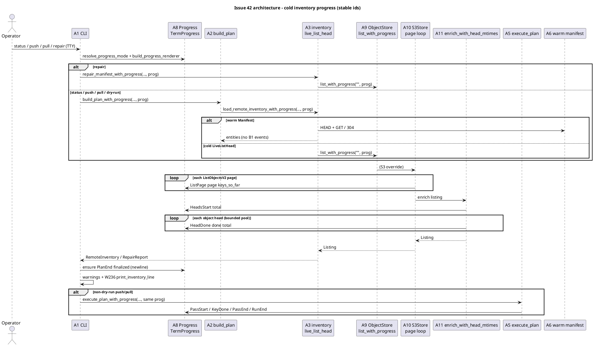
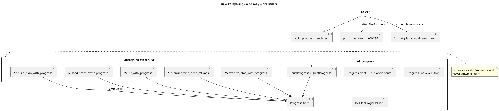
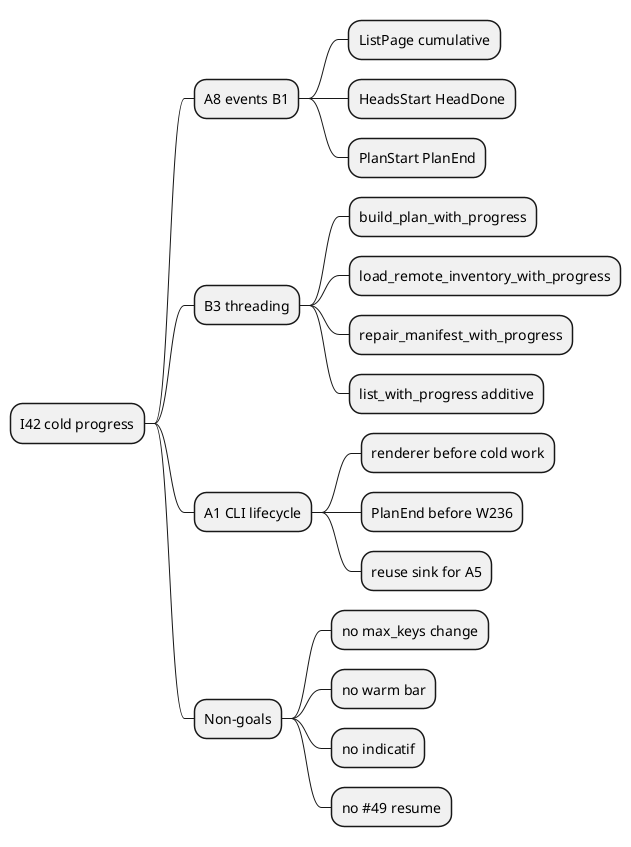

# Issue 42 plan: Plan-phase / cold-inventory progress on TTY

**Status:** implemented (W325-W368). Final offline gate: 645 passed / 0 failed / 1 ignored. Acceptance checkboxes ready to tick on close - see [W368 summary](#w368---plan-implemented-summary--issue-close-checklist).
**Issue:** https://github.com/tlkahn/vaultsync/issues/42 (OPEN; enhancement; body finalized 2026-08-31 against `main`)
**Parent sequencing:** inventory design note S9 (parallel with #45 S1-S8; cost-cut already shipped)
**Siblings (out of scope):** #45 manifest/cache/repair command (landed PR #46), #48 push-time bootstrap (landed PR #50), #49 transfer resume, #27 executor progress (landed PR #28; seam reused here)
**Design parents:** issue #42 body (finalized), [inventory-manifest.md](../inventory-manifest.md) section 6.3, [plans/issue-45.md](./issue-45.md) S9 note, I27 home in `src/progress.rs` / PR #28
**Branch:** `worktree-plan-progress-issue-42`
**Verified baseline (recorded at plan time):** tip `8f13f1b` (issue 48 / PR #50 on `main`). Gate on this tree: `cargo test --offline --lib --bins` = **612 passed / 0 failed / 1 ignored**. W-series last used: **W324** (PR 50 r2). This plan starts at **W325**.
**Blocker check:** #27 progress seam, #45 cold facade (`live_list_head` / `repair_manifest`), and #48 bootstrap are on `main`. No code blocker. Implementation does **not** wait on #49 or #12.
**Dependency policy:** **std-only** for progress rendering (I42-deps / I27-deps). Do not add `indicatif` or any new crate without explicit user confirmation.

---

## Problem recap (verified against the tree)

After #45 / #48, warm plans are fast (manifest HEAD+GET or 304) and already print W236:

```text
inventory: manifest (N entries)
```

The **cold** path is still multi-minute and silent:

| Call site | Entry | Slow work | Renderer today |
| --- | --- | --- | --- |
| `status` / `push` / `pull` / dry-run | `build_plan` -> `load_remote_inventory` -> `live_list_head` -> `store.list("")` | S3 sequential `ListObjectsV2` pages (`max_keys=1000`) + N `HeadObject`s (`enrich_with_head_mtimes`) | push/pull: executor-only **after** plan; status/dry-run: **none** |
| `repair` | `repair_manifest` -> `live_list_head` (bypasses `build_plan`) | same cold list+head | **none** |

`#27` `ProgressEvent` is executor-only (`PassStart` / `KeyDone` / `PassEnd` / `RunEnd`). `dispatch_plan` already calls `resolve_progress_mode` before `build_plan`, but `build_progress_renderer` runs only around `execute_plan_with_progress`. Library code never writes stderr (CLI owns the writer).

Measured cold cost (issue body, unchanged): ~87 s listing alone for 6.9k objects / 7 pages to `us-west-2`; heads add another large N x RTT term. `max_keys=100` is a measured regression - stay at 1000.

**Success metric:** on a TTY, cold `status` / `push` / `pull` / dry-run / `repair` show a **live** stderr feed during list pages and/or heads; warm runs keep a single W236 line and gain no fake bar; no-sink library callers are bit-identical.

---

## Architecture overview

Stable ids below are the cross-reference vocabulary for W-items, commits, and review.

| Id | Element | Role | This issue? |
| -- | ------- | ---- | ----------- |
| A1 | CLI (`src/cli.rs`) | Owns stderr writer, `ProgressMode`, W236, dispatch | **yes** - hold renderer across cold inventory; wire status/repair/dry-run |
| A2 | `build_plan` (`src/lib.rs`) | Local walk + remote inventory + plan | **yes** - `build_plan_with_progress` |
| A3 | Inventory facade (`src/inventory.rs`) | Warm/cold remote file set; `repair_manifest` | **yes** - thread sink on cold only; repair too |
| A4 | `plan()` | Pure planner | **no** |
| A5 | Executor (`src/exec.rs`) | Transfer passes + existing #27 events | **no** behavior change; may share A8 sink instance |
| A6 | Remote manifest | Warm authority | **no** writes; warm path stays quiet |
| A7 | Local manifest cache | 304 mirror | **no** |
| A8 | Progress module (`src/progress.rs`) | Events, trait, pure line machines, TTY/quiet renderers | **yes** - plan-phase events + line machine + TermProgress routing |
| A9 | `ObjectStore` trait | `list` / head / get / put | **yes** - additive `list_with_progress` |
| A10 | `S3Store` | Page loop + enrich | **yes** - emit `ListPage` + drive head events |
| A11 | `enrich_with_head_mtimes` | I15 head fan-out | **yes** - emit `HeadsStart` / `HeadDone` |
| A12 | `MemoryStore` / test doubles | Offline stores | **yes** - default `list_with_progress` no-op progress; optional FakePagingStore for page tests |
| B1 | Plan-phase event set | Coarse inventory signals | **yes** (new) |
| B2 | `PlanProgressLine` | Pure plan-phase line state machine | **yes** (new) |
| B3 | Sink threading | Optional `&dyn Progress` from CLI -> facade -> store/enrich | **yes** (new) |







### Data flow (cold S3)

```text
CLI renderer (A8/TermProgress over stderr)
        ^
        | ProgressEvent::{PlanStart, ListPage, HeadsStart, HeadDone, PlanEnd}
        |
build_plan_with_progress / repair_manifest_with_progress
        |
load_remote_inventory_with_progress  [warm: zero events]
        |
live_list_head(store, progress)
        |
store.list_with_progress("", progress)
        |
S3Store: list_prefix_objects pages ----ListPage---->
         partition reserved (W118)
         enrich_with_head_mtimes(..., progress) --HeadsStart/HeadDone-->
        |
RemoteInventory { source: LiveListHead, ... }
        |
CLI: PlanEnd finalize -> warnings -> W236 -> plan table -> (optional) executor events
```

---

## Locked decisions (owned by #42; do not reopen in implementation)

| ID | Decision | Lock |
| -- | -------- | ---- |
| I42-split | Cost cut vs progress | Cost cut = #45 (done). This issue = progress only. |
| I42-max-keys | Page size | **1000** stays. No shrink. |
| I42-i15 | Cold mtime identity | Unchanged fail-closed I15 list+head. |
| I42-progress-surface | Signal channel | **stderr only** via #27 `ProgressMode` Auto/Off/Always. |
| I42-warm | Warm runs | **No** list/head counters; existing W236 only; do not duplicate. |
| I42-repair | Repair | Required; wire at `repair_manifest` / `live_list_head` (bypasses `build_plan`). |
| I42-deps | Crates | **std-only** renderer; no `indicatif`. |
| I42-callers-no-sink | Compat | No-sink wrappers (`build_plan`, `load_remote_inventory`, `repair_manifest`, `ObjectStore::list`) behave bit-identically to today. |
| I42-events | Event home | **Extend** `ProgressEvent` in A8 with plan-phase variants (one `Progress` trait / one CLI sink). Do not invent a second user-facing progress trait. |
| I42-line | Line machine | New pure **`PlanProgressLine`** (B2) beside executor `ProgressLine`. `TermProgress` routes by event class. No byte rate/ETA on plan phase. |
| I42-list-api | Store seam | Additive **`ObjectStore::list_with_progress(&self, prefix, progress: &dyn Progress)`** with default body = ignore progress + `self.list(prefix)` (same additive spirit as `put_from_with`). `S3Store::list` becomes `list_with_progress(..., &NoProgress)` (or shared inner). |
| I42-heads | Head seam | `enrich_with_head_mtimes` gains `progress: &dyn Progress`; emits `HeadsStart` once then `HeadDone` per completed object head (success or NotFound-vanish); hard errors still fail closed without requiring a final 100% frame. |
| I42-pages | Page seam | `ListPage { page, keys_so_far }` is **cumulative** (1-based page index, keys counted after each S3 page). No total-page denominator (S3 unknown up front). |
| I42-walk | Local walk | **v1: no walk counters** (remote is the multi-minute piece). Optional single milestone is an explicit follow-up, not this plan. |
| I42-warm-events | Warm emission | Warm path emits **zero** plan-phase events (not even PlanStart/PlanEnd), so Quiet/Always tests and W236 stay simple. |
| I42-finalize | Bar vs W236 | CLI must observe a terminal plan-phase finalize (`PlanEnd` or renderer `finish_plan`) **before** `print_inventory_line` / warning dumps so `\r` bars never collide with W236. |
| I42-non-s3 | Other backends | Default `list_with_progress` emits nothing; MemoryStore stays quiet unless a test double overrides. No fake page counts. |
| I42-dry-run | Dry-run push/pull | Still cold-plans; **must** show plan-phase feed when cold. No executor bar (unchanged). |
| I42-json | `--json` | Still whole-command `reject_json` (Phase 3 / #12). No new JSON schema. |
| I42-verbose | `-v` | v1 plan-phase feed is the same aggregate line at any verbosity; no per-head log spam. Revisit later if needed. |

### Event shapes (normative for tests)

```rust
// Additive variants on ProgressEvent (names locked for W-series pins):
ProgressEvent::PlanStart,           // cold inventory about to run (optional bracket)
ProgressEvent::ListPage {
    page: u32,                      // 1-based
    keys_so_far: u64,               // cumulative object keys from raw pages (pre-folder-synth ok; pin in W item)
},
ProgressEvent::HeadsStart {
    total_keys: u32,                // object rows that will be headed (post-reserved, non-folder)
},
ProgressEvent::HeadDone {
    done: u32,                      // 1..=total completed heads (incl. NotFound vanish)
    total_keys: u32,
},
ProgressEvent::PlanEnd,             // cold inventory finished (success path); finalize line with newline
```

**Emission rules:**

- Cold success path: `PlanStart` -> zero-or-more `ListPage` -> optional `HeadsStart` + `HeadDone`* -> `PlanEnd`.
- If list returns zero object rows, `HeadsStart`/`HeadDone` may be skipped; still emit `PlanStart`/`PlanEnd` on cold so CLI can finalize symmetrically when it chose cold.
- Warm: no plan-phase events.
- Failure mid-cold: no requirement to emit `PlanEnd` (CLI still should clear any partial bar defensively - pin as CLI belt-and-braces, W-item).
- Executor events unchanged; plan-phase and executor must not interleave on one run (plan fully ends before execute starts).

### Plan line format (normative sketch; exact string pinned in W326+)

```text
Listing     page 3  2100 keys
Heading     1200/6894  [====>---]   17%
```

Fixed budgets in the spirit of I27 (12-col verb, no byte rate). Exact truncation/padding locked by pure-line unit tests before TermProgress wiring.

---

## API sketch (signatures; implement only behind RED tests)

```rust
// src/progress.rs - extend ProgressEvent; add PlanProgressLine; TermProgress routes both.

// src/store/mod.rs
pub trait ObjectStore {
    fn list(&self, prefix: &str) -> Result<Listing, Error>;
    fn list_with_progress(
        &self,
        prefix: &str,
        progress: &dyn crate::progress::Progress,
    ) -> Result<Listing, Error> {
        let _ = progress;
        self.list(prefix)
    }
    // ... existing methods
}

pub(crate) fn enrich_with_head_mtimes<S: ObjectStore + ?Sized>(
    store: &S,
    listing: Listing,
    concurrency: u32,
    progress: &dyn crate::progress::Progress,
) -> Result<Listing, Error>;

// src/inventory.rs
pub fn load_remote_inventory(...) -> Result<RemoteInventory, Error> {
    load_remote_inventory_with_progress(store, mode, cache, &NoProgress)
}
pub fn load_remote_inventory_with_progress(
    store: &dyn ObjectStore,
    mode: InventoryMode,
    cache: Option<&CachePaths>,
    progress: &dyn Progress,
) -> Result<RemoteInventory, Error>;

pub fn repair_manifest(...) -> Result<RepairReport, Error> {
    repair_manifest_with_progress(store, opts, cache, &NoProgress)
}
pub fn repair_manifest_with_progress(
    store: &dyn ObjectStore,
    opts: &RepairOpts,
    cache: Option<&CachePaths>,
    progress: &dyn Progress,
) -> Result<RepairReport, Error>;

// src/lib.rs
pub fn build_plan(...) -> Result<PlanReport, Error> {
    build_plan_with_progress(local, store, mode, opts, ignore, inventory, &NoProgress)
}
pub fn build_plan_with_progress(
    local: &LocalFs,
    store: &dyn ObjectStore,
    mode: Mode,
    opts: &PlanOpts,
    ignore: &IgnoreSet,
    inventory: &InventoryOpts,
    progress: &dyn Progress,
) -> Result<PlanReport, Error>;
```

**S3Store:** implement `list_with_progress`; `list` delegates to it with `&NoProgress`. Page loop emits `ListPage`. Call `enrich_with_head_mtimes(..., progress)`.

**CLI:** one renderer lifetime covering cold inventory (+ executor on mutating push/pull). Status and repair resolve `ProgressMode` the same way `dispatch_plan` does today.

---

## Strict TDD protocol (applies to every W item)

1. **RED:** write the smallest failing test first; run it; confirm failure mode matches the pin (compile fail or assert fail) before production code.
2. **GREEN:** write the minimum production code to pass that test (and keep the offline gate green).
3. **Refactor:** only after green; no behavior change; re-run the gate.
4. **Commit shape:** prefer `test: [42] ... (Wnnn)` then `feat: [42] ... (Wnnn)` when a pair is large; single `feat:` commits allowed when test+code are one logical step and the RED was observed locally (note RED evidence in the commit body).
5. **No speculative code:** do not pre-wire CLI before library event pins exist; do not "while here" change plan semantics, max_keys, or warm fetch.
6. **Gate:** `cargo test --offline --lib --bins` green at end of every W item (or every pair).
7. **Recording double:** reuse the I27 pattern (`RecordingProgress: Progress` with `Mutex<Vec<ProgressEvent>>`) - put a shared test helper in `progress` tests / `#[cfg(test)]` as needed so exec/inventory/store do not each fork a divergent double.

---

## Work series (W325+)

### S0 - Baseline freeze

#### W325 - Baseline gate + plan pointer

**RED/n/a (docs/process):** confirm gate on tip; record counts in this file header if they drift before coding starts.

**Pin:** `cargo test --offline --lib --bins` green; issue body already finalized; this plan is the implementation source of truth.

**Commit (optional):** `docs: [42] implementation plan (W325)` adding this file if not already on the branch.

---

### S1 - B1 events + B2 pure `PlanProgressLine` (A8 only; no store/CLI)

#### W326 - RED: `ProgressEvent` plan-phase variants exist and are constructible

**Test file:** `src/progress.rs` tests.

**Pin:** can construct / match `PlanStart`, `ListPage { page: 1, keys_so_far: 1000 }`, `HeadsStart { total_keys: 3 }`, `HeadDone { done: 1, total_keys: 3 }`, `PlanEnd`. Exhaustive match helper or debug equality.

**RED:** variants missing -> compile fail.

**GREEN:** add variants only (executor match sites need a non-breaking wild-card or explicit ignore arms - do the minimum so existing tests still compile/pass).

**Commit:** `feat: [42] plan-phase ProgressEvent variants (W326)`

#### W327 - RED: `PlanProgressLine` listing frames (cumulative pages)

**Pin:** pure state machine:

- start empty -> `render()` empty
- `PlanStart` -> optional idle/listing zero frame (pin: either empty or `Listing page 0 0 keys` - choose **empty until first ListPage** to avoid noise)
- `ListPage { page: 1, keys_so_far: 1000 }` -> line contains `Listing` and `1000` and page `1`
- `ListPage { page: 2, keys_so_far: 2000 }` -> updates to page 2 / 2000
- no byte rate / no ETA substrings

**Commit:** `test: [42] PlanProgressLine listing frames (W327)` then `feat: [42] PlanProgressLine listing (W327)`

#### W328 - RED: `PlanProgressLine` heading frames

**Pin:**

- `HeadsStart { total_keys: 100 }` arms heading mode (0/100 frame ok)
- `HeadDone { done: 40, total_keys: 100 }` -> `Heading` + `40/100` + percent + bar
- `HeadDone { done: 100, total_keys: 100 }` -> 100%
- `total_keys == 0` -> render empty (mirror executor zero-total policy)

**Commit:** `test+feat: [42] PlanProgressLine heading frames (W328)`

#### W329 - RED: `PlanEnd` finalizes; foreign executor events ignored by `PlanProgressLine`

**Pin:** `PlanEnd` keeps last frame state for the renderer to print with newline; `PassStart`/`KeyDone` do not mutate `PlanProgressLine`. Symmetric: executor `ProgressLine` ignores plan-phase variants (add arms / default).

**Commit:** `test+feat: [42] PlanProgressLine PlanEnd + ignore executor events (W329)`

#### W330 - RED: `ProgressLine` (executor) ignores plan-phase variants

**Pin:** feed `PlanStart`/`ListPage`/`HeadsStart`/`HeadDone`/`PlanEnd` into executor `ProgressLine` - state unchanged; `render()` still empty or previous executor state.

**Commit:** `test+feat: [42] ProgressLine ignores plan-phase events (W330)`

---

### S2 - TermProgress / QuietProgress routing (A8)

#### W331 - RED: `TermProgress` renders plan-phase listing with `\r` refresh

**Pin:** `Vec<u8>` writer + `TermProgress`; emit `PlanStart`, `ListPage`, `ListPage`; writer contains `\r` and `Listing` and latest key count; no newline yet.

**Commit:** `test+feat: [42] TermProgress plan listing refresh (W331)`

#### W332 - RED: `PlanEnd` finalizes with newline; then executor pass can start clean

**Pin:** after `PlanEnd`, writer ends the plan frame with `\n` (and clear). Subsequent `PassStart`/`KeyDone` produce executor frames without corrupting the finalized plan line (split contents on `\n` and assert).

**Commit:** `test+feat: [42] TermProgress PlanEnd then executor pass (W332)`

#### W333 - RED: `QuietProgress` still swallows plan-phase events

**Pin:** emit full cold sequence into `QuietProgress`; writer empty.

**Commit:** `test+feat: [42] QuietProgress ignores plan-phase (W333)`

#### W334 - Refactor: shared `RecordingProgress` test helper

**Pin:** exec tests and progress tests can use one helper (move or `pub(crate) #[cfg(test)]`). No behavior change; gate green.

**Commit:** `refactor: [42] shared RecordingProgress test helper (W334)`

---

### S3 - A11 head enrichment emits progress

#### W335 - RED: `enrich_with_head_mtimes` emits HeadsStart + HeadDone per object

**Setup:** tiny `MemoryStore` (or existing mock) with 3 file keys + 1 folder view; call enrich with `RecordingProgress` and concurrency 1.

**Pin:**

- events: `HeadsStart { total_keys: 3 }`, three `HeadDone` with done=1,2,3 and total_keys=3
- folder rows not headed / not counted in total
- listing entity mtimes still match head (I15 behavior unchanged)
- order of HeadDone follows completion; under concurrency 1 that is listing order

**RED:** signature still old / no emission.

**GREEN:** add `progress: &dyn Progress` param; emit. Update all in-tree callers to pass `&NoProgress` temporarily.

**Commit:** `test: [42] enrich emits head progress (W335)` / `feat: [42] enrich_with_head_mtimes progress sink (W335)`

#### W336 - RED: NotFound vanish still counts as HeadDone; hard error fails closed

**Pin:**

- one key NotFound during head -> dropped + warning path unchanged; `HeadDone` still advances `done`
- one hard error -> `Err` returned; may have partial HeadDone emissions; no requirement for PlanEnd here

**Commit:** `test+feat: [42] enrich head progress on vanish/error (W336)`

#### W337 - RED: concurrency > 1 still emits total HeadDone count == total_keys on success

**Pin:** concurrency 4, N=20 objects; recording sees HeadsStart total 20 and exactly 20 HeadDone; final listing len matches (minus vanishes if any).

**Commit:** `test: [42] enrich head progress under concurrency (W337)`

#### W338 - RED: `&NoProgress` enrich matches pre-change listing bytes (compat)

**Pin:** same store seed; enrich with NoProgress equals prior expected entities/warnings (clone fixture assert). Regression lock for I42-callers-no-sink at enrich layer.

**Commit:** `test: [42] enrich NoProgress listing unchanged (W338)`

---

### S4 - A9/A10 `list_with_progress` + page ticks

#### W339 - RED: trait default `list_with_progress` ignores progress and equals `list`

**Pin:** `MemoryStore` seed; `list("")` == `list_with_progress("", &recording)`; recording empty.

**GREEN:** default trait method only.

**Commit:** `test+feat: [42] ObjectStore::list_with_progress default (W339)`

#### W340 - RED: FakePagingStore test double emits ListPage per synthetic page

**Why:** offline stand-in for S3 page loop without network.

**Pin:** double implements `list_with_progress` by chunking keys in pages of P and emitting `ListPage { page, keys_so_far }` then returning a full listing (optionally calling real enrich with NoProgress or returning pre-built entities). Recording shows page count `ceil(N/P)`.

**Commit:** `test+feat: [42] FakePagingStore ListPage emissions (W340)`  
(Helper lives under `#[cfg(test)]` in store or inventory tests.)

#### W341 - RED: S3Store page loop emits ListPage (structure unit-test or extract)

**Preferred offline approach (lock):** extract a tiny pure helper used by the S3 page loop, e.g. `fn note_list_page(progress: &dyn Progress, page: u32, keys_so_far: u64)` or fold emission into a `PageProgress` callback invoked from `list_prefix_objects` **with progress threaded through `list_with_progress` only**.

**Pin options (pick one in GREEN, document in commit):**

- (preferred) `list_with_progress` on a **local test subclass / wrapper** around page accumulation logic extracted as `pub(crate) fn emit_list_pages_for_raw(...)` - pure + progress.
- or instrument `list_prefix_objects` to take `&dyn Progress` and unit-test via a thin wrapper with canned page vectors (no network).

**Do not** require live S3 for green gate.

Also: `S3Store::list` calls `list_with_progress(..., &NoProgress)`; `list_with_progress` passes progress into page loop + `enrich_with_head_mtimes`.

**Commit:** `feat: [42] S3 list_with_progress page + head emission (W341)` with offline pins.

#### W342 - RED: keys_so_far semantics pinned

**Pin:** after page 1 with 1000 raw keys, `keys_so_far == 1000`; after page 2 with 500 more, `== 1500`. Define whether folder-marker raw keys count - **lock: count raw listed object rows from ListObjectsV2 contents len cumulative** (simple, matches wall-time work). Document in event comment.

**Commit:** `test: [42] ListPage keys_so_far cumulative (W342)`

---

### S5 - A3 facade cold/warm emission

#### W343 - RED: `load_remote_inventory_with_progress` cold ListHead emits PlanStart..PlanEnd

**Setup:** FakePagingStore or MemoryStore; mode `ListHead`; recording progress.

**Pin:**

- first event `PlanStart`, last `PlanEnd`
- MemoryStore: no ListPage required; may still emit PlanStart/PlanEnd only (and heads if enrich path exists - MemoryStore list has no enrich, so **only PlanStart/PlanEnd**)
- FakePagingStore: ListPage present between brackets

**Compat:** `load_remote_inventory` wrapper uses NoProgress and returns same entities/source as today.

**Commit:** `test+feat: [42] load_remote_inventory_with_progress cold brackets (W343)`

#### W344 - RED: warm Auto/Manifest emits zero plan-phase events

**Setup:** MemoryStore with valid manifest object at `MANIFEST_KEY`; mode Auto and Manifest.

**Pin:** recording empty; source `Manifest { .. }`; entities match.

**Commit:** `test: [42] warm load emits no plan progress (W344)`

#### W345 - RED: Auto missing/invalid fallback is cold (emits brackets) and keeps warning text

**Pin:** missing manifest -> LiveListHead + existing warning substring + PlanStart/PlanEnd; invalid body same with invalid warning detail. Progress does not alter warning strings.

**Commit:** `test: [42] auto cold fallback still warns + emits plan progress (W345)`

#### W346 - RED: `live_list_head` uses `list_with_progress` not bare `list`

**Pin:** a store override that **fails** `list` but succeeds `list_with_progress` is what the facade calls (or a counter store: `list_with_progress` hit count 1, `list` hit count 0 on cold path).

**Commit:** `test+feat: [42] live_list_head routes list_with_progress (W346)`

---

### S6 - A2 `build_plan_with_progress`

#### W347 - RED: `build_plan_with_progress` forwards sink on cold; wrapper equals old `build_plan`

**Pin:**

- cold ListHead + FakePagingStore/MemoryStore: recording sees PlanStart..PlanEnd
- `build_plan(...)` without sink == `build_plan_with_progress(..., &NoProgress)` on plan actions/stats/warnings/source (full `PlanReport` equality modulo any non-deterministic fields - there should be none)

**Commit:** `test+feat: [42] build_plan_with_progress (W347)`

#### W348 - RED: warm `build_plan_with_progress` silent + W236 still the CLI concern only

**Pin:** warm report source Manifest; recording empty. (W236 stays CLI-only; no library print.)

**Commit:** `test: [42] warm build_plan_with_progress silent (W348)`

---

### S7 - A3 repair progress

#### W349 - RED: `repair_manifest_with_progress` emits cold brackets; dry-run too

**Pin:**

- force/dry_run true: still lists cold -> PlanStart..PlanEnd before write skip
- `repair_manifest` wrapper == with NoProgress on listed/written/dry_run/etag/warnings

**Commit:** `test+feat: [42] repair_manifest_with_progress (W349)`

#### W350 - RED: repair does not emit executor PassKind events

**Pin:** recording has no `PassStart`/`KeyDone`.

**Commit:** `test: [42] repair progress is plan-phase only (W350)`

---

### S8 - A1 CLI lifecycle

#### W351 - RED: status cold + `ProgressMode::Always` shows Listing or Heading frames on err

**Setup:** existing CLI test harness (`run_with_io` / `run_mode`) with FakePagingStore or slow-ish MemoryStore large N; `ProgressMode::Always`.

**Pin:** `err` contains `\r` and (`Listing` or `Heading`); stdout still has plan table and no `\r`; exit codes unchanged; W236 `inventory: list+head (cold)` appears **after** a newline-finalized progress frame (split err: last inventory line is W236, earlier has progress).

**Commit:** `test+feat: [42] status cold plan progress (W351)`

#### W352 - RED: status warm + Always does **not** show Listing/Heading; still W236 manifest line

**Pin:** err has `inventory: manifest (` and does not contain `Listing`/`Heading`/`\r` from plan phase.

**Commit:** `test: [42] status warm no plan bar (W352)`

#### W353 - RED: repair + Always shows plan-phase frames on err; stdout summary unchanged shape

**Pin:** err has progress frames; stdout still `repair: listed N objects via list+head` (and dry-run/wrote lines as applicable).

**Commit:** `test+feat: [42] repair CLI plan progress (W353)`

#### W354 - RED: dispatch_plan cold dry-run + Always shows plan progress; no Uploading

**Pin:** dry-run push cold: err has Listing/Heading; no `Uploading`; stdout plan present; W236 cold line once.

**Commit:** `test+feat: [42] dry-run push cold plan progress (W354)`

#### W355 - RED: dispatch_plan cold push (execute) reuses one renderer - plan then upload frames

**Pin:** Always mode; FakePagingStore + local dirty file; err shows plan-phase frame(s) **then** `Uploading` (ordering: PlanEnd newline before upload). Exit codes unchanged vs Off.

**Commit:** `test+feat: [42] push plan+exec shared renderer (W355)`

#### W356 - RED: `ProgressMode::Off` keeps captured-err contracts free of `\r` / Listing / Heading

**Pin:** extend or reassert existing `dry_run_and_status_emit_no_progress` style tests for status/repair/push under Off (default test mode).

**Commit:** `test: [42] ProgressMode::Off no plan frames (W356)`

#### W357 - RED: PlanEnd before W236 (collision guard)

**Pin:** under Always, parse stderr: any `\r`-progress content's last finalize newline index < index of `inventory: list+head (cold)` / `inventory: manifest`.

**Commit:** `test: [42] W236 after plan progress finalize (W357)`

#### W358 - RED: `--json` still rejected before progress on status/push/pull/repair

**Pin:** existing reject_json paths; err has no Listing/Heading.

**Commit:** `test: [42] json reject precedes plan progress (W358)`

#### W359 - CLI wiring sweep / refactor

**Work:** status + repair resolve mode like dispatch; helpers to avoid four copy-pastes (`with_progress_renderer(resolved, err, |prog| ...)`). Keep clippy arg limits happy (DispatchCtx patterns).

**Pin:** gate green; no new public CLI flags (no `--progress=` required; seam already exists via ProgressMode).

**Commit:** `refactor: [42] CLI progress lifecycle helper (W359)`

---

### S9 - Compatibility + regression locks

#### W360 - RED: I15 fail-closed unchanged with progress sink attached

**Pin:** store head hard-error during cold list still fails `build_plan` / repair with same error class; no partial plan commit.

**Commit:** `test: [42] I15 fail-closed with progress (W360)`

#### W361 - RED: max_keys still 1000 in S3 list request builder

**Pin:** existing unit/string assert or const; if no pin exists, add one on the request setup path (`max_keys(1000)` still present).

**Commit:** `test: [42] max_keys stays 1000 (W361)`

#### W362 - RED: library no-sink public APIs retain signatures used by tests/docs

**Pin:** `build_plan`, `load_remote_inventory`, `repair_manifest`, `ObjectStore::list` still callable without progress args; count of call sites compiles.

**Commit:** `test: [42] no-sink API surface stable (W362)` if needed (often compile-only).

#### W363 - Full offline gate sweep

**Pin:** `cargo test --offline --lib --bins` green; fix fallout.

**Commit:** `test: [42] offline gate sweep (W363)` only if fixes needed.

---

### S10 - Docs + decision log + closeout

#### W364 - `doc/cli.md` plan-phase progress behavior

**Pin:** document cold stderr feed, warm W236-only, ProgressMode, repair/status/dry-run coverage; no `--progress` flag claimed unless implemented.

**Commit:** `docs: [42] cli.md plan-phase progress (W364)`

#### W365 - `doc/inventory-manifest.md` section 6.3 update

**Pin:** replace "reuse whatever #42 has landed" future tense with the landed event/CLI behavior; link events at high level.

**Commit:** `docs: [42] inventory-manifest 6.3 progress (W365)`

#### W366 - `doc/roadmap.md` decision log `I42-plan-progress`

**Pin:** table row recording locks (events, list_with_progress, PlanProgressLine, warm silent, repair wired, std-only).

**Commit:** `docs: [42] roadmap I42-plan-progress (W366)`

#### W367 - architecture.md / README touch if they mention silent plan build

**Pin:** progress story mentions plan-phase as well as executor.

**Commit:** `docs: [42] architecture/README progress note (W367)`

#### W368 - Plan implemented summary + issue close checklist

**Pin:** this file status -> implemented; list final test count; issue acceptance checkboxes ready to tick on close.

**Commit:** `docs: [42] plan implemented summary (W368)`

---

## Slice map (implementation order)

| Slice | W items | Exit criterion |
| --- | --- | --- |
| S0 | W325 | Plan on branch; baseline known |
| S1 | W326-W330 | Pure events + PlanProgressLine + mutual ignore with executor line |
| S2 | W331-W334 | Term/Quiet render plan phase; shared RecordingProgress |
| S3 | W335-W338 | enrich emits heads; NoProgress compat; concurrency ok |
| S4 | W339-W342 | list_with_progress default + FakePagingStore + S3 page emission offline |
| S5 | W343-W346 | facade warm silent / cold brackets / list_with_progress route |
| S6 | W347-W348 | build_plan_with_progress |
| S7 | W349-W350 | repair_manifest_with_progress |
| S8 | W351-W359 | CLI status/repair/dry-run/push lifecycle + W236 ordering |
| S9 | W360-W363 | I15 / max_keys / API compat / gate |
| S10 | W364-W368 | docs + roadmap + closeout |

**Suggested PR strategy:** one PR for S1-S7 (library seam, feature-gated by unused CLI), second PR for S8-S10 (CLI + docs) - **or** one PR if smaller. Prefer library-first so CLI review stays focused. Do not merge library half with public behavior change incomplete without noting that CLI still silent until S8 (library progress is opt-in via with_progress APIs).

---

## Acceptance mapping (issue -> W)

| Issue acceptance | W coverage |
| --- | --- |
| TTY cold status/push/pull/dry-run/repair live signal | W351-W355, W349 |
| Warm no fake bar; W236 only | W344, W348, W352 |
| list_head + auto cold + repair same feed | W343, W345, W349, W353 |
| W236 once after finalize | W357 |
| max_keys 1000 | W361 |
| offline gate; I15 unchanged; no-sink identical | W338, W347, W360, W362, W363 |
| stderr ProgressMode; json reject | W333, W356, W358 |
| roadmap decision log | W366 |
| optional measurement recipe | optional follow-up note in W368 (not required to close) |

---

## Out of scope (refuse if pulled into the PR)

- Manifest format, cache policy, bootstrap, commit races (#45/#48)
- Transfer resume / journals (#49)
- `--json` schema (#12)
- `indicatif`, async runtime changes, S3 client swap
- Shrinking `max_keys`, dropping I15 heads on cold, sampling heads
- Local-walk progress counters (I42-walk locked off for v1)
- Per-head `-v` line spam
- Changing plan equality, exit codes, ignore rules, reserved partition
- Making warm path emit PlanStart/PlanEnd

---

## Risks and mitigations

| Risk | Mitigation |
| --- | --- |
| Trait default `list_with_progress` not overridden on S3 -> silent pages | W341/W346 counter store pins; S3 override required for GREEN of page tests |
| HeadDone under pool interleaves | allowed (same as KeyDone); totals pinned, not order |
| TermProgress plan+exec share Mutex writer | W332/W355 ordering pins; PlanEnd newline before PassStart |
| CLI forgets repair/status | W351/W353 explicit |
| W236 collision with `\r` | W357 |
| Scope creep into cost-cut | I42-split; reject in review |
| FakePagingStore drifts from S3 semantics | only asserts event emission + facade routing; S3 page emission separately extracted |
| Performance: virtual call per head | negligible vs RTT; NoProgress is empty fn |
| Clippy too many args on build_plan_with_progress | already near limits; bundle progress into a thin run opts struct only if clippy forces it - prefer extra param first |

---

## Test inventory (minimum new pins)

| Area | Tests (approx) |
| --- | --- |
| progress events / PlanProgressLine / TermProgress | W326-W333 (~10) |
| enrich progress | W335-W338 (~5) |
| list_with_progress + FakePagingStore + keys_so_far | W339-W342 (~5) |
| inventory facade warm/cold/repair | W343-W346, W349-W350 (~8) |
| build_plan | W347-W348 (~3) |
| CLI status/repair/dry-run/push/off/json/W236 | W351-W358 (~10) |
| compat I15/max_keys | W360-W361 (~2) |

Existing I27/I15/inventory tests must stay green without rewriting assertions unless signatures force `NoProgress` pass-through updates (mechanical).

---

## Implementation notes (operator checklist)

```bash
# every W item
cargo test --offline --lib --bins

# focused examples during S1
cargo test --offline --lib plan_progress -- --nocapture

# focused CLI
cargo test --offline --lib cli::tests -- --nocapture
```

Manual smoke (not required for merge gate; optional W368 recipe):

```bash
# force cold
# inventory.mode = "list_head" in config
time vaultsync status    # expect live Listing/Heading on TTY stderr, then W236 + plan
time vaultsync repair --dry-run
# warm after push ensure/commit
time vaultsync status    # expect only inventory: manifest (N entries) for inventory source
```

---

## Revision log

| Date | Change |
| --- | --- |
| 2026-08-31 | Initial plan against tip `8f13f1b` (612 offline tests), issue body finalized same day. W325-W368. Locks I42-* including events-on-ProgressEvent, list_with_progress additive API, PlanProgressLine, repair+build_plan dual call sites, walk counters deferred, std-only. |

---

## Open questions intentionally left to implementation-time micro-decisions (not blockers)

These must not reopen locks above; pick the first option that keeps tests simple and document in the W commit body:

1. Exact `PlanProgressLine` padding constants (mirror 12-col verb vs slightly different).
2. Whether `PlanStart` alone renders an initial `Listing...` placeholder or stays blank until first `ListPage` (**plan default: blank until first ListPage or HeadsStart**).
3. Whether FakePagingStore lives in `src/store/mod.rs` `#[cfg(test)]` or `src/inventory.rs` tests only.
4. Single PR vs library/CLI split PR.
5. Whether `list_with_progress` should be mentioned in `doc/object-store.md` in W367 or only cli/inventory docs.

---

## W368 - Plan implemented summary + issue close checklist

**Implemented 2026-08-31 on `worktree-plan-progress-issue-42` (W325-W368).**
Final offline gate: `cargo test --offline --lib --bins` = 645 passed / 0 failed / 1 ignored (baseline at plan time: 612).

### What landed (by slice)

- **S1 (W326-W330):** plan-phase `ProgressEvent` variants (`PlanStart`, `ListPage { page, keys_so_far }`, `HeadsStart { total_keys }`, `HeadDone { done, total_keys }`, `PlanEnd`); pure `PlanProgressLine` (listing + heading frames, zero-total policy, PlanEnd keeps state); mutual ignore between the executor `ProgressLine` and the plan line (the executor line only advances its injected clock on accepted events).
- **S2 (W331-W334):** `TermProgress` routes by event class (`is_plan_phase`), finalizes the plan frame with a newline at `PlanEnd`, and gained `finish_plan()` (trait default no-op) as the error-path belt-and-braces; `QuietProgress` swallows plan events; shared `RecordingProgress` moved to `crate::testutil`.
- **S3 (W335-W338):** `enrich_with_head_mtimes` takes `&dyn Progress`; emits `HeadsStart` (object rows only; folders never headed) + one `HeadDone` per completed head (NotFound-vanish included); hard errors fail closed with partial emissions allowed; `&NoProgress` compat locked.
- **S4 (W339-W342):** additive `ObjectStore::list_with_progress` (default = ignore sink + `list`); `FakePagingStore` test double; S3 page loop emits cumulative `ListPage` per page via the pure `fold_list_page` (keys_so_far = raw contents count, W342 lock); `S3Store::list` delegates with `&NoProgress`.
- **S5 (W343-W346):** `load_remote_inventory_with_progress`; `live_list_head` brackets cold with `PlanStart`/`PlanEnd` (PlanEnd on success only) and routes through `list_with_progress` (counter-store pin); warm Auto/Manifest emits zero events; Auto fallback keeps warning text verbatim.
- **S6 (W347-W348):** `build_plan_with_progress`; no-sink wrapper byte-identical; warm silent.
- **S7 (W349-W350):** `repair_manifest_with_progress` (dry-run included); plan-phase-only events.
- **S8 (W351-W359):** CLI resolves the progress mode for status/repair/dispatch_plan and runs the cold plan through a renderer (`with_plan_renderer` helper); `finish_plan` before W236/warnings/errors; plan-then-upload ordering on push; `--json` rejected before any renderer; `ProgressMode::Off` keeps captured-stderr contracts clean.
- **S9 (W360-W363):** I15 fail-closed pinned with a progress sink; `LIST_MAX_KEYS` const = 1000 pinned; no-sink API surface compile-stable; gate green.
- **S10 (W364-W368):** docs - cli.md plan-phase progress section, inventory-manifest.md 6.3, roadmap decision log row `I42-plan-progress`, architecture.md facade note; this summary.

### Acceptance mapping check (issue -> landed)

| Issue acceptance | Covered by |
| --- | --- |
| TTY cold status/push/pull/dry-run/repair live signal | W351-W355, W349 (tests `status_cold_always_shows_plan_progress`, `repair_always_shows_plan_frames`, `dry_run_push_cold_always_shows_plan_progress`, `push_cold_always_plan_then_upload_frames`) |
| Warm no fake bar; W236 only | W344, W348, W352 (`warm_load_emits_no_plan_progress`, `warm_build_plan_with_progress_silent`, `status_warm_always_no_plan_bar`) |
| list_head + auto cold + repair same feed | W343, W345, W349, W353 |
| W236 once after finalize | W357 (`w236_after_plan_progress_finalize`) |
| max_keys 1000 | W361 (`max_keys_stays_1000`) |
| offline gate; I15 unchanged; no-sink identical | W338, W347, W360, W362, W363 |
| stderr ProgressMode; json reject | W333, W356, W358 |
| roadmap decision log | W366 |
| optional measurement recipe | follow-up note (not required to close) |

### Micro-decisions made during implementation (documented per W commit)

- Exact line strings: `Listing     page N  K keys` and `Heading     D/T  [bar]  P%` (12-col verb, 8-cell bar - mirrors the executor budgets).
- Blank until the first `ListPage`/`HeadsStart` (PlanStart alone renders nothing).
- `FakePagingStore` lives in `crate::testutil` (shared with inventory/CLI tests).
- Single PR (library + CLI + docs together; the W-series commits are the review trail).
- `doc/object-store.md` not touched; the store seam is documented in cli/inventory/architecture docs.
- dispatch_plan uses a second renderer instance for the executor phase (borrow-safety of the direct `err` writes between phases); output ordering is identical to a single renderer (plan finalize newline, direct lines, executor frames).
