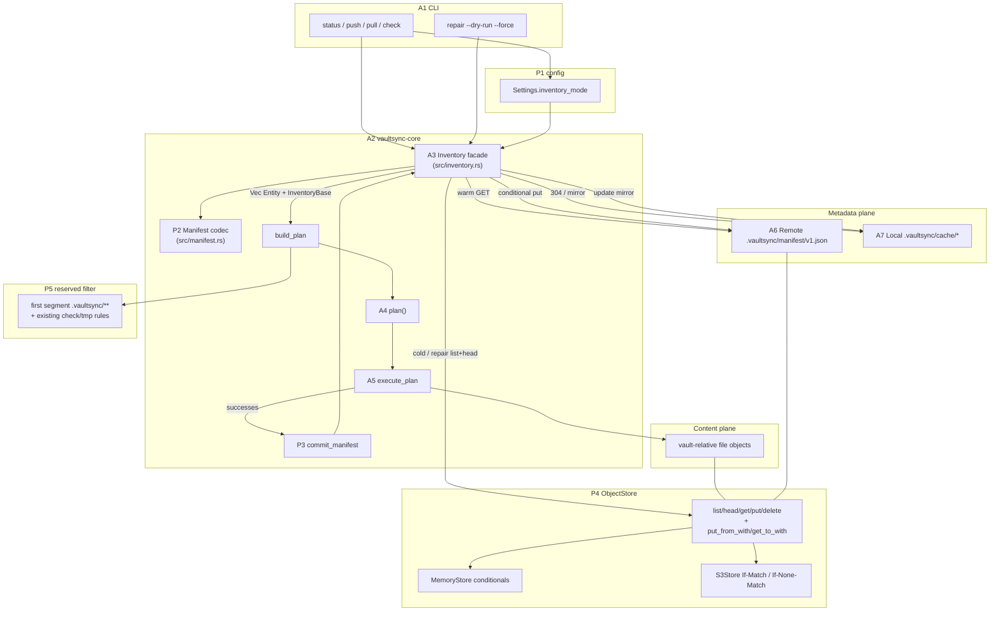

# Issue 45 plan: Inventory manifest (remote source of truth + local cache)

**Status:** implemented (W219-W246 landed on branch
`worktree-inventory-manifest-issue-45`; docs W247-W248 done). Offline gate at
landing: `cargo test --offline --lib --bins` green (554 passed / 0 failed / 1
ignored).
**Issue:** https://github.com/tlkahn/vaultsync/issues/45 (OPEN; enhancement)
**Branch:** `worktree-inventory-manifest-issue-45`
**Design refs:** issue #45 body, normative design
[inventory-manifest.md](../inventory-manifest.md) (S0 already landed),
[object-store.md](../object-store.md), [sync-model.md](../sync-model.md),
[architecture.md](../architecture.md), [cli.md](../cli.md),
[roadmap.md](../roadmap.md), [vision.md](../vision.md), related #42
(plan-build latency / progress; parallel, not owned here)
**Verified baseline (recorded at plan time):** tip `fe82546` (P3-7e / #34 on
`main`). Gate on this tree:
`cargo test --offline --lib --bins` = 499 passed / 0 failed / 1 ignored;
W-series last used: **W218** (PR 41 review reply). This plan starts at
**W219**.
**Blocker check:** design note S0 is present. No code blocker. S9 (#42
plan-phase progress) is **parallel** and improves cold/repair UX but is
**not** required to land S1-S7 correctness. Q1-Q8 are locked below at plan
time (issue "Locked decisions" was empty; this plan is the lock source -
mirror into the issue when implementation starts).

---

## Problem recap (from the issue, verified against the tree)

Every list-driven command (`status` / `push` / `pull`) builds a plan from a
full remote inventory. On S3 that is:

1. sequential `ListObjectsV2` pages, then
2. **N** `HeadObject` calls so plans see client `vaultsync-mtime` (I15 /
   `enrich_with_head_mtimes` in `src/store/mod.rs`),

with no progressive UX until the plan exists (#42). Upload/download are fine;
**inventory is the bottleneck** on multi-thousand-file vaults.

Locked tension (cannot keep all four on naked S3):

| Constraint | Today |
| ---------- | ----- |
| Stateless (no local prev-sync DB) | yes |
| No remote control-plane object | yes |
| Exact client mtime identity (I15) | yes |
| Fast plan on 10k-20k files | **no** |

Option 1 (this issue): drop only "no remote control plane" via one rebuildable
JSON manifest at `.vaultsync/manifest/v1.json`, with an optional local cache
of that remote object. Planner stays unchanged; cold/repair path keeps I15.

Today's relevant seams (tip `fe82546`):

| Seam | Today |
| ---- | ----- |
| `ObjectStore` (`src/store/mod.rs`) | `list` / `head` / `get_to` / `put_from` / `delete` - **no** conditional get/put |
| `MemoryStore` / `S3Store` | mock is content-etag; S3 put stamps `vaultsync-mtime`, list = list+head |
| Reserved keys | final-segment only: `.vaultsync-check-*`, `.*.vaultsync-tmp-*` (`is_reserved_vaultsync_key_name`, `partition_reserved_remote_keys`) - **no** `.vaultsync/**` |
| Local walk | same final-segment reserved skip; no `.vaultsync/` directory prune |
| `build_plan` | `store.list("")` always (cold path only) |
| Config | `[store]` / `[ignore]` / `[transfer]` - **no** `[inventory]` |
| CLI commands | `status` / `push` / `pull` / `check` / `version` / `help` - **no** `repair` |
| JSON crate | **none** (`serde` + `toml` only) |
| Errors | no `PreconditionFailed` variant |

---

## Locked decisions (owned by #45; do not reopen in implementation)

### From design note section 17 (Q1-Q8) - locked now

| ID | Question | Lock |
| -- | -------- | ---- |
| Q1 | Default `inventory.mode` | **`auto`** |
| Q2 | Lost commit race exit code | **warning + exit 0** if transfers succeeded; document. Transfer failures still exit 1. Conflicts still exit 2. |
| Q3 | Auto-write manifest after cold `status`? | **no** - read path side-effect free (except optional cache fill of a valid remote fetch in S7) |
| Q4 | Manifest `mtime_ms` null | **allow JSON `null`**; map to `Entity.mtime_ms = None`; classify via existing unknown-mtime rules |
| Q5 | Soft cap on manifest bytes | **64 MiB** parse/read cap; refuse louder than that |
| Q6 | Should `pull` ever write manifest? | **no** |
| Q7 | Trait extension shape | additive **`put_from_with` / `get_to_with`** + `PutOpts` / `GetOpts` / `GetOutcome` |
| Q8 | Tracking | **this issue (#45)**; #42 stays latency/UX umbrella (S9 parallel) |

### Implementation locks (derived; pin here)

| ID | Lock | Choice |
| -- | ---- | ------ |
| D-auth | Authority | Remote manifest when present and valid is planning authority. Local cache is never authority for equality or `--delete`. Cold/repair = live list+head (I15). |
| D-key | Remote key | Exactly `.vaultsync/manifest/v1.json` (constant `MANIFEST_KEY`). |
| D-schema | Schema id | `vaultsync.manifest.v1` only. Unknown schema => reject (mode-dependent fallthrough). |
| D-reserved | Namespace | Extend reserved policy: (1) existing final-segment rules unchanged; (2) any key whose **first path segment** is exactly `.vaultsync` (file or folder form). Applies to local walk prune, remote partition, and pre-head partition on S3. |
| D-reserved-local | Cache dir | `<vault_root>/.vaultsync/` is never walked/uploaded (same first-segment rule). |
| D-check | Probe keys | Stay `.vaultsync-check-*` at prefix root; never under `.vaultsync/manifest/`. |
| D-ignore | Manifest contents | Full remote file set minus reserved keys; **not** ignore-filtered. Ignore stays plan-time (D-both-sides unchanged). |
| D-folders | Folder rows | Not stored in manifest. Synthesize folder views from file keys with the **same** algorithm as store list (`parent_folders` style), shared helper. |
| D-order | Entry order | Writers sort by key ascending (byte-wise). Readers accept any order, sort after parse, **fail on duplicate keys**. |
| D-commit-when | When to write | After successful remote-mutating `push` / `push --delete` when at least one Upload or DeleteRemote succeeded; always on `repair`. Never on `status` / `pull` / `check`. Zero successful remote mutations => skip commit. |
| D-commit-order | Crash order | **Bodies first, manifest last.** Never upsert a key whose put/delete did not succeed this run. |
| D-commit-cond | Conditionals | Base was Manifest + etag => `If-Match` that etag. Base was LiveListHead / missing => `If-None-Match: *` create. `--force` repair => unconditional put. |
| D-commit-race | Race text | Pin warning substring: `manifest not committed` (full sentence locked in W-item). Exit 0 if transfers ok (Q2). |
| D-trait-default | Trait churn | `put_from` / `get_to` remain required methods (existing impls/test doubles keep compiling). New methods get **default bodies**: if any precondition is set, return a loud unsupported/`PreconditionFailed`-class error; if no precondition, delegate to `put_from` / `get_to`. `MemoryStore` + `S3Store` override with real conditionals. Manifest code **only** calls `*_with`. |
| D-error | Precondition | Add `Error::PreconditionFailed(String /* key or msg */)` (and Display arm). Prefer real variant over stuffing `Other` so mock race tests match cleanly. |
| D-get-outcome | 304 shape | `GetOutcome::{Body(Entity), NotModified { entity metadata }}` - not a hard error. |
| D-json-dep | Crate | Add **`serde_json`** (companion to existing `serde`). One new dep, justified by nested JSON + null mtime + key escaping. No other new crates. Confirm at first S3 RED if policy wants zero-dep hand-roll instead; default remains serde_json. |
| D-config | `[inventory]` | Optional section; `mode = "auto" \| "manifest" \| "list_head"`; absent => `auto`. `deny_unknown_fields`. Resolve into `Settings.inventory_mode`. |
| D-plan-seam | `build_plan` | Inventory facade supplies remote `Vec<Entity>` (+ source metadata). `plan()` stays pure and unchanged. `PlanReport` gains inventory base fields needed for commit (struct extension, H1 style). |
| D-modes | Behavior | `list_head`: always cold. `manifest`: require valid remote manifest (missing/corrupt => hard error suggesting `repair`). `auto`: valid manifest => warm; missing/corrupt => warning + cold. |
| D-cache | S7 role | Optional; keys under `.vaultsync/cache/manifest-v1.json` + `.meta.json`. 304 via conditional GET. Never plan from cache if remote fetch fails open. Owner-only `0o600` on Unix. |
| D-repair | CLI | New subcommand `vaultsync repair` with `--dry-run` and `--force`. No plan table; summary lines on stderr/stdout per design. Exit 0/1. |
| D-progress | Warm/cold | Warm: one inventory source line when TTY (or always on stderr milestone - pin in CLI item). Cold/repair: reuse whatever #42 has landed; if #42 absent, at least a cold-path label (no fake progress bar required in this issue). |
| D-scope | Non-goals | No deletion journal; no signed/encrypted manifests; no sharding; no replacing I15 on cold/repair; no local-only authority; no `pull` commit; no auto-commit on `status`; no planner equality change; no #42 full progress implementation (S9 parallel). |
| D-prs | Landing | Prefer **stacked PRs / commits per S-step** (S1, S2, ...). S7 must not ship without S4+S5. S8 docs last. Offline gate green every step. |
| D-w-series | Numbering | Work items **W219+**. |

### Normative strings (pin via substring in tests)

```text
schema: vaultsync.manifest.v1
key:    .vaultsync/manifest/v1.json

warning: manifest not committed (lost race or changed under us); run vaultsync repair if status looks wrong
warning: inventory manifest missing or corrupt; falling back to list+head
# (exact auto-fallback wording may add detail; must contain "falling back" + "list+head")

inventory: manifest (N entries)
inventory: list+head (cold)

repair: listed N objects via list+head
repair: wrote .vaultsync/manifest/v1.json (N entries
```

### Config sketch (normative)

```toml
[inventory]
# auto | manifest | list_head  (default auto when section/key absent)
mode = "auto"
```

---

## Architecture overview

Stable ids match the design note (`A1`...`A7`) plus plan-only seams (`P1`...`P5`).



### Layering rules (normative)

1. **A4 `plan()`** never knows the inventory source.
2. **A3** is the only writer of A6 (via commit/repair) and the only reader path
   used by status/push/pull for remote entities.
3. **A7** is optional and derived; delete/equality never trust cache alone.
4. **P5** strips control-plane keys before ignore + `ensure_valid_key` + plan.
5. **P4** conditionals are provider-honest on S3 and mock; other test doubles
   keep default "no precondition" behavior unless a test needs otherwise.

### Authority table (repeat for implementers)

| Data | Authority |
| ---- | --------- |
| File bytes | object store bodies at vault-relative keys |
| Remote inventory for planning | remote manifest when present+valid; else live list+head |
| Local `.vaultsync/cache/*` | cache of remote only |
| Client mtime on a body | `vaultsync-mtime` user metadata (I15); manifest **copies** it |

---

## Method: strict fine-grained TDD

Adopted for every behavioral work item (S1-S7). Docs (S8) are docs-only under
the all-green gate.

1. **RED** - named failing test first; confirm it fails for the right reason.
   Compile failure for a missing type/fn is an accepted RED form; once the
   symbol exists, assertion failures are the RED form.
2. **GREEN** - smallest implementation that passes that cycle's tests.
3. **Refactor** only while green; no behavior change without a new RED.
4. One logical behavior per work item. Prefer separate commits per item (or
   RED+GREEN pair collapsed only when RED is compile-fail on a brand-new
   symbol and GREEN is the first body - still prefer separate when practical).
5. After each GREEN: `cargo fmt`, `cargo clippy --all-targets -- -D warnings`,
   focused test(s), then full
   `cargo test --offline --lib --bins` before the next RED.
6. **Mutation-check** on every pin that locks authority, reserved filtering,
   conditional race, commit apply, or warm==cold plan parity: temporarily
   break the production branch or invert one assertion, confirm RED, revert.
7. Work items continue the project W-series at **W219+**.
8. **No network in the default suite.** Conditional S3 headers and warm-path
   "no N heads" gauges use mock + test doubles offline. Env-gated S3
   integration tests are optional follow-ons (not required to close the
   offline acceptance gate).
9. Characterization tests are never silently edited; reserved/partition tests
   gain new cases rather than rewriting old final-segment pins away.
10. Do not implement S7 before S4+S5 are green. Do not write manifests from
    `pull` or `status`.

### Mutation-check habit (required)

After each GREEN that locks a safety property:

- Reserved: temporarily drop the new `.vaultsync/**` arm and confirm a plan
  row or walk entry reappears for the control-plane key.
- Conditional put: force If-Match mismatch and confirm no clobber + warning
  path.
- Commit apply: mark an Upload failed and confirm that key is absent from the
  committed body.
- Warm/cold parity: same tree via manifest vs list must yield identical
  non-Skip action multisets (or identical plan actions for a fixed mode).
- Cache: delete remote etag meta and confirm we do not plan from stale cache
  when GET fails.

Revert; leave the suite green.

---

## Design (what lands in the tree)

### P4 - `src/error.rs`

```rust
Error::PreconditionFailed(String),
```

Display: `precondition failed: {msg}` (include key when known).

### P4 - `src/store/mod.rs` trait extension

```rust
#[derive(Debug, Clone, Default)]
pub struct PutOpts {
    pub mtime_ms: Option<u64>,
    pub if_match_etag: Option<String>,
    pub if_none_match_star: bool,
}

#[derive(Debug, Clone, Default)]
pub struct GetOpts {
    pub if_none_match_etag: Option<String>,
}

#[derive(Debug, Clone, PartialEq, Eq)]
pub enum GetOutcome {
    Body(Entity),
    /// Conditional GET satisfied (HTTP 304). Entity carries head-like
    /// metadata when the backend provides it; size/mtime may be best-effort.
    NotModified(Entity),
}

pub trait ObjectStore: Send + Sync {
    // existing methods unchanged...

    fn put_from_with(
        &self,
        key: &str,
        r: &mut dyn Read,
        size: u64,
        opts: PutOpts,
    ) -> Result<Entity, Error> {
        if opts.if_match_etag.is_some() || opts.if_none_match_star {
            return Err(Error::Other(format!(
                "conditional put not supported for key {key}"
            )));
        }
        self.put_from(key, r, size, opts.mtime_ms)
    }

    fn get_to_with(
        &self,
        key: &str,
        w: &mut dyn Write,
        opts: GetOpts,
    ) -> Result<GetOutcome, Error> {
        if opts.if_none_match_etag.is_some() {
            return Err(Error::Other(format!(
                "conditional get not supported for key {key}"
            )));
        }
        self.get_to(key, w).map(GetOutcome::Body)
    }
}
```

`MemoryStore`: implement real If-Match / If-None-Match * / If-None-Match GET
against in-memory etag. `S3Store`: map to AWS SDK conditional headers
(`if_match` / `if_none_match` on put; get object conditional). Map 412 to
`PreconditionFailed`, 304 to `GetOutcome::NotModified`.

### P5 - reserved extension

Single source of truth helpers (prefer `local` or a tiny shared fn used by
local + lib + s3):

```rust
pub const MANIFEST_KEY: &str = ".vaultsync/manifest/v1.json";

/// True when the vault-relative key is under the control-plane prefix
/// (first path segment exactly `.vaultsync`).
pub fn is_vaultsync_control_plane_key(key: &str) -> bool { /* ... */ }

pub fn is_reserved_remote_key(key: &str) -> bool {
    is_vaultsync_control_plane_key(key)
        || /* existing final-segment check on last segment */
}
```

Wire:

- `partition_reserved_remote_keys` uses the extended predicate (folder form
  included: `.vaultsync/`, `.vaultsync/manifest/`, etc.).
- `S3Store::list` pre-head partition uses the same helper (W118 preserved).
- Local walk: when an entry's vault-relative key is control-plane (directory
  `.vaultsync` at first segment), skip and count in `skipped_temp_files`
  (reserved bucket), not ignore.

### P2 - `src/manifest.rs` (new)

Pure codec + validation + entity mapping. No IO.

```rust
pub const MANIFEST_SCHEMA: &str = "vaultsync.manifest.v1";
pub const MANIFEST_MAX_BYTES: u64 = 64 * 1024 * 1024;

pub struct ManifestV1 {
    pub schema: String,
    pub created_ms: u64,
    pub generator: Option<String>,
    pub prefix: Option<String>,
    pub entry_count: usize,
    pub entries: Vec<ManifestEntry>,
}

pub struct ManifestEntry {
    pub key: String,
    pub size: u64,
    pub mtime_ms: Option<u64>, // JSON null -> None
    pub etag: Option<String>,
}

pub fn parse_manifest_bytes(bytes: &[u8]) -> Result<ManifestV1, Error>;
pub fn serialize_manifest(m: &ManifestV1) -> Result<Vec<u8>, Error>; // compact
pub fn manifest_to_file_entities(m: &ManifestV1) -> Result<Vec<Entity>, Error>;
pub fn file_entities_to_manifest(
    files: &[Entity],
    created_ms: u64,
    generator: Option<String>,
    prefix: Option<String>,
) -> Result<ManifestV1, Error>;
pub fn synthesize_folders(files: &[Entity]) -> Vec<Entity>; // shared with list ethos
```

Validation on parse:

- schema match
- `entry_count == entries.len()`
- each key `ensure_valid_key`, no trailing `/`, no control-plane key
- no duplicate keys
- soft cap on raw bytes before parse
- sort entries after parse for stable mapping

### P1 - config

```rust
pub enum InventoryMode { Auto, Manifest, ListHead } // default Auto

// FileConfig:
pub inventory: Option<InventoryConfig>,
// InventoryConfig { mode: Option<String> }
// Settings { inventory_mode: InventoryMode }
```

Loud reject unknown mode strings (W56 ethos).

### A3 - `src/inventory.rs` (new)

```rust
pub enum InventorySource {
    Manifest { remote_etag: Option<String> },
    LiveListHead,
}

pub struct InventoryBase {
    pub source: InventorySource,
    pub file_entities: Vec<Entity>, // full remote files, pre-ignore, post-reserved
    pub manifest_etag: Option<String>,
}

pub struct RemoteInventory {
    pub entities: Vec<Entity>, // files + synthesized folders (planner input shape)
    pub base: InventoryBase,
    pub warnings: Vec<String>,
}

pub fn load_remote_inventory(
    store: &dyn ObjectStore,
    mode: InventoryMode,
    concurrency: u32, // cold path heads via existing list (S3) / unused mock
    cache: Option<&CachePaths>, // None until S7
) -> Result<RemoteInventory, Error>;

pub fn commit_manifest(
    store: &dyn ObjectStore,
    base: &InventoryBase,
    successes: &[CommitMutation], // Upload upsert / DeleteRemote remove
    cache: Option<&CachePaths>,
) -> Result<CommitOutcome, Error>;

pub enum CommitOutcome {
    Written { etag: Option<String>, entry_count: usize },
    SkippedNoMutations,
    PreconditionFailed,
}

pub fn repair_manifest(
    store: &dyn ObjectStore,
    opts: RepairOpts, // force, dry_run, concurrency
    cache: Option<&CachePaths>,
) -> Result<RepairReport, Error>;
```

`load_remote_inventory` algorithm = design section 6.1. Cold path =
`store.list("")` then strip reserved (second-line guard) then take file
entities for `base.file_entities`, keep folder synthesis as list provided.

Warm path = get manifest -> parse -> file entities -> `synthesize_folders` ->
same reserved filter (should be no-ops if writer honest).

### `build_plan` integration

- Call `load_remote_inventory` instead of bare `store.list("")`.
- Aggregate inventory warnings into `PlanReport.warnings`.
- Attach `InventoryBase` on `PlanReport` for the CLI commit path.
- Signature: thread `InventoryMode` (and later cache paths) without teaching
  `plan()` about manifests. Prefer adding args or an `InventoryOpts` struct:

```rust
pub struct InventoryOpts {
    pub mode: InventoryMode,
    pub concurrency: u32,
    pub vault_root: Option<PathBuf>, // enables S7 cache when Some
}

pub fn build_plan(
    local: &LocalFs,
    store: &dyn ObjectStore,
    mode: Mode,
    opts: &PlanOpts,
    ignore: &IgnoreSet,
    inventory: &InventoryOpts,
) -> Result<PlanReport, Error>;
```

All call sites update (CLI + unit tests). Tests that want today's behavior
pass `InventoryOpts { mode: ListHead, .. }` **or** `Auto` against a store
with no manifest (cold fallback) - prefer explicit `ListHead` for pure
planner tests that seed MemoryStore without manifests, to avoid accidental
warm coupling. Characterization: empty remote + Auto == ListHead.

### P3 - CLI commit after push

In `dispatch_plan` / push path after `execute_plan*`:

1. Collect successful Upload + DeleteRemote keys (and local Entity snapshots
   for uploads: size, mtime_ms, etag from exec if available - today exec may
   not return per-key etags; use put result if plumbed, else local plan entity
   + optional head). **Lock:** prefer plumbing successful upload `Entity`
   (with etag) from executor report or re-use plan local entity + store head
   only if needed. Minimal approach: extend exec success path to record
   resulting remote Entity for uploads (put_from already returns Entity).
2. Call `commit_manifest`.
3. On `PreconditionFailed`: print locked warning; exit code stays 0 if no
   transfer failures and no conflicts (Q2).
4. Pull/status: no commit.

### A7 - local cache (S7)

Paths:

```text
<vault_root>/.vaultsync/cache/manifest-v1.json
<vault_root>/.vaultsync/cache/manifest-v1.meta.json
```

Meta: `remote_etag`, `fetched_at_ms`, `source_key`. Atomic temp+rename writes.
Invalidate on parse failure.

### Repair CLI (S6)

```text
vaultsync repair
vaultsync repair --dry-run
vaultsync repair --force
```

clap `Commands::Repair(RepairArgs)`. Requires store config like push/pull.

---

## Work items (W219+)

Grouped by design sequencing S1-S8. Each item is one RED->GREEN cycle (or a
tight pair). Commit messages use `feat|test|docs: [45] ... (Wnnn)`.

---

### S1 - Reserved-key extension (no manifest behavior yet)

#### W219 - `is_vaultsync_control_plane_key` unit pins

**RED:** tests for:

| key | reserved? |
| --- | --------- |
| `.vaultsync/manifest/v1.json` | yes |
| `.vaultsync/cache/x` | yes |
| `.vaultsync/` | yes |
| `.vaultsync` | yes (segment form) |
| `notes/.vaultsync/x` | **no** (not first segment) |
| `.vaultsync-check-1-2-3` | yes via **existing** final-segment rule only |
| `notes/a.md` | no |

**GREEN:** pure helpers + wire into `partition_reserved_remote_keys` without
breaking old W109/W118 tests; add new partition cases for `.vaultsync/**`.

**Mutation-check:** remove control-plane arm -> new test RED.

**Commit:** `feat: [45] reserve .vaultsync/** control-plane keys (W219)`

#### W220 - local walk skips `.vaultsync/` directory

**RED:** vault with `.vaultsync/cache/manifest-v1.json` and `notes/a.md`; walk
must not list control-plane files; `skipped_temp_files >= 1` (or dedicated
counter - prefer existing reserved counter to avoid report field churn).

**GREEN:** first-segment prune in walker (directory short-circuit).

**Commit:** `feat: [45] local walk prunes .vaultsync/ control dir (W220)`

#### W221 - S3 pre-head partition includes control-plane (offline double)

**RED:** listing double that feeds reserved keys including
`.vaultsync/manifest/v1.json` proves they never reach head enrichment
(extend existing HeadLogStore-style test in `lib`/`store`).

**GREEN:** S3Store + shared partition helper already covered if W219 shared;
add pin if gap remains.

**Commit:** `test: [45] control-plane keys never headed (W221)`

S1 exit criteria: reserved extension only; no inventory module yet; full
offline gate green; behavior elsewhere unchanged.

---

### S2 - Conditional put/get on ObjectStore + mock (+ S3)

#### W222 - `PutOpts` / `GetOpts` / `GetOutcome` + default trait methods compile

**RED:** compile-fail / unit test calling `put_from_with` on a minimal stub.

**GREEN:** types + default methods + `Error::PreconditionFailed`.

**Commit:** `feat: [45] ObjectStore conditional get/put surface (W222)`

#### W223 - MemoryStore If-Match success/fail

**RED:**

- put create with `if_none_match_star` on empty key => Ok
- second create with `if_none_match_star` => PreconditionFailed
- put with `if_match_etag` correct => Ok
- put with wrong etag => PreconditionFailed, body unchanged

**GREEN:** MemoryStore override.

**Mutation-check:** skip etag compare -> fail test RED.

**Commit:** `feat: [45] MemoryStore conditional put (W223)`

#### W224 - MemoryStore conditional GET 304

**RED:** get_to_with If-None-Match matching etag => NotModified, writer
untouched (0 bytes); mismatch => Body.

**GREEN:** MemoryStore override.

**Commit:** `feat: [45] MemoryStore conditional get (W224)`

#### W225 - S3Store conditional headers (unit/offline where possible)

**RED/GREEN:** map opts into SDK request builders; error map 412 ->
`PreconditionFailed`. Prefer thin unit tests on helper functions that attach
headers / map status codes if full S3 is env-gated. Optional ignored
integration test for real 412 - not required for offline gate.

**Commit:** `feat: [45] S3Store conditional put/get (W225)`

S2 exit criteria: mock locks races offline; trait defaults keep all existing
test doubles compiling without edits beyond Error match exhaustiveness.

---

### S3 - Manifest parse/serialize

#### W226 - add `serde_json` + `src/manifest.rs` skeleton

**RED:** `parse_manifest_bytes` missing.

**GREEN:** crate dep + module wired in `lib.rs`. Record dep in commit body.

**Commit:** `feat: [45] add manifest module + serde_json (W226)`

#### W227 - parse happy path + entry_count + schema

**RED:** fixtures for valid compact JSON; wrong schema; entry_count mismatch.

**GREEN:** parse validation.

**Commit:** `test: [45] manifest parse schema/count (W227)`

#### W228 - dup keys, folder key reject, invalid key, size cap

**RED:** each failure mode one test.

**GREEN:** validators; 64 MiB cap (test with cap override hook or
`parse_manifest_bytes_with_cap` in `pub(crate)` tests to avoid 64 MiB
fixture).

**Commit:** `test: [45] manifest parse fail-closed cases (W228)`

#### W229 - null mtime + optional etag round-trip

**RED:** `mtime_ms: null` => None; etag omitted vs present; serialize compact
round-trip preserves fields; writers emit sorted keys.

**GREEN:** serde attrs + serialize helper.

**Commit:** `test: [45] manifest mtime null + serialize sort (W229)`

#### W230 - map to entities + folder synthesis parity

**RED:** manifest files => entities; folders synthesized equal to
`parent_folders` ethos (compare against MemoryStore list folders for same
files).

**GREEN:** `synthesize_folders` shared helper (consider moving
`parent_folders` to a shared `pub(crate)` place to avoid drift - if moved,
keep mock/s3 behavior identical via characterization).

**Commit:** `feat: [45] manifest entity mapping + folders (W230)`

S3 exit criteria: pure module fully tested offline; no CLI yet.

---

### S4 - Inventory facade on plan read path

#### W231 - `InventoryMode` config parse/resolve

**RED:** absent => Auto; `list_head` / `manifest` / `auto`; unknown loud error;
deny unknown `[inventory]` fields.

**GREEN:** config.rs wiring into Settings.

**Commit:** `feat: [45] [inventory] mode config (W231)`

#### W232 - `load_remote_inventory` cold path (`list_head`)

**RED:** mode list_head always hits store.list shape (use counting double).

**GREEN:** facade cold branch.

**Commit:** `feat: [45] inventory cold list_head path (W232)`

#### W233 - warm path GET+parse; NotFound => cold in auto

**RED:** seeded manifest in MemoryStore; Auto returns Manifest source and
entities without needing list of files (list may still be unused - pin via
list-counter double that fails if list called). Missing manifest => LiveListHead
+ warning substring `falling back`.

**GREEN:** warm branch.

**Commit:** `feat: [45] inventory warm manifest read (W233)`

#### W234 - mode `manifest` strict missing/corrupt

**RED:** missing => Err suggesting repair; corrupt => Err; no silent empty plan.

**GREEN:** strict branch.

**Commit:** `feat: [45] inventory mode=manifest fail-closed (W234)`

#### W235 - wire `build_plan` + PlanReport inventory base

**RED:** `build_plan` signature gains InventoryOpts; report carries base;
existing tests updated to explicit opts; warm vs cold same plan on identical
trees (integration-style unit test).

**GREEN:** wire; CLI passes settings.inventory_mode.

**Mutation-check:** warm plan differs if mtime wrong in manifest fixture.

**Commit:** `feat: [45] build_plan inventory facade wire (W235)`

#### W236 - CLI inventory source milestone line

**RED:** status against manifest store prints `inventory: manifest` (stderr);
list_head prints `list+head`.

**GREEN:** CLI print once per plan build (TTY or always-on stderr - lock
**always-on** for testability, like ignore warnings).

**Commit:** `feat: [45] CLI inventory source line (W236)`

S4 exit criteria: status/push/pull plan via warm manifest when present; no
commit yet; pull does not write (still true).

---

### S5 - Commit path after successful push

#### W237 - commit apply pure logic (upsert/delete/fail leave base)

**RED:** unit tests on apply function:

- successful upload upserts size/mtime/etag
- successful delete removes
- failed upload leaves base
- output sorted unique

**GREEN:** pure apply helper used by commit_manifest.

**Commit:** `feat: [45] manifest commit apply helper (W237)`

#### W238 - conditional commit create + If-Match

**RED:** MemoryStore: first push create If-None-Match *; second commit wrong
base etag => PreconditionFailed without clobber; correct etag => Ok.

**GREEN:** `commit_manifest`.

**Commit:** `feat: [45] commit_manifest conditional put (W238)`

#### W239 - executor success entities available to CLI

**RED:** after push uploads, commit sees new keys (end-to-end with MemoryStore
through CLI or library helper). May require ExecReport to carry successful
upload Entities / delete keys.

**GREEN:** minimal plumbing (prefer ExecReport extension over re-listing).

**Commit:** `feat: [45] plumb push successes for manifest commit (W239)`

#### W240 - CLI push commits; pull/status do not; race warning exit 0

**RED:**

- push uploads then manifest exists and matches
- push --delete removes key from manifest
- pull does not change manifest etag/body
- forced race: commit PreconditionFailed => warning substring
  `manifest not committed`, exit 0 when transfers ok
- zero mutations skip commit

**GREEN:** dispatch_plan push tail.

**Mutation-check:** skip commit call => manifest stale test RED.

**Commit:** `feat: [45] CLI push commits remote manifest (W240)`

S5 exit criteria: multi-device story works on mock (push machine writes
manifest; second load_remote_inventory warm-reads it).

---

### S6 - `vaultsync repair`

#### W241 - repair library: rebuild from live list+head

**RED:** store with files, no/corrupt manifest; repair writes valid manifest
matching live files; dry_run writes nothing; force overwrites despite etag.

**GREEN:** `repair_manifest`.

**Commit:** `feat: [45] repair_manifest library (W241)`

#### W242 - CLI `repair` subcommand

**RED:** clap parse `repair` / `--dry-run` / `--force`; run summary substrings;
exit 1 on store error; exit 0 on success.

**GREEN:** Commands::Repair + dispatch.

**Commit:** `feat: [45] vaultsync repair CLI (W242)`

S6 exit criteria: bootstrap path documented by tests; cold status still works
without repair (auto fallback).

---

### S7 - Local cache + conditional GET

#### W243 - cache paths read/write atomic + mode 0o600

**RED:** write cache body+meta via temp+rename; meta carries remote_etag.

**GREEN:** cache module helpers under inventory.

**Commit:** `feat: [45] local manifest cache IO (W243)`

#### W244 - load path 304 uses cache body

**RED:** counting store: first load GETs body and fills cache; second load with
same etag issues conditional get, receives NotModified, **no** full body
re-download (pin via get counter / byte counter); parse still works.

**GREEN:** wire cache into load_remote_inventory when vault_root present.

**Commit:** `feat: [45] inventory conditional GET cache (W244)`

#### W245 - cache never authority on remote failure; invalidate corrupt

**RED:** remote get fails (Unavailable) with warm cache present => error or
cold per mode (**fail closed** on non-NotFound; do not silently plan from
cache alone). Corrupt cache files deleted best-effort.

**GREEN:** policy pins.

**Commit:** `test: [45] cache non-authority + invalidate (W245)`

#### W246 - commit/repair refresh cache; CLI vault_root threaded

**RED:** after successful commit, cache mirrors new etag; repair too.

**GREEN:** wire Option cache from vault path in CLI InventoryOpts.

**Commit:** `feat: [45] commit/repair refresh local cache (W246)`

S7 exit criteria: repeated status on mock is 304-path; still offline.

---

### S8 - Docs / README / roadmap decision log

#### W247 - docs sweep

Update:

- `doc/inventory-manifest.md` status line: accepted / implementing / done as
  appropriate
- `doc/object-store.md` reserved namespace + conditional put/get
- `doc/cli.md` `[inventory]`, `repair`, inventory lines, race warning
- `doc/sync-model.md` short inventory pointer
- `doc/architecture.md` inventory facade one-liner
- `README.md` known behaviors (fast warm plan; repair bootstrap; not a
  deletion journal)
- `doc/roadmap.md` decision-log row `I45-inventory-manifest` (and Q1-Q8
  summary)
- Issue #45 "Locked decisions" mirrored via `gh` when kicking off (optional
  commit-adjacent chore)

**Commit:** `docs: [45] inventory manifest docs + decision log (W247)`

#### W248 - plan status + offline gate final

Mark this plan **Status: implemented (W219-W247 ...)** when landed; record
final test count.

**Commit:** `docs: [45] issue-45 plan status implemented (W248)`

---

### S9 - parallel (#42) - not in this plan's commits

Plan-phase progress for cold/repair UX. If #42 lands mid-flight, repair/cold
should call the shared progress hooks; if not, W236 labels are enough for v1.
Do not block S1-S8 on #42.

---

## Dependency graph (implementation order)

```text
W219-W221 (S1 reserved)
    -> W222-W225 (S2 conditionals)
        -> W226-W230 (S3 codec)        [serde_json at W226]
            -> W231-W236 (S4 read path)
                -> W237-W240 (S5 commit)
                    -> W241-W242 (S6 repair)
                        -> W243-W246 (S7 cache)
                            -> W247-W248 (S8 docs)
#42 / S9 parallel anytime after S4 for UX polish
```

S4 can start coding against S3 codec before S2 finishes **only** if warm path
uses unconditional `get_to` first; conditional cache still needs S2. Prefer
strict order above.

---

## Test matrix (offline acceptance)

| Area | Pins | Home |
| ---- | ---- | ---- |
| Control-plane reserved | partition + walk + no plan rows | W219-W221, W235 |
| Conditional put race | If-Match / If-None-Match * | W223, W238, W240 |
| Conditional get 304 | writer untouched | W224, W244 |
| Parse fail-closed | schema/count/dup/folder/cap | W227-W228 |
| Null mtime | Option mapping | W229 |
| Folder synthesis parity | vs MemoryStore list | W230 |
| Modes auto/manifest/list_head | config + load | W231-W234 |
| Warm == cold plan | identical trees | W235 |
| Push commit / pull no-write | CLI e2e mock | W240 |
| Race warning exit 0 | CLI | W240 |
| Repair dry-run/force | lib+CLI | W241-W242 |
| Cache non-authority | fail closed | W245 |
| `cargo test --offline --lib --bins` | always green | every GREEN |

Env-gated (optional, post-landing ok):

- Real S3: push then status head-count gauge (warm path heads == 0 or 1 for
  manifest object only).
- Repair bootstrap on pre-seeded prefix.

---

## Risks and edges

| Risk | Mitigation |
| ---- | ---------- |
| Many `ObjectStore` test doubles need Error match updates | Add PreconditionFailed arm; default methods avoid implementing `*_with` everywhere |
| ExecReport lacks per-success Entity | W239 explicitly plumbs; do not re-list entire bucket to commit |
| Folder synthesis drift mock vs manifest | Shared `synthesize_folders` / `parent_folders` (W230) |
| `notes/.vaultsync/` user folder accidentally reserved | First-segment-only rule + explicit negative test |
| Cache becomes accidental authority | W245 fail-closed pin; design Q3 no status write |
| serde_json dep pushback | W226 confirm; hand-roll only if user rejects - plan assumes serde_json |
| Large test churn on `build_plan` signature | InventoryOpts with `list_head` default helper for tests |
| S7 before S5 | Hard order in dependency graph; PR review rejects cache-only |
| Manifest commit loses race, bodies ahead | Warning + repair story; exit 0 (Q2); docs |
| Clippy exhaustiveness on Error | Fix all matches in same W222 commit |
| Windows file modes | 0o600 Unix-only cfg; Windows best-effort like temps |
| #42 not landed | Accept cold repair slow; labels only |

---

## Test implementation notes (fixtures)

- Reuse `MemoryStore`, `TempDir`, CLI `run_with_settings_store`,
  `ProgressMode::Off`.
- Manifest fixtures: small JSON strings in-test; do not check in multi-MB
  blobs; use `with_cap` for soft-cap tests.
- Counting doubles: wrap MemoryStore with `AtomicUsize` list/get/put/head
  counters (pattern already used in store tests).
- For warm-without-list pin: double whose `list` returns `Err` or panics if
  called; only `get_to` serves `MANIFEST_KEY`.
- Race: two sequential commits with stale base etag on one MemoryStore
  (single-threaded is enough to lock If-Match).
- Do not pull live S3 into default suite.

---

## Post-landing

- Open PR(s) titled around `inventory manifest` / issue 45; body checklist
  below. Stacked PRs per S-step are preferred if the branch gets large.
- Mirror Q1-Q8 locks into issue #45 "Locked decisions" at kickoff (`gh` +
  `--body-file`).
- Close #45 when S1-S7 + offline gate + docs S8 are on `main`.
- Leave #42 open until its own progress work lands; reference warm-path win
  in #42 comments when measured.
- Decision log row id: **`I45-inventory-manifest`**.

---

## Implementation checklist (copy into PR body)

- [ ] Q1-Q8 locked on the issue (mirror this plan)
- [ ] W219-W221 S1 reserved `.vaultsync/**` (remote + local + pre-head)
- [ ] W222-W225 S2 conditional put/get (trait + mock + S3)
- [ ] W226-W230 S3 manifest codec (serde_json; fail-closed parse)
- [ ] W231-W236 S4 inventory read facade + build_plan + CLI source line
- [ ] W237-W240 S5 push commit; pull/status no write; race warning exit 0
- [ ] W241-W242 S6 `vaultsync repair` (+ dry-run/force)
- [ ] W243-W246 S7 local cache + conditional GET; non-authority pins
- [ ] W247-W248 S8 docs + roadmap `I45-inventory-manifest` + plan status
- [ ] Warm-path plan build does not issue per-object heads for steady-state
      objects (mock counter pin)
- [ ] Cold/repair path still fail-closed and I15-correct
- [ ] Offline `cargo test --offline --lib --bins` green
- [ ] Mock covers conditional race (no clobber)
- [ ] No new crates except `serde_json`
- [ ] `cargo fmt` / `clippy -D warnings` clean
- [ ] Non-goals honored (no deletion journal, no pull commit, no status
      auto-write, no local-only authority)

---

## Acceptance mapping (issue #45)

| Acceptance draft | Plan coverage |
| ---------------- | ------------- |
| Design note reviewed; Q1-Q8 locked | Locked decisions section; issue mirror at kickoff |
| Decision log row when accepted | W247 `I45-inventory-manifest` |
| Implementation tracks S1-S7 | Work items W219-W246 |
| Warm-path plan without per-object heads | W233/W235 counter pins |
| Cold/repair fail-closed I15-correct | W232/W241; existing enrich path untouched |
| Offline tests green; mock conditional race | Method gate + W223/W238/W240 |
