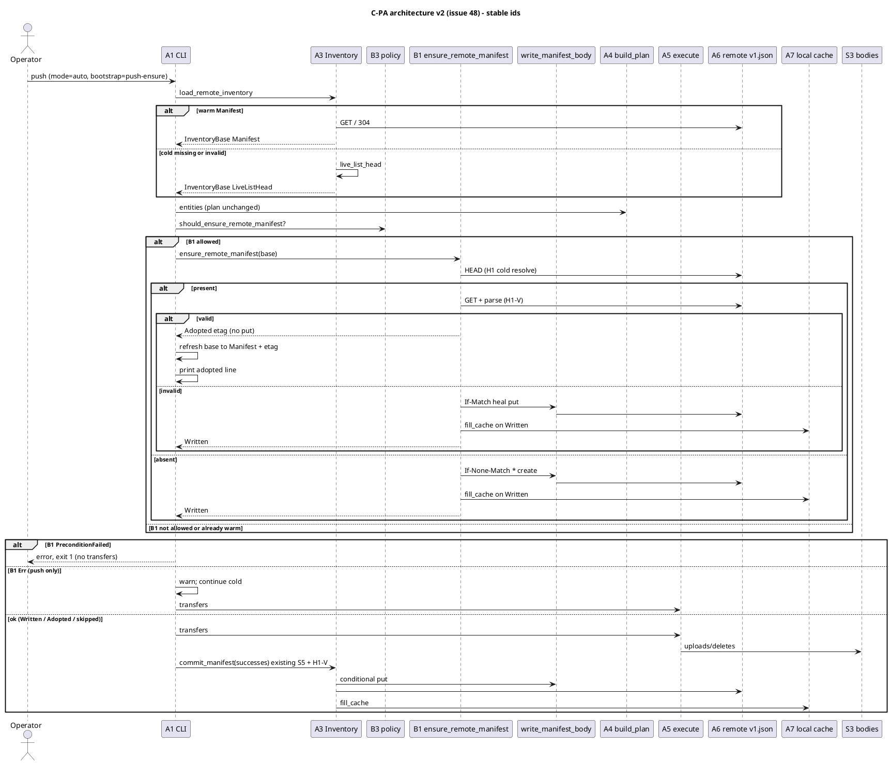
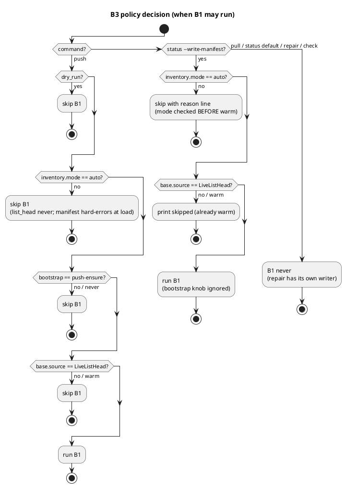
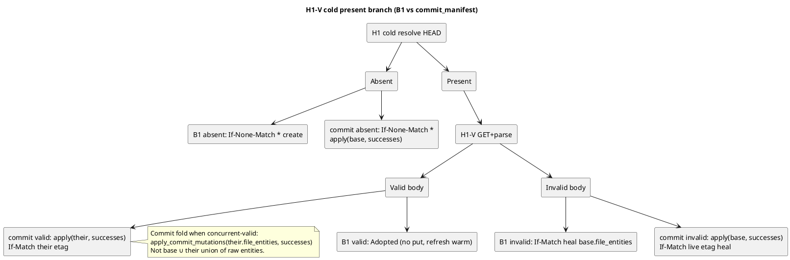
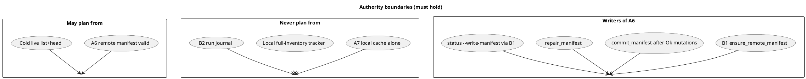
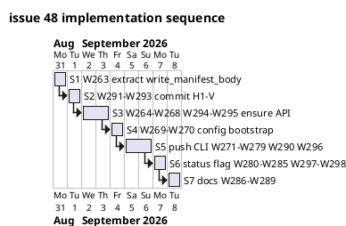

# Issue 48 plan v2: Push-time inventory bootstrap (C-PA / P-A)

**Status:** ready to implement under **strict fine-grained TDD** (IQs locked; critique [comment 5475236417](https://github.com/tlkahn/vaultsync/issues/48#issuecomment-5475236417) incorporated; this file is the implementation source of truth).
**Supersedes:** [issue-48.md](./issue-48.md) (v1; retained for cross-reference; do not implement from v1).
**Issue:** https://github.com/tlkahn/vaultsync/issues/48 (OPEN; enhancement)
**Parent tracking:** [#47](https://github.com/tlkahn/vaultsync/issues/47)
**Sibling (out of scope):** [#49](https://github.com/tlkahn/vaultsync/issues/49) C-PB transfer resume - do not fold journal/resume work into this plan
**Spike:** [doc/spikes/inventory-bootstrap-ideation.md](../spikes/inventory-bootstrap-ideation.md) (discussion only; locks live here + issue body)
**Design parents:** [inventory-manifest.md](../inventory-manifest.md) (issue 45), [plans/issue-45.md](./issue-45.md), Q3 (no status auto-write), Q6 (no pull write), vision "no local prev-sync DB"
**Branch (suggested):** `worktree-inventory-bootstrap-issue-48`
**Verified baseline (recorded at plan time):** tip `f1d13ac` (issue 45 / PR #46 on `main`). Gate on this tree: `cargo test --offline --lib --bins` = 572 passed / 0 failed / 1 ignored. W-series last used: **W262** (PR 46 review fixes). This plan starts at **W263**.
**Blocker check:** #45 warm path + commit + repair + local cache are on `main`. No code blocker. #49 / #26 / #42 are parallel or deferred and are **not** required for C-PA correctness.
**Critique delta:** v1 locks changed by F1 (validate-before-overwrite on B1 **and** `commit_manifest` H1) and F2 (split IQ-fail: race aborts, transient Err warns-and-continues on push). F3-F8 are plan-text / test pins only. See [Revision log](#revision-log) and [Critique disposition](#critique-disposition-comment-5475236417).

---

## Problem recap (verified against the tree)

Remote `.vaultsync/manifest/v1.json` (A6) is written today only by:

| Writer | Gate |
| ------ | ---- |
| `commit_manifest` after `push` (`src/inventory.rs`, CLI `dispatch_plan`) | at least one successful remote mutation (`SkippedNoMutations` when empty) |
| `vaultsync repair` | explicit operator action |

The planner never writes. Q3 forbids auto-write after cold `status`. Local cache (A7) is filled only after a valid remote fetch, commit, or repair - never from a synthesized cold listing alone.

```text
push/status -> cold list+head (~35s at 1.8k files on the PR #46 smoke)
            -> transfers fail / Ctrl-C / 0 Ok mutations
            -> no remote v1.json
            -> next run cold-lists again
```

Evidence: PR #46 comments [5472302524](https://github.com/tlkahn/vaultsync/pull/46#issuecomment-5472302524), [5472308083](https://github.com/tlkahn/vaultsync/pull/46#issuecomment-5472308083). Same wall-time class as #42 cold path.

**C-PA success metric:** after one cold inventory on an eligible push (or explicit `status --write-manifest`), later plans are warm even when transfers failed or none were planned.

**Not this issue:** mid-run transfer resume, run journals, skip-already-Ok PUTs (C-PB / #49).

---

## Architecture overview

Stable ids below match the spike and issue body. New work is **B1** (writer) + **B3** (policy) + **H1-V** (validate-before-overwrite on cold present branch for B1 and `commit_manifest`).

| Id | Element | Role | This issue? |
| -- | ------- | ---- | ----------- |
| A3 | Inventory facade (`load_remote_inventory`) | Read path; still never auto-writes from cold | read stays; gains shared write helper |
| A4 | `plan()` / `build_plan` | Unchanged consumer of entities | no |
| A5 | `execute_plan` | Mutation source | no (C-PB only) |
| A6 | Remote `.vaultsync/manifest/v1.json` | Planning authority when valid | **B1 writes**; commit/repair still write |
| A7 | Local `.vaultsync/cache/*` | 304 mirror only; never authority | filled after successful B1 put (not on Adopted) |
| B1 | Bootstrap writer `ensure_remote_manifest` | Publish A6 from cold `InventoryBase.file_entities` without file-body successes | **yes** |
| B2 | Run journal | C-PB only | **no** |
| B3 | CLI / config policy | When B1 may run | **yes** |
| H1-V | Validate-before-overwrite | On cold present HEAD: GET+parse before If-Match; valid => adopt/fold, invalid => heal | **yes** (B1 + `commit_manifest`) |









### Layering rules

- **A4 `plan()` stays pure** and does not know about B1.
- **B1 never claims in-flight uploads.** It publishes the pre-transfer remote snapshot only (`base.file_entities` as loaded), or **adopts** a concurrent-valid live manifest without writing. Final `commit_manifest` still applies Ok mutations last (D-commit-order from #45).
- **A7 is filled only after a successful A6 put** (Written path). **Adopted does not fill cache** from the GET body in v1 of this fix (optional later; next warm load will fetch/304 as today). Document this.
- **Shared bytes path:** extract `write_manifest_body` so repair, commit, and B1 do not diverge on serialize / conditional put / cache fill. **Retry / force / dry-run stay outside the helper** (repair wraps the helper; see D-write-helper / W263).
- **No second list in B1.** B1 consumes the already-paid cold `InventoryBase` (plus at most one GET of the small JSON on the present-at-HEAD branch).
- **H1-V is mandatory on cold present** for both B1 and `commit_manifest`. Plain HEAD-then-If-Match overwrite of a present object without validate is removed from both paths.

---

## Critique disposition (comment 5475236417)

| Id | Finding | Disposition |
| -- | ------- | ----------- |
| F0 (holds up) | Abort-on-PreconditionFailed at B1 is necessary to prevent cascade: cold base + continue would let final `commit_manifest` H1 If-Match-clobber the winner with `base ∪ successes`. | **Adopt as primary IQ-fail rationale** (stronger than v1 "no bodies landed yet"). |
| F1 | B1 H1 cold-resolve silently clobbers concurrent-valid manifests (HEAD present => If-Match; cannot tell corrupt vs concurrent-valid). B1 widens the hole (every cold push, including zero-mutation). Same hole pre-exists in `commit_manifest` H1. | **Adopt for B1 and for `commit_manifest`.** B1: valid => `Adopted` (refresh warm, no put); invalid => If-Match heal. Commit: valid => `apply_commit_mutations(their.file_entities, successes)` then If-Match their etag; invalid => heal `apply(base, successes)` with live etag. Etag-less present (N5) still degrades; document residual hole. |
| F2 | IQ-fail "any failure aborts" conflates PreconditionFailed (correctness) with Err (availability regression vs today). | **Split.** Push: `PreconditionFailed` => exit 1 no transfers; `Err` => warn + continue cold. Status `--write-manifest`: any failure => exit 1 (write is the requested op). |
| F3 | Etag-less `Written { etag: None }` makes D-cond / IQ-refresh "one fewer HEAD" false; `source = Manifest { remote_etag: None }` still counts warm for B1 predicate. | **Doc pin** in D-cond / D-n5 / IQ-refresh. |
| F4 | D-trigger-status vs D-b1-skip-warm: `mode=manifest` + warm + flag - which skip line? Algorithm checks mode first. | **Lock mode-first:** non-Auto => `skipped (mode=...)` even if warm; warm check only under Auto. W-item pins it. |
| F5 | Test gaps: warm push no B1 put; non-empty N; simulated-race honesty; `--json` combo. | **Add W-items** (W290/W294/W266 note/W298). `--json` remains Phase-3 rejected today (W298); future contract: combo allowed, lines on stderr (D-json). |
| F6 | `mode=manifest` + missing rejects `status --write-manifest` at load (A11) before flag runs. | **Doc pin** in cli.md (flag does not bypass strict load; repair owns re-list). |
| F7 | B1 publishes list-stale authority earlier; concurrent readers between B1 and final commit plan from stale A6. | **Risk table** row. |
| F8 | `write_manifest_body` must preserve commit (single attempt), repair (retry once, force, dry-run), B1 (single attempt, race-as-data). | **W263 pin:** helper = single conditional/force attempt + optional cache fill; repair keeps retry/dry-run/force policy in its wrapper; helper owns cache fill uniformly. |

---

## Locked decisions (owned by #48; do not reopen in implementation)

### IQ locks (from issue discussion + critique)

| ID | Question | Lock |
| -- | -------- | ---- |
| IQ1+IQ2 | When may push-time B1 run (trigger)? | **O1b:** under `mode=auto`, when base source is `LiveListHead` (covers **missing OR invalid/corrupt**, H1-aligned). Not on warm Manifest (including `Manifest { remote_etag: None }` after etag-less B1 - see F3). |
| IQ3 | B1 timing vs transfers | **Before transfers.** Ctrl-C mid-upload still leaves a warm baseline when B1 already succeeded (Written or Adopted). |
| IQ4 | B1 when `inventory.mode=list_head`? | **No.** Debug/bisect mode never bootstraps. (Final mutation commit behavior from #45 is unchanged if transfers run.) |
| IQ5 | Zero-mutation push that only B1: UX? | Always print one stderr line on **Written**: `inventory: manifest bootstrap written (N entries)` (N may be 0). On **Adopted**: `inventory: manifest bootstrap adopted (already present, N entries)` (or pin substring `manifest bootstrap adopted`). |
| IQ6 | Config knob in v1? | **Yes:** `[inventory].bootstrap = "push-ensure" \| "never"`, default **`push-ensure`** when absent. Gates **push-time B1 only**. |
| IQ7 | Share code with repair how? | Extract **`write_manifest_body(...)`**; add **`ensure_remote_manifest(store, base, cache) -> Result<EnsureOutcome, Error>`**; repair + commit call the shared write helper. Policy (retry/force/dry-run) stays in repair wrapper (F8). |
| IQ9 | `status --write-manifest`? | **Include** as explicit opt-in. Same B1 eligibility as cold auto (`mode=auto` + `LiveListHead`); warm => no-op line. **Q3 holds:** no status auto-write. Combo with `--json` **allowed** (lines on stderr). |
| IQ-strict | `mode=manifest` + missing/invalid on push | **Keep hard error at load**; B1 only under `mode=auto`. Strict stays strict. Flag cannot heal strict missing (F6); cli.md states it. |
| IQ-zero-xfer | Push may write A6 with zero file-body successes? | **Yes** - that is the point of P-A. |
| IQ-empty | Cold push on empty remote | **Yes**, B1 may write a **0-entry** manifest (warm empty baseline). |
| IQ-fail | B1 failure policy (**F2 split**) | **Push:** `PreconditionFailed` => **abort exit 1, no transfers** (cascade prevention - F0; not merely "no bodies yet"). `Err(e)` => **warn** `manifest bootstrap failed: {e}; continuing without bootstrap` and **proceed cold** (same spirit as final-commit Err arm). **Status `--write-manifest`:** any failure (`PreconditionFailed` or `Err`) => **exit 1** (write is the op). |
| IQ-refresh | After B1 `Written` or `Adopted`, in-memory base for final commit | **Refresh** to `InventorySource::Manifest { remote_etag }` + `manifest_etag = etag` (may be `None` on etag-less - F3). After **Adopted**, **also replace `file_entities` with the adopted snapshot** (the parsed winner file set) so the warm final commit cannot fold onto a stale cold list and drop the winner's untouched keys (**PR50-r1 H1**, review 5476323432). On etag-bearing backends final commit uses warm If-Match (one fewer HEAD). On etag-less, final commit may H1 again; still no second B1 because source is Manifest not LiveListHead. |
| IQ-api | B1 entry name | **`ensure_remote_manifest`** returning **`EnsureOutcome`**. |
| IQ-status-flag-vs-bootstrap | `bootstrap=never` vs `status --write-manifest` | Explicit flag **always allowed**; bootstrap knob gates push-time B1 only. |
| IQ-h1v | Validate-before-overwrite (**F1**) | **Yes** on cold present branch for **B1 and `commit_manifest`**. See D-h1v / algorithms. |
| IQ-deliverable | Spec location | Issue body locks + **this v2 plan file** on main tree. |

### Implementation locks (derived; pin here)

| ID | Lock | Choice |
| -- | ---- | ------ |
| D-pa-scope | Module boundary | C-PA: B1 + B3 + shared write extract + **H1-V on B1 and commit_manifest**. No B2 journal, no executor resume, no plan-phase progress (#42), no local tracker. |
| D-auth | Authority | Unchanged from #45: plan only from valid A6 or live list+head. A7 never authority. Reject O3 local full-inventory tracker as planner input. |
| D-q3 | Status auto-write | **Still no.** Only explicit `status --write-manifest` may mutate remote from status. Default status remains read-side-effect free for the remote (cache fill of a valid fetch still allowed as today). |
| D-q6 | Pull write | **Still no.** Pull never calls B1. |
| D-trigger-push | Push B1 predicate | `!dry_run && mode == Auto && bootstrap == PushEnsure && base.source == LiveListHead`. Warm Manifest (any etag including None) => B1 not called (put-counter pin W290). |
| D-trigger-status | Status B1 predicate (**F4 mode-first**) | Flag set, then **mode checked before warm**: (1) `mode != Auto` => print `skipped (mode={mode})`, no put (even if warm); (2) else if source is Manifest => print `skipped (already warm)`; (3) else run B1. Bootstrap knob ignored. |
| D-cond | Conditional put shape | Shared cold resolve skeleton: HEAD live object; absent => If-None-Match `*`; present etag-less => unconditional put (N5, residual multi-writer hole documented); present with etag => **H1-V** (not blind If-Match). Warm base (etag Some) keeps If-Match on base etag with no HEAD. |
| D-h1v | H1-V present+etag branch | **GET** body + **parse/validate** with the same rules as load (schema/cap). **B1:** valid => `EnsureOutcome::Adopted { etag, files, entry_count }` (no put, no cache fill; `files` = parsed winner set for a complete warm refresh - PR50-r1 H1); invalid => If-Match heal write of `base.file_entities`. **`commit_manifest`:** valid => `files = apply_commit_mutations(their.file_entities, successes)`, If-Match **their** etag (concurrent-valid fold; not raw entity union with cold base); invalid => `files = apply_commit_mutations(base.file_entities, successes)`, If-Match live etag heal. GET/parse failure on the validate probe: treat as **Err** (propagate; B1 push warns-and-continues per IQ-fail; commit Err arm warns as today). |
| D-body | Snapshot contents (B1 write path) | `base.file_entities` only (full remote file set minus reserved; **not** ignore-filtered; no folder rows). No mutation fold in B1. Adopted path uses live entry_count from parsed body only for the line. |
| D-order-cli | CLI order on push | `build_plan` -> warnings -> inventory source line -> **B1 (maybe)** -> bootstrap written/adopted line or warn-continue -> print plan -> (dry-run exit \| execute -> final commit with H1-V). |
| D-order-status | CLI order on status + flag | `build_plan` -> warnings -> inventory source line -> **B1 (maybe)** -> bootstrap / skip / error line -> print plan -> exit 0/2 (or 1 on B1 fail). Mode-first skip ordering (D-trigger-status). |
| D-ensure-outcome | `EnsureOutcome` | At least: `Written { etag: Option<String>, entry_count: usize }`, `Adopted { etag: Option<String>, files: Vec<Entity>, entry_count: usize }`, `PreconditionFailed`. `Adopted.files` is the parsed winner snapshot (**PR50-r1 H1**); `len() == entry_count`. Callers: push maps PreconditionFailed -> abort; Written/Adopted -> refresh (Adopted installs files); Err -> warn+continue. Status maps PreconditionFailed and Err -> exit 1. Optional CLI-side skip (do not call ensure) rather than inside ensure. |
| D-write-helper | `write_manifest_body` (**F8**) | Shared **lowest** layer: body bytes + `WriteCond` (If-Match / If-None-Match * / force unconditional) -> single put attempt -> on success optional `fill_cache` -> etag. **Does not** retry, does not interpret dry-run, does not run H1-V GET. H1-V and repair retry/force/dry-run live in callers wrapping the helper. W263 must pin: repair retry loop stays in `repair_manifest`; helper owns cache fill uniformly (remove repair's hand-clone-only path divergence). |
| D-commit-when | Final commit after B1 | Unchanged: skip when zero Ok mutations (`SkippedNoMutations`). Baseline already published or adopted by B1. When mutations Ok, final commit folds successes onto **refreshed base** - after Adopted that is the COMPLETE adopted file set, so the winner's untouched keys survive (PR50-r1 H1) - (or onto their-entries under H1-V valid branch) with warm If-Match when etag known. |
| D-commit-race | Final commit lost race | **Unchanged Q2:** warning + exit 0 if transfers ok. Do not apply B1's PreconditionFailed abort policy to final commit. |
| D-commit-h1v | `commit_manifest` cold path | Replace blind present=>If-Match with D-h1v. Existing W249 corrupt-overwrite tests stay green; add concurrent-valid fold pin (W292). |
| D-b1-race-msg | B1 lost-race stderr (push + status) | Pin substring: `manifest bootstrap failed` and `lost race`. Push exit **1**; status exit **1**. |
| D-b1-err-msg | B1 transient Err on push (**F2**) | Pin substring: `manifest bootstrap failed` and `continuing without bootstrap`. Exit code follows transfers (B1 itself does not force 1). |
| D-b1-ok-msg | B1 Written stderr | Exactly one line shape: `inventory: manifest bootstrap written ({N} entries)` with decimal N (**N = real file count**, including non-empty bases - F5). |
| D-b1-adopt-msg | B1 Adopted stderr | `inventory: manifest bootstrap adopted (already present, {N} entries)` - substring pins: `manifest bootstrap adopted` and `already present`. |
| D-b1-skip-warm | Status flag on warm under Auto | `inventory: manifest bootstrap skipped (already warm)` |
| D-b1-skip-mode | Status flag when mode blocks (**F4**) | `inventory: manifest bootstrap skipped (mode={mode})` - emitted whenever `mode != Auto`, **including** warm Manifest under `mode=manifest` / `list_head`. |
| D-json | `status --write-manifest --json` (**F5**) | **Today:** `--json` is still Phase-3 rejected (`reject_json` runs before flag work; existing `run_status_json_rejected_not_implemented` stays green). **Do not implement status JSON in this issue.** **Future contract (docs only):** when JSON lands, combo is allowed and bootstrap/skip lines stay on **stderr** so JSON stdout stays clean. W298 pins current rejection + documents the future contract. |
| D-config | `[inventory].bootstrap` | Optional string; absent => `push-ensure`. Allowed: `push-ensure`, `never`. Unknown => loud parse error naming `inventory.bootstrap`. `deny_unknown_fields` remains on the section. |
| D-settings | `Settings` field | `inventory_bootstrap: InventoryBootstrap` next to `inventory_mode`. Thread through CLI ctx / `PlanFlags` as needed. |
| D-dry-run | Dry-run | `push --dry-run` never B1 and never final commit. No status dry-run flag required. |
| D-cache | Cache on B1 | On `Written`, `fill_cache` with new body + etag. On `Adopted`, **no** cache fill required in this issue (next load fetches). |
| D-n5 | Etag-less backends (**F3**) | Present etag-less => unconditional put (N5); H1-V cannot If-Match-protect. After `Written { etag: None }`, refresh sets `manifest_etag = None` and `source = Manifest { remote_etag: None }` (warm for B1 predicate; final commit may H1 again). Document residual multi-writer hole; no new policy. |
| D-ignore | Ignore | Unchanged: manifest stores unfiltered remote set; ignore stays plan-time both sides. |
| D-repair | Repair | Stays the full re-list rebuild tool (`--force` / `--dry-run` / retry-once). Not replaced by B1. B1 never re-lists. H1-V is **not** required on repair (repair intentionally rebuilds from live list and overwrites via its own policy). |
| D-tests | Offline gate | Every W-item leaves `cargo test --offline --lib --bins` green. Prefer mock list-counter / `NoListStore`-style pins for "next status is warm". W266 may stay single-store simulated race; document honesty (F5). |
| D-docs | Docs | `cli.md` (incl. F6 strict+flag, F2 split, adopted line, `--json`), `inventory-manifest.md` (C-PA addendum + H1-V), README known behaviors, roadmap decision row; spike stays ideation. |
| D-w-series | Numbering | Work items **W263+** (numbers kept from v2 critique pass; **execute in S-phase order**, not numeric order - see [Implementation sequence](#implementation-sequence-s-phases)). |
| D-tdd | Method | **Strict fine-grained TDD** per [Method](#method-strict-fine-grained-tdd) (same bar as issue-45). One behavior per W-item; RED before GREEN; mutation-check on safety pins; offline gate after every GREEN. |
| D-prs | Landing | Stacked commits in S-phase order: S1 extract -> S2 H1-V commit -> S3 ensure API -> S4 config -> S5 push CLI -> S6 status flag -> S7 docs. Offline green each step. Prefer one commit per W-item (`feat\|test\|refactor\|docs: [48] ... (Wnnn)`). |

### Normative strings (pin via substring in tests)

```text
inventory: manifest bootstrap written (
inventory: manifest bootstrap adopted
already present
inventory: manifest bootstrap skipped (already warm)
inventory: manifest bootstrap skipped (mode=
manifest bootstrap failed
lost race
continuing without bootstrap
```

Existing strings that must keep working:

```text
inventory: list+head (cold)
inventory: manifest (
manifest not committed
warning: manifest commit failed
```

### Config sketch (normative)

```toml
[inventory]
mode = "auto"                 # existing: auto | manifest | list_head
bootstrap = "push-ensure"     # new: push-ensure | never (default push-ensure)
```

### CLI sketch (normative)

```text
vaultsync push                 # may B1 under push-ensure + auto + cold
vaultsync push --dry-run       # never B1
vaultsync status               # never writes remote (Q3)
vaultsync status --write-manifest   # explicit B1 when auto + cold; warm/mode skip lines
vaultsync status --write-manifest --json  # allowed; lines on stderr
vaultsync pull                 # never B1 (Q6)
vaultsync repair               # existing full rebuild writer
```

---

## Code seams (where to touch)

| Seam | File | Change | Phase |
| ---- | ---- | ------ | ----- |
| Shared write | `src/inventory.rs` | Extract `write_manifest_body` + `WriteCond`; repair/commit wrappers; helper owns cache fill | S1 |
| H1-V commit | `src/inventory.rs` `commit_manifest` | Cold present+etag => GET+validate; valid fold their+successes; invalid heal | S2 |
| Cold resolve helper | `src/inventory.rs` | Private `resolve_cold_put_plan` (shared commit + ensure) | S2/S3 |
| B1 API | `src/inventory.rs` | `EnsureOutcome` (+Adopted), `ensure_remote_manifest` | S3 |
| Push predicate | `src/inventory.rs` or `src/cli.rs` | Pure `should_push_b1(...)` with unit table | S5 |
| Config | `src/config.rs` | `InventoryBootstrap`, parse `bootstrap`, `Settings.inventory_bootstrap` | S4 |
| Command | `src/cli.rs` | `Command::Status { write_manifest: bool, ... }`; clap `--write-manifest` on status subcommand | S6 |
| Push dispatch | `src/cli.rs` `dispatch_plan` | After inventory line, before execute: B1; PF abort; Err warn+continue; refresh Written/Adopted | S5 |
| Status dispatch | `src/cli.rs` status arm | After inventory line: mode-first skip / warm skip / B1; any fail => exit 1 | S6 |
| Ctx flags | `src/cli.rs` | Thread `inventory_bootstrap` beside `inventory_mode` into `PlanFlags` / status ctx | S5/S6 |
| Docs | `doc/cli.md`, `doc/inventory-manifest.md`, `README.md`, `doc/roadmap.md` | Behavior + config + flag + H1-V + F2/F6 | S7 |
| Spike / index | `doc/spikes/...`, `doc/README.md` | Point to locked **v2** plan | S7 |

**Primary test homes:** `src/inventory.rs` (S1-S3), `src/config.rs` (S4), `src/cli.rs` (S5-S6). Prefer `#[cfg(test)]` modules next to production code (project norm).

**Do not touch for this issue:** `execute_plan` journal hooks, `plan()` equality, pull commit, #42 progress bars, S3 retry policy, implementing status `--json` output, repair's intentional overwrite / retry / force semantics (beyond routing bytes through the helper).

---

## Detailed algorithm

### `write_manifest_body` (lowest layer)

```text
write_manifest_body(store, body, cond, cache) -> Result<WriteOutcome, Error>:
  # cond: IfMatch(etag) | IfNoneMatchStar | Force
  # single put attempt only - no retry, no HEAD, no H1-V
  match store.put_from_with(MANIFEST_KEY, body, cond_to_PutOpts(cond)):
    Ok(entity) =>
      if cache: fill_cache(cache, body, entity.etag)
      OkWritten { etag: entity.etag }
    Err(PreconditionFailed) => PreconditionFailed
    Err(e) => Err(e)
```

### H1-V resolve helper (shared idea; may be private fn)

```text
resolve_cold_put_plan(store, base_files, successes_opt) -> Result<ColdPlan, Error>:
  # successes_opt: None for B1 (files = base_files on write paths)
  #                Some(successes) for commit
  match store.head(MANIFEST_KEY):
    Err(NotFound) =>
      files = apply_or_base(base_files, successes_opt)
      ColdPlan::Create { files }          # If-None-Match *
    Ok(ent) if ent.etag is None =>
      files = apply_or_base(base_files, successes_opt)
      ColdPlan::ForcePut { files }        # N5 unconditional
    Ok(ent) =>
      body = GET MANIFEST_KEY
      match parse_validate(body):
        Valid(their) =>
          match successes_opt:
            None => ColdPlan::Adopt { etag: ent.etag, entry_count: their.entry_count }
            Some(successes) =>
              files = apply_commit_mutations(their.file_entities, successes)
              ColdPlan::Overwrite { files, etag: ent.etag }
        Invalid =>
          files = apply_or_base(base_files, successes_opt)
          ColdPlan::Overwrite { files, etag: ent.etag }   # heal
    Err(e) => Err(e)
```

### `ensure_remote_manifest`

```text
ensure_remote_manifest(store, base, cache) -> Result<EnsureOutcome, Error>:
  # Caller enforces policy (only call when cold-eligible).
  created_ms = now_ms()
  match resolve_cold_put_plan(store, &base.file_entities, None)?:
    Adopt { etag, files, entry_count } =>
      EnsureOutcome::Adopted { etag, files, entry_count }    # no put, no cache
    Create { files } =>
      body = serialize(file_entities_to_manifest(files, ...))?
      match write_manifest_body(store, body, IfNoneMatchStar, cache)?:
        OkWritten { etag } => Written { etag, entry_count: files.len() }
        PreconditionFailed => PreconditionFailed
    Overwrite { files, etag } | ForcePut { files } =>
      body = serialize(...)?
      cond = Overwrite -> IfMatch(etag) ; ForcePut -> Force
      match write_manifest_body(store, body, cond, cache)?:
        OkWritten { etag } => Written { etag, entry_count: files.len() }
        PreconditionFailed => PreconditionFailed
```

### `commit_manifest` cold branch (delta from today)

```text
# unchanged: empty successes => SkippedNoMutations
# warm base (manifest_etag Some) => If-Match base etag on apply(base, successes)  # no H1-V
# cold base (manifest_etag None):
match resolve_cold_put_plan(store, &base.file_entities, Some(successes))?:
  Adopt => impossible (successes Some never returns Adopt)
  Create { files } => write If-None-Match *
  Overwrite { files, etag } => write If-Match etag
  ForcePut { files } => write Force
# map put results to CommitOutcome as today (incl. Q2 PreconditionFailed)
```

### Push integration

```text
report = build_plan(...)
print warnings + inventory source line
base = report.inventory_base

if should_push_b1(dry_run, mode, bootstrap, &base.source):
  match ensure_remote_manifest(store, &base, Some(cache)):
    Written { etag, entry_count } =>
      base.source = Manifest { remote_etag: etag.clone() }
      base.manifest_etag = etag
      print "inventory: manifest bootstrap written ({entry_count} entries)"
    Adopted { etag, files, entry_count } =>
      base.file_entities = files          # PR50-r1 H1: complete adopted snapshot
      base.source = Manifest { remote_etag: etag.clone() }
      base.manifest_etag = etag
      print "inventory: manifest bootstrap adopted (already present, {entry_count} entries)"
    PreconditionFailed =>
      print error lost-race bootstrap text; return 1
    Err(e) =>
      print "warning: manifest bootstrap failed: {e}; continuing without bootstrap"
      # base stays cold; fall through

print plan
if dry_run: exit clean/dirty
else:
  exec...
  if push and mutations non-empty:
    commit_manifest(store, &base, mutations, cache)  # Q2 on race; H1-V on cold
  exit per transfer/conflict rules
```

### Status `--write-manifest` integration

```text
report = build_plan(...)
print warnings + inventory source line
base = report.inventory_base

if write_manifest:
  if mode != Auto:                                    # F4 mode-first
    print "inventory: manifest bootstrap skipped (mode={...})"
  else if base.source is Manifest:
    print "inventory: manifest bootstrap skipped (already warm)"
  else:
    match ensure_remote_manifest(...):
      Written => print written line
      Adopted => print adopted line
      PreconditionFailed | Err => print error; exit 1

print plan
# Today: --json still rejected before this arm (D-json). Future: lines stay on stderr.
exit 0/2 as today
```

---

## Method: strict fine-grained TDD

Same bar as [issue-45.md](./issue-45.md) Method. Applies to every behavioral W-item (S1-S6). Docs (S7) are docs-only under the all-green gate.

1. **RED first** - named failing test before production code. Confirm failure reason:
   - missing symbol / type => compile-fail RED is accepted for brand-new APIs
   - once the symbol exists, assertion failure is the RED form
   - never write GREEN implementation in the same edit as the first RED without running the test and seeing it fail
2. **GREEN smallest** - only enough code to pass that cycle's new tests + keep the offline suite green
3. **Refactor only while green** - no behavior change without a new RED; extract/rename is fine under green
4. **One logical behavior per W-item** - prefer separate commits; collapse RED+GREEN into one commit only when RED was compile-fail on a new symbol and GREEN is the first body (still prefer split when practical)
5. **After every GREEN**, in order:
   - `cargo fmt`
   - `cargo clippy --all-targets -- -D warnings`
   - focused test(s) for the W-item
   - full `cargo test --offline --lib --bins` before starting the next RED
6. **Mutation-check** (required on safety pins - see each W-item): temporarily break the production branch or invert one assertion, confirm the pin goes RED, revert, leave suite green
7. **No network** in the default suite. All B1/H1-V/CLI pins use `MemoryStore` + thin test doubles (put counters, fail-on-put, fail-on-head, NoListStore). No env-gated S3 required to close the issue
8. **Do not edit characterization tests silently** - extend with new cases; keep W249/W250/W246 family meanings intact when H1-V lands
9. **Phase gates** - do not start S3 (B1 API) before S2 (commit H1-V) is green if sharing `resolve_cold_put_plan`; do not start S5 (push CLI) before S3+S4 green; do not start S6 before S5 predicate/helpers exist; S7 docs last
10. **Library never writes stderr** - inventory returns data; CLI prints lines (same as #45 W236 ethos)

### Mutation-check habit (required on these properties)

| Property | Break experiment |
| -------- | ---------------- |
| H1-V no silent clobber | skip GET/validate; blind If-Match overwrite => W291 / W268 RED |
| B1 Adopted no put | still put on valid present => W268 put-counter RED |
| B1 race abort | continue push after PreconditionFailed => W276 uploads-ran RED |
| B1 Err continue | abort push on Err => W277 RED (wrong direction) |
| Warm push no B1 | call ensure on Manifest source => W290 put-counter RED |
| Mode-first status skip | warm check before mode => W297 prints already-warm RED |
| Cache only on Written | fill_cache on Adopted path => W267 RED if we assert no cache |
| Final commit uses B1 etag | pass stale etag only-accept mock => W278 RED |
| Q3 default status | write without flag => W281 RED |
| Repair retry outside helper | helper retries => characterization / W263 pin RED |

Revert after each experiment; leave the suite green.

### Test double recipes (reuse / extend)

| Double | Purpose | Home |
| ------ | ------- | ---- |
| `MemoryStore` | baseline conditional put/get | `store::mock` |
| `NoListStore` | warm path must not list | already in `inventory` tests |
| Put-counter store | assert B1 did/didn't put `MANIFEST_KEY`; file-key puts for "no uploads" | thin wrapper in test module |
| Fail-precondition store | If-Match / If-None-Match always 412 | extend existing CLI race double pattern (`cli.rs` ~2439) |
| Fail-err store | HEAD or PUT returns non-precondition `Error` | new thin double |
| Etag-accept store | only accepts one If-Match etag | W278 refresh pin |
| List-counter store | next status warm => list count unchanged / zero | inventory tests |

### Commit message shape

```text
feat|test|refactor|docs: [48] <summary> (Wnnn)
```

Body may cite lock ids (`IQ-fail`, `D-h1v`, `F2`) and acceptance rows (`A18`).

---

## Implementation sequence (S-phases)

Execute **in this order**. W-numbers are stable ids from the critique pass; they are **not** execution order.



| Phase | W-items (execution order inside phase) | Exit criteria |
| ----- | -------------------------------------- | ------------- |
| **S1** Shared write extract | W263 | commit + repair existing tests green; helper single-attempt; repair still retries; cache fill via helper |
| **S2** Commit H1-V | W291 RED -> W292 RED/char -> W293 GREEN | W249 family green; concurrent-valid fold pinned; no blind overwrite |
| **S3** B1 library API | W264 -> W294 -> W265 -> W268 -> W266 -> W267 -> W295 | `ensure_remote_manifest` complete offline; Adopted/Written/PF; cache rules |
| **S4** Config | W269 -> W270 | `Settings.inventory_bootstrap` resolved; unknown loud |
| **S5** Push CLI | pure predicate unit (with W271..) then W290, W273-W275, W271, W272, W296, W276, W277, W278, W279 | all push A-rows; F2 split live |
| **S6** Status flag | W280 -> W281 -> W282 -> W283 -> W297 -> W284 -> W298 -> W285 | Q3 held; mode-first; json still rejected |
| **S7** Docs + closeout | W286 -> W287 -> W288 -> W289 | docs match locks; plan status implemented; offline gate recorded |

**Parallelism note:** S4 config is independent of S2/S3 library work and **may** be done immediately after S1 if desired; default order above keeps one mental stack. Do not merge push CLI before ensure API exists.

---

## Work items (W263+) - fine-grained TDD

Each item below is one RED->GREEN cycle (or tight pair). Files default to `src/inventory.rs` tests unless noted.

### S1 - Shared write extract (behavior-preserving)

#### W263 - extract `write_manifest_body` (**F8**)

**Kind:** refactor-while-green (characterization first if gap).

**Pins before extract (must pass on current tree, or add as GREEN characterization then extract):**

- Existing: `commit_manifest_create_then_if_match_race`, `commit_manifest_cold_base_overwrites_existing_corrupt_body`, `commit_manifest_cold_base_creates_when_absent`, repair force/dry-run/retry tests in `inventory.rs`
- Add thin pin if missing: repair lost-race retries **once** (second put succeeds) - prove retry is not inside the future helper by structure comment + test name `repair_manifest_retries_once_on_precondition_failed`

**Extract contract:**

```text
fn write_manifest_body(
    store: &dyn ObjectStore,
    body: &[u8],           // or Vec moved into cursor once
    cond: WriteCond,       // IfMatch(String) | IfNoneMatchStar | Force
    cache: Option<&CachePaths>,
) -> Result<WriteBodyOutcome, Error>
// WriteBodyOutcome: Written { etag } | PreconditionFailed
// single put_from_with; on Written + cache Some => fill_cache
// NO head, NO retry, NO dry-run, NO H1-V
```

**GREEN:** `commit_manifest` and `repair_manifest` call helper; repair keeps retry/force/dry-run in wrapper; repair drops hand-clone-only cache path divergence (helper fills).

**Mutation-check:** move retry into helper -> repair test that expects one retry still passes only if wrapper retries; add comment asserting helper has no loop. Optionally count puts on a 412-then-ok double: repair => 2 puts; bare helper => 1 put + PF.

**Commit:** `refactor: [48] extract write_manifest_body for commit/repair (W263)`

**S1 exit:** full offline green; no public API change required (helper `pub(crate)` ok).

---

### S2 - H1-V on `commit_manifest` (F1 commit half)

Depends on: S1 (helper available). Touches: `commit_manifest` cold branch only; warm If-Match path unchanged.

#### W291 - RED: cold commit does not clobber concurrent-valid manifest

**Fixture:**

1. Build valid manifest body M_their with entries `[b.md]` only; PUT to `MANIFEST_KEY` (unconditional); capture `etag_their`
2. Cold base: `manifest_etag: None`, `file_entities: [a.md]` (stale cold list - has a, lacks b)
3. Successes: `[Upload(a.md)]`
4. Call `commit_manifest`

**Assert (will FAIL on pre-H1-V tree - that is the RED):**

- Outcome `Written`
- Parsed live body contains **both** `a.md` (from success) **and** `b.md` (from their)
- Must **not** be only `a.md` (stale base∪successes clobber)

**Commit (RED only ok):** `test: [48] RED commit H1-V keeps concurrent-valid keys (W291)`

#### W292 - RED/char: cold commit still heals corrupt present

**Fixture:** reuse W249 shape - corrupt body at key; cold base; Upload success.

**Assert:** `Written`; body valid; entry set = apply(base, successes). Existing `commit_manifest_cold_base_overwrites_existing_corrupt_body` may already pin this - if so, mark W292 as **characterization keep** and only add a cross-link comment `// W292 / H1-V invalid branch`. If the existing test would break under a wrong H1-V (e.g. treat corrupt as adopt), it is the pin.

**Commit:** `test: [48] pin cold commit corrupt heal under H1-V (W292)` only if new test added; else fold comment into W293 commit.

#### W293 - GREEN: implement commit H1-V

**Implement** D-h1v for `commit_manifest`:

- cold + absent => create If-None-Match * with apply(base, successes)
- cold + present etag-less => Force put apply(base, successes) (N5)
- cold + present+etag + GET valid => apply(**their**.file_entities, successes), If-Match their etag
- cold + present+etag + GET invalid => apply(base, successes), If-Match live etag
- warm path unchanged

Prefer private `resolve_cold_put_plan` shared with later B1 (or duplicate minimally then extract under green in S3).

**Mutation-check:** skip validate; always overwrite with base fold => W291 RED.

**Gate:** `cargo test --offline --lib --bins`; W249/W250/race family green.

**Commit:** `feat: [48] commit_manifest H1-V validate-before-overwrite (W293)`

**S2 exit:** A19 held at library layer; no CLI change yet.

---

### S3 - B1 library API (`ensure_remote_manifest`)

Depends on: S2 (shared cold resolve). All tests in `src/inventory.rs` `#[cfg(test)]` unless noted.

#### W264 - RED: EnsureOutcome + empty Written create

**RED:**

- Types `EnsureOutcome::{Written { etag, entry_count }, Adopted { etag, entry_count }, PreconditionFailed}` referenced from a test
- `ensure_remote_manifest(&MemoryStore::new(), &cold_empty_base, None)` 
  - cold_empty: `LiveListHead`, `file_entities: []`, `manifest_etag: None`
  - => `Ok(Written { entry_count: 0, etag: Some(_) })`
  - live body parses; `entry_count == 0`
  - put used If-None-Match * (optional: counter/double)

**GREEN (this item or tightly paired):** minimal ensure create path only (absent branch). Adopted/corrupt may still be `todo`/unimplemented arms if tests for them are not yet added - prefer full skeleton returning Err("unimplemented") only if compile needs it; better to implement create path fully and leave other branches for later W-items' GREEN.

**Commit:** `feat: [48] ensure_remote_manifest empty create (W264)`

#### W294 - RED: non-empty Written entry_count (**F5**)

**RED:** cold base `file_entities: [a.md, b.md]` (len 2); absent key; ensure => `Written { entry_count: 2 }`; parsed manifest entry_count 2; keys {a.md, b.md}.

**GREEN:** already satisfied if W264 serializes `base.file_entities`; else fix mapping.

**Commit:** `test: [48] ensure Written entry_count matches base (W294)`

#### W265 - RED: present corrupt => heal Written + warm load

**RED:**

1. Seed corrupt body at `MANIFEST_KEY`
2. Cold base with `[a.md]`
3. ensure => `Written { entry_count: 1, .. }`
4. body valid with a.md
5. `load_remote_inventory(Auto, None)` on `NoListStore` wrapping store => warm Manifest (no list panic)

**GREEN:** H1-V invalid branch for B1 (If-Match heal, no successes).

**Mutation-check:** on corrupt, return Adopted without write => load still fails / test RED.

**Commit:** `feat: [48] ensure H1-V heals corrupt present (W265)`

#### W268 - RED: present valid => Adopted, zero puts (**F1 B1**)

**RED:**

1. Seed **valid** manifest with `[b.md]` only; capture etag
2. Cold base stale `[a.md]`
3. Put-counter store around MemoryStore
4. ensure => `Adopted { etag: eq live, entry_count: 1 }`
5. manifest-key put count **0**
6. live body still only b.md (unchanged)

**GREEN:** H1-V valid => Adopted path.

**Mutation-check:** valid present still overwrites => put count > 0 and/or body loses b.md => RED.

**Commit:** `feat: [48] ensure adopts concurrent-valid manifest (W268)`

#### W266 - RED: lost race => PreconditionFailed, no clobber, no cache

**Honesty (F5):** single-store simulation, not two tasks. Comment in test: `// W266 simulated race (not two ensure_remote_manifest tasks).`

**RED:**

- Double: `put_from_with` with `if_none_match_star` or If-Match returns `Error::PreconditionFailed`
- ensure => `Ok(PreconditionFailed)` **or** `EnsureOutcome::PreconditionFailed` per API (`Result` vs enum - lock: outcome enum variant, not Err)
- pre-seeded body unchanged
- cache dir absent / untouched when `Some(cache)` passed

**GREEN:** map helper PF to EnsureOutcome::PreconditionFailed; no fill_cache.

**Commit:** `test: [48] ensure PreconditionFailed is race-as-data (W266)`

#### W267 - RED: cache fill on Written only

**RED:**

1. Written path with `Some(cache)` under temp dir => cache body + meta present; fingerprint contract from W259 holds
2. Adopted path with `Some(cache)` => **no** new cache files required (assert cache missing or unchanged)

**GREEN:** fill_cache only on Written arm.

**Commit:** `test: [48] ensure cache fill Written not Adopted (W267)`

#### W295 - GREEN sweep / shared resolve extract

If `resolve_cold_put_plan` not yet shared between commit and ensure, extract under green now. Run full offline gate. No new behavior.

**Commit:** `refactor: [48] share cold H1-V resolve between commit and ensure (W295)` (skip commit if already shared in W293/W268).

**S3 exit:** library A8/A12/A18/A23-class pins green; `ensure_remote_manifest` public or `pub(crate)` ready for CLI.

---

### S4 - Config `[inventory].bootstrap`

Files: `src/config.rs` (+ tests module there).

#### W269 - RED: parse bootstrap values

**RED table:**

| TOML | expect |
| ---- | ------ |
| no `[inventory]` / no bootstrap key | `InventoryBootstrap::PushEnsure` |
| `bootstrap = "push-ensure"` | PushEnsure |
| `bootstrap = "never"` | Never |
| `bootstrap = "sometimes"` | Err message contains `inventory.bootstrap` |
| unknown key under `[inventory]` | still denied (`deny_unknown_fields`) |

Mirror style of `inventory_mode_absent_defaults_to_auto` / `inventory_mode_unknown_is_loud_error`.

**Commit:** `test: [48] RED inventory.bootstrap parse matrix (W269)`

#### W270 - GREEN: wire enum + Settings field

**GREEN:**

```text
enum InventoryBootstrap { PushEnsure, Never }
Settings.inventory_bootstrap: InventoryBootstrap
InventoryConfig.bootstrap: Option<String>
resolve_inventory_bootstrap(...)
```

Thread into CLI later (S5); for W270, Settings resolve tests green enough.

**Commit:** `feat: [48] config inventory.bootstrap push-ensure|never (W270)`

**S4 exit:** config unit tests green; CLI may still ignore the field.

---

### S5 - Push CLI policy (B3 + IQ-fail split)

Files: `src/cli.rs` (`dispatch_plan`, `PlanFlags`, `CliCtx`), pure predicate preferably `pub(crate)` in `inventory` or `cli` with unit tests.

**Prerequisite helper (do first inside S5, can be unlabeled micro-step or part of W271):**

```text
fn should_push_b1(dry_run, mode, bootstrap, source) -> bool
// !dry_run && mode==Auto && bootstrap==PushEnsure && source==LiveListHead
```

Unit table RED/GREEN before wiring dispatch (cheap, pure):

| dry_run | mode | bootstrap | source | expect |
| ------- | ---- | --------- | ------ | ------ |
| F | Auto | PushEnsure | LiveListHead | true |
| T | Auto | PushEnsure | LiveListHead | false |
| F | ListHead | PushEnsure | LiveListHead | false |
| F | Auto | Never | LiveListHead | false |
| F | Auto | PushEnsure | Manifest{..} | false |
| F | Manifest | PushEnsure | LiveListHead | false |

#### W290 - RED: warm push never calls B1 (**F5**)

**RED:** vault+store with **valid** remote manifest already; local in sync or any; `push-ensure`; put-counter on MANIFEST_KEY stays 0 across push (B1 not invoked). Final commit may still put if mutations - isolate by zero-mutation warm push (identical trees) => zero manifest puts.

**GREEN:** predicate skips; dispatch does not call ensure.

**Commit:** `test: [48] warm push does not bootstrap (W290)`

#### W273 - RED: dry-run never B1

**RED:** cold remote (no manifest); `push --dry-run`; MANIFEST_KEY absent after; no written line.

**Commit:** `test: [48] push dry-run skips B1 (W273)`

#### W274 - RED: bootstrap=never skips B1

**RED:** config bootstrap never; cold push; no manifest from B1. (If mutations Ok, final commit may still create - pin B1 skip by: zero planned mutations + never => still no manifest.)

**Commit:** `test: [48] bootstrap=never skips push B1 (W274)`

#### W275 - RED: mode=list_head skips B1

**RED:** list_head + cold push + zero mutations => no manifest write.

**Commit:** `test: [48] list_head skips push B1 (W275)`

#### W271 - RED: zero-mutation cold push writes baseline

**RED:**

- Auto + default bootstrap + cold + local/remote equal (0 actions) or no uploads planned
- stderr contains `inventory: list+head (cold)` (or existing cold marker) and `inventory: manifest bootstrap written (`
- N matches remote file count
- after push, `load_remote_inventory(Auto)` on NoListStore is warm

**GREEN:** wire ensure into `dispatch_plan` after inventory line, before execute; print written line; refresh base.

**Commit:** `feat: [48] push-time B1 bootstrap before transfers (W271)`

#### W272 - RED: B1 survives transfer failure

**Prefer unit seam:** call ensure (or dispatch with store that fails file puts after manifest put). Assert MANIFEST_KEY present even when exit 1 from transfers.

**Commit:** `test: [48] B1 persists when transfers fail (W272)`

#### W296 - RED: Adopted path line + refresh

**RED:** pre-seed valid manifest; force cold base... wait - if load sees valid manifest, source is warm and B1 skipped. **Adopted is only reachable when load went cold** (missing/invalid at load) **but** object became valid before B1 HEAD/GET (TOCTOU). Simulate with store that: list path cold (no valid manifest at load) then at ensure HEAD/GET returns valid body. Pattern: load with corrupt/missing; between load and ensure, put valid (in test, seed valid after building cold base manually and call ensure; CLI-level: custom double where first manifest GET fails/invalid and later GET succeeds).

**Library-level already in W268.** CLI-level: either

- integration double, or
- accept W268 as library pin and CLI pin only checks adopted **line** via a test hook / direct ensure+print helper

**Prefer:** thin CLI test that injects `EnsureOutcome::Adopted` through a small print helper unit-tested for the string; plus one end-to-end double if cheap. Minimum: stderr substring `manifest bootstrap adopted` + `already present` when outcome Adopted.

**Commit:** `feat: [48] push prints adopted bootstrap line (W296)`

#### W276 - RED: PreconditionFailed aborts, no uploads

**RED:** B1 returns PF (fail-precondition double on manifest put); push exit **1**; file-key put counter **0**; stderr `manifest bootstrap failed` + `lost race`.

**GREEN:** match arm abort before execute.

**Mutation-check:** fall through to execute on PF => uploads > 0 => RED.

**Commit:** `feat: [48] B1 lost race aborts push (W276)`

#### W277 - RED: B1 Err warns and continues (**F2**)

**RED:** fail-err double on manifest put/head (e.g. `Error::other` / message `simulated 503`); push with a planned upload; stderr has `manifest bootstrap failed` and `continuing without bootstrap`; file upload **may** run (put counter on file key >= 1); exit code not forced to 1 solely by B1 (if upload ok => 0).

**GREEN:** Err arm warn+continue; base stays cold.

**Mutation-check:** treat Err like PF (abort) => this test RED.

**Commit:** `feat: [48] B1 transient Err warns and continues (W277)`

#### W278 - RED: refresh etag for final commit

**RED:** B1 Written returns etag E1; successes non-empty; final commit store accepts If-Match only E1 (stale/other => PF). Push succeeds Written final. Proves refresh happened (cold path would HEAD/ differently - pin via etag-accept double).

**Commit:** `test: [48] B1 refresh drives final commit If-Match (W278)`

#### W279 - GREEN sweep push path

Full offline gate; fill any remaining glue (PlanFlags.inventory_bootstrap, ctx wiring). No new behavior beyond fixing failures from W271-W278/W290/W296.

**Commit:** `feat: [48] push B1 wiring complete (W279)` only if needed after incremental GREENS; otherwise skip.

**S5 exit:** A1,A4-A10,A12,A17,A18,A20 held at CLI; pull still no B1 (add one-liner pin if missing - see A3).

**A3 pin (add under W279 if not covered):** cold pull does not create MANIFEST_KEY.

---

### S6 - Status `--write-manifest`

Files: `src/cli.rs` clap / `Command::Status` / status arm.

#### W280 - RED: parse flag

**RED:** `Cli::try_parse_from(["vaultsync", "status", "--write-manifest"])` => `Command::Status { write_manifest: true, .. }`; without flag => false. With `--json` still parses structurally if clap allows global json + flag (json rejection is dispatch-time).

**Note:** today `Commands::Status` is unit-like - needs args struct or global flag on status only. Prefer status-subcommand flag `--write-manifest` (not global).

**GREEN:** clap + `into_command` mapping.

**Commit:** `feat: [48] status --write-manifest flag parse (W280)`

#### W281 - RED: flag cold writes; no flag no write (Q3)

**RED:**

- status without flag, cold => MANIFEST_KEY absent; no bootstrap line
- status with flag, cold auto => Written; line `inventory: manifest bootstrap written (`; next load warm

**Commit:** `feat: [48] status --write-manifest cold B1 (W281)`

#### W282 - RED: warm Auto skip line

**RED:** valid manifest present; status --write-manifest; stderr `skipped (already warm)`; put counter 0.

**Commit:** `test: [48] status write-manifest warm skip (W282)`

#### W283 - RED: bootstrap=never does not gate flag

**RED:** config never + status --write-manifest cold auto => still writes.

**Commit:** `test: [48] status flag ignores bootstrap knob (W283)`

#### W297 - RED: mode-first skip (**F4**)

**RED:** `mode=manifest` (or list_head) + **valid** warm manifest + flag => stderr `skipped (mode=` and **not** `already warm`; put 0. For `mode=manifest` missing, load still hard-errors before flag (A11/F6) - separate pin optional here or docs-only.

**Commit:** `test: [48] status write-manifest mode-first skip (W297)`

#### W284 - RED: any B1 failure exit 1

**RED:**

- PF double => exit 1; `manifest bootstrap failed` / `lost race`
- Err double => exit 1 (unlike push); must **not** print `continuing without bootstrap`

**Commit:** `feat: [48] status write-manifest fails closed (W284)`

#### W298 - RED: `--json` still rejected; future contract noted (**F5**/D-json)

**RED:** `status --write-manifest --json` => exit 1; stderr contains `not implemented` (existing reject_json); does **not** write manifest as side effect of parsing. Extend `run_status_json_rejected_not_implemented` or sibling.

**Docs bite (can wait for W286):** when JSON ships, lines on stderr.

**Commit:** `test: [48] status write-manifest --json still rejected (W298)`

#### W285 - GREEN sweep status path

Offline gate; Q3 default status characterization still green.

**Commit:** `feat: [48] status --write-manifest complete (W285)` if needed.

**S6 exit:** A2,A11,A13-A15,A21,A22 held.

---

### S7 - Docs + closeout

No RED/GREEN code cycles; suite must stay green. Edit docs only after S1-S6 green on the branch.

#### W286 - `doc/cli.md`

Cover: `[inventory].bootstrap`, push B1 before transfers, Written/Adopted lines, F2 split (race abort vs Err continue), `status --write-manifest`, mode-first skips, F6 strict+flag cannot heal missing (use repair), dry-run, list_head/manifest, D-json current rejection + future stderr contract.

**Commit:** `docs: [48] cli.md C-PA bootstrap (W286)`

#### W287 - `doc/inventory-manifest.md` C-PA addendum

B1, H1-V (commit + ensure), authority table unchanged, Q3, N5 caveat, stale-authority window (F7) one paragraph.

**Commit:** `docs: [48] inventory-manifest C-PA addendum (W287)`

#### W288 - README + roadmap

Known-behaviors bullet; roadmap decision row for issue 48 / C-PA.

**Commit:** `docs: [48] README + roadmap C-PA (W288)`

#### W289 - plan + issue closeout

- This plan status -> `implemented` with offline gate counts + tip SHA
- Issue body: point at v2; acceptance checkboxes
- Optional: short issue comment listing landed W-items

**Commit:** `docs: [48] plan implemented summary (W289)`

**S7 exit:** issue ready to close when PR merges; A16 recorded.

---

## Implementation checklist (operator)

```text
[ ] branch worktree-inventory-bootstrap-issue-48 from main
[ ] baseline: cargo test --offline --lib --bins  (record count)
[ ] S1 W263
[ ] S2 W291 -> W292 -> W293
[ ] S3 W264 -> W294 -> W265 -> W268 -> W266 -> W267 -> W295
[ ] S4 W269 -> W270
[ ] S5 predicate table -> W290 W273 W274 W275 W271 W272 W296 W276 W277 W278 W279
[ ] S6 W280 W281 W282 W283 W297 W284 W298 W285
[ ] S7 W286 W287 W288 W289
[ ] final offline gate + clippy -D warnings
[ ] PR against main; issue 48 link; do not include #49 scope
```

After each checked W-item: fmt, clippy, focused test, full offline suite.

---

## Acceptance matrix (promote from issue)

| # | Scenario | Expect |
| - | -------- | ------ |
| A1 | Cold push, kill after B1 before transfers | A6 exists (or was Adopted present); next `status` warm (no list; mock pin) |
| A2 | Default status cold | never writes (Q3) |
| A3 | Pull cold | never writes (Q6) |
| A4 | B1 lost race (PreconditionFailed) | error, exit 1, no clobber, no transfers; final commit not reached |
| A5 | B1 + partial Ok + final commit | entry set reflects fold rules; warm If-Match on B1 etag when Some |
| A6 | `push --dry-run` | no B1 |
| A7 | Zero-mutation cold push | B1 writes baseline; bootstrap line; no final commit; next status warm |
| A8 | Empty remote cold push | 0-entry A6 allowed |
| A9 | `bootstrap=never` | push skips B1 |
| A10 | `mode=list_head` | push skips B1 |
| A11 | `mode=manifest` missing | hard error at load; no B1; flag cannot bypass (F6) |
| A12 | Corrupt present + auto push | B1 heals via H1-V overwrite before transfers |
| A13 | `status --write-manifest` cold auto | B1 write |
| A14 | `status --write-manifest` warm Auto | skip already-warm line, no put |
| A15 | `status --write-manifest` with `bootstrap=never` | still writes |
| A16 | Offline `cargo test --offline --lib --bins` | green |
| A17 | B1 transient Err on push (**F2**) | warn + continue cold; transfers may run |
| A18 | B1 present valid concurrent (**F1**) | Adopted; no put; refresh warm; no silent clobber |
| A19 | commit_manifest cold + present valid (**F1**) | fold `apply(their, successes)`; their non-touched keys survive |
| A20 | Warm push + push-ensure | B1 not called (put-counter 0) |
| A21 | status flag + mode=manifest warm (**F4**) | skipped (mode=manifest), not already-warm |
| A22 | status `--write-manifest --json` | **today:** still rejected (`--json` not implemented); no manifest side-effect; **future:** allowed with lines on stderr |
| A23 | Written line N on non-empty base | N equals file_entities.len() |
| A24 | Adopted + mutations then final commit (**PR50-r1 H1**) | winner's untouched keys survive; Adopted refresh installs the adopted file set, so the warm final commit retains e.g. the winner-only key alongside our uploads |

---

## Non-goals

- P-B / #49 run journal or mid-run transfer resume
- O5 chunked mid-run remote commits
- Local full-inventory tracker as planning base (O3)
- Changing warm-path plan semantics from #45 (beyond H1-V on cold commit)
- Auto-write on default status (Q3)
- Pull manifest write (Q6)
- Making B1 re-list (repair owns re-list)
- Applying B1 PreconditionFailed abort policy to final commit Q2 (or the reverse)
- Plan-phase TTY progress (#42)
- Filling A7 cache on Adopted (deferred; optional later)
- Closing N5 etag-less multi-writer hole (document only)
- Changing repair's intentional overwrite / retry / force policy beyond shared helper extract

---

## Risk notes

| Risk | Mitigation |
| ---- | ---------- |
| B1 PreconditionFailed abort is stricter than final commit Q2 | Necessary cascade prevention (F0); document; pin separate strings and exit codes |
| B1 transient Err continuing cold | Availability preserved vs v1 abort-all; persistent misconfig still warns every run (F2) |
| Publishing cold snapshot then dying mid-upload leaves A6 without new bodies | Already the #45 "bodies ahead/behind" repair story; next push plans warm and uploads dirty locals |
| **B1 widens stale-authority window (F7)** | Cold snapshot is ~list-duration + plan-build old when B1 puts; concurrent readers between B1 and final commit plan from that stale A6 where they previously cold-listed truth. Inherent to manifest design; B1 advances publish time. Risk accepted; repair / next commit converge. |
| Concurrent writers | H1-V closes silent clobber of concurrent-valid on B1 and commit cold path; loser at B1 PreconditionFailed still aborts this push; N5 etag-less residual hole documented |
| Operators surprised push writes control plane with 0 transfers | IQ-zero-xfer accepted; one bootstrap line; `bootstrap=never` escape hatch; repair remains |
| `status --write-manifest` scope creep toward auto-write | Flag is explicit; default status path unchanged; tests pin no write without flag |
| Shared write extract regresses repair/commit | W263 behavior-preserving + existing tests first; retry/force/dry-run pinned outside helper |
| H1-V extra GET cost | One GET of small JSON only on present-at-HEAD cold branch; absent path unchanged |
| commit H1-V fold surprises multi-writer semantics | Pin W291: their non-touched keys survive; successes win on touched keys; document in inventory-manifest.md |

---

## Critique vs v1 lock diff (quick index)

| v1 lock | v2 change |
| ------- | --------- |
| IQ-fail: any B1 failure => push exit 1 | **Split:** PreconditionFailed abort; Err warn+continue on push; status any fail exit 1 |
| IQ-fail rationale: "no bodies landed yet" | **Primary:** cascade clobber prevention (F0); bodies rationale secondary |
| D-cond: blind H1 present => If-Match | **H1-V** validate-before-overwrite (B1 + commit) |
| `EnsureOutcome`: Written, PreconditionFailed | **+ Adopted** |
| D-trigger-status / D-b1-skip-warm ambiguous | **Mode-first** skip ordering |
| W277: B1 Err => exit 1 | **Warn + continue cold** |
| Scope: B1 + B3 + extract | **+ H1-V on commit_manifest** |
| (missing) warm push no-B1 test | **W290** |
| (missing) non-empty N | **W294 / A23** |
| (missing) `--json` policy | **Today reject (Phase 3); future stderr lines (D-json)** |
| (missing) stale-authority risk | **F7 risk row** |
| W263 vague on retry policy | **F8 explicit pin** |

---

## Revision log

| Date | Change |
| ---- | ------ |
| 2026-08-31 | **v1** initial ready-to-implement plan from #48 IQ locks (O1b before transfers; config bootstrap default push-ensure; B1 abort including race; base refresh; `ensure_remote_manifest`; status `--write-manifest`; W263+). File: [issue-48.md](./issue-48.md). |
| 2026-08-31 | **v2** (this file): incorporate critique [5475236417](https://github.com/tlkahn/vaultsync/issues/48#issuecomment-5475236417). F1 H1-V on B1 **and** `commit_manifest` (adopt / apply-their+successes); F2 IQ-fail split; F3-F8 plan/test pins; new W268/W290-W298, A17-A23; Adopted outcome + messages; mode-first status skip; D-json honest about Phase-3 rejection. v1 retained for cross-reference. |
| 2026-08-31 | **v2 TDD enrichment:** adopt issue-45-style strict fine-grained TDD (Method section); S-phase implementation sequence (gantt + exit criteria); each W-item expanded with RED fixtures, GREEN scope, mutation-check, commit message; test-double recipes; operator checklist; D-tdd lock; A22/D-json clarified. |
| 2026-08-31 | **v2.1 (PR50-r1 5476323432):** IQ-refresh now carries the ADOPTED file set - after Adopted the in-memory base's `file_entities` are replaced by the parsed winner snapshot (`Adopted { files }`) before transfers/final commit, closing H1 (stale-cold-base clobber). D-ensure-outcome / D-h1v / D-commit-when updated; A24 added. |
