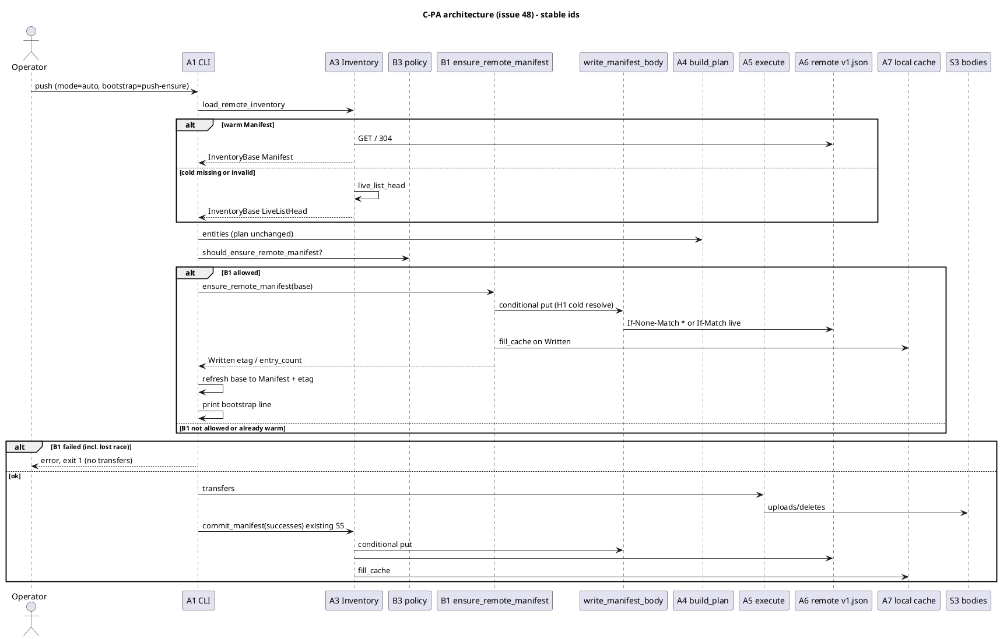
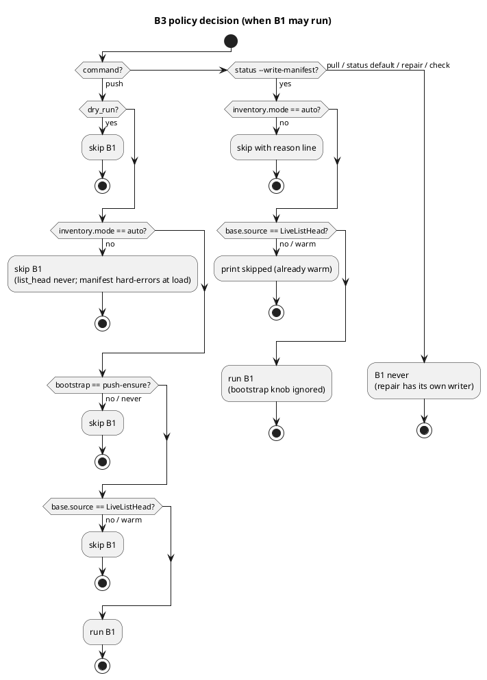
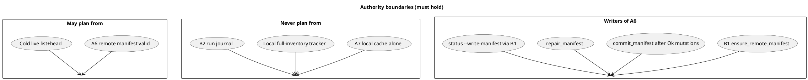

# Issue 48 plan: Push-time inventory bootstrap (C-PA / P-A)

**Status:** superseded by [issue-48-v2.md](./issue-48-v2.md) (critique [5475236417](https://github.com/tlkahn/vaultsync/issues/48#issuecomment-5475236417) incorporated there). **Do not implement from this v1 file.** Retained for cross-reference only.
**v1 status at supersession:** was ready to implement (IQs locked; this file was the implementation source of truth).
**Issue:** https://github.com/tlkahn/vaultsync/issues/48 (OPEN; enhancement)
**Parent tracking:** [#47](https://github.com/tlkahn/vaultsync/issues/47)
**Sibling (out of scope):** [#49](https://github.com/tlkahn/vaultsync/issues/49) C-PB transfer resume - do not fold journal/resume work into this plan
**Spike:** [doc/spikes/inventory-bootstrap-ideation.md](../spikes/inventory-bootstrap-ideation.md) (discussion only; locks live here + issue body)
**Design parents:** [inventory-manifest.md](../inventory-manifest.md) (issue 45), [plans/issue-45.md](./issue-45.md), Q3 (no status auto-write), Q6 (no pull write), vision "no local prev-sync DB"
**Branch (suggested):** `worktree-inventory-bootstrap-issue-48`
**Verified baseline (recorded at plan time):** tip `f1d13ac` (issue 45 / PR #46 on `main`). Gate on this tree: `cargo test --offline --lib --bins` = 572 passed / 0 failed / 1 ignored. W-series last used: **W262** (PR 46 review fixes). This plan starts at **W263**.
**Blocker check:** #45 warm path + commit + repair + local cache are on `main`. No code blocker. #49 / #26 / #42 are parallel or deferred and are **not** required for C-PA correctness.

---

## Problem recap (verified against the tree)

Remote `.vaultsync/manifest/v1.json` (A6) is written today only by:

| Writer | Gate |
| ------ | ---- |
| `commit_manifest` after `push` (`src/inventory.rs`, CLI `dispatch_plan`) | at least one successful remote mutation (`SkippedNoMutations` when empty) |
| `vaultsync repair` | explicit operator action |

The planner never writes. Q3 forbids auto-write after cold `status`. Local cache (A7) is filled only after a valid remote fetch, commit, or repair - never from a synthesized cold listing alone.

```text
push/status -> cold list+head (~35s at 1.8k files on the PR #46 smoke)
            -> transfers fail / Ctrl-C / 0 Ok mutations
            -> no remote v1.json
            -> next run cold-lists again
```

Evidence: PR #46 comments [5472302524](https://github.com/tlkahn/vaultsync/pull/46#issuecomment-5472302524), [5472308083](https://github.com/tlkahn/vaultsync/pull/46#issuecomment-5472308083). Same wall-time class as #42 cold path.

**C-PA success metric:** after one cold inventory on an eligible push (or explicit `status --write-manifest`), later plans are warm even when transfers failed or none were planned.

**Not this issue:** mid-run transfer resume, run journals, skip-already-Ok PUTs (C-PB / #49).

---

## Architecture overview

Stable ids below match the spike and issue body. New work is **B1** (writer) + **B3** (policy) only.

| Id | Element | Role | This issue? |
| -- | ------- | ---- | ----------- |
| A3 | Inventory facade (`load_remote_inventory`) | Read path; still never auto-writes from cold | read stays; gains shared write helper |
| A4 | `plan()` / `build_plan` | Unchanged consumer of entities | no |
| A5 | `execute_plan` | Mutation source | no (C-PB only) |
| A6 | Remote `.vaultsync/manifest/v1.json` | Planning authority when valid | **B1 writes** |
| A7 | Local `.vaultsync/cache/*` | 304 mirror only; never authority | filled after successful B1 put |
| B1 | Bootstrap writer `ensure_remote_manifest` | Publish A6 from cold `InventoryBase.file_entities` without file-body successes | **yes** |
| B2 | Run journal | C-PB only | **no** |
| B3 | CLI / config policy | When B1 may run | **yes** |







### Layering rules

- **A4 `plan()` stays pure** and does not know about B1.
- **B1 never claims in-flight uploads.** It publishes the pre-transfer remote snapshot only (`base.file_entities` as loaded). Final `commit_manifest` still applies Ok mutations last (D-commit-order from #45).
- **A7 is filled only after a successful A6 put** (same as commit/repair today).
- **Shared bytes path:** extract `write_manifest_body` so repair, commit, and B1 do not diverge on serialize / conditional put / cache fill.
- **No second list in B1.** B1 consumes the already-paid cold `InventoryBase`.

---

## Locked decisions (owned by #48; do not reopen in implementation)

### IQ locks (from issue discussion)

| ID | Question | Lock |
| -- | -------- | ---- |
| IQ1+IQ2 | When may push-time B1 run (trigger)? | **O1b:** under `mode=auto`, when base source is `LiveListHead` (covers **missing OR invalid/corrupt**, H1-aligned). Not on warm Manifest. |
| IQ3 | B1 timing vs transfers | **Before transfers.** Ctrl-C mid-upload still leaves a warm baseline when B1 already succeeded. |
| IQ4 | B1 when `inventory.mode=list_head`? | **No.** Debug/bisect mode never bootstraps. (Final mutation commit behavior from #45 is unchanged if transfers run.) |
| IQ5 | Zero-mutation push that only B1: UX? | Always print one stderr line: `inventory: manifest bootstrap written (N entries)` (N may be 0). |
| IQ6 | Config knob in v1? | **Yes:** `[inventory].bootstrap = "push-ensure" \| "never"`, default **`push-ensure`** when absent. Gates **push-time B1 only**. |
| IQ7 | Share code with repair how? | Extract **`write_manifest_body(...)`**; add **`ensure_remote_manifest(store, base, cache) -> Result<EnsureOutcome, Error>`**; repair + commit call the shared write helper. |
| IQ9 | `status --write-manifest`? | **Include** as explicit opt-in. Same B1 eligibility as cold auto (`mode=auto` + `LiveListHead`); warm => no-op line. **Q3 holds:** no status auto-write. |
| IQ-strict | `mode=manifest` + missing/invalid on push | **Keep hard error at load**; B1 only under `mode=auto`. Strict stays strict. |
| IQ-zero-xfer | Push may write A6 with zero file-body successes? | **Yes** - that is the point of P-A. |
| IQ-empty | Cold push on empty remote | **Yes**, B1 may write a **0-entry** manifest (warm empty baseline). |
| IQ-fail | B1 failure policy | **Any B1 failure aborts push before transfers (exit 1)**, including **lost conditional race (PreconditionFailed)**. Asymmetry with final-commit Q2 is intentional: no bodies have landed yet at B1 time. |
| IQ-refresh | After B1 `Written`, in-memory base for final commit | **Refresh** to `InventorySource::Manifest { remote_etag }` + `manifest_etag = new etag` so final commit uses warm If-Match (one fewer HEAD). |
| IQ-api | B1 entry name | **`ensure_remote_manifest`** returning **`EnsureOutcome`**. |
| IQ-status-flag-vs-bootstrap | `bootstrap=never` vs `status --write-manifest` | Explicit flag **always allowed**; bootstrap knob gates push-time B1 only. |
| IQ-deliverable | Spec location | Issue body locks + this plan file on main tree. |

### Implementation locks (derived; pin here)

| ID | Lock | Choice |
| -- | ---- | ------ |
| D-pa-scope | Module boundary | C-PA only: B1 + B3 + shared write extract. No B2 journal, no executor resume, no plan-phase progress (#42), no local tracker. |
| D-auth | Authority | Unchanged from #45: plan only from valid A6 or live list+head. A7 never authority. Reject O3 local full-inventory tracker as planner input. |
| D-q3 | Status auto-write | **Still no.** Only explicit `status --write-manifest` may mutate remote from status. Default status remains read-side-effect free for the remote (cache fill of a valid fetch still allowed as today). |
| D-q6 | Pull write | **Still no.** Pull never calls B1. |
| D-trigger-push | Push B1 predicate | `!dry_run && mode == Auto && bootstrap == PushEnsure && base.source == LiveListHead`. |
| D-trigger-status | Status B1 predicate | `--write-manifest && mode == Auto && base.source == LiveListHead`. Else if flag set and warm: print skip line; if flag set and `list_head`/`manifest`: skip with reason (manifest missing already errored at load). |
| D-cond | Conditional put for B1 | Same **H1 cold resolve** as `commit_manifest` when `manifest_etag` is `None`: HEAD live object; present + etag => If-Match; absent => If-None-Match `*`; present etag-less => unconditional put (N5). After refresh, final commit uses warm If-Match on B1 etag. |
| D-body | Snapshot contents | `base.file_entities` only (full remote file set minus reserved; **not** ignore-filtered; no folder rows). No mutation fold in B1. |
| D-order-cli | CLI order on push | `build_plan` -> warnings -> inventory source line -> **B1 (maybe)** -> bootstrap line on Written -> print plan -> (dry-run exit \| execute -> final commit). |
| D-order-status | CLI order on status + flag | `build_plan` -> warnings -> inventory source line -> **B1 (maybe)** -> bootstrap or skip line -> print plan -> exit 0/2 (or 1 on B1 fail). |
| D-ensure-outcome | `EnsureOutcome` | At least: `Written { etag: Option<String>, entry_count: usize }`, `PreconditionFailed`. Callers map `PreconditionFailed` and `Err` to abort. Optional `Skipped` is CLI-side (do not call ensure) rather than inside ensure. |
| D-write-helper | `write_manifest_body` | Shared lowest layer: file entities -> serialize -> conditional/`force` put -> optional cache fill -> etag/entry_count. `repair_manifest` / `commit_manifest` / `ensure_remote_manifest` all go through it (behavior-preserving refactor first). |
| D-commit-when | Final commit after B1 | Unchanged: skip when zero Ok mutations (`SkippedNoMutations`). Baseline already published by B1. When mutations Ok, final commit folds `base ∪ successes` with refreshed warm etag. |
| D-commit-race | Final commit lost race | **Unchanged Q2:** warning + exit 0 if transfers ok. Do not apply B1's stricter abort policy to final commit. |
| D-b1-race-msg | B1 lost-race stderr | Pin substring: `manifest bootstrap failed` and `lost race` (full sentence locked in W-item). Exit **1**. |
| D-b1-ok-msg | B1 success stderr | Exactly one line shape: `inventory: manifest bootstrap written ({N} entries)` with decimal N. |
| D-b1-skip-warm | Status flag on warm | `inventory: manifest bootstrap skipped (already warm)` |
| D-b1-skip-mode | Status flag when mode blocks | `inventory: manifest bootstrap skipped (mode={mode})` where mode is `list_head` (and if ever reached, `manifest`). |
| D-config | `[inventory].bootstrap` | Optional string; absent => `push-ensure`. Allowed: `push-ensure`, `never`. Unknown => loud parse error naming `inventory.bootstrap`. `deny_unknown_fields` remains on the section. |
| D-settings | `Settings` field | `inventory_bootstrap: InventoryBootstrap` next to `inventory_mode`. Thread through CLI ctx / `PlanFlags` as needed. |
| D-dry-run | Dry-run | `push --dry-run` never B1 and never final commit. No status dry-run flag required. |
| D-cache | Cache on B1 | On `Written`, `fill_cache` with new body + etag (same helper as commit/repair). |
| D-n5 | Etag-less backends | B1 degrades like commit H1/N5 (unconditional put on present etag-less object). Document; no new policy. |
| D-ignore | Ignore | Unchanged: manifest stores unfiltered remote set; ignore stays plan-time both sides. |
| D-repair | Repair | Stays the full re-list rebuild tool (`--force` / `--dry-run`). Not replaced by B1. B1 never re-lists. |
| D-tests | Offline gate | Every W-item leaves `cargo test --offline --lib --bins` green. Prefer mock list-counter / `NoListStore`-style pins for "next status is warm". |
| D-docs | Docs | `cli.md`, `inventory-manifest.md` (short C-PA addendum), README known behaviors, roadmap decision row; spike stays ideation. |
| D-w-series | Numbering | Work items **W263+**. |
| D-prs | Landing | Prefer stacked commits: shared write extract -> ensure API + unit pins -> config -> push CLI -> status flag -> docs. Offline green each step. |

### Normative strings (pin via substring in tests)

```text
inventory: manifest bootstrap written (
inventory: manifest bootstrap skipped (already warm)
inventory: manifest bootstrap skipped (mode=
manifest bootstrap failed
lost race
```

Existing strings that must keep working:

```text
inventory: list+head (cold)
inventory: manifest (
manifest not committed
```

### Config sketch (normative)

```toml
[inventory]
mode = "auto"                 # existing: auto | manifest | list_head
bootstrap = "push-ensure"     # new: push-ensure | never (default push-ensure)
```

### CLI sketch (normative)

```text
vaultsync push                 # may B1 under push-ensure + auto + cold
vaultsync push --dry-run       # never B1
vaultsync status               # never writes remote (Q3)
vaultsync status --write-manifest   # explicit B1 when auto + cold; warm no-op line
vaultsync pull                 # never B1 (Q6)
vaultsync repair               # existing full rebuild writer
```

---

## Code seams (where to touch)

| Seam | File | Change |
| ---- | ---- | ------ |
| Shared write | `src/inventory.rs` | Extract `write_manifest_body`; keep repair/commit behavior identical |
| B1 API | `src/inventory.rs` | `EnsureOutcome`, `ensure_remote_manifest`, pure `should_ensure_remote_manifest` (or CLI-local predicate + unit-tested twin) |
| Config | `src/config.rs` | `InventoryBootstrap`, parse `bootstrap`, `Settings.inventory_bootstrap` |
| Command | `src/cli.rs` | `Command::Status { write_manifest: bool, ... }`; clap `--write-manifest` on status |
| Push dispatch | `src/cli.rs` `dispatch_plan` | After inventory line, before execute: maybe B1; abort on fail; refresh base; print bootstrap line |
| Status dispatch | `src/cli.rs` status arm | After inventory line: maybe B1; abort on fail; skip lines |
| Ctx flags | `src/cli.rs` | Thread `inventory_bootstrap` beside `inventory_mode` |
| Docs | `doc/cli.md`, `doc/inventory-manifest.md`, `README.md`, `doc/roadmap.md` | Behavior + config + flag |
| Spike map | `doc/spikes/...` / `doc/README.md` | Point to locked plan (optional one-liner) |

**Do not touch for this issue:** `execute_plan` journal hooks, `plan()` equality, pull commit, #42 progress bars, S3 retry policy.

---

## Detailed algorithm

### `ensure_remote_manifest`

```text
ensure_remote_manifest(store, base, cache) -> Result<EnsureOutcome, Error>:
  # Caller is responsible for policy (only call when cold-eligible).
  # Defense in depth (optional assert in debug/tests): base.manifest_etag is None
  # and source is LiveListHead.

  files = base.file_entities           # already reserved-stripped, files only
  created_ms = now_ms()
  manifest = file_entities_to_manifest(files, created_ms, generator, None)?
  body = serialize_manifest(manifest)?

  outcome = write_manifest_body(store, body, WriteCond::ColdResolveH1, cache)?
  match outcome:
    OkWritten { etag, entry_count } => EnsureOutcome::Written { etag, entry_count }
    PreconditionFailed => EnsureOutcome::PreconditionFailed
    Err(e) => Err(e)
```

### Push integration

```text
report = build_plan(...)
print warnings + inventory source line
base = report.inventory_base

if should_push_b1(dry_run, mode, bootstrap, &base.source):
  match ensure_remote_manifest(store, &base, Some(cache)):
    Written { etag, entry_count } =>
      base.source = Manifest { remote_etag: etag.clone() }
      base.manifest_etag = etag
      print "inventory: manifest bootstrap written ({entry_count} entries)"
    PreconditionFailed =>
      print error lost-race bootstrap text; return 1
    Err(e) =>
      print error bootstrap failed: e; return 1

print plan
if dry_run: exit clean/dirty
else:
  exec...
  if push and mutations non-empty:
    commit_manifest(store, &base, mutations, cache)  # Q2 on race
  exit per transfer/conflict rules
```

### Status `--write-manifest` integration

```text
report = build_plan(...)
print warnings + inventory source line
base = report.inventory_base

if write_manifest:
  if mode != Auto:
    print "inventory: manifest bootstrap skipped (mode={...})"
  else if base.source is Manifest:
    print "inventory: manifest bootstrap skipped (already warm)"
  else:
    match ensure_remote_manifest(...):
      Written => print written line
      fail => exit 1

print plan
exit 0/2 as today
```

---

## Work items (W263+)

### P0 - Shared write extract (behavior-preserving)

- **W263** RED/GREEN: extract `write_manifest_body` (or equivalent private helper) used by `commit_manifest` and `repair_manifest` without changing outcomes. Existing inventory commit/repair tests stay green; add a thin unit pin that both paths still create / If-Match / force / dry-run as today.

### P1 - B1 API

- **W264** RED: `EnsureOutcome::{Written, PreconditionFailed}` + `ensure_remote_manifest` compiles; test that empty base writes 0-entry manifest (If-None-Match `*`) and returns Written with entry_count 0.
- **W265** RED: ensure on cold base with **present corrupt** body overwrites via H1 If-Match on live etag (invalid heal); next `load_remote_inventory(Auto)` is warm without `list` (`NoListStore` or list-counter pin).
- **W266** RED: ensure lost race => `PreconditionFailed`, object body unchanged (second writer won); no cache fill.
- **W267** RED: ensure fills A7 cache on Written (body + meta fingerprint contract from #45 W259).
- **W268** GREEN: implement W264-W267 against MemoryStore.

### P2 - Config

- **W269** RED: `[inventory].bootstrap` absent => `PushEnsure`; `push-ensure` / `never` parse; unknown value loud error naming `inventory.bootstrap`; unknown key still denied.
- **W270** GREEN: wire `Settings.inventory_bootstrap` + tests.

### P3 - Push CLI policy

- **W271** RED: cold auto + default bootstrap + push with **zero planned mutations** still B1-writes; stderr has cold line then bootstrap written line; next status warm (no list).
- **W272** RED: cold push, B1 ok, then simulated transfer failure still leaves A6 present (unit: call ensure then skip exec); next load warm.
- **W273** RED: `push --dry-run` cold does **not** write A6.
- **W274** RED: `bootstrap = never` cold push does **not** B1 (even with mutations; final commit may still write after Ok mutations as today).
- **W275** RED: `mode = list_head` cold push does **not** B1.
- **W276** RED: B1 `PreconditionFailed` => push exit 1, **no** uploads attempted (executor not called / put counter on file keys stays 0).
- **W277** RED: B1 hard store error => exit 1, no uploads.
- **W278** RED: B1 Written refreshes base; final commit with successes uses If-Match on B1 etag (stale etag would fail - pin via mock that only accepts the refreshed etag).
- **W279** GREEN: implement push path W271-W278.

### P4 - Status flag

- **W280** RED: parse `status --write-manifest` into `Command::Status { write_manifest: true, ... }`.
- **W281** RED: status + flag + cold auto => B1 write + written line; without flag => no write (Q3).
- **W282** RED: status + flag + warm => skip already-warm line; no put.
- **W283** RED: status + flag + `bootstrap=never` still writes (knob does not gate flag).
- **W284** RED: status + flag + B1 fail => exit 1.
- **W285** GREEN: implement status path W280-W284.

### P5 - Docs + closeout

- **W286** Docs: `doc/cli.md` - bootstrap config, push B1 behavior, `status --write-manifest`, failure exit 1, dry-run, list_head/manifest interactions.
- **W287** Docs: `doc/inventory-manifest.md` short **C-PA addendum** (B1 before transfers, authority table unchanged, Q3 explicit-only status write).
- **W288** Docs: README known behaviors bullet; `doc/roadmap.md` decision row for issue 48.
- **W289** Plan status -> implemented summary; issue body status -> ready/done as appropriate; offline gate recorded.

---

## Acceptance matrix (promote from issue)

| # | Scenario | Expect |
| - | -------- | ------ |
| A1 | Cold push, kill after B1 before transfers | A6 exists; next `status` warm (no list; mock pin) |
| A2 | Default status cold | never writes (Q3) |
| A3 | Pull cold | never writes (Q6) |
| A4 | B1 lost race | error, exit 1, no clobber, no transfers; final commit not reached |
| A5 | B1 + partial Ok + final commit | entry set = base ∪ successes; warm If-Match on B1 etag |
| A6 | `push --dry-run` | no B1 |
| A7 | Zero-mutation cold push | B1 writes baseline; bootstrap line; no final commit; next status warm |
| A8 | Empty remote cold push | 0-entry A6 allowed |
| A9 | `bootstrap=never` | push skips B1 |
| A10 | `mode=list_head` | push skips B1 |
| A11 | `mode=manifest` missing | hard error at load; no B1 |
| A12 | Corrupt present + auto push | B1 heals via H1 overwrite before transfers |
| A13 | `status --write-manifest` cold auto | B1 write |
| A14 | `status --write-manifest` warm | skip line, no put |
| A15 | `status --write-manifest` with `bootstrap=never` | still writes |
| A16 | Offline `cargo test --offline --lib --bins` | green |

---

## Non-goals

- P-B / #49 run journal or mid-run transfer resume
- O5 chunked mid-run remote commits
- Local full-inventory tracker as planning base (O3)
- Changing warm-path plan semantics from #45
- Auto-write on default status (Q3)
- Pull manifest write (Q6)
- Making B1 re-list (repair owns re-list)
- Softening final-commit Q2 to match B1 abort policy (or vice versa)
- Plan-phase TTY progress (#42)

---

## Risk notes

| Risk | Mitigation |
| ---- | ---------- |
| B1 abort-on-race is stricter than final commit Q2 | Document asymmetry; pin separate strings and exit codes |
| Publishing cold snapshot then dying mid-upload leaves A6 without new bodies | Already the #45 "bodies ahead/behind" repair story; next push plans warm and uploads dirty locals |
| Concurrent writers | Same conditional model as #45; loser at B1 aborts this push |
| Operators surprised push writes control plane with 0 transfers | IQ-zero-xfer accepted; one bootstrap line; `bootstrap=never` escape hatch; repair remains |
| `status --write-manifest` scope creep toward auto-write | Flag is explicit; default status path unchanged; tests pin no write without flag |
| Shared write extract regresses repair/commit | W263 behavior-preserving + existing tests first |

---

## Revision log

| Date | Change |
| ---- | ------ |
| 2026-08-31 | Initial ready-to-implement plan from #48 IQ locks (O1b before transfers; config bootstrap default push-ensure; B1 abort including race; base refresh; `ensure_remote_manifest`; status `--write-manifest`; W263+). |
