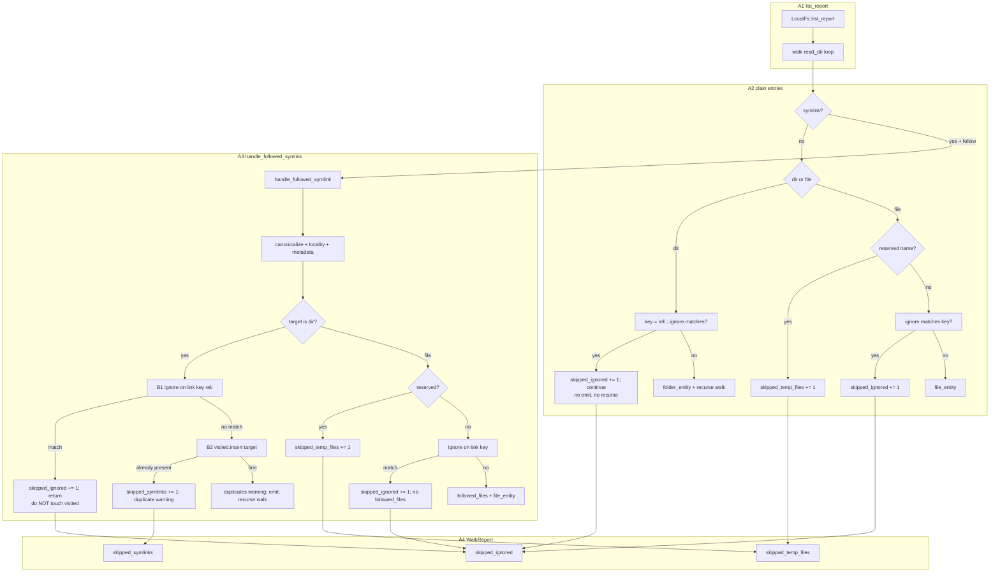

# PR 37 fix plan: review round 1 (comment 5467761913)

**Status:** implemented (`6dacceb` W202/W203 fix + W204 test, `471ff1c` W205 docs)
**PR:** https://github.com/tlkahn/vaultsync/pull/37 ("Issue 32: apply ignore patterns in the local walker")
**Review comment:** https://github.com/tlkahn/vaultsync/pull/37#issuecomment-5467761913
**Reviewed tip:** `3258734` on `worktree-apply-ignore-patterns-in-the-local-walker` (W195-W201; issue #32 plan marked implemented)
**Work branch:** `worktree-apply-ignore-patterns-in-the-local-walker` (this worktree; fixes land on the same branch and update PR 37 in place)
**Reviewer verdict:** **request changes**. One **high** correctness bug in the follow+ignore interaction (`visited` / cycle-guard ordering vs dir-symlink ignore). Plain-walk half (D-prune, file skip, D-report, reserved-first, empty-set seam, false friends) is solid. Scope discipline is excellent.
**Work items:** continue the project W-series after issue #32 **W201**. This plan uses **W202-W205**.
**Planning file location:** `doc/plans/pr-37-review-5467761913.md` at the repository-root planning path and the same relative path on this PR worktree branch (same convention as PR 28 / PR 35 fix plans).

**Design refs:** issue #32, [doc/plans/issue-32.md](issue-32.md) (D-prune / D-report / D-match-subject / D-filter-order / W200), [doc/plans/issue-30.md](issue-30.md) (`IgnoreSet` semantics), W67/A-L5 + R-b (in-vault dir-symlink aliases listed; dedup declined because order must not pick a survivor), R5-L8/W46 (duplicate-target / cycle guard).

**Verified baseline (recorded at plan time):** tip `3258734`. Reviewer re-ran new walk ignore tests 20/20 green; reproduced both order-dependent failure modes with throwaway probes under a deterministic `read_dir` sort; probes and sort reverted; tree clean at review tip.

---

## Architecture overview

The bug is a **control-flow ordering** fault inside one function, not a new subsystem. Ignore matching on a followed **dir** symlink must be a pure decision on the link's vault-relative key and must not participate in the canonical-target `visited` set.



| ID | Component | Role after fix |
| -- | --------- | -------------- |
| A1 | `list_report` / `walk` | Unchanged control flow; drop dead `let _ = opts.ignore` (F2). |
| A2 | Plain dir/file arms | Already correct (ignore before emit/recurse; reserved before ignore). No production change. |
| A3 | `handle_followed_symlink` | **B1 before B2** on the dir arm: ignore on link key, then `visited.insert`. File arm already correct vs `followed_files`. |
| A4 | `WalkReport` counters | Ignored dir links always land in `skipped_ignored`, never steal a `visited` slot or get mis-labeled as duplicate `skipped_symlinks` solely because another alias already claimed the target. |
| B1 | Dir-symlink ignore gate | Match subject = vault-relative link key with trailing `/` (D-match-subject). Count 1, no emit, no recurse, **no `visited` mutation**. |
| B2 | Duplicate-target / cycle guard | Only runs for **non-ignored** dir links. Preserves R5-L8/W46 for real multi-alias and true cycles. |

Data flow for the two-link fixture (same in-vault target, one link name ignored):

```mermaid
sequenceDiagram
  participant T as Test / walk order
  participant H as handle_followed_symlink
  participant I as IgnoreSet
  participant V as visited set
  participant R as WalkReport

  Note over T,R: Case A - ignored link first (today broken)
  T->>H: .git -> realdir
  H->>I: matches(".git/")
  I-->>H: true
  H->>R: skipped_ignored += 1
  Note over V: must NOT insert realdir
  T->>H: alias -> realdir
  H->>I: matches("alias/")
  I-->>H: false
  H->>V: insert realdir
  H->>R: emit alias/ + recurse

  Note over T,R: Case B - kept alias first (today broken)
  T->>H: alias -> realdir
  H->>I: matches("alias/")
  I-->>H: false
  H->>V: insert realdir
  T->>H: zz_git -> realdir
  H->>I: matches("zz_git/")
  I-->>H: true
  H->>R: skipped_ignored += 1
  Note over V: ignore wins; no duplicate symlink bucket
```

---

## Implementation discipline

**Strict fine-grained TDD** on every behavior change:

1. **RED** - write the exposing test first; run it; observe the expected assertion failure *before* touching production code. Record the failing assertion text in the commit body.
2. **GREEN** - smallest production change that turns that cycle's pins green.
3. **REFACTOR** - behavior-preserving cleanup only under green; no behavior change without a new RED.
4. Do **not** push a RED tree. A single commit may contain RED-verified tests plus the GREEN implementation, with local RED observations recorded in the commit message (same convention as PR 28 / PR 35 / issue #32).
5. Characterization pins for *already-correct* behavior: write first, confirm GREEN on arrival, then **mutation-check** (temporarily break the code, observe RED, revert). Record "mutation-checked" in the commit body.
6. Docs-only / roadmap / plan-status / PR-reply changes have no artificial RED; they land under the all-green gate.

Per-cycle gate (every commit tip):

```bash
cargo fmt --check
cargo clippy --all-targets -- -D warnings
cargo test --offline --lib --bins
```

No network. Do not touch `tests/s3_integration.rs` or env-gated suites. Do not edit `cli.rs`, `config.rs`, `plan/**`, remote `build_plan` filter, or `src/ignore.rs` matcher logic. No new Cargo dependencies. Do **not** restructure `walk()` for depth-cap (#10) and do **not** sort `read_dir` in production to make tests pass (order pins must be order-explicit another way - see R37-test-strategy).

Mutation-check discipline (as on #30 / #32): after GREEN, temporarily restore the old order (`visited.insert` before ignore) and confirm the new tests go RED; revert. Record "mutation-checked" in the commit body.

---

## Baseline verification

Before W202:

```bash
git status --short --branch
git log -1 --oneline
cargo fmt --check
cargo clippy --all-targets -- -D warnings
cargo test --offline --lib --bins
cargo test --offline --lib walk_
```

Expected baseline: branch `worktree-apply-ignore-patterns-in-the-local-walker` at `3258734` or a later PR-branch tip; full lib/bins gate green (462 passed / 0 failed / 1 ignored at review tip); walk_ filter 20/20 green; tree clean.

---

## Findings -> decisions -> work items

| Finding | Review severity | Decision | Work item |
| ------- | --------------- | -------- | --------- |
| **F1** Followed dir-symlink ignore runs *after* `visited.insert` - order-dependent inventory and mis-bucketing | **High** (merge-blocking per review) | **Fix:** B1 before B2 on the dir arm only. Pin both orders permanently. | W202 RED pins + W203 GREEN |
| **F2** W195 scaffolding `let _ = opts.ignore; // threaded; matching applied in W196/W197` left in `walk()` | **Medium** | **Delete** the dead line (twin in `handle_followed_symlink` already removed in W200). | W203 ride-along under green (or W204 if split) |
| **F3** Stale test comment in `walk_empty_ignore_set_unchanged` ("no increments yet") | **Low** | **Refresh or drop** the parenthetical; assertion stays. | W203/W204 ride-along |
| **F4** Walk-level pin for nested dir-prefix non-match is matcher-only (`notes/.git/` under pattern `.git/` must remain listed) | **Low** / optional | **Add** a cheap walk integration row so #10/#34 cannot invent basename-dir prune. | W204 |
| **F5** W199 commit titled `fix:` but test-only | **Low** / nit | **No code action.** Acknowledge in reply only. | W205 record only |
| Plain-walk D-prune / file skip / D-report / reserved-first / empty seam / false friends / D-match-subject single-link follow tests / scope | positives | **No action** beyond acknowledging in the reply | W205 |

### Positives (no code action; acknowledge in W205 reply)

- D-library-seam: `with_ignore` chain, empty default, non-breaking `new` / `with_follow`.
- D-prune / D-report: dir continue without emit/recurse; exact `walk_counts_skipped_ignored == 3` pin; mutation-checked.
- D-filter-order: reserved first with patterns that *would* match leftovers; mixed `.DS_Store` + reserved variant.
- D-match-subject: single-link follow tests plant link whose **own** key matches; file symlink excluded from `followed_files` on ignore.
- False friends at FS boundary (`walk_dir_prefix_no_false_friends`).
- Scope: no CLI count line, no remote filter, walk shape not restructured for #10; TDD series maps 1:1 to #32 acceptance.
- File-arm follow ignore vs `followed_files` ordering already correct.

---

## Scope decisions

| ID | Question | Decision |
| -- | -------- | -------- |
| R37-f1-order | Where does dir-symlink ignore sit relative to `visited.insert`? | **Ignore first (B1), then visited (B2).** Match subject stays the link's vault-relative key with trailing `/`. On match: `skipped_ignored += 1`, return, **no** `visited` mutation, **no** emit, **no** recurse, **no** W67 duplicates warning. |
| R37-f1-file-arm | Touch followed file-symlink arm? | **No production change.** File arm already checks reserved then ignore before `followed_files.insert`. Existing `walk_follow_skips_ignored_file_symlink` stays the pin. |
| R37-f1-dangling | Move ignore before canonicalize / dangling / out-of-vault? | **Out of scope for this round.** Review optional sharpening only. Keep locality / dangling / out-of-vault / metadata probes as today; fix only the confirmed `visited` interaction once file-vs-dir is known. Document as accepted residual: a dangling link whose name would match ignore still counts as `skipped_symlinks` (dangling arm returns first). |
| R37-f1-plan-text | Issue-32 plan said "after locality / dangling / cycle guards, apply ignore" | **Supersede for cycle/duplicate only.** Intent was "do not rewrite those guards," not "ignored links consume `visited`." Roadmap / reply notes the sharpening: ignore on the link key is independent of target-identity guards and must not poison them. Locality / dangling stay before ignore (need resolve to know dir vs file, and escape policy stays first for resolvable out-of-vault targets). |
| R37-test-strategy | How to pin both orders without sorting production `read_dir`? | **Explicit sequential calls** to `handle_followed_symlink` from `local.rs` `mod tests` (same-module private access) with a shared `visited` / `report` / `out`. Order is a test input, not an FS accident. Do **not** add production `read_dir` sorting. Do **not** rely on `list_report` enumeration order for F1 pins (flaky across FS). Optional: a thin wrapper helper in tests to build `root_canon` + call HFS. |
| R37-f1-compat | Do existing single-link follow tests flip? | **No.** `walk_follow_symlink_into_ignored_dir` (one ignored link) stays green either order. `walk_follow_warns_on_duplicate_dir_target` (two non-ignored aliases) stays green: first claims `visited`, second still duplicate-skips. |
| R37-f2 | Dead `let _ = opts.ignore` | **Delete** in the GREEN commit (or tiny hygiene commit under green). |
| R37-f3 | Stale W195 comment | **Edit** in same hygiene pass. |
| R37-f4 | Nested `.git/` walk pin | **In scope** as a small characterization test (GREEN on arrival under correct #30 semantics; mutation-check optional by temporarily matching final segment of dir keys - do not actually ship that). |
| R37-f5 | Commit taxonomy nit | **Reply only.** |
| R37-scope | In-scope findings | **F1 + F2 + F3 + F4 + decision-log/reply.** No CLI/config/remote/planner. No `IgnoreSet` API change. No new `WalkReport` fields. |
| R37-tdd | Commit granularity | Prefer **W202 RED observation + W203 GREEN** as one pushed commit if the body records RED (bisect noise control on a fix branch), **or** two commits if RED tests are useful alone on a fixup branch. F4 may share the GREEN commit or follow as test-only. Docs/reply = final commit. |
| R37-walk-shape | Depth cap / walk restructure | **Forbidden.** Touch only the dir-arm order inside `handle_followed_symlink` plus dead-line deletion in `walk`. |

---

## Normative dir-arm order (W203)

Replace only the dir-arm body ordering inside `handle_followed_symlink`. After successful canonicalize, in-vault check, and `tmd.is_dir()`:

```rust
// BEFORE (buggy):
if !visited.insert(target.clone()) { /* duplicate */; return Ok(()); }
let key = format!("{}/", path_to_key(rel)?);
if ignore.matches(&key) {
    report.skipped_ignored += 1;
    return Ok(());
}
// duplicates warning + emit + recurse

// AFTER (fixed):
let key = format!("{}/", path_to_key(rel)?);
if ignore.matches(&key) {
    report.skipped_ignored += 1;
    return Ok(()); // no visited.insert
}
if !visited.insert(target.clone()) {
    // existing R5-L8/W46 duplicate / cycle warning + skipped_symlinks
    return Ok(());
}
// existing W67 duplicates warning + folder_entity + walk recurse
```

Rustdoc on the ignore block must state explicitly: ignored dir links do **not** claim the canonical target in `visited`, so a later non-ignored alias to the same target still lists (W67/A-L5 + R-b intact under ignore).

---

## Failure modes locked by F1 tests

Shared fixture (unix):

```text
tempdir/
  realdir/child.md          # real in-vault dir
  LINK_IGNORED -> realdir   # name matches dir-prefix pattern
  LINK_KEPT    -> realdir   # name does not match
```

Patterns: one dir-prefix that matches only `LINK_IGNORED/` (e.g. ignored link named `.git` with pattern `.git/`, kept link named `alias`; or ignored `zz_git` with pattern `zz_git/`).

| Case | Call order | Assert entities | Assert report |
| ---- | ---------- | --------------- | ------------- |
| A - no poison | ignored, then kept | `alias/` + `alias/child.md` present; no `.git/` / `.git/child.md` | `skipped_ignored == 1`; kept alias is **not** counted only as `skipped_symlinks` duplicate |
| B - no mis-bucket | kept, then ignored | `alias/` + `alias/child.md` present; ignored link keys absent | `skipped_ignored == 1`; ignored link must **not** be solely `skipped_symlinks` with `skipped_ignored == 0` |

Also assert `realdir/child.md` can still appear if the test also walks the real dir path (optional; primary pin is alias survival + counter bucket).

Today (tip `3258734`), with sequential HFS calls:

- Case A: kept alias lost (`visited` poisoned); may see `skipped_symlinks` on kept alias.
- Case B: ignored link classified as duplicate (`skipped_ignored == 0`, `skipped_symlinks += 1`).

---

## Work items

### W202 - F1 RED: both follow+ignore order pins

**Goal:** Expose today's order-dependent failures as failing assertions. No production change in the RED observation step.

**Where:** `src/local.rs` `mod tests`, near existing `walk_follow_symlink_into_ignored_dir` / `walk_follow_skips_ignored_file_symlink`.

**Test names** (review literals; keep stable for the reply checklist):

1. `walk_follow_ignored_dir_symlink_does_not_poison_visited` (Case A)
2. `walk_follow_ignored_dir_symlink_not_misbucketed_as_duplicate` (Case B)

**Shape (both `#[cfg(unix)]`):**

- Plant `realdir/child.md`, two symlinks to `realdir` with distinct names, one name matching a dir-prefix pattern.
- `std::fs::canonicalize` the vault root once (same as `LocalFs::root_canonical` would).
- `IgnoreSet::from_patterns(&[...]).unwrap()`.
- Shared `out: Vec<Entity>`, `report: WalkReport`, `visited: HashSet<PathBuf>`.
- Call `handle_followed_symlink(...)` **twice in the case's explicit order**.
- Map `out` keys; assert per table above (`skipped_ignored == 1`, alias children present, ignored keys absent).

**RED confirm (before GREEN):**

```bash
cargo test --offline --lib walk_follow_ignored_dir_symlink_does_not_poison_visited -- --nocapture
cargo test --offline --lib walk_follow_ignored_dir_symlink_not_misbucketed_as_duplicate -- --nocapture
```

Expected: Case A fails on alias-present (or equivalent); Case B fails on `skipped_ignored == 1`. Record assertion text in the commit body.

**Do not** land W202 alone on the remote if the branch must stay green for CI - prefer bundling with W203 in one pushed commit after local RED observation (issue #32 / PR 35 convention).

---

### W203 - F1 GREEN + F2/F3 hygiene

**Goal:** Smallest production change that greens W202 pins; delete dead scaffolding; refresh stale comment.

**Production (F1):**

- In `handle_followed_symlink` dir arm: compute `key` and run `ignore.matches(&key)` **before** `visited.insert`.
- On match: `skipped_ignored += 1`; `return Ok(())` without touching `visited`.
- Update the inline comment to cite visited non-poisoning + W67/A-L5 interaction.

**Hygiene (F2):**

- Delete from `walk()`:
  ```rust
  let _ = opts.ignore; // threaded; matching applied in W196/W197
  ```

**Hygiene (F3):**

- In `walk_empty_ignore_set_unchanged`, drop or rewrite `(no increments yet)` so the comment matches post-W197 reality.

**GREEN confirm:**

```bash
cargo test --offline --lib walk_follow_ignored_dir_symlink -- --nocapture
cargo test --offline --lib walk_ -- --test-threads=8
cargo test --offline --lib --bins
cargo clippy --all-targets -- -D warnings
cargo fmt --check
```

**Mutation-check (mandatory):** temporarily swap back to `visited.insert` before ignore; confirm both new tests RED; revert. Record in commit body.

**Existing suite must stay green**, especially:

- `walk_follow_symlink_into_ignored_dir`
- `walk_follow_skips_ignored_file_symlink`
- `walk_follow_warns_on_duplicate_dir_target`
- `walk_follow_symlinks_loop_safe`
- `walk_prunes_git_dir` / `walk_counts_skipped_ignored` / `walk_ignore_does_not_override_reserved`

**Commit:** `fix: [32] dir-symlink ignore before visited insert (W202/W203)`  
(or split `test:` W202 + `fix:` W203 if pushing two green commits is preferred - only if W202 is characterization that somehow passes, which it must not)

Body must record: RED observation summary, GREEN order change, mutation-check, F2 line deleted, F3 comment touch.

---

### W204 - F4 characterization: nested dir-prefix non-match at walk layer

**Goal:** Walk-level pin that vault-rooted `.git/` does **not** prune `nested/.git/`. Matcher already pins this in #30; this stops a future walk-layer "basename dir" helper from drifting under #10/#34.

**RED/GREEN note:** On tip this should be **GREEN on arrival** (characterization). Write the test first; confirm green; mutation-check optional (e.g. temporarily also skip when `final_segment(key) == "git"` - do not ship). If someone had already "fixed" walk incorrectly, it would RED - not expected now.

**Test name:** `walk_dir_prefix_does_not_prune_nested_git` (or `walk_nested_git_not_pruned_by_root_git_prefix`).

**Fixture:**

```text
tempdir/
  note.md
  nested/.git/HEAD
  nested/keep.md
```

- Patterns: `[".git/"]`
- Assert present: `note.md`, `nested/`, `nested/keep.md`, `nested/.git/`, `nested/.git/HEAD`
- Assert absent only if we also planted a root `.git/` (optional root prune still works - can plant root `.git/x` and assert root absent + nested present in one test)
- Prefer the stronger combined tree:

```text
note.md
.git/HEAD              # pruned
nested/.git/HEAD       # kept
nested/keep.md
```

- `skipped_ignored == 1` (only root `.git/`)
- keys contain nested `.git` paths; do not contain `.git/` or `.git/HEAD`

**Commit:** `test: [32] walk pin nested dir-prefix non-match (W204)`  
(or fold into W203 if the diff stays tiny and the commit body lists both)

---

### W205 - docs, roadmap decision-log, plan status, PR reply

No RED.

1. **Rustdoc** (if not fully done in W203): `handle_followed_symlink` ignore block states visited non-poisoning; module / `with_ignore` docs unchanged unless a one-liner helps #34.
2. **`doc/roadmap.md` decision-log** new row, dated, e.g.:

   > I32-r1 | PR 37 review 5467761913: followed dir-symlink ignore runs before `visited.insert` so an ignored alias cannot poison the canonical-target set or mis-bucket as duplicate `skipped_symlinks` (order-independent vs a non-ignored alias to the same target; W67/A-L5 + R-b preserved under ignore). Dangling/out-of-vault arms unchanged this round. Dead W195 `let _ = opts.ignore` removed. Walk-level pin: vault-root `.git/` does not prune `nested/.git/`. Plan: doc/plans/pr-37-review-5467761913.md.

3. **This plan's Status** -> `implemented` with commit range when landing.
4. **`doc/plans/issue-32.md`:** brief note under post-landing / risk that F1 ordering was sharpened in PR 37 r1 (optional one-liner; do not rewrite the whole issue plan).
5. **PR reply** (developer capacity `GH_TOKEN_TLKAHN`, body via `--body-file`): thank reviewer; map F1-F5 to W202-W205; state residual dangling-before-ignore acceptance; request re-review.
6. Full gate once more.

**Commit:** `docs: [32] PR 37 r1 visited/ignore order + roadmap (W205)`

---

## Sequencing (commits on the branch)

```text
W202/W203  F1 order pins RED (local) + GREEN ignore-before-visited
           + F2 dead line + F3 comment          [one or two commits]
  -> W204  nested dir-prefix walk pin (test-only; may fold into prior)
  -> W205  rustdoc / roadmap I32-r1 / plan status / PR reply
```

Rationale:

- F1 is merge-blocking; land first with mandatory mutation-check.
- F2/F3 are one-line hygiene on the same files - ride with GREEN to avoid a noise-only commit, unless diff clarity prefers split.
- F4 is independent characterization; safe after F1 green.
- Docs/reply last so the decision-log cites final SHAs.

---

## Acceptance mapping (review findings -> work items)

| Review finding | Work item | Done when |
| -------------- | --------- | --------- |
| F1 Case A visited poison | W202/W203 | `walk_follow_ignored_dir_symlink_does_not_poison_visited` green; mutation-checked |
| F1 Case B mis-bucket | W202/W203 | `walk_follow_ignored_dir_symlink_not_misbucketed_as_duplicate` green; mutation-checked |
| F2 dead `let _ = opts.ignore` | W203 | line absent; clippy/fmt clean |
| F3 stale comment | W203/W204 | comment accurate or removed |
| F4 nested dir-prefix walk pin | W204 | nested `.git/` listed under pattern `.git/`; root `.git/` still pruned if planted |
| F5 commit taxonomy nit | W205 | acknowledged in PR reply only |
| fmt / clippy / offline tests | every commit gate | green |

---

## Explicit non-goals (refuse scope creep)

- Sorting `read_dir` in production or under `cfg(test)` to stabilize `list_report` order
- Moving ignore before dangling / out-of-vault / canonicalize (residual; document only)
- Changing plain-walk ignore/reserved order (already correct)
- Changing file-symlink follow ignore order (already correct)
- Planner / CLI / config / remote filter / W25 retire (#31/#33/#34)
- `IgnoreSet` matcher or API changes
- Walker depth cap (#10)
- New crate or `WalkReport` field
- Making two non-ignored aliases both list (duplicate-target guard stays; R-b only requires ignored links not to act as a claiming walk)

---

## Risk notes

| Risk | Mitigation |
| ---- | ---------- |
| Flaky order pins if tests use `list_report` / raw `read_dir` | R37-test-strategy: sequential `handle_followed_symlink` calls with shared `visited` |
| Fix accidentally disables duplicate-target guard | Keep guard for non-ignored path; existing `walk_follow_warns_on_duplicate_dir_target` + loop_safe stay green |
| Ignore match after `path_to_key` fails loud on invalid names | Same as today's emit path; no new policy |
| Double `path_to_key` for warnings after ignore move | Reuse `key` / call `path_to_key(rel)?` once where possible; behavior-identical messages |
| Residual dangling name matches ignore but counts as symlink skip | Accepted this round (R37-f1-dangling); do not expand scope mid-fix |
| Parallel issue #33 W-series also uses W200+ on another branch | This branch's commits stay on local-walker history only; roadmap row IDs (`I32-r1`) disambiguate |

---

## Post-landing

- Push to `origin/worktree-apply-ignore-patterns-in-the-local-walker`; PR 37 updates in place.
- Developer reply on PR 37 (`GH_TOKEN_TLKAHN`, `--body-file`).
- Reviewer re-review; merge when approved.
- Close #32 with PR 37 after merge (if not already auto-closing).

---

## Implementation checklist (copy into fix PR comment / commit series)

- [ ] W202 Case A + Case B RED observed locally (assertion text in commit body)
- [ ] W203 ignore-before-`visited.insert` on followed dir arm
- [ ] W203 mutation-check (old order -> new tests RED -> reverted)
- [ ] W203 delete `let _ = opts.ignore` in `walk`
- [ ] W203/W204 refresh `walk_empty_ignore_set_unchanged` comment
- [ ] W204 nested dir-prefix walk pin (root prune + nested keep)
- [ ] W205 roadmap I32-r1 row + this plan status `implemented` + PR reply
- [ ] Existing follow / prune / reserved / count suite still green
- [ ] No `cli.rs` / `config.rs` / `plan/**` / remote filter / `ignore.rs` matcher edits
- [ ] No production `read_dir` sort
- [ ] `cargo fmt` / `clippy -D warnings` / offline lib+bin tests green
