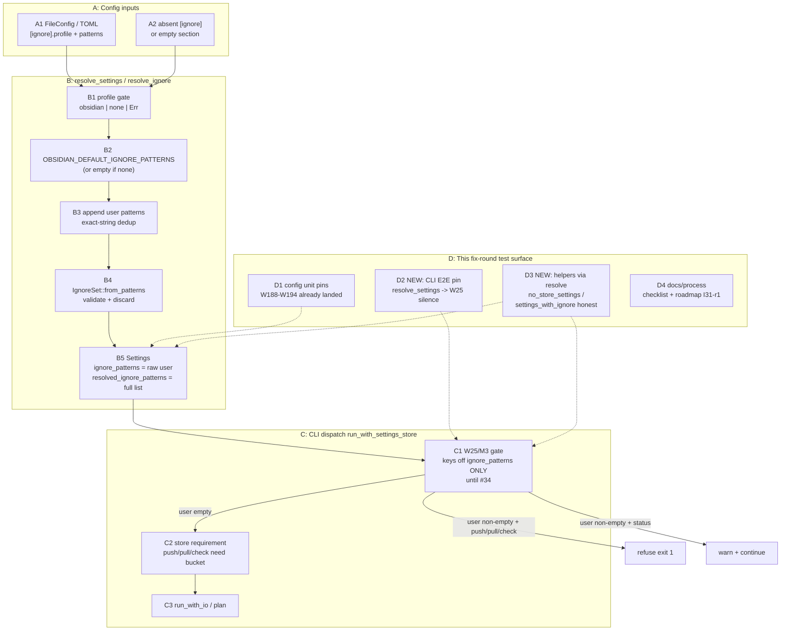

# PR 38 fix plan: review round 1 (comment 5467754440)

**Status:** implemented (W196-W200 landed on `worktree-ignore-profile-config-resolution-obsidian-default`, all commits bisectable-green)

- W196 `70e396d` - CLI E2E W25-silence pins (characterization + mutation-check)
- W197 `79b06c8` - honest `no_store_settings` / `settings_with_ignore` via `resolve_settings`
- W198 `c08cf27` - `resolve_ignore` nit + stale parse comment
- W199 skipped (no unexpected RED)
- W200 this commit - issue-31 checklist tick + roadmap I31-r1 row + plan status

- PR: https://github.com/tlkahn/vaultsync/pull/38 ("Issue 31: [ignore] profile + config resolution (Obsidian default)")
- Review comment: https://github.com/tlkahn/vaultsync/pull/38#issuecomment-5467754440
- Reviewed tip: `a3e1a2e` on `worktree-ignore-profile-config-resolution-obsidian-default`
- Work branch: `worktree-ignore-profile-config-resolution-obsidian-default`; fixes land on the same branch and update PR 38 in place.
- Reviewer verdict: **Approve / merge-ready.** No blocking correctness bugs. Non-blocking polish / process / epic follow-through only.
- Formal review state: Approve (`lgsunnyvale`).
- Work items continue the project W-series after issue #31 **W195**. This plan uses **W196-W200**.
- Planning file location: authored at the repository-root planning path
  `doc/plans/pr-38-fix-5467754440.md`. Keep an identical copy on the PR
  worktree branch under the same relative path so the branch carries the plan
  (same convention as PR 28 / PR 35 fix plans).

---

## Implementation discipline

**Strict fine-grained TDD** on every behavior change:

1. **RED** - write or extend the exposing test first; run it; observe the
   expected assertion failure (or compile failure) *before* touching production
   code. Record the failing assertion text in the commit body.
2. **GREEN** - smallest production change that turns that cycle's pins green.
3. **REFACTOR** - behavior-preserving cleanup only under green; no behavior
   change without a new RED.
4. Do **not** push a RED tree. A single commit may contain RED-verified tests
   plus the GREEN implementation, with local RED observations recorded in the
   commit message (same convention as PR 28 / issue #30 / issue #31 plan).
5. Characterization pins for *already-correct* behavior: write first, confirm
   GREEN on arrival, then **mutation-check** (temporarily break the code,
   observe RED, revert). Record "mutation-checked" in the commit body.
6. Docs-only / roadmap / plan-status / PR-reply changes have no artificial RED;
   they land under the all-green gate, ideally in the same commit as the
   behavior they describe when user-facing.
7. **Commit body convention (review item 1 / process repair):** every behavior
   commit on this fix series **must** carry a non-empty body with at least:
   - what was RED-observed (assertion text or "GREEN on arrival"),
   - mutation-check note when characterization,
   - gate one-liner (`N passed / 0 failed`).
   Subject-only commits are explicitly out of policy for this branch going
   forward (does **not** require rewriting W186-W195 history).

Per-cycle gate (every commit tip):

```bash
cargo fmt --check
cargo clippy --all-targets --locked -- -D warnings
cargo test --locked --offline --lib --bins
```

No network. Do not touch `tests/s3_integration.rs` or env-gated suites.
Do **not** retire W25, wire `resolved_ignore_patterns` into walk/remote/apply,
rewrite live `doc/cli.md` ignore behavior, add bare `*`/`*/` warnings, or
change `IgnoreSet` match semantics. `Cargo.toml` / `Cargo.lock` dependency
sections stay untouched. No new crate.

---

## Baseline verification

Before W196:

```bash
git status --short --branch
git log -1 --oneline
cargo fmt --check
cargo clippy --all-targets --locked -- -D warnings
cargo test --locked --offline --lib --bins
cargo test --locked --offline --lib config
cargo test --locked --offline --lib --bins push_with_ignore status_with_ignore resolve_
```

Expected baseline: branch `worktree-ignore-profile-config-resolution-obsidian-default`
at `a3e1a2e` or a later PR-branch tip; full lib/bins gate **462 passed / 0 failed / 1 ignored**;
clippy `-D warnings` clean; fmt clean. Reviewer already verified this tip.

---

## Architecture overview

PR 38 already landed the config-layer resolve path. This fix round does **not**
change the architecture; it hardens the test/helper surface around the existing
split so the D-w25-seq invariant is locked through the CLI gate and helpers
cannot green on production-impossible `Settings` shapes.



### Architecture cross-reference

| ID | Component | Role in this fix round |
| -- | --------- | ---------------------- |
| A1/A2 | `FileConfig` / absent `[ignore]` | Unchanged production inputs; E2E pin drives A2 through B into C1. |
| B1-B5 | `resolve_ignore` / `Settings` split | Production path unchanged except optional nit on B4 (`let _ =` drop). |
| C1 | W25 gate on `ignore_patterns` | **Must stay** on user field only. E2E pin (D2) locks C1 silence when B5 user field is empty even if resolved is non-empty. |
| C2 | Store requirement | Used by push E2E: after C1 silence, push with empty bucket still fails on store - assert failure text is store, not ignore. |
| D2 | New CLI characterization | Primary behavioral add of this round. |
| D3 | Helper honesty | `settings_with_ignore` / `no_store_settings` build B5 via `resolve_settings` so resolved is never a lie. |
| D4 | Docs/process | Checklist tick, roadmap row, plan status; commit-body policy for this series. |

### Data-flow invariant (must remain true)

```text
absent [ignore]
  -> B5.ignore_patterns == []
  -> B5.resolved_ignore_patterns == OBSIDIAN_DEFAULT_IGNORE_PATTERNS (six)
  -> C1 does not fire
  -> push may still fail C2 (no bucket); status proceeds without Phase-3 ignore text
```

---

## Findings -> decisions -> work items

| ID | Review item | Severity | Decision | Work item |
| -- | ----------- | -------- | -------- | --------- |
| **F1** | Commit bodies subject-only; PR/plan claimed RED recorded | Process / non-blocking | **Repair going forward** on this fix series (commit body policy above). **Do not** rewrite W186-W195 history. Record the policy in roadmap I31-r1. | W200 (docs) + every W196-W199 commit body |
| **F2** | `doc/plans/issue-31.md` bottom checklist still all `[ ]` while Status is `implemented` | Low hygiene | **Fix:** tick the checklist to `[x]` to match Status + PR body. | W200 |
| **F3** | W25 sequencing pin is config-layer only; no TOML/`resolve_settings` -> CLI gate E2E | Non-blocking preferred | **Fix now** as characterization pins on the CLI side (GREEN on arrival + mutation-check). Status path (exit 0, no ignore warning) and push path (W25 silent; store error ok). | **W196** |
| **F4** | `settings_with_ignore` builds production-impossible split (user non-empty, resolved empty) | Low / #34 heads-up | **Fix now** (cheap, prevents future false greens when #34 reads resolved). Route helpers through `resolve_settings`. Keep W25 assertions on user field / Phase-3 text unchanged. | **W197** |
| **N1** | `let _ = IgnoreSet::from_patterns(...)?` unnecessary | Nit | **Fix** ride-along under green in the first production-touch commit that already edits `resolve_ignore`, or a tiny hygiene commit with W198. | W198 |
| **N2** | `resolve_absent_*` overlaps `resolve_default_profile_is_obsidian` | Nit | **Keep both** (reviewer: not asking to delete; W188 vs W194 narrative). | no code |
| **N3** | Unknown-profile `match` uses catch-all `_` after guard | Nit | **Optional micro-clarify:** `Some("obsidian") \| None` arm. Only if touching `resolve_ignore` for N1; no new pin required. | W198 optional |
| **N4** | `config_parse_full_example` stale comment ("unknown sections like `[ignore]`") | Nit | **Fix** comment only: `[ignore]` is a known section. | W198 |
| **H1** | Bare `*` / `*/` nuclear warning (PR 35 r2 -> #31, still open) | Heads-up | **Defer to #34** (W25 still refuses any non-empty user list; warning is last-safe at wire-up before `--delete`). Record in I31-r1. | W200 record only |
| **H2** | F5 iterator-form `from_patterns` | Heads-up | **Defer** (first caller already owns `Vec<String>`). | W200 record only |
| **H3** | #34 field rename / compile-once IgnoreSet / helper honesty | Heads-up | Partially addressed by F4 now; rename + apply still #34. | W200 record only |
| **H4** | `doc/cli.md` live `[ignore]` / `profile` rewrite | Heads-up | **Defer to #34** (D-scope of #31). | W200 record only |

### Positives (no code action; acknowledge in W200 reply)

- D-w25-seq option 2 field split is correct and well-rustdoc'd.
- Single `IgnoreSet` validation seam; no new `Error` variant.
- Profile error quality (`ignore.profile`, `{value:?}`, allowed set).
- Constant single source of truth + ignore fixture DRY.
- Scope lock exemplary; truth table actually pinned.
- Gate green 462/0/1 on review tip.

---

## Scope decisions

| ID | Question | Decision |
| -- | -------- | -------- |
| R38-verdict | Re-open approve? | **No.** This is optional hardening on an approved PR; keep merge-ready after each commit. |
| R38-f3-cmd | Which CLI command for E2E? | **Both:** (1) `status` - clean exit 0 + no Phase-3 ignore text; (2) `push` - assert W25 silence (no `[ignore].patterns` / Phase-3 ignore refusal) even though empty bucket then fails C2. Status alone is insufficient to lock the mutating-command branch of C1. |
| R38-f3-construct | How to build Settings in E2E? | **`resolve_settings` on `FileConfig`** (absent `ignore` and/or empty `[ignore]` section). Do **not** hand-build the split. |
| R38-f4-helper | How to fix helpers? | **`no_store_settings` and `settings_with_ignore` both go through `resolve_settings`**, then force empty bucket / offline store shape if resolve ever fills one (today default store is already empty bucket). `settings_with_ignore` sets `[ignore].patterns` only (profile absent => default obsidian), matching production extend semantics. |
| R38-f4-w25 | May W25 trio assertions change? | **No** on the Phase-3 / exit-code surface. They must stay green without rewriting their ignore/Phase-3 expects. Internally resolved becomes non-empty (built-ins +/- user); that is invisible to current asserts. |
| R38-history | Rewrite W186-W195 bodies? | **No.** Policy applies from W196 forward. |
| R38-nuclear | Bare `*` warning on this branch? | **No.** #34 only. |
| R38-cli-md | Live cli.md ignore rewrite? | **No.** #34 only. |
| R38-w25-logic | Any change to C1 predicate? | **No.** Still `!settings.ignore_patterns.is_empty()`. Mutation-check E2E by temporarily pointing C1 at `resolved_ignore_patterns` and observing the new status/push pins go RED. |
| R38-deps | Cargo.toml? | Untouched. |

---

## TDD work items (RED -> GREEN -> refactor)

### W196 - RED/GREEN characterization: CLI E2E W25 silence after real resolve

**Goal:** lock D-w25-seq through C1, not only B5. Review F3.

**Test file:** `src/cli.rs` tests module, next to the existing W25 trio.

**Pins (two tests; names stable enough to cite):**

1. `status_absent_ignore_resolve_does_not_warn_phase3`
   - Build `FileConfig { vault_root: Some(temp), ..Default::default() }` (no `ignore`).
   - `settings = resolve_settings(&cfg, &EnvSnapshot::default()).unwrap()`.
   - Assert `settings.ignore_patterns.is_empty()`.
   - Assert `settings.resolved_ignore_patterns` equals
     `OBSIDIAN_DEFAULT_IGNORE_PATTERNS` mapped to `String` (import
     `crate::config::OBSIDIAN_DEFAULT_IGNORE_PATTERNS`).
   - `run_with_settings(Command::status(vault), &settings, ProgressMode::Off, ...)`.
   - Assert exit code `0`.
   - Assert stderr does **not** contain `Phase 3` together with ignore (be
     precise: no substring `[ignore].patterns` and no `Phase 3` ignore warning
     line). Prefer:
     ```rust
     assert!(
         !err.contains("[ignore].patterns"),
         "W25 must not warn when only resolved defaults are present: {err}"
     );
     ```
   - Assert stdout still has a plan line (`out.contains("plan:")`) so the run
     actually dispatched past C1.

2. `push_absent_ignore_resolve_does_not_trip_w25`
   - Same resolve setup (absent ignore, resolved six, user empty).
   - `run_with_settings(Command::push(vault, false), &settings, ...)`.
   - Assert stderr does **not** contain `[ignore].patterns` (W25 refusal text).
   - Assert exit code `1` **and** the error is the store requirement (message
     names `store` / `bucket` / `configured [store]` - match existing
     `requires_real_store` string stably enough, e.g. `err.contains("[store]")`
     or `err.contains("store.bucket")`).
   - Rationale: push's C1 branch is the critical "every push refuses" hazard;
     empty bucket makes C2 fire only if C1 let the run through.

Also pin empty `[ignore]` section (section present, no keys) on **one** of the
two tests (or a third one-liner shared setup) so "section present but empty"
matches absent-section at the CLI gate - same as config W188.

**Expected color on arrival:** **GREEN** (behavior already correct). This is
characterization, not a product bug fix.

**Mutation-check (required before commit):**

1. Temporarily change C1 predicate from
   `!settings.ignore_patterns.is_empty()` to
   `!settings.resolved_ignore_patterns.is_empty()`.
2. Re-run the two new tests: both must go **RED** (status warns/refuses path;
   push returns the Phase-3 ignore refusal instead of store error).
3. Revert the predicate.
4. Record the RED observation text in the commit body.

No production code change in W196 unless a pin unexpectedly fails (should not
on tip `a3e1a2e`).

**Commit:** `test: [31] CLI E2E pin: absent ignore does not trip W25 (W196)`

Commit body must include GREEN-on-arrival + mutation-check RED quotes + gate
count.

---

### W197 - RED/GREEN: honest `no_store_settings` / `settings_with_ignore` via resolve

**Goal:** review F4 - helpers must not construct `(user non-empty, resolved empty)`.

**Steps:**

1. **RED characterization (optional explicit pin, preferred):** add a small test
   `settings_with_ignore_helper_matches_resolve_split` (or fold asserts into
   an existing W25 test without weakening it):
   - `let s = settings_with_ignore(dir, vec![".trash/"]);`
   - Assert `s.ignore_patterns == vec![".trash/".to_string()]` (W25 surface).
   - Assert `s.resolved_ignore_patterns` equals default profile extended with
     `.trash/` after exact-string dedup. Since `.trash/` is already in
     `OBSIDIAN_DEFAULT_IGNORE_PATTERNS`, resolved must equal the six built-ins
     **once** (no seventh `.trash/`).
   - Assert `!s.resolved_ignore_patterns.is_empty()`.
   - On today's helper this pin is **RED** (`resolved` is empty).

2. **GREEN:** rewrite helpers:

   ```rust
   fn no_store_settings(vault: &Path) -> crate::config::Settings {
       let cfg = crate::config::FileConfig {
           vault_root: Some(vault.to_path_buf()),
           ..Default::default()
       };
       // Real resolve path: absent [ignore] => user empty, resolved = Obsidian six.
       // Empty bucket keeps the in-memory mock store path used by CLI unit tests.
       crate::config::resolve_settings(&cfg, &crate::config::EnvSnapshot::default())
           .expect("default FileConfig must resolve")
   }

   fn settings_with_ignore(vault: &Path, patterns: Vec<&str>) -> crate::config::Settings {
       let cfg = crate::config::FileConfig {
           vault_root: Some(vault.to_path_buf()),
           ignore: Some(crate::config::IgnoreConfig {
               profile: None, // default obsidian; user patterns extend
               patterns: patterns.iter().map(|s| s.to_string()).collect(),
           }),
           ..Default::default()
       };
       crate::config::resolve_settings(&cfg, &crate::config::EnvSnapshot::default())
           .expect("valid ignore patterns in W25 helpers must resolve")
   }
   ```

3. Re-run W25 trio + W196 pins + new helper pin: all GREEN.
4. Confirm no test depended on `resolved_ignore_patterns` being empty under
   `no_store_settings` (`rg resolved_ignore_patterns src/cli.rs` should only
   see the new asserts / field init removal).

**Mutation-check:** temporarily set `resolved_ignore_patterns: Vec::new()` after
resolve in `settings_with_ignore`; helper pin goes RED; revert.

**Do not change** W25 trio expectation strings or exit codes.

**Commit:** `test: [31] build CLI Settings helpers via resolve_settings (W197)`

---

### W198 - hygiene nits under green (N1, N3 optional, N4)

**Goal:** small production/comment cleanup; no behavior change.

1. **N1:** in `resolve_ignore`, replace
   `let _ = crate::IgnoreSet::from_patterns(&resolved)?;`
   with
   `crate::IgnoreSet::from_patterns(&resolved)?;`
   (statement form; `?` is a use).
2. **N3 (optional, same hunk):** tighten the profile `match` to
   `Some("none") | ...` / `Some("obsidian") | None` with a final
   `Some(_) => unreachable!("unknown profiles returned above")` **or** keep the
   guard + `_` if unreachable feels worse. Prefer clarity without new branches
   that can drift from the guard. Acceptable minimal form:

   ```rust
   let mut resolved: Vec<String> = match profile {
       Some("none") => Vec::new(),
       Some("obsidian") | None => OBSIDIAN_DEFAULT_IGNORE_PATTERNS
           .iter()
           .map(|s| (*s).to_string())
           .collect(),
       Some(_) => {
           // guarded above; keep arm for exhaustiveness readability
           unreachable!("unknown ignore.profile must Err before match");
       }
   };
   ```

   Only do N3 if it stays obviously equivalent; otherwise skip and leave a
   one-line comment on the `_` arm: `// obsidian | absent (unknown rejected above)`.
3. **N4:** in `config_parse_full_example`, fix the stale comment
   ("unknown sections like `[ignore]` parse fine") to something accurate, e.g.
   known `[ignore]` section deserializes `patterns` (profile optional; resolution
   tested elsewhere).

No new behavioral pins required. Existing resolve/parse tests are the net.
Run full gate.

**Commit:** `refactor: [31] resolve_ignore nit + stale parse comment (W198)`

---

### W199 - (slot reserved) only if W196/W197 uncover a real bug

Do **not** invent work. If W196 is unexpectedly RED on tip, stop and diagnose:
that would mean reviewer's approve missed a regression - fix with a dedicated
behavior commit before continuing. If nothing fails, **skip W199** and go to
W200. Keep the number in the plan so commit messages stay aligned if needed.

---

### W200 - docs / roadmap / plan status / PR reply

No RED required.

1. Tick `doc/plans/issue-31.md` bottom implementation checklist to all `[x]`
   (F2). Leave Status line as `implemented` (already correct); optionally add a
   note that PR 38 r1 hardening is tracked in this fix plan.
2. Add `doc/roadmap.md` decision-log row, dated, e.g.:

   > I31-r1 | PR 38 review 5467754440 (approve; F1-F4 + nits): CLI E2E
   > characterization pins lock D-w25-seq through the W25 gate after real
   > `resolve_settings` (status silent; push does not Phase-3-refuse when only
   > resolved defaults are present). CLI test helpers
   > `no_store_settings` / `settings_with_ignore` now build `Settings` via
   > `resolve_settings` so `(user non-empty, resolved empty)` cannot green
   > tests. Process: commit bodies from W196+ record RED/mutation/gate (no
   > rewrite of W186-W195). Deferred to #34 unchanged: bare `*`/`*/` warning,
   > cli.md live ignore/`profile` rewrite, field rename/collapse, iterator-form
   > `from_patterns`. Plan: doc/plans/pr-38-fix-5467754440.md.

3. Flip **this** plan's Status line to `implemented` when landing; list final
   commit SHAs.
4. Copy this plan file onto the worktree branch at the same relative path if
   the root and worktree trees ever diverge (they should be the same branch
   content after commit).
5. Post developer disposition reply on PR 38 (`GH_TOKEN_TLKAHN`, `--body-file`)
   mapping F1-F4 / N1-N4 / H1-H4 to commits; do not use heredoc for the body.
6. Full gate once more on tip.

**Commit:** `docs: [31] PR 38 r1 fix plan + roadmap I31-r1 (W200)`

(PR thread reply may be the same commit's follow-up command or a second docs
commit if the reply needs the final SHA list - prefer one commit then reply.)

---

## Sequencing

```text
W196 CLI E2E W25 silence pins (characterization + mutation-check)
  -> W197 honest Settings helpers via resolve_settings
  -> W198 resolve_ignore / comment nits
  -> W199 only if unexpected RED
  -> W200 docs + roadmap I31-r1 + plan status + PR reply
```

Rationale:

- W196 first locks the product invariant at the gate with zero helper churn.
- W197 next may change helper internals; W196 pins guard that W197 cannot
  accidentally repoint W25 at resolved or empty user defaults wrong.
- W198 is pure hygiene under green after behavior pins exist.
- W200 last so the roadmap row can cite final SHAs.

Each arrow is a separate commit; full offline gate green; commit bodies carry
RED/mutation/gate notes (F1 repair).

---

## Acceptance mapping (review -> work items)

| Review item | Work item | Done when |
| ----------- | --------- | --------- |
| F3 E2E W25 pin | W196 | Two CLI tests green; mutation-check recorded |
| F4 helper honesty | W197 | Helper pin + W25 trio green; resolved non-empty under ignore helper |
| N1 / N3 / N4 | W198 | `let _` gone; comment fixed; optional match clarify |
| F2 checklist | W200 | issue-31.md checklist all `[x]` |
| F1 process | W196-W200 bodies + I31-r1 row | New commits have bodies; no history rewrite |
| H1-H4 deferrals | W200 roadmap row | Explicitly named deferred to #34 |

---

## Explicit non-goals (refuse scope creep)

- Retire W25 / apply `resolved_ignore_patterns` in CLI (#34)
- Bare `*` / `*/` config warning or reject (#34)
- `doc/cli.md` live ignore section / `profile` docs (#34)
- Iterator-form `from_patterns` API change
- Storing compiled `IgnoreSet` on `Settings`
- Rewriting W186-W195 commit messages
- Deleting overlapping config pins (`resolve_absent_*` vs `resolve_default_*`)
- Walk prune (#32), remote filter (#33)
- New dependency / new `Error` variant
- Changing unknown-profile or bad-pattern error strings (pins lock them)

---

## Risk notes

| Risk | Mitigation |
| ---- | ---------- |
| W197 helper change breaks W25 trio | Run trio every commit; do not edit their expects; helpers must keep user field == supplied patterns |
| E2E push pin is flaky on error text | Match stable `[store]` / `store.bucket` fragments already used in production message; also assert absence of `[ignore].patterns` |
| Helper `expect` hides resolve errors | W25 helpers only feed valid patterns (`.trash/`); invalid patterns stay covered by config `resolve_bad_pattern_errors` |
| Mutation-check left in tree | Revert before commit; `git diff` clean on C1 predicate |
| Scope creep into #34 warning | Non-goals list; review reply restates deferral |

---

## Post-landing

- PR 38 remains approved; r1 hardening is additive characterization + hygiene.
- Developer reply on the review thread with disposition table.
- Close #31 when PR merges (unchanged intent).
- #34 plan should start from: read `resolved_ignore_patterns`, retire W25,
  honest helpers already in place, add nuclear-`*` warning + cli.md rewrite.

---

## Implementation checklist (copy into PR reply)

- [ ] W196 CLI E2E absent-ignore W25 silence pins + mutation-check
- [ ] W197 `no_store_settings` / `settings_with_ignore` via `resolve_settings`
- [ ] W198 `resolve_ignore` `let _` nit + stale parse comment (+ optional match)
- [ ] W199 only if unexpected RED (else skip)
- [ ] W200 issue-31 checklist tick + roadmap I31-r1 + this plan status + PR reply
- [ ] Commit bodies from W196+ record RED/mutation/gate (F1 policy)
- [ ] No W25 predicate change; no walk/remote/apply; no cli.md live rewrite
- [ ] `Cargo.toml` deps unchanged
- [ ] Full gate green on tip
