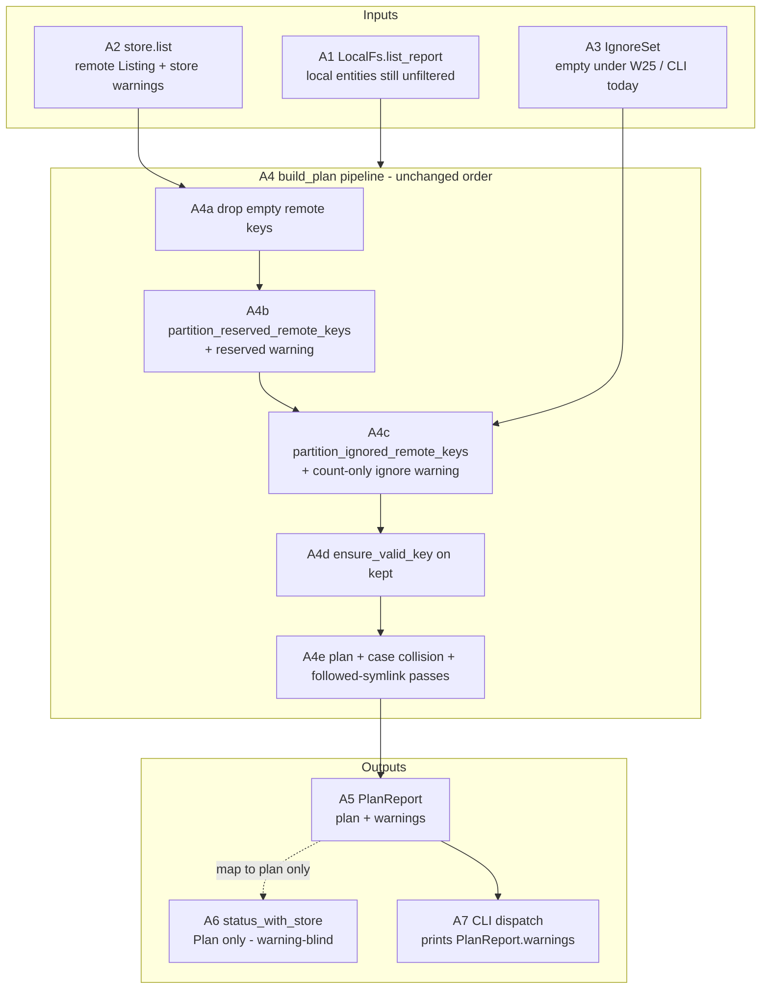

# PR 39 fix plan: review round 1 (comment 5467770600)

**Status:** implemented (W203-W208 landed on this worktree; tip will be the PR-branch head)
**PR:** https://github.com/tlkahn/vaultsync/pull/39 ("Issue 33: Apply ignore patterns to remote listings in `build_plan`")
**Review comment:** https://github.com/tlkahn/vaultsync/pull/39#issuecomment-5467770600
**Reviewed tip:** `b160d20` on `worktree-apply-ignore-patterns-to-remote-listings-in-build_plan`
**Work branch:** same PR branch; fixes land in place and update PR 39
**Reviewer verdict:** **Approve / merge-ready.** No blocking correctness issues. Six non-blocking nits (N1-N6): docs honesty (N1-N3), optional characterization pins (N4), plan-file hygiene (N5), known out-of-scope cost (N6).
**Work items:** continue the project W-series after issue #33 **W202**. This plan uses **W203-W208**.
**Planning file location:** authored at the repository-root planning path
`doc/plans/pr-39-review-5467770600.md`. Keep an identical copy on the PR
worktree branch under the same relative path so the branch carries the plan
(same convention as PR 35 / PR 28 fix plans).

---

## Architecture overview

PR 39 already wired the remote half of D-both-sides inside `build_plan`. This
fix pass does **not** change the pipeline shape, the `IgnoreSet` matcher, the
CLI W25 gate, or `plan()`. It hardens documentation and characterization around
the existing seam so #32 / #34 consumers cannot misread the API, and so locked
orders (ignore-before-validate, absence-not-Skip) cannot silently regress.



| ID | Component | This plan's touch |
| -- | --------- | ----------------- |
| A1 | Local walk entities | **Docs only (N2):** state explicitly that A1 is not filtered here (#32 owns walk prune). No code change. |
| A3 | `IgnoreSet` | Unchanged. Tests may construct non-empty sets. |
| A4c | Ignore partition | Unchanged production code. N4 characterization pins exercise A4c through full `build_plan`. |
| A4d | `ensure_valid_key` | Unchanged. N4 invalid-key pin locks that A4c runs **before** A4d (ignored junk never fails closed). |
| A5 | `PlanReport` | **N1 rustdoc** lists ignore-pattern drops as a warning source. |
| A6 | `status_with_store` | **N3 rustdoc only** (warning-blind). No signature change on this branch. |
| A7 | CLI | Out of scope (still `IgnoreSet::empty()`). |

Cross-reference: production filter body stays the issue-33 shape in `src/lib.rs`
(`build_plan` after reserved block calls `partition_ignored_remote_keys` then
pushes `ignored_remote_drops_warning`).

---

## Implementation discipline

**Strict fine-grained TDD** on every behavior-facing change:

1. **RED** - write or extend the exposing test first; run it; observe the
   expected assertion failure (or compile failure) *before* touching production
   code when production must change. Record the failing assertion text in the
   commit body.
2. **GREEN** - smallest production change that turns that cycle's pins green.
3. **REFACTOR** - behavior-preserving cleanup only under green; no behavior
   change without a new RED.
4. Do **not** push a RED tree. A single commit may contain RED-verified tests
   plus the GREEN implementation, with local RED observations recorded in the
   commit message (same convention as PR 35 / issue #33).
5. **Characterization pins** for *already-correct* behavior (this plan's N4):
   write the test first, confirm **GREEN on arrival**, then **mutation-check**
   (temporarily break the production path or invert a fixture, observe RED,
   revert). Record "characterization: GREEN on arrival; mutation-checked:
   \<break\> re-fails \<assert\>; reverted" in the commit body.
6. Docs-only / roadmap / plan-status / PR-reply changes have no artificial RED;
   they land under the all-green gate.

Per-cycle gate (every commit tip):

```bash
cargo fmt --check
cargo clippy --all-targets --locked -- -D warnings
cargo test --locked --offline --lib --bins
```

No network. Do not touch `tests/s3_integration.rs` or env-gated suites unless a
call site compile break forces it (it should not - no signature changes in this
plan). Do not edit W25 characterization tests, walk / local / config / plan /
exec production code, or store backends. `Cargo.toml` / `Cargo.lock` dependency
sections stay untouched.

This round has **no production filter-algorithm change** and **no public
signature change**. N4 is characterization-only (tests). N1-N3 and N5 are
docs/hygiene. N6 is record-only.

---

## Baseline verification

Before W203:

```bash
git status --short --branch
git log -1 --oneline
cargo fmt --check
cargo clippy --all-targets --locked -- -D warnings
cargo test --locked --offline --lib --bins
cargo test --locked --offline --lib \
  partition_ignored build_plan_filters push_delete_does_not_delete \
  build_plan_ignore_after build_plan_dir_prefix build_plan_ignore_warning \
  build_plan_no_ignore build_plan_empty_ignore
```

Expected baseline: branch
`worktree-apply-ignore-patterns-to-remote-listings-in-build_plan` at `b160d20`
(or a later PR-branch tip that still matches the review surface); full lib/bins
gate green (464 passed / 0 failed / 1 ignored at review tip); 10 issue-33 ignore
pins green; tree clean enough to start (plan file addition is the first dirty
path). Issue-33 plan status `implemented (W195-W202 ...)`.

---

## Findings -> decisions -> work items

| Finding | Review severity | Decision | Work item |
| ------- | --------------- | -------- | --------- |
| **N1** `PlanReport` rustdoc omits ignore-pattern drops as a warning source | Non-blocking / docs | **Fix rustdoc** on this branch | W206 |
| **N2** `build_plan` rustdoc does not say local entities stay unfiltered (#32) | Non-blocking / docs (mildly preferred before #34) | **Fix rustdoc** - one explicit "remote half only until #32" sentence + asymmetric Upload/DeleteLocal note | W206 |
| **N3** `status_with_store` discards `PlanReport.warnings` (pre-existing; now includes ignore) | Non-blocking / API note | **Document only** on this branch. Do **not** change the return type to `PlanReport` here (call-site blast + behavior change beyond "nit"). Defer signature widening to #34 if CLI/library needs warnings through this helper. | W206 docs; W208 record deferral |
| **N4a** Folder-form remote key under dir prefix not exercised in `build_plan` path | Optional characterization | **Land permanent pin** (GREEN on arrival + mutation-check) | W203 |
| **N4b** Basename-anywhere through `build_plan` (e.g. `.DS_Store` / `notes/.DS_Store`) | Optional characterization | **Land permanent pin** | W204 |
| **N4c** Ignored invalid remote key does not return `InvalidKey` | Optional characterization (locks ignore-before-validate) | **Land permanent pin** | W205 |
| **N4d** W198 asserts only no `DeleteRemote`, not full absence | Optional strengthen | **Extend existing test** in the same commit as related pins or a tiny follow commit; prefer ride-along on W203 or W205 to avoid a one-line commit - **this plan: ride along on W203** | W203 |
| **N5** `doc/plans/issue-33.md` bottom checklist still all `- [ ]` while Status is `implemented` | Hygiene | **Tick the checklist** | W207 |
| **N6** S3 still HEADs objects later ignore-dropped in `build_plan` | Out of scope / known cost | **Record only** in roadmap decision-log + review reply; no code | W208 record only |
| Approve / merge-ready; pipeline; absence; delete invariant; reserved-first; count-only warning; empty seam; acceptance names; scope lock | positives | **Acknowledge** in W208 reply | W208 |

### Positives (no code action; acknowledge in W208 reply)

- Pipeline order matches the lock; reserved-first pinned by W199.
- Absence semantics (not `Skip(ignored)`); delete invariant falls out of pairing (W198).
- `plan()` stays filter-agnostic; no `PlanOpts` smuggling.
- D-report is structurally count-only (`ignored_remote_drops_warning(usize)`).
- `IgnoreSet::empty()` is the right default seam (aligns with #32 avoiding `Default`).
- Acceptance tests named to match the issue sketch; W25 untouched; CLI empty-only.
- Issue-33 rustdoc / roadmap `I33-remote-ignore` / plan status already consistent with the filter body.
- Non-goals correctly refused (#31/#32/#34, no key dump, no new deps).

---

## Scope decisions

| ID | Question | Decision |
| -- | -------- | -------- |
| R39-scope | Which nits land on this branch? | **N1, N2, N3 (docs), N4a-d, N5.** N6 record-only. No filter algorithm change. No CLI/W25 change. No store HEAD optimization. |
| R39-n3-api | Return `PlanReport` from `status_with_store`? | **No on this branch.** Document warning-blind behavior. Revisit under #34 when real patterns flow and CLI may want a single helper. Rationale: nit was pre-existing; changing `Result<Plan, _>` -> `Result<PlanReport, _>` is a signature break across lib tests with no production CLI caller today (CLI uses `build_plan` directly). |
| R39-n4-tdd | N4 tests: RED or characterization? | **Characterization.** Behavior is already correct on tip (reviewer: merge-ready). Write tests first, confirm GREEN on arrival, mutation-check, revert break. |
| R39-n4c-fixture | How to spell "ignored invalid key"? | Remote key `../evil.md` (rejected by `ensure_valid_key` for `..` segment) + basename ignore pattern `evil.md` (valid pattern; `final_segment("../evil.md") == "evil.md"`). Do **not** put `..` inside an ignore pattern (pattern compile rejects `.`/`..` segments). Sibling kept key `notes/a.md`. Mode `Pull`. Assert `build_plan` is `Ok`, no action row for `../evil.md`, some row for `notes/a.md`. |
| R39-n4c-control | Also pin control-char keys? | **No.** Control characters cannot appear in ignore patterns (loud reject). Basename matching on a control-bearing key is awkward and adds little beyond the `..` pin. |
| R39-n4a-fixture | Folder-form fixture | `entity::folder(".git")` (normalizes to `.git/`) + `entity::file(".git/objects/aa", ...)` + `entity::file("notes/a.md", ...)`; ignore `[".git/"]`. Assert neither `.git/` nor `.git/objects/aa` planned; `notes/a.md` planned; ignore warning contains `ignored 2 remote key(s) by ignore patterns`. |
| R39-n4b-fixture | Basename-anywhere fixture | `entity::file("notes/.DS_Store", ...)` + `entity::file("notes/a.md", ...)`; ignore `[".DS_Store"]`. Assert no row for `notes/.DS_Store`; row for `notes/a.md`. Warning N=1 optional but nice. |
| R39-n4d-where | Strengthen W198 where? | Add to existing `push_delete_does_not_delete_remote_ignored`: assert `!actions.iter().any(|a| a.key == ".obsidian/workspace.json")` (full absence), keeping the existing DeleteRemote / stats pins. |
| R39-docs-tests | Must rustdoc be tested? | No rustdoc test harness. Full gate green is enough. |
| R39-merge | Block merge on these items? | **No** (reviewer: merge-ready even if deferred). Still land N1-N5 on this branch while the file is hot - cheap, closes the r1 checklist before #34. |
| R39-tdd-granularity | Commit splitting | W203 (folder + W198 absence), W204 (basename), W205 (invalid-key order), W206 (N1-N3 rustdoc), W207 (issue-33 checklist), W208 (roadmap + this plan status + review reply). No combined "fix everything" blob. |
| R39-production | Any production code edits? | **Docs/rustdoc only** in `src/lib.rs` (N1-N3). Test modules gain pins. `doc/plans/issue-33.md` checklist. `doc/roadmap.md` decision-log row. No changes under `src/ignore.rs` matcher body, `src/cli.rs`, `src/exec.rs`, `src/local.rs`, `src/store/**`, `src/plan/**`. |

---

## Work items

### W203 - N4a + N4d: folder-form dir-prefix through `build_plan` + W198 full absence

**Goal:** Lock folder-shaped remote keys under a dir-prefix pattern on the full
`build_plan` path (not only the pure partition helper / file-shaped W200), and
make the delete-invariant test also assert **no plan row at all** for the
ignored key.

**Where:** `src/lib.rs` `mod tests`, next to the existing issue-33 pins
(`build_plan_dir_prefix_drops_nested_remote`, `push_delete_does_not_delete_remote_ignored`).

**New test** `build_plan_dir_prefix_drops_folder_form_remote` (name stable for
cross-reference):

```text
local: empty TempDir + LocalFs
store: StubStore listing
  - entity::folder(".git")           // key normalizes to ".git/"
  - entity::file(".git/objects/aa", 25, Some(100))
  - entity::file("notes/a.md", 25, Some(100))
ignore: ignore_set(&[".git/"])
mode: Pull
opts: default
```

Assert:

- No action with `key == ".git/"` or `key == ".git/objects/aa"`.
- Some action with `key == "notes/a.md"`.
- Exactly one ignore warning containing
  `ignored 2 remote key(s) by ignore patterns`.

**Extend** `push_delete_does_not_delete_remote_ignored` (N4d):

```rust
assert!(
    !p.actions.iter().any(|a| a.key == ".obsidian/workspace.json"),
    "ignored key must be fully absent, not merely non-DeleteRemote: {:?}",
    p.actions
);
```

Keep existing DeleteRemote / `stats.delete_remote == 1` asserts.

**TDD protocol (characterization):**

1. Add the new test + the W198 absence assert only; no production change.
2. Run:

   ```bash
   cargo test --locked --offline --lib \
     build_plan_dir_prefix_drops_folder_form_remote \
     push_delete_does_not_delete_remote_ignored -- --exact --nocapture
   ```

   Expected: **GREEN on arrival**.

3. **Mutation-check (required):**
   - Folder pin: temporarily comment out the `partition_ignored_remote_keys`
     call in `build_plan` (or pass `&IgnoreSet::empty()` inside the test only as
     a negative check in a throwaway edit). Observe folder/child keys reappear
     and/or warning missing. Revert.
   - W198 absence: weaker - temporarily change the new assert to look for a
     key that still exists (`orphan.md`) and confirm it would fail if miswritten;
     better: remove filter as above and observe `.obsidian/workspace.json`
     appears as `DeleteRemote` (existing mutation habit from issue-33 W198).
   - Revert all breaks.

4. Commit body must record: "characterization: GREEN on arrival;
   mutation-checked: \<break\> re-fails \<test\>; reverted."

**Production change:** none.

**Gate:** full offline lib/bins + fmt + clippy `-D warnings`.

**Commit:**

```text
test: [33] folder-form dir-prefix + W198 full absence pins (PR 39 r1 N4a/N4d)

W203: characterization pins for build_plan_dir_prefix_drops_folder_form_remote
(entity::folder(".git") + child under .git/ pattern) and full absence assert on
push_delete_does_not_delete_remote_ignored. GREEN on arrival; mutation-checked.
```

---

### W204 - N4b: basename-anywhere through `build_plan`

**Goal:** Lock the default-profile basename shape (`.DS_Store` matches any final
segment) on the full remote-ingest path, not only in `IgnoreSet` unit tests.

**New test** `build_plan_basename_anywhere_drops_nested_remote`:

```text
local: empty
store: StubStore
  - entity::file("notes/.DS_Store", 25, Some(100))
  - entity::file("notes/a.md", 25, Some(100))
ignore: ignore_set(&[".DS_Store"])
mode: Pull
```

Assert:

- No action with `key == "notes/.DS_Store"`.
- Some action with `key == "notes/a.md"`.
- Optional but preferred: ignore warning contains
  `ignored 1 remote key(s) by ignore patterns`.

**TDD protocol:** characterization (GREEN on arrival) + mutation-check
(empty the ignore set in the test temporarily, or disable filter in
`build_plan`; observe `notes/.DS_Store` planned; revert).

**Production change:** none.

**Commit:**

```text
test: [33] basename-anywhere remote drop through build_plan (PR 39 r1 N4b)

W204: build_plan_basename_anywhere_drops_nested_remote pins .DS_Store matching
notes/.DS_Store on the full ingest path. Characterization + mutation-check.
```

---

### W205 - N4c: ignored invalid remote key does not fail closed

**Goal:** Lock the intentional pipeline order "ignore before `ensure_valid_key`"
so a well-meaning "validate first" refactor cannot turn ignored junk into a
hard `InvalidKey` error (issue-33 risk table; reviewer N4c).

**New test** `build_plan_ignored_invalid_remote_key_is_dropped`:

```text
local: empty
store: StubStore
  - entity::file("../evil.md", 25, Some(100))   // invalid: .. segment
  - entity::file("notes/a.md", 25, Some(100))
ignore: ignore_set(&["evil.md"])                 // basename; valid pattern
mode: Pull
```

Assert:

- `build_plan(...).is_ok()` (not `Err(InvalidKey(_))`).
- No action with `key == "../evil.md"`.
- Some action with `key == "notes/a.md"`.
- Optional: ignore warning N=1.

**Negative twin (same test file, or second test
`build_plan_non_ignored_invalid_remote_key_still_fails`):** if not already
covered by `build_plan_rejects_invalid_remote_key`, keep using that existing
test as the non-ignored control (`../evil.md` without matching ignore still
errors). Do **not** duplicate unless the existing test's bad-key list drifts;
prefer a one-line comment in the new test pointing at
`build_plan_rejects_invalid_remote_key`.

**TDD protocol:**

1. Add test; GREEN on arrival under current order.
2. **Mutation-check (required):** temporarily move
   `partition_ignored_remote_keys` to **after** the `ensure_valid_key` loop (or
   run validation before ignore). Observe new test RED with `InvalidKey`.
   Revert.
3. Record mutation in commit body.

**Production change:** none.

**Commit:**

```text
test: [33] ignored invalid remote key dropped before validate (PR 39 r1 N4c)

W205: build_plan_ignored_invalid_remote_key_is_dropped locks ignore-before-
ensure_valid_key (../evil.md + basename evil.md). Characterization;
mutation-checked by swapping filter/validate order (RED), reverted.
```

---

### W206 - N1 + N2 + N3: rustdoc honesty on `PlanReport` / `build_plan` / `status_with_store`

**Goal:** Docs match the shipped seam. No behavior change.

**Edits in `src/lib.rs` only (rustdoc):**

1. **N1 - `PlanReport`:** extend the struct-level summary so warning sources
   include ignore-pattern drops, e.g.:

   ```rust
   /// A plan plus the advisory warnings surfaced while building it (store
   /// listing drops, reserved-namespace leftovers, and ignore-pattern remote
   /// drops). The CLI prints `warnings` (one `warning: ...` line each);
   /// library consumers may inspect or ignore them. ...
   ```

2. **N2 - `build_plan`:** after the existing `ignore` paragraph, add one
   explicit sentence that **local entities are not filtered here** (walk prune
   is issue #32). Mention the interim asymmetry for non-empty sets: ignored
   local paths can still plan `Upload` / `DeleteLocal` until #32. Keep the
   remote absence / delete-invariant / empty-default sentences.

   Sketch (tighten to project voice when applying):

   ```rust
   /// ...
   /// Local entities are **not** filtered by `ignore` in this function - the
   /// local half of D-both-sides is walk-time prune (issue #32). Until #32
   /// lands, a non-empty `IgnoreSet` is remote-only: ignored local paths can
   /// still appear as `Upload` / `DeleteLocal`. Production CLI passes
   /// [`IgnoreSet::empty`] under W25 until #34 wires patterns from settings.
   ```

3. **N3 - `status_with_store`:** document that this convenience API returns
   only the `Plan` and **discards** `PlanReport.warnings` (listing, reserved,
   and ignore). Callers that need warnings must use `build_plan` directly.
   Do **not** change the signature or the `.map(|report| report.plan)` body.

**TDD:** docs-only; no new test. Gate: fmt / clippy / full offline lib/bins
(still green; rustdoc is not compiled into tests unless `#[doc]` attrs break
parse - keep plain `///` prose).

**Commit:**

```text
docs: [33] PlanReport/build_plan/status_with_store rustdoc (PR 39 r1 N1-N3)

W206: PlanReport warns sources include ignore-pattern drops; build_plan states
local half unfiltered until #32 (asymmetric Upload/DeleteLocal); status_with_store
documents warning-blind Plan-only return (no signature change; #34 may revisit).
```

---

### W207 - N5: tick `doc/plans/issue-33.md` implementation checklist

**Goal:** Plan file stops contradicting its own `Status: implemented`.

**Edit:** in `doc/plans/issue-33.md`, section "Implementation checklist (copy
into PR body)", flip every `- [ ]` to `- [x]` for the W195-W202 / gate rows
(mirror the PR body checklist that is already checked).

Do **not** rewrite the work-item narrative sections above; only the bottom
checklist and, if useful, a one-line note under Status that the checklist was
reconciled under this review plan.

**TDD:** n/a (markdown hygiene).

**Commit:**

```text
docs: [33] tick issue-33 plan checklist (PR 39 r1 N5)

W207: bottom Implementation checklist marked done to match Status implemented
and the PR 39 body.
```

---

### W208 - hygiene: roadmap decision-log row + this plan status + review reply

**Goal:** Close the review loop the same way PR 35 r1/r2 did.

1. **`doc/roadmap.md` decision-log** - add a row, e.g. `I33-r1` / `PR39-r1`:

   > PR 39 review 5467770600 (approve / merge-ready; N1-N6): PlanReport /
   > build_plan / status_with_store rustdoc honesty (ignore warning channel;
   > local unfiltered until #32; status_with_store warning-blind, signature
   > deferred to #34). Characterization pins: folder-form dir-prefix through
   > build_plan, basename-anywhere `.DS_Store`, ignore-before-validate on
   > invalid remote key, W198 full absence. issue-33 plan checklist ticked.
   > S3 HEAD-then-ignore cost recorded, not fixed (epic non-goal). Plan:
   > doc/plans/pr-39-review-5467770600.md.

2. **This plan file:** set **Status** to
   `implemented (W203-W208 landed on this worktree; tip <sha>)` when done.

3. **Review reply** on PR 39 (developer capacity `GH_TOKEN_TLKAHN`), body via
   `--body-file` (never heredoc), summarizing:
   - Thanks / agree with approve verdict
   - N1-N5 landed (map to W203-W207)
   - N3: documented only; return-type widen deferred to #34
   - N6: acknowledged, no code (list-side ignore still non-goal)
   - Gate line (test counts / clippy / fmt)
   - Link this plan path

**TDD:** n/a.

**Commit (docs; reply is a `gh` side effect after push):**

```text
docs: [33] PR 39 r1 roadmap log + plan status (W208)

I33-r1 decision-log row for review 5467770600; pr-39-review-5467770600.md
status implemented.
```

**After push:** post the reply comment; do not force-push; do not merge without
maintainer/author intent (reviewer already approved conceptually - author
merges when ready).

---

## Sequencing

```text
W203 folder-form + W198 absence (N4a/N4d)
  -> W204 basename-anywhere (N4b)
  -> W205 ignore-before-validate invalid key (N4c)
  -> W206 rustdoc N1-N3
  -> W207 issue-33 checklist (N5)
  -> W208 roadmap + plan status + review reply (N6 record)
```

Rationale: characterization pins first while the test module context is hot;
docs after pins so rustdoc can optionally cross-link test names if useful
(optional, not required); hygiene last.

Each arrow is a separate commit with the full offline gate green.

---

## Explicit non-goals (refuse scope creep)

- Changing `partition_ignored_remote_keys` / warning wording / pipeline order
- Making `status_with_store` return `PlanReport` (deferred to #34 decision)
- Filtering local entities inside `build_plan` (#32)
- CLI real `IgnoreSet` / W25 retire / cli.md (#34)
- Profile / built-in injection (#31)
- S3 or any store-side ignore prefilter / skipping HEADs on ignored keys (N6)
- Planner `Skip(ignored)` rows
- Dumping ignored key names in the ignore warning
- New crate dependency
- Editing W25 tests or applying patterns in `src/cli.rs`
- Touching `src/ignore.rs` matcher algorithm
- Live S3 integration tests for ignore

---

## Risk notes

| Risk | Mitigation |
| ---- | ---------- |
| Characterization test fails on arrival (unexpected bug) | Stop; convert that item to a real RED/GREEN production fix under a new W-id; do not "fix forward" silently |
| `entity::folder(".git")` key spelling surprises (`".git"` vs `".git/"`) | `folder` normalizes to trailing `/`; assert on `".git/"`; matcher `DirPrefix(".git/")` matches equal key |
| Basename `evil.md` does not match `../evil.md` | Matcher `final_segment` strips one trailing `/` then takes last segment - pins in ignore unit tests; if RED on arrival, fix test fixture first, only then suspect matcher |
| Pattern `evil.md` rejected or too broad | Basename-anywhere is intentional; only one invalid key in the fixture |
| Moving validate-before-ignore during mutation-check leaves tree dirty | Revert immediately after observing RED; never commit the break |
| Parallel #32/#31 merge conflicts on rustdoc / `IgnoreSet::empty` | Keep rustdoc additive; no `IgnoreSet` API change in this plan |
| W-series number collision with parallel #32 branch (also used W195+) | Accepted project practice across parallel epic-9 worktrees; this plan continues **this branch's** series at W203 after issue-33 W202 |

---

## Test implementation notes

Reuse existing lib-test tools only:

- `StubStore { listed: Vec<Entity> }`
- `entity::file` / `entity::folder`
- `TempDir` + `LocalFs::new` for empty local
- `ignore_set(&[&str])` helper already in `src/lib.rs` tests (W197+)
- `PlanOpts { delete: true, ..Default::default() }` only if touching W198
- Offline lib tests only; no S3, no network

Place new tests immediately after the existing W195-W201 block so issue-33 and
PR-39 pins stay contiguous.

---

## Implementation checklist (copy into PR reply / track progress)

- [x] W203 folder-form dir-prefix + W198 full absence (N4a/N4d) - characterization + mutation-check
- [x] W204 basename-anywhere through `build_plan` (N4b) - characterization + mutation-check
- [x] W205 ignored invalid remote key dropped before validate (N4c) - characterization + mutation-check
- [x] W206 `PlanReport` / `build_plan` / `status_with_store` rustdoc (N1-N3)
- [x] W207 tick issue-33 plan bottom checklist (N5)
- [x] W208 roadmap `I33-r1` row + this plan status `implemented` (N6 record; review reply posted after push)
- [x] `Cargo.toml` deps unchanged
- [x] No CLI / W25 / `plan()` / store / local production edits
- [x] `cargo fmt` / `clippy -D warnings` / `cargo test --offline --lib --bins` green on tip

---

## Post-landing

- Reply to review comment 5467770600 (developer token) with checklist mapping.
- Author merges PR 39 when ready (review already approve / merge-ready; this
  pass is polish).
- Close #33 on merge if not auto-closed.
- Unblocks cleaner #34 docs/API story (warning-blind helper called out; local
  asymmetry called out until #32 merges).
