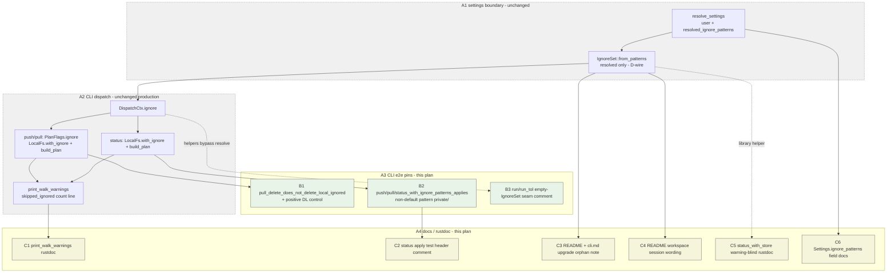

# PR 41 fix plan: review round 1 (review 5060627714)

**Status:** implemented (W212-W217 landed on this worktree; W218 review reply posted on PR 41 after push)
**PR:** https://github.com/tlkahn/vaultsync/pull/41 ("P3-7e: Wire ignores in CLI, retire W25, docs (issue 34)")
**Review:** https://github.com/tlkahn/vaultsync/pull/41#pullrequestreview-5060627714
**Reviewed tip:** `7d76b5b` on `worktree-wire-ignores-in-cli-retire-w25-docs`
**Work branch:** same PR branch; fixes land in place and update PR 41
**Reviewer verdict:** **Approve / merge-ready.** No blocking production correctness issues. Nine non-blocking findings (F1-F9): two medium test-strength pins (F1, F2), docs/comment honesty (F3-F6, F8-F9), residual library API note (F7).
**Work items:** continue the project W-series after issue #34 **W211**. This plan uses **W212-W218**.
**Planning file location:** authored at the repository-root planning path
`doc/plans/pr-41-fix-5060627714.md`. Keep an identical copy on the PR
worktree branch under the same relative path so the branch carries the plan
(same convention as PR 39 / PR 37 / PR 28 fix plans).

**Design refs:** issue #34, [doc/plans/issue-34.md](issue-34.md) (D-wire /
D-both-sides / D-w25-retire / D-report / D3 / delete invariant), epic #9,
sibling [issue-31.md](issue-31.md) (user-vs-resolved split),
[issue-32.md](issue-32.md) (local prune + `skipped_ignored`),
[issue-33.md](issue-33.md) (remote partition + count warning), review
5060627714 body.

**Verified baseline (recorded at plan time):** tip `7d76b5b`. Gate on this
worktree:

```text
cargo test --offline --lib --bins  = 499 passed / 0 failed / 1 ignored
cargo clippy --all-targets --locked -- -D warnings  clean
cargo fmt --check  clean
```

---

## Architecture overview

PR 41 already closed epic #9 in production: one `IgnoreSet` compiled from
`Settings.resolved_ignore_patterns` is threaded into both the local walk and
`build_plan`, W25 is gone, and D-report / D3 / delete-invariant e2e pins exist.
This fix pass does **not** change the dispatch pipeline, matcher, walk prune,
remote partition, or W25 absence. It hardens **test sharpness** where the
review showed pins that can pass for the wrong reason, and brings **docs /
comments** in line with the live behavior (including the upgrade orphan note
and README pattern shorthand).



| ID | Component | This plan's touch |
| -- | --------- | ----------------- |
| A1 | `resolve_settings` / D-wire compile | **Unchanged.** F8 only clarifies field docs (raw user list is split guard, not a live diagnostic consumer). |
| A2 | CLI dispatch / both-sides wire / W25 absence | **Unchanged production code.** F3/F5 are rustdoc/comments on existing helpers. |
| B1 | `pull_delete_does_not_delete_local_ignored` | **F1:** add local-only non-ignored positive control (`extra.md` must `DL` and leave disk). |
| B2 | `push`/`pull`/`status_with_ignore_patterns_applies` | **F2:** rewrite fixtures from `.trash/` (Obsidian built-in) to `private/` (user-only) so user-union is uniquely pinned on mutating paths. F4 rides with status test comment. |
| B3 | `run` / `run_tol` test helpers | **F5:** one-line comment - empty `IgnoreSet` is intentional; ignore e2e must use `run_with_settings*`. |
| C1 | `print_walk_warnings` | **F3:** rustdoc lists local ignore count line. |
| C3/C4 | README + `doc/cli.md` | **F6/F9:** sticky remote orphan upgrade note; name workspace session files without implying a `workspace*` glob. |
| C5 | `status_with_store` | **F7:** rustdoc only (warning-blind; no signature change). |
| C6 | `Settings.ignore_patterns` | **F8:** drop "diagnostics consumer" implication; state split-guard / test role honestly. |

Cross-reference: production filter body stays the issue-34 shape in
`src/cli.rs` (`run_with_settings_store` compile site + status/`dispatch_plan`
both-sides handoff). No change to `src/ignore.rs`, `src/local.rs` walk body,
or `src/lib.rs` partition algorithm.

---

## Implementation discipline

**Strict fine-grained TDD** on every behavior-facing change (F1, F2):

1. **RED** - when production code must change: write or extend the exposing
   test first; run it; observe the expected assertion failure *before*
   touching production. Record the failing assertion text in the commit body.
2. **GREEN** - smallest production change that turns that cycle's pins green.
3. **REFACTOR** - behavior-preserving cleanup only under green; no behavior
   change without a new RED.
4. Do **not** push a RED tree. A single commit may contain RED-verified tests
   plus the GREEN implementation, with local RED observations recorded in the
   commit message (same convention as PR 39 / issue #34).
5. **Characterization pins** for *already-correct* behavior (this plan's F1
   and F2): write/extend the test first, confirm **GREEN on arrival**, then
   **mutation-check** (temporarily break the production path or invert a
   fixture, observe RED, revert). Record
   `characterization: GREEN on arrival; mutation-checked: <break> re-fails
   <assert>; reverted` in the commit body.
6. Docs-only / rustdoc / comment / roadmap / plan-status / PR-reply changes
   have no artificial RED; they land under the all-green gate.

Per-cycle gate (every commit tip):

```bash
cargo fmt --check
cargo clippy --all-targets --locked -- -D warnings
cargo test --locked --offline --lib --bins
```

No network. Do not touch `tests/s3_integration.rs` or env-gated suites.
Do not reopen matcher / walk prune / remote partition / W25 (already gone) /
`DispatchCtx` shape / `Cargo.toml` deps. Prefer not to edit
`doc/plans/issue-34.md` body except if a test-name cross-reference must stay
accurate after F2 fixture renames inside existing test fn names (fn names stay;
only fixtures change).

This round has **no production filter-algorithm change** and **no public
signature change**. F1/F2 are characterization test strengthenings. F3-F9 are
docs/comment honesty.

---

## Baseline verification

Before W212:

```bash
git status --short --branch
git log -1 --oneline
cargo fmt --check
cargo clippy --all-targets --locked -- -D warnings
cargo test --locked --offline --lib --bins
cargo test --locked --offline --lib --bins \
  pull_delete_does_not_delete_local_ignored \
  push_with_ignore_patterns_applies \
  pull_with_ignore_patterns_applies \
  status_with_ignore_patterns_applies \
  status_user_patterns_extend_default_profile \
  push_delete_does_not_delete_remote_ignored_e2e -- --exact
```

Expected baseline: branch `worktree-wire-ignores-in-cli-retire-w25-docs` at
`7d76b5b` (or a later PR-branch tip that still matches the review surface);
full lib/bins gate green (499/0/1 at review tip); the six named pins green;
tree clean enough to start (plan file addition is the first dirty path).

---

## Findings -> decisions -> work items

| Finding | Review severity | Decision | Work item |
| ------- | --------------- | -------- | --------- |
| **F1** `pull_delete_does_not_delete_local_ignored` has no positive delete control | Medium / test strength | **Extend the existing test** with local-only non-ignored `extra.md`: must plan `DL extra.md`, file removed from disk; ignored `.trash/x.md` still survives. Keep issue sketch name. | W212 |
| **F2** push/pull/status apply tests use `.trash/` (already in Obsidian six) | Medium / test strength | **Rewrite fixtures** to user-only `private/` (dir prefix) + kept sibling (`a.md` / `notes/a.md` as today). Keep fn names. `check_with_ignore_patterns_does_not_refuse` stays on any non-empty user list (`.trash/` or `private/` - either fine; leave `.trash/` unless a drive-by is free). | W213 |
| **F3** `print_walk_warnings` rustdoc omits local ignore line | Low / docs | **Fix rustdoc** | W214 |
| **F4** `status_with_ignore_patterns_applies` header says exit 0; assert is 2 | Low / comment | **Fix header comment** (ride with W213 status fixture edit or W214 if split) | W213 (same file/test) |
| **F5** `run`/`run_tol` inject empty `IgnoreSet` with no warning comment | Low / seam clarity | **One-line helper comment** | W214 |
| **F6** Upgrade sticky-orphan consequence undocumented | Low / operator docs | **README known-behavior + `doc/cli.md` `[ignore]` note** | W215 |
| **F7** `status_with_store` still warning-blind | Residual API / docs | **Rustdoc only.** Do **not** change `Result<Plan, _>` to `PlanReport` (call-site blast, beyond nit). Do **not** expand to rewire `LocalFs::with_ignore` on this helper in this round (CLI does not use it; separate footgun if ever prioritized). | W216 |
| **F8** `Settings.ignore_patterns` claimed "diagnostics" with no consumer | Nit / docs | **Honest field + `resolve_settings` prose**: retained for the user-vs-resolved split (tests + future diagnostics), not a live production reader after W25 retire. Do **not** delete the field. | W216 |
| **F9** README `.obsidian/workspace*` reads like a glob | Nit / docs | **Name the three exact session keys** (or "workspace session files") in README; keep `doc/cli.md` table as source of truth | W215 |
| Approve / merge-ready; D-wire; both-sides; W25 gone; D-report; D3; delete push half; docs live; scope lock | positives | **Acknowledge** in W218 reply | W218 |

### Positives (no code action; acknowledge in W218 reply)

- D-wire compiles `resolved_ignore_patterns` only; loud re-compile failure path.
- D-both-sides structural at status and `dispatch_plan` (same set, both seams).
- D-w25-retire complete; Phase-3 strings regression-pinned.
- D-report local + remote count-only; reserved orthogonal under `profile=none`.
- D3 default / none / extend e2e named to issue sketch.
- Push delete e2e already has positive `orphan.md` control (F1 is pull parity).
- `DispatchCtx` seam under clippy arg limit; help/version empty set.
- User-facing docs already say live end-to-end; no new flags/deps.
- Non-goals correctly refused.

---

## Scope decisions

| ID | Question | Decision |
| -- | -------- | -------- |
| R41-scope | Which findings land on this branch? | **All of F1-F9** (cheap while the file is hot). No production algorithm change. |
| R41-f1-name | Rename `pull_delete_does_not_delete_local_ignored`? | **No.** Issue sketch name stays. Extend body only. |
| R41-f1-fixture | Positive control key | Local-only file `extra.md` at vault root (or `notes/extra.md` if root clutter is worse - prefer **`extra.md` at vault root** for a short `DL extra.md` line match). Content arbitrary (`"extra"`). Not present on the store. |
| R41-f1-asserts | Exact asserts to add | (1) `out.lines().any(|l| l.starts_with("DL extra.md"))`; (2) `!dir.join("extra.md").exists()` after exit 0; keep existing no-`DL .trash/x.md`, trash exists, `notes/a.md` exists, exit 0. |
| R41-f1-tdd | RED or characterization? | **Characterization.** Behavior is already correct (reviewer: merge-ready). GREEN on arrival + mutation-check: temporarily pass `Command::pull(..., false)` (delete off) and observe `extra.md` survives / no `DL` - proves the new asserts bite; revert. |
| R41-f2-pattern | Replacement pattern | **`private/`** dir prefix (already used by `status_user_patterns_extend_default_profile`). Not in `OBSIDIAN_DEFAULT_IGNORE_PATTERNS`. |
| R41-f2-fixtures | Per-test layout | **push:** `a.md` + `private/secret.md`; pattern `private/`; assert `U  a.md`, no `private/secret.md`, store has `a.md`, store lacks `private/secret.md`. **pull:** remote `a.md` + `private/secret.md`; empty local; assert `D  a.md`, no private row, `a.md` on disk, no `private/secret.md` on disk. **status:** local `a.md` + `private/secret.md`; assert exit 2, `U  a.md`, no `private/`. Drop `.trash/` from these three fixtures entirely so a defaults-only matcher cannot mask a broken user union. |
| R41-f2-mutation | How to mutation-check user-union uniqueness | Temporarily compile only built-ins at the CLI site (or pass `settings` with user patterns stripped / `IgnoreSet` from `OBSIDIAN_DEFAULT_IGNORE_PATTERNS` only). Observe `private/secret.md` reappears on the plan / store. Revert. Record in commit body. |
| R41-f2-check | Change `check_with_ignore_patterns_does_not_refuse` pattern? | **No** (optional). It only needs non-empty raw user `ignore_patterns` to prove W25 is gone; `.trash/` is fine. |
| R41-f2-extend | Touch `status_user_patterns_extend_default_profile`? | **No.** Already the unique status-side extend pin; leave as the built-in+user union checkbox. |
| R41-f4-where | Fix exit-0 comment where? | Same commit as F2 status fixture edit (W213) - one test, one comment block. |
| R41-f6-where | Upgrade orphan note placement | (1) README known-behaviors `[ignore]` bullet: one sentence on pre-existing remote ignored keys staying until manual delete or temporary `profile = "none"`. (2) `doc/cli.md` live `[ignore]` blockquote: short "Upgrade note" sentence with the same meaning. Do not invent a new subcommand. |
| R41-f6-tone | Scare vs matter-of-fact | Matter-of-fact. Absence + no `DeleteRemote` for ignored keys is the locked delete invariant; the note explains the upgrade consequence of that lock when defaults activate under previously uploaded keys. |
| R41-f7-api | Widen `status_with_store` to `PlanReport`? | **No on this branch.** Document warning-blind. Signature change is a separate decision with test blast radius; CLI already uses `build_plan` directly. |
| R41-f7-local | Also `with_ignore` on `status_with_store`'s `LocalFs`? | **Out of scope this round.** Review F7 was warnings only. Local half still unfiltered on this helper (library footgun if callers pass non-empty ignore expecting both sides). Record as residual in W218 reply, do not silently expand. |
| R41-f8-field | Delete `ignore_patterns`? | **No.** Keep the #31 split; tests assert it. Docs only. |
| R41-f9-readme | Exact README wording | Replace `` `.obsidian/workspace*` `` with the three exact keys listed, or the phrase "Obsidian workspace session files (`.obsidian/workspace`, `.obsidian/workspace.json`, `.obsidian/workspace-mobile.json`)". Prefer the three keys once for accuracy without ballooning the bullet. |
| R41-production | Any production code edits? | **None required** for F1-F9 as decided. Only tests + rustdoc/comments + user docs. If a mutation-check somehow reveals a real bug, stop and reopen scope with a new finding - do not silently expand. |
| R41-tdd-granularity | Commit splitting | W212 (F1), W213 (F2+F4), W214 (F3+F5 code comments), W215 (F6+F9 user docs), W216 (F7+F8 lib/config rustdoc), W217 (this plan status + optional roadmap breadcrumb), W218 (review reply). No combined "fix everything" blob. |
| R41-roadmap | Decision-log row? | **Optional one-liner** under existing `I34-wire` or a tiny `I34-r1` row pointing at this review + plan. Prefer `I34-r1` so the original wire row stays the epic close narrative. |
| R41-merge | Block merge on these items? | **No** (reviewer already approved). Still land F1-F9 on this branch while hot - cheap, closes the r1 checklist before merge. |

---

## Work items (W212-W218)

### W212 - F1: pull delete e2e positive control

**Goal:** Make `pull_delete_does_not_delete_local_ignored` as strong as the push
twin: ignored local-only path is not deleted **and** a non-ignored local-only
path still is.

**Where:** `src/cli.rs` `mod tests`, existing
`pull_delete_does_not_delete_local_ignored`.

**Fixture extension** (keep existing notes/trash/store setup):

```text
before:
  notes/a.md          local + remote (same content)
  .trash/x.md         local-only, ignored by default Obsidian profile
after add:
  extra.md            local-only, NOT ignored
```

**New asserts** (in addition to existing):

```rust
assert!(
    out.lines().any(|l| l.starts_with("DL extra.md")),
    "non-ignored local-only key must DeleteLocal: {out}"
);
assert!(
    !dir.join("extra.md").exists(),
    "non-ignored local-only file must be removed by pull --delete"
);
```

Keep: exit 0, no `DL .trash/x.md`, trash exists, `notes/a.md` exists.

**TDD protocol (characterization):**

1. Extend the test only; no production change.
2. Run:

   ```bash
   cargo test --locked --offline --lib --bins \
     pull_delete_does_not_delete_local_ignored -- --exact --nocapture
   ```

   Expected: **GREEN on arrival**.

3. **Mutation-check (required):**
   - Temporarily change the test call to `Command::pull(dir.path().into(), false)`
     (delete off). Observe RED on the new `DL extra.md` / file-removed asserts.
   - Revert.
   - Record in commit body.

4. Full gate green.

**Commit:** `test: [34] pull delete e2e positive DL control (W212, PR41 F1)`

---

### W213 - F2 + F4: apply tests use user-only `private/`; status comment exit 2

**Goal:** Rewrite the three W25-replacement apply tests so a defaults-only
matcher cannot mask a broken user-pattern union. Fix the status test header
comment (exit 2, not 0).

**Where:** `src/cli.rs` `mod tests`:

- `push_with_ignore_patterns_applies`
- `pull_with_ignore_patterns_applies`
- `status_with_ignore_patterns_applies`

**Shared fixture shape** (per command):

| Test | Local | Remote | Settings patterns | Keep asserts |
| ---- | ----- | ------ | ----------------- | ------------ |
| push | `a.md`, `private/secret.md` | empty MemoryStore | `["private/"]` via `settings_with_ignore` | exit 0; no Phase 3; `U  a.md`; no `private/secret.md` in plan; store has `a.md`; store `NotFound` for `private/secret.md` |
| pull | empty vault dir | `a.md`, `private/secret.md` | `["private/"]` | exit 0; no Phase 3; `D  a.md`; no private in plan; `a.md` on disk; no `private/secret.md` on disk |
| status | `a.md`, `private/secret.md` | mock empty | `["private/"]` | exit **2**; no Phase 3; `U  a.md`; no `private/` in out |

**Comments to rewrite:**

- Drop "`.trash/` under user pattern" language; say user-only `private/` so the
  pin cannot pass on Obsidian built-ins alone.
- Mutation-check note in comments: empty set / built-ins-only at compile site
  makes `private/secret.md` reappear.
- **F4:** status header must say the run proceeds with **exit 2** (dirty plan)
  and no Phase 3 warning - match the assertion body.

**Do not change** fn names (issue / plan cross-references).

**TDD protocol (characterization):**

1. Edit the three tests' fixtures + asserts + comments only.
2. Run:

   ```bash
   cargo test --locked --offline --lib --bins \
     push_with_ignore_patterns_applies \
     pull_with_ignore_patterns_applies \
     status_with_ignore_patterns_applies -- --exact --nocapture
   ```

   Expected: **GREEN on arrival** (user union already works via W205/W210).

3. **Mutation-check (required), at least one of:**
   - Strip user patterns from the settings helper result before dispatch
     (`settings.resolved_ignore_patterns = OBSIDIAN_DEFAULT... only`, or
     clear user list and re-resolve with empty patterns), **or**
   - Temporarily force `IgnoreSet::empty()` at the compile site in
     `run_with_settings_store`.
   - Observe RED: `private/secret.md` planned and/or uploaded/downloaded.
   - Revert production/test break.
   - Record in commit body.

4. Full gate green. Confirm
   `status_user_patterns_extend_default_profile` still green (untouched).

**Commit:** `test: [34] apply pins use user-only private/ (W213, PR41 F2/F4)`

---

### W214 - F3 + F5: `print_walk_warnings` rustdoc + `run`/`run_tol` seam comment

**Goal:** Docs honesty on two CLI-internal seams the review called out.

**Where:** `src/cli.rs`

**F3 - `print_walk_warnings` rustdoc** (replace the Slice-9-only blurb):

Must mention, in plain language:

- out-of-vault / walk `warnings` passthrough
- default-mode skipped-symlink count hint
- reserved temp/probe skip count (already always-on)
- **local ignore count** when `WalkReport.skipped_ignored > 0`
  (`warning: ignored N local path(s) by ignore patterns`, issue #34 D-report)

Keep it short; do not duplicate the locked string in three places if one
reference to the issue/D-report is enough.

**F5 - `run` / `run_tol` helpers** (above `fn run` or inside `run_tol` where
`IgnoreSet::empty()` is set):

```rust
// Ignore e2e must use run_with_settings / run_with_settings_store (real
// resolve -> resolved_ignore_patterns). These helpers keep IgnoreSet::empty()
// on purpose so pre-ignore contracts (progress, tolerance, parse, store
// refusal, ...) stay isolated from the default Obsidian profile.
```

**TDD:** docs-only; full gate green (no new test required).

**Commit:** `docs: [34] walk-warning rustdoc + run() empty-ignore note (W214, PR41 F3/F5)`

---

### W215 - F6 + F9: README + `doc/cli.md` upgrade orphan note; workspace wording

**Goal:** Operator-facing honesty for the default-profile activation upgrade,
and accurate workspace session wording (no implied `workspace*` glob).

**Where:**

- `README.md` known-behaviors `[ignore]` bullet
- `doc/cli.md` live `[ignore]` blockquote (after the D-report / profile
  sentences, before or after the matcher shape table)

**F9 - README list of defaults:**

Replace the informal `` `.obsidian/workspace*` `` with the three exact keys:

```text
.git/, .trash/, .DS_Store, .obsidian/workspace,
.obsidian/workspace.json, .obsidian/workspace-mobile.json
```

(or equivalent readable wrapping). Do not claim a glob shape the built-ins do
not use.

**F6 - upgrade / sticky remote orphans** (both surfaces, matter-of-fact):

Core meaning to preserve:

- Before issue #34, absent `[ignore]` listed everything (CLI passed an empty
  matcher; W25 only tripped on a non-empty *user* list).
- After #34, the Obsidian six apply with no config change.
- Keys **already uploaded** under those patterns remain on the remote: they are
  ignored on both sides, so `push --delete` will **not** remove them (delete
  invariant). Clean up manually in the store, or temporarily use
  `profile = "none"` (understanding that disables built-ins for that run).

Do not add a new CLI flag or subcommand. Do not soften the delete invariant.

**TDD:** docs-only; full gate green. Manually re-read both paragraphs for
em-dash policy (project: plain hyphen / colon only) and link preservation.

**Commit:** `docs: [34] ignore upgrade orphans + workspace key wording (W215, PR41 F6/F9)`

---

### W216 - F7 + F8: `status_with_store` + `Settings.ignore_patterns` rustdoc honesty

**Goal:** Library/config docs match post-W25 reality without API churn.

**Where:**

- `src/lib.rs` - `status_with_store` rustdoc (and any adjacent note already
  mentioning warnings)
- `src/config.rs` - `Settings.ignore_patterns` field docs + the
  `resolve_settings` prose that says "diagnostics"

**F7 - `status_with_store`:**

State explicitly:

- Returns `Plan` only; **`PlanReport.warnings` are discarded** (listing drops,
  reserved leftovers, ignore-pattern drops). Callers that need warnings must
  use `build_plan` directly.
- Optional one sentence: production CLI status does not use this helper (it
  calls `build_plan` and prints warnings itself).

Do **not** change the signature or attach `with_ignore` on this pass (see
R41-f7-local).

**F8 - `ignore_patterns` field:**

Replace "retained for diagnostics" with accurate split-guard language, e.g.:

- Raw user `[ignore].patterns` only (no profile injection).
- Production D-wire compiles `resolved_ignore_patterns`, never this field alone.
- Retained so the user-vs-resolved split stays testable (#31 D-w25-seq) and so a
  future diagnostic surface can report "what the user wrote" vs "what ran".
- Not read by the CLI production path after W25 retirement.

Mirror the same honesty in `resolve_settings` module/fn prose if it still says
the raw field is for "diagnostics" as if a consumer existed.

**TDD:** docs-only; full gate green.

**Commit:** `docs: [34] status_with_store + ignore_patterns field honesty (W216, PR41 F7/F8)`

---

### W217 - plan hygiene + optional roadmap `I34-r1` breadcrumb

**Goal:** This plan file flips to implemented when W212-W216 are green; optional
roadmap pointer so the decision log records the r1 follow-up.

**Where:**

- `doc/plans/pr-41-fix-5060627714.md` - Status line + checklist at bottom
- `doc/roadmap.md` - optional short `I34-r1` decision-log row after `I34-wire`:
  review 5060627714 approve; F1-F9 landed as test strength + docs honesty; no
  production algorithm change; plan link.

**TDD:** docs-only; full gate green.

**Commit:** `docs: [34] PR41 r1 fix plan status + I34-r1 log (W217)`

---

### W218 - review reply on PR 41

**Goal:** Public reply mapping F1-F9 to W212-W217 commits so the review thread
closes cleanly (same convention as PR 39 / PR 37 fix replies).

**Where:** GitHub PR 41 comment via reviewer or developer account per project
two-user workflow. Body via `--body-file` (never heredoc). Content:

- Thanks + restate approve still holds
- Table: Finding -> commit / W item -> done
- Explicit non-changes: no production filter change; no `status_with_store`
  signature widen; no `ignore_patterns` field deletion; residual library
  `status_with_store` local-half still unfiltered if callers pass non-empty
  ignore (recorded, not fixed)
- Gate numbers at reply tip

**Commit:** none required for the reply itself (chat/GitHub only). If the
project prefers a `docs:` commit that only records the reply URL in the plan
file, fold into W217 instead of a free-floating edit.

---

## Implementation checklist

- [x] W212 F1 `pull_delete_does_not_delete_local_ignored` + `extra.md` positive DL
- [x] W213 F2+F4 apply tests on `private/`; status comment exit 2
- [x] W214 F3+F5 `print_walk_warnings` rustdoc + `run`/`run_tol` empty-ignore note
- [x] W215 F6+F9 README/cli.md upgrade orphans + workspace key wording
- [x] W216 F7+F8 `status_with_store` + `ignore_patterns` rustdoc honesty
- [x] W217 plan status implemented + optional roadmap `I34-r1`
- [x] W218 PR review reply mapping F1-F9 -> commits (posted on PR 41 after push)
- [x] `Cargo.toml` deps unchanged
- [x] No production filter / dispatch / W25 / signature changes
- [x] `cargo fmt` / `clippy -D warnings` / `cargo test --offline --lib --bins` green
- [x] Each of W212/W213 mutation-checked (GREEN on arrival, break RED, revert)

---

## Risks and non-goals

| Risk | Mitigation |
| ---- | ---------- |
| F2 fixture rewrite accidentally depends on default `.trash/` again | Fixtures must not create `.trash/` / workspace files; only `private/` + kept sibling |
| F1 `extra.md` collides with formatter width / plan prefix | Use exact `starts_with("DL extra.md")` like existing `DR orphan.md` |
| Docs introduce em-dash or invent CLI flags | Project plain hyphen/colon; config-only posture unchanged |
| Scope creep into `status_with_store` both-sides wire | Explicitly out of scope (R41-f7-local); record residual only |
| Mutation-check left in tree | Revert before commit; full gate must be green at tip |
| Split commits leave docs disagreeing with tests mid-branch | Prefer merge only after W215 at least; do not publish half-updated README alone without F2 if README cites test names (it should not) |

**Non-goals (do not do in this plan):**

- Production ignore algorithm, `DispatchCtx` shape, or W25 resurrection checks beyond existing pins
- `status_with_store` -> `Result<PlanReport, _>` signature change
- `LocalFs::with_ignore` on `status_with_store` (library both-sides footgun; separate issue if desired)
- Deleting `Settings.ignore_patterns`
- CLI `--profile` / `--exclude` / `--include`
- New dependencies
- S3 HEAD-then-ignore list-side optimization (#33 residual)
- Integration / env-gated suite edits

---

## Suggested landing order

```text
W212  test    F1 pull delete positive control
W213  test    F2/F4 apply pins on private/ + status comment
W214  docs    F3/F5 code rustdoc + helper comment
W215  docs    F6/F9 README + cli.md
W216  docs    F7/F8 lib + config rustdoc
W217  docs    plan status + I34-r1
W218  reply   GitHub review thread
```

Each tip: fmt + clippy `-D warnings` + `cargo test --locked --offline --lib --bins`.
