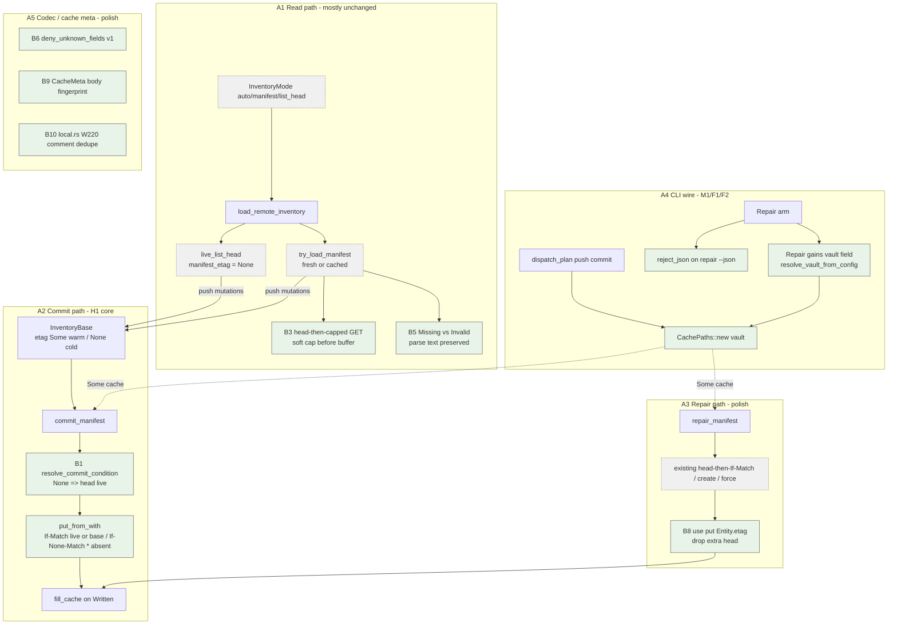

# PR 46 fix plan: review round 1 (comments 5472028291 + 5472033449)

**Status:** implemented (W249-W262 ...; one commit per work item, see the
commit history below the reviewed tip `865256e`; RED evidence recorded in
commit bodies)
**PR:** https://github.com/tlkahn/vaultsync/pull/46 ("Inventory manifest: remote source of truth + local cache for fast plans (issue 45)")
**Review comments:**
- https://github.com/tlkahn/vaultsync/pull/46#issuecomment-5472028291 (lgsunnyvale; severity-ordered; **H1 merge-gate**)
- https://github.com/tlkahn/vaultsync/pull/46#issuecomment-5472033449 (lgsunnyvale; **approve**; prefers F1/F2 before merge)
**Reviewed tip:** `865256e` on `worktree-inventory-manifest-issue-45`
**Work branch:** same PR branch; fixes land in place and update PR 46
**Reviewer verdict (combined):** feature is plan-faithful and offline-green; **H1 is the one merge-blocking correctness gap** (cold-base commit is create-only and cannot heal a present corrupt/ignored manifest). M1/F1 (CLI cache wire) and F2 (`repair --json`) are small, preferred-before-merge. Remaining findings are polish / docs / nits.
**Work items:** continue the project W-series after issue #45 **W248**. This plan uses **W249-W262**.
**Planning file location:** authored at the repository-root planning path
`doc/plans/pr-46-fixes-5472028291-5472033449.md` (this file on the PR
worktree). Keep the branch carrying the plan (same convention as PR 41 /
PR 39 / PR 35 fix plans).

**Design refs:** issue #45, [doc/plans/issue-45.md](issue-45.md),
[doc/inventory-manifest.md](../inventory-manifest.md) (esp. 7.4 Conditional
commit, 9 Local cache, 10 Repair), [doc/cli.md](../cli.md),
[doc/object-store.md](../object-store.md), review bodies 5472028291 and
5472033449.

**Verified baseline (recorded at plan time):** tip `865256e`. Gate on this
worktree (as reported by the approve review; re-confirm before W249):

```text
cargo test --offline --lib --bins  = 554 passed / 0 failed / 1 ignored
cargo clippy --all-targets --locked -- -D warnings  clean
cargo fmt --check  clean
```

---

## Architecture overview

PR 46 already landed S1-S8 of issue #45 (reserved namespace, conditionals,
codec, inventory facade, push commit, repair, local cache, docs). This fix
pass does **not** reopen the planner, the reserved-key predicate, the warm
no-list pin, or Q1-Q8 locks except where H1 forces a **narrow refinement of
D-commit-cond**: a cold base (`manifest_etag = None`) must mean "resolve the
live condition at commit time", not "always If-None-Match: *".



| ID | Component | This plan's touch |
| -- | --------- | ----------------- |
| A1/WARM | `try_load_manifest_*` | **H1-related read honesty (L6/F4):** distinguish Missing vs Invalid; surface parse text. **M2:** head-then-capped GET before unbounded buffer. **L3:** 304 path parse once. |
| A1/COLD | `live_list_head` | **Unchanged** (`manifest_etag: None` stays). H1 is fixed at commit, not by inventing a fake etag on cold load. |
| A2 | `commit_manifest` | **H1:** when `base.manifest_etag` is `None`, `head(MANIFEST_KEY)` and choose If-Match live / If-None-Match * create. Warm `Some(etag)` path unchanged (If-Match base). |
| A3 | `repair_manifest` | **N2:** use put's returned `Entity.etag`; drop trailing head. Cache fill already correct when `Some(cache)`. |
| A4 | CLI `dispatch_plan` / Repair | **M1/F1:** pass `Some(&CachePaths::new(vault))`. **F2:** carry `json` + `reject_json`. Repair gains `vault` so cache and config vault resolve work. |
| A5 | `ManifestV1` / cache meta / local walk | **L1:** `deny_unknown_fields`. **N3:** body fingerprint in meta. **L4/N1:** dedupe W220 comment. |
| Docs | design note 7.4, cli.md, object-store.md, README | Refine D-commit-cond wording; etag-capable backend + conditional-PUT notes; README #45 (not #42). |
| Out of scope | mock lock (L2), planner, reserved predicate, Q2 exit codes, S3 integration suite, new crates | Record only / no code. |

Cross-reference: production commit body stays in `src/inventory.rs`
(`commit_manifest`); CLI wires in `src/cli.rs` (`dispatch_plan` push arm +
`Command::Repair`); codec in `src/manifest.rs`.

---

## Implementation discipline

**Strict fine-grained TDD** on every behavior-facing change:

1. **RED** - write or extend the exposing / validation test first; run it;
   observe the expected assertion failure (or compile failure) *before*
   touching production code when production must change. Record the failing
   assertion text in the commit body.
2. **GREEN** - smallest production change that turns that cycle's pins green.
3. **REFACTOR** - behavior-preserving cleanup only under green; no behavior
   change without a new RED.
4. Do **not** push a RED tree. A single commit may contain RED-verified tests
   plus the GREEN implementation, with local RED observations recorded in the
   commit message (same convention as PR 41 / PR 39 / issue #45).
5. **Characterization pins** for *already-correct* behavior: write the test
   first, confirm **GREEN on arrival**, then **mutation-check** (temporarily
   break the production path or invert a fixture, observe RED, revert).
   Record `characterization: GREEN on arrival; mutation-checked: <break>
   re-fails <assert>; reverted` in the commit body.
6. Docs-only / rustdoc / comment / roadmap / plan-status / PR-reply changes
   have no artificial RED; they land under the all-green gate.

Per-cycle gate (every commit tip):

```bash
cargo fmt --check
cargo clippy --all-targets --locked -- -D warnings
cargo test --locked --offline --lib --bins
```

No network. Do not touch `tests/s3_integration.rs` or env-gated suites.
Do not reopen: reserved-key predicate body, warm-no-list pin shape, Q1-Q8
product locks (except the H1 refinement of D-commit-cond locked below),
`plan()` source-agnostic contract, pull/status no-commit, bodies-first
ordering, or `Cargo.toml` deps (no new crates). Prefer not to edit
`doc/plans/issue-45.md` body except status/checklist cross-links if needed.

**TDD granularity rule for this plan:** one finding (or one tightly coupled
pair like F4+L6) per work item. Do not bundle H1 with M1 in a single commit.

---

## Baseline verification

Before W249:

```bash
git status --short --branch
git log -1 --oneline
cargo fmt --check
cargo clippy --all-targets --locked -- -D warnings
cargo test --locked --offline --lib --bins
cargo test --locked --offline --lib --bins \
  commit_manifest commit_and_repair_refresh \
  auto_falls_back warm_path_reads push_commits \
  push_race repair_parses repair_dry
```

Expected baseline: branch `worktree-inventory-manifest-issue-45` at
`865256e` (or a later tip that still matches the review surface); full
lib/bins gate green (554 passed / 0 failed / 1 ignored at review tip); tree
clean enough to start (plan file addition is the first dirty path). Issue-45
plan status remains `implemented (W219-W248 ...)`; this fix series is a
follow-on on the same branch.

---

## Findings -> decisions -> work items

Combined from both review comments. IDs keep the reviewers' labels; the
Decision column is this plan's lock.

| Finding | Source | Severity | Decision | Work item |
| ------- | ------ | -------- | -------- | --------- |
| **H1** Cold-base commit always `If-None-Match: *`; cannot overwrite present corrupt / `list_head` / etag-less object | 5472028291 | **High / merge-gate** | **Fix.** When `base.manifest_etag.is_none()`, `head(MANIFEST_KEY)` at commit time: present => `If-Match` live etag; absent => `If-None-Match: *`. Warm `Some(etag)` unchanged. Do **not** skip commit under `list_head` (push still maintains the control plane). Refine design note 7.4. Two RED-first pins (corrupt auto push; list_head push with present manifest). | **W249-W250** |
| **M1 / F1** CLI passes `cache: None` on commit + repair; W246 mirror refresh dead in production | both | Medium (preferred before merge) | **Fix.** `dispatch_plan` passes `Some(&CachePaths::new(vault))`. Repair gains `vault`, resolves via `resolve_vault_from_config`, passes cache the same way. CLI e2e pin: push then assert cache meta etag == remote etag. | **W251** |
| **F2** `repair --json` silently ignores `--json` | 5472033449 | Low (preferred before merge) | **Fix.** Carry `json: self.json` on `Command::Repair`; `reject_json` like status/push/pull/check. | **W252** |
| **M2** Soft cap only after full unbounded GET | 5472028291 | Medium | **Fix.** Warm fetch: `head` first (refuse when `size > MANIFEST_MAX_BYTES`); GET through a capped writer (belt-and-braces). Same on cache-fill unconditional path. | **W253** |
| **M3 / F3** `InventoryOpts.concurrency` / `RepairOpts.concurrency` / `load_remote_inventory(..., _concurrency)` dead | both | Low | **Remove the dead knobs** from the inventory facade; document that cold-head concurrency is a store-construction concern (`S3Store::new(..., settings.concurrency)`). Update rustdoc / call sites. | **W254** |
| **F4 + L6** Warm parse errors swallowed; missing vs corrupt share one warning | both | Low / Medium-adjacent | **Fix together.** Warm attempt returns Missing vs Invalid(message). Auto warnings differ; strict error carries parse text. | **W255** |
| **L1** Serde permissive on unknown fields | 5472028291 | Low | **Fix.** `#[serde(deny_unknown_fields)]` on `ManifestV1` + `ManifestEntry`. Pin typo field rejects. | **W256** |
| **L3** 304 path double-parses | 5472028291 | Low | **Fix.** `read_cache_body` returns validated bytes (or parse once at call site and reuse). Second failure => invalidate + fresh fetch (not hard error). | **W257** |
| **N2** Repair discards put `Entity.etag`, extra `head`, swallows head errors | 5472033449 | Nit | **Fix.** Thread put's returned etag through all three write arms; drop the trailing head. | **W258** |
| **N3** Cache body-before-meta crash window; comment overstates mitigation | 5472033449 | Nit | **Fix.** Add body fingerprint to `CacheMeta`; 304/read path requires fingerprint match or invalidate. Correct the comment. | **W259** |
| **L4 / N1** Duplicate W220 comment block in `local.rs` | both | Nit | **Fix.** Delete the duplicate block. | **W260** |
| **N4** `doc/README.md` cites inventory-manifest as (#42) | 5472033449 | Nit | **Fix.** Cite issue **#45** (optionally "related #42"). | **W260** (docs ride-along) |
| **N5** Etag-less backend: warm read + commit create-only loses every push | 5472033449 | Nit / docs | **Docs.** Manifest mode assumes an etag-capable backend; H1 head-then-If-Match also covers "etag None on read but object present" when head returns an etag. | **W261** |
| **N6** Minio / S3-compatible may lack conditional PUT | 5472033449 | Nit / docs | **Docs** in `cli.md` / `object-store.md`: conditional PUT required for manifest commit; without it push warns and control plane never advances (data ok, cold auto still works). | **W261** |
| **L2** Mock conditional put check-then-act without holding lock | 5472028291 | Nit | **No code.** Record only; mock stays single-threaded. | **W262** record |
| **L5** Stale "RED today" commentary in a few tests | 5472028291 | Nit | **Opportunistic** only when touching those tests; no dedicated commit. Do not churn unrelated historical RED notes. | opportunistic |
| Positives (layering, pins, reserved namespace, trait defaults, repair, cache security, docs) | both | - | **Acknowledge** in W262 review reply | **W262** |

### Positives (no code action; acknowledge in W262 reply)

- Layering: pure codec / inventory facade owns IO / `plan()` source-agnostic.
- Fail-closed ethos; mutation-checked pins (warm no-list, 304 no-redownload, conditional race no-clobber, warm==cold plan parity).
- Single reserved-namespace predicate across walk / partition / S3 pre-head / manifest entry reject; `notes/.vaultsync/x` carve-out pinned.
- Trait defaults keep third-party `ObjectStore` impls compiling; real conditionals only on mock + S3; `PreconditionFailed` is a real variant.
- Commit ordering bodies-first / manifest-last; success-only `apply_commit_mutations`.
- Repair dry-run / force / conditional retry once; never touches file bodies.
- Cache: temp+rename, 0o600, never authority (non-NotFound fails closed).
- Offline suite green; clippy / fmt clean at review tip.

---

## Scope decisions (locked for this fix series)

| ID | Question | Decision |
| -- | -------- | -------- |
| R46-h1-shape | How does cold commit choose its condition? | **Head at commit time when `base.manifest_etag.is_none()`.** Present object (any body, including corrupt) => `If-Match` on the live etag (overwrite). Absent => `If-None-Match: *` create. Warm path with `Some(etag)` stays `If-Match` on the base etag (no extra head). |
| R46-h1-list-head | Skip commit entirely under `list_head`? | **No.** `list_head` forces cold **planning** only. Push still commits so other devices on `auto` keep a fresh control plane. Document in design note + cli.md. |
| R46-h1-retry | Retry once on push commit PreconditionFailed like repair? | **No.** Keep Q2: warn + exit 0 when transfers ok; suggest repair. Retry stays repair-only (section 10). |
| R46-h1-helper | Share write helper with repair? | **Small shared pure helper for condition resolution is OK** (`resolve_cold_commit_opts(store) -> PutOpts` or equivalent). Do **not** merge commit and repair into one function - different outcomes (`CommitOutcome` vs `RepairReport`), different retry policy. |
| R46-h1-design-text | Update D-commit-cond / 7.4? | **Yes** in W250/W261. New wording: `None` means "resolve live at commit": head then If-Match / If-None-Match *. "LiveListHead because corrupt / mode forced / absent" all share that resolve step. |
| R46-m1-repair-vault | How does repair get a vault root for cache? | **Add `vault: PathBuf` to `Command::Repair`** (from global `--vault`), include it in `resolve_vault_from_config`, pass `CachePaths::new(&vault)` into `repair_manifest`. Mirror status/push/pull. Update `Command::repair()` test helper. |
| R46-m3-api | Remove concurrency fields or docs-only? | **Remove** from `InventoryOpts`, `RepairOpts`, and `load_remote_inventory`'s param. Call sites drop the argument. Rustdoc states cold-head concurrency is owned by store construction. |
| R46-m2-cap | Head-only vs capped writer vs both? | **Both.** Head refuse on `size > cap` (cheap loud path); GET through a local capped writer so a lying/changing object cannot blow RSS. Prefer a small `CappedWriter` in `inventory` or `pub(crate)` reuse - do **not** take a new dependency. Do not couple inventory to `exec` internals if a 15-line writer is enough. |
| R46-f4-shape | How to plumb Missing vs Invalid? | Internal enum or distinct `Result` path inside `try_load_manifest*`. Public `load_remote_inventory` stays the same signature. Auto: two warning strings. Strict: error string includes parse/remedy text. |
| R46-l1-forward | Does deny_unknown_fields block schema evolution? | **Acceptable.** Extension valve remains `schema != vaultsync.manifest.v1` reject + future schema id. v1 is closed. |
| R46-n3-fingerprint | What fingerprint? | Reuse in-tree **fnv1a** (mock already has it) or a trivial length+fnv stored as hex string on `CacheMeta`. No new crate. Mismatch => invalidate + fresh fetch. |
| R46-l2 | Mock lock hardening? | **Defer.** Comment already honest; no concurrent mock users. |
| R46-scope-merge | What blocks merge? | **H1 + M1/F1 + F2** are the merge-preferred set. M2/M3/F4/L1 and nits land on this branch while hot (cheap, same PR) unless a cycle blows up - then park behind H1/M1/F2 in the reply. |
| R46-tdd | Commit splitting | One W-item per commit (see Work items). H1 tests (RED) may land in the same commit as H1 GREEN with RED evidence in the message body. |
| R46-production-files | Primary edit surfaces | `src/inventory.rs`, `src/cli.rs`, `src/manifest.rs`, `src/local.rs` (comment only), `doc/inventory-manifest.md`, `doc/cli.md`, `doc/object-store.md`, `doc/README.md`, `doc/roadmap.md` decision-log row, this plan status. |

---

## Work items

### W249 - H1 tests RED: cold commit overwrites present manifest (corrupt auto + list_head)

**Goal:** Expose H1 with failing pins before any production change.

**Where:** `src/inventory.rs` `mod tests` and/or `src/cli.rs` `mod tests`
(library pin preferred for precise condition; CLI pin optional ride-along if
the library pin already covers the put condition).

**TDD cycle:**

1. **RED** - add two tests (names indicative):
   - `commit_manifest_cold_base_overwrites_existing_corrupt_body`  
     Seed `MANIFEST_KEY` with garbage bytes (or valid-looking wrong schema).
     Build `InventoryBase { source: LiveListHead, file_entities: [...],
     manifest_etag: None }`. Call `commit_manifest` with one successful
     `Upload`. **Assert** `CommitOutcome::Written` and that a subsequent
     `get_to(MANIFEST_KEY)` parses as a valid manifest containing the
     uploaded key. Today this returns `PreconditionFailed` (create-only).
   - `commit_manifest_cold_base_creates_when_absent` (control)  
     Same base with **no** object at `MANIFEST_KEY` => `Written` + create.
     Likely **GREEN on arrival** (characterization of the absent path) -
     mutation-check by forcing a present object without the H1 fix.
   - CLI companion (may live in W250 if cleaner): `push_auto_replaces_corrupt_remote_manifest`
     under `InventoryMode::Auto` with corrupt remote body + local file;
     assert exit 0, remote manifest parses, no stuck "manifest not committed"
     from the create-only path.
2. Run the new tests; record the failing assertion (expected Written,
   got PreconditionFailed).
3. **Do not** implement production fix in this commit if splitting RED and
   GREEN aids review; preferred project convention allows RED+GREEN in one
   commit **with RED evidence in the message**. This plan **pairs W249 RED
   observations with W250 GREEN in practice as one or two commits** - if two,
   W249 is tests-only (temporarily `#[ignore]` is **forbidden**; prefer
   single commit W249+W250 collapsed - see below).

**Practical commit shape (locked):** implement as **one commit "W249-W250"**
if the team prefers no ignored tests on the branch tip; keep the logical
RED-then-GREEN sequence in the commit body. If two commits are used, W249
must not leave `main`-bound CI red - use a stacked branch tip only, or keep
tests in the same commit as GREEN.

**This plan standardizes on: one commit for H1 (tests first in the diff,
production second; commit body records local RED).** Work item IDs stay
W249 (tests) / W250 (prod) for cross-reference; landing may be one SHA.

**Gate:** full offline lib/bins (red only if split; else green after W250).

---

### W250 - H1 GREEN: resolve cold commit condition via live head

**Goal:** Cold-base commit can replace a present object and still create when absent.

**Where:** `src/inventory.rs` `commit_manifest` (and a small private helper).

**Production change (smallest):**

```text
before put_from_with:
  let (if_match_etag, if_none_match_star) = match &base.manifest_etag {
    Some(e) => (Some(e.clone()), false),
    None => match store.head(MANIFEST_KEY) {
      Ok(ent) => (ent.etag, false),  // if etag None, see R46-h1-etagless below
      Err(Error::NotFound(_)) => (None, true),
      Err(e) => return Err(e),
    },
  };
```

**Etag-less present object (head Ok but `etag: None`):** do **not** use
`If-None-Match: *` (would fail forever). Options locked here:
- If live etag is `None` and object exists => unconditional put for the
  cold-commit resolve path only (still never unconditional on the warm
  If-Match path). Document that etag-less backends lose multi-writer safety
  on commit (N5). Prefer this over permanent stuck state.

**Refactor under green:** optional `fn cold_commit_put_opts(store) -> Result<PutOpts, Error>`
shared comment with repair's head arm; do not force repair to call it this
round if signatures fight.

**Docs in same commit or W261:** design note 7.4 wording update (short).

**TDD:** local RED from W249 tests -> GREEN with helper; mutation-check by
temporarily restoring create-only and watching PreconditionFailed return.

**Gate:** full offline + the new H1 pins green.

---

### W251 - M1/F1: CLI wires `CachePaths` into commit + repair

**Goal:** Production push/repair refresh the local mirror (W246 contract live).

**Where:** `src/cli.rs`

**TDD cycle:**

1. **RED** - CLI e2e pin `push_refreshes_local_manifest_cache`:
   - Temp vault with `a.md`; `MemoryStore`; `DispatchCtx` default auto.
   - `run_with_io(Command::push(vault, false), ...)`.
   - Read `<vault>/.vaultsync/cache/manifest-v1.meta.json` (via `CachePaths`
     or direct path); assert `remote_etag` equals `store.head(MANIFEST_KEY).etag`.
   - Optional: second `status` against a `CountingGetStore` wrapper asserts
     zero body bytes on the second warm load (library already pins 304; CLI
     pin of meta etag is the minimum).
   - Companion: `repair_refreshes_local_manifest_cache` once Repair has vault.
2. Observe RED: cache files absent / meta missing (today `None` cache).
3. **GREEN:**
   - In `dispatch_plan` push commit arm:  
     `let cache = CachePaths::new(vault);`  
     `commit_manifest(..., Some(&cache))`.
   - Extend `Command::Repair` with `vault: PathBuf` + `json: bool` (json used
     in W252; can add both fields here to avoid two enum churns - **locked:
     add `vault` here, add `json` in W252 or together if smaller churn**).
   - Prefer **adding both `vault` and `json` in W251** so W252 is reject-only.
   - `into_command`: Repair carries `vault: self.vault`, `json: self.json`.
   - `resolve_vault_from_config`: add Repair arm like Status.
   - Repair dispatch: `CachePaths::new(&vault)` + `Some(&cache)`.
   - Update `Command::repair()` helper and all Repair pattern matches /
     construct sites.
4. Mutation-check: pass `None` again, watch cache pin fail; revert.

**Gate:** full offline; new CLI pins green; existing
`commit_and_repair_refresh_local_cache` still green.

---

### W252 - F2: `repair --json` rejects like other subcommands

**Goal:** Phase-2 stance is uniform: `--json` is loud, not silent.

**Where:** `src/cli.rs`

**TDD cycle:**

1. **RED** - `repair_json_is_rejected`:
   - `parse_args(["vaultsync", "repair", "--json"])` yields `json: true`
     (once field exists), **or** dispatch `Command::Repair { json: true, .. }`
     via `run_with_io` and assert exit != 0 and stderr contains the locked
     `--json is not implemented` substring (`reject_json`).
2. **GREEN** - Repair arm starts with `if json { return reject_json(err); }`.
   Ensure `into_command` does not drop `self.json` (if not done in W251).
3. Characterization: plain `repair` without `--json` still exit 0 (existing
   pin).

**Gate:** full offline.

---

### W253 - M2: soft cap before unbounded buffer on warm GET

**Goal:** Pathological/hostile object at `MANIFEST_KEY` cannot force full
download + peak RSS before refuse.

**Where:** `src/inventory.rs` (`try_load_manifest_fresh`,
`try_load_manifest_cached` unconditional arm, and Body arm if it buffers
blindly). Optionally a tiny `CappedWriter` next to the inventory helpers.

**TDD cycle:**

1. **RED** - double whose `get_to` / `get_to_with` writes more than a tiny
   test cap and/or whose `head` reports `size > cap`:
   - `warm_load_refuses_over_cap_without_full_get` with injectable cap **or**
     a store that counts bytes written to the writer and a head size above
     `MANIFEST_MAX_BYTES` (use a test-only seam: `try_load` calls a
     `head_then_get(cap)` helper with `MANIFEST_MAX_BYTES`; unit-test the
     helper with `cap = 8`).
   - Assert: result is refuse/Invalid/None-as-corrupt per mode, and byte
     counter on the writer is 0 when head size already exceeds cap.
2. **GREEN** - `head` first; if `entity.size > cap` return corrupt/invalid
   without GET; else GET into `CappedWriter` with `cap` remaining.
3. Keep parse-cap in `parse_manifest_bytes_with_cap` as belt-and-braces.

**Gate:** full offline; existing soft-cap parse pin still green.

---

### W254 - M3/F3: drop dead concurrency knobs from inventory facade

**Goal:** API/docs stop claiming a wire that does not exist.

**Where:** `src/inventory.rs`, call sites in `src/lib.rs` / `src/cli.rs`.

**TDD cycle:**

1. **RED (compile)** - remove `concurrency` from `InventoryOpts`,
   `RepairOpts`, and the `load_remote_inventory` parameter; fix call sites
   until the tree compiles.
2. No behavioral test change expected (knobs were ignored).
3. Update rustdoc: cold-head concurrency is `S3Store::new(..., concurrency)`
   / `[transfer].concurrency` at construction; inventory facade does not
   re-bound it through `dyn ObjectStore`.
4. CLI RepairOpts / InventoryOpts construction drops the field.

**Gate:** full offline; clippy clean (no unused fields).

---

### W255 - F4 + L6: Missing vs Invalid warm diagnostics

**Goal:** Operators can tell "absent (next push will create)" from "present
but corrupt (see parse error; push may heal via H1, or run repair)".

**Where:** `src/inventory.rs` load path; warning/error strings.

**TDD cycle:**

1. **RED**
   - `auto_missing_manifest_warning_names_absent` (or substring `missing`)
     with no object.
   - `auto_corrupt_manifest_warning_includes_parse_detail` with bad JSON /
     bad schema; stderr/warnings contain a stable fragment of the parse
     error (e.g. `unknown schema` or `JSON parse failed`).
   - `strict_manifest_mode_surfaces_parse_detail` for `InventoryMode::Manifest`.
2. **GREEN** - internal `enum ManifestWarm { Loaded(RemoteInventory), Missing,
   Invalid(String) }`; auto pushes distinct warnings; strict `Error::Other`
   includes the detail + repair hint.
3. After H1, corrupt+push may heal; warning text should not claim push can
   never heal. Prefer: "falling back to list+head; push will try to replace
   a present corrupt object, or run vaultsync repair".

**Gate:** full offline; update any tests that lock the old single string
`missing or corrupt; falling back...`.

---

### W256 - L1: `deny_unknown_fields` on v1 codec

**Goal:** Typo'd hand-edits fail closed instead of silently dropping fields.

**Where:** `src/manifest.rs`

**TDD cycle:**

1. **RED** - `parse_rejects_unknown_entry_field` body with `"mTime_ms": 1`
   (or extra `"hash": "..."`) asserts error. `parse_rejects_unknown_top_level_field`
   similarly.
2. **GREEN** - `#[serde(deny_unknown_fields)]` on `ManifestV1` and
   `ManifestEntry`.
3. Confirm valid fixtures and serialize-roundtrip pins still green.

**Gate:** full offline.

---

### W257 - L3: 304 path parse once

**Goal:** No redundant parse; second-failure path invalidates rather than
hard-erroring the load when applicable.

**Where:** `src/inventory.rs` `try_load_manifest_cached` NotModified arm +
`read_cache_body`.

**TDD cycle:**

1. Prefer a small refactor under green of existing 304 pins
   (`CountingGetStore` suite): change `read_cache_body` to return
   `Option<Vec<u8>>` still, but have the NotModified arm use
   `parse_manifest_bytes` **once**. If parse fails, `invalidate_cache` +
   fall through to fresh fetch (do not `?` hard error).
2. **RED** if new pin: plant a meta that 304s while body is garbage after
   meta read - expect fresh fetch or None, not hard Err from the 304 arm.
3. Existing 304 byte-counter pin must stay green.

**Gate:** full offline.

---

### W258 - N2: repair uses put's returned etag

**Goal:** Drop extra RTT; etag truth comes from the write.

**Where:** `src/inventory.rs` `repair_manifest`

**TDD cycle:**

1. Characterization / strengthen `commit_and_repair_refresh_local_cache` or
   a repair unit pin: etag equals put result.
2. **Optional RED double:** `head` panics after successful put - repair must
   still return Ok with etag (today would depend on head). Write that double
   first if practical.
3. **GREEN** - each put arm keeps `Ok(entity)` and uses `entity.etag`; remove
   trailing `store.head(MANIFEST_KEY)`.

**Gate:** full offline.

---

### W259 - N3: cache meta body fingerprint

**Goal:** Close the "new body + stale meta => 304 serves wrong body" window.

**Where:** `src/inventory.rs` `CacheMeta`, `fill_cache` / `write_cache_files`,
`read_cache_body` / NotModified arm.

**TDD cycle:**

1. **RED** - construct cache files manually: new body bytes + meta with old
   etag and **wrong/missing fingerprint**; load path must not plan from the
   mismatched pair (invalidate + refetch, or treat as absent cache).
2. **GREEN** - `CacheMeta` gains `body_fnv: String` (or `u64` serde); fill
   writes fingerprint of body bytes; read requires match.
3. Update comment on `write_cache_files` to describe the real mitigation.
4. Rename order may stay body-then-meta; fingerprint makes either crash
   window safe enough for v1.

**Gate:** full offline; 304 pins updated for new meta field.

---

### W260 - L4/N1 + N4: comment dedupe + README issue number

**Goal:** Hygiene only.

**Where:** `src/local.rs` walk (delete duplicate W220 block),
`doc/README.md` line for inventory-manifest (cite #45).

**TDD:** none (comment/docs). Gate green.

---

### W261 - Docs: D-commit-cond refine + N5/N6 compatibility notes

**Goal:** Design and operator docs match the H1 behavior and backend limits.

**Where:**
- `doc/inventory-manifest.md` section 7.4 (cold resolve via head; list_head
  still commits on push).
- `doc/cli.md` - corrupt/`list_head` push behavior; conditional-PUT
  requirement; repair cache refresh; etag-capable backend assumption.
- `doc/object-store.md` - conditional PUT / etag notes for S3-compatible
  endpoints.
- `doc/roadmap.md` decision-log short row for this fix series id
  (e.g. `I45-r1-commit-cond-resolve` or `PR46-r1`).

**TDD:** none. Gate green.

---

### W262 - Plan status + review reply (developer capacity)

**Goal:** Close the loop on both review comments.

**Where:** this plan file status -> `implemented (W249-W262 ...)`; PR 46
comments via `gh` as **developer** (`GH_TOKEN=$GH_TOKEN_TLKAHN`), body via
`--body-file` (never heredoc).

**Reply content (outline):**
- H1 fixed: cold commit heads then If-Match / create; list_head still
  commits; pins named.
- M1/F1: CLI cache wired; e2e pin.
- F2: repair --json rejected.
- M2 capped warm GET; M3 knobs removed; F4/L6 diagnostics; L1 deny unknown;
  L3/N2/N3/N1/N4 as landed.
- L2 deferred (mock single-threaded).
- N5/N6 docs.
- Thanks for the merge-gate catch on H1.

**Gate:** full offline at tip; tree clean after commit; reply posted.

---

## Dependency graph

```text
W249/W250 H1 cold commit resolve
    -> W251 M1/F1 CLI cache wire (commit now succeeds on corrupt path; cache worth pinning)
        -> W252 F2 repair --json
            -> W253 M2 soft cap
            -> W254 M3 drop concurrency knobs
            -> W255 F4/L6 diagnostics (strings stable after H1 warning text)
            -> W256 L1 deny_unknown_fields
            -> W257 L3 304 parse once
            -> W258 N2 repair etag
            -> W259 N3 cache fingerprint
                -> W260 hygiene comment + README
                    -> W261 docs D-commit-cond + N5/N6
                        -> W262 plan status + review reply
```

W253-W259 after W252 are largely independent of each other and may reorder
if a conflict appears; **do not** start W261 design-text until H1 code is
final. W254 is compile-driven and can slide earlier if desired.

---

## Risk table

| Risk | Mitigation |
| ---- | ---------- |
| H1 head+put race between head and put | Same class as repair; If-Match on live etag still serializes writers; lost race => existing Q2 warning. Do not add push retry. |
| Etag-less present object | Unconditional put only on cold-resolve when head lacks etag; document multi-writer weakness (N5). |
| Repair `vault` field churn across tests | Update `Command::repair()` helper and exhaustive matches in one commit (W251). |
| `deny_unknown_fields` breaks fixtures | Run manifest suite; fix fixtures that relied on extras (should be none). |
| Cache meta shape change breaks existing cache files | Accept: mismatch fingerprint => invalidate + refetch (one-time cold warm path). |
| CappedWriter duplication vs exec | Prefer 15-line local writer or `pub(crate)` move; no new crate. |
| Scope creep into #42 progress | Refuse; labels only. |
| Removing concurrency fields breaks external callers | Crate is app-primary; no stable external Rust API promise beyond in-tree. |

---

## Non-goals

- Mock mutex hardening for concurrent conditional put (L2).
- Making local cache authoritative.
- Pull/status committing the manifest.
- Auto-write manifest after cold status (Q3).
- New crates; S3 live integration in default suite.
- Skipping commit under `list_head`.
- Push-commit retry loops.
- Reopening Q1-Q8 except D-commit-cond refinement locked above.
- Progress UX (#42).

---

## Acceptance checklist (copy into follow-up commit / PR comment)

- [x] W249-W250 H1 cold commit resolve + pins (corrupt present; absent create; list_head still commits)
- [x] W251 M1/F1 CLI cache on commit + repair + e2e pin
- [x] W252 F2 repair --json rejected
- [x] W253 M2 warm GET head-then-cap
- [x] W254 M3/F3 dead concurrency knobs removed
- [x] W255 F4/L6 Missing vs Invalid diagnostics
- [x] W256 L1 deny_unknown_fields
- [x] W257 L3 304 parse once
- [x] W258 N2 repair put etag
- [x] W259 N3 cache body fingerprint
- [x] W260 L4/N1 comment dedupe + N4 README #45
- [x] W261 docs 7.4 + N5/N6
- [x] W262 plan status + developer review reply on both comments
- [x] `cargo test --locked --offline --lib --bins` green
- [x] `cargo clippy --all-targets --locked -- -D warnings` clean
- [x] `cargo fmt --check` clean
- [x] Design note 7.4 matches code
- [x] No new crates; no s3_integration edits

---

## Post-landing

- Push branch; ensure PR 46 commits include this plan + W249-W262.
- Reply on comments 5472028291 and 5472033449 (developer token, `--body-file`).
- Do not close #45 until this fix series is on `main` with the original S1-S8
  work (or explicitly leave #45 open until merge).
- Decision-log row for the H1 refine under roadmap.
