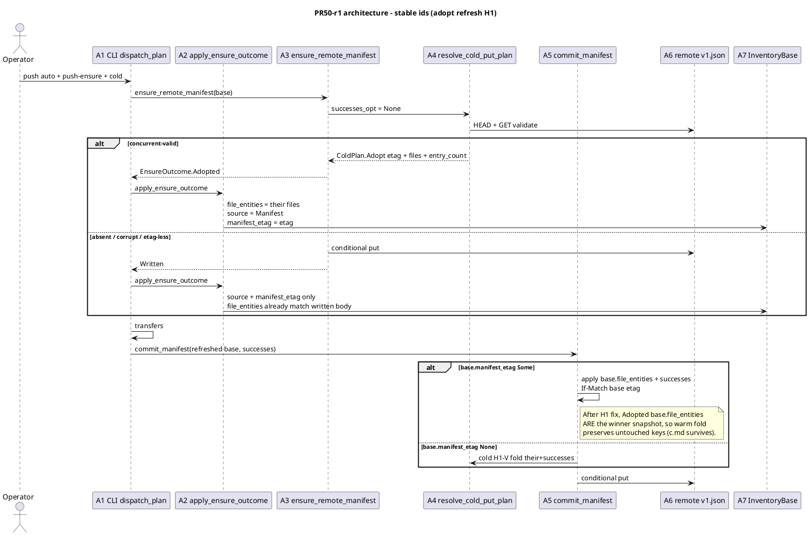
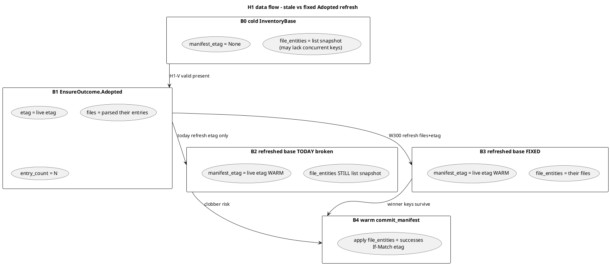
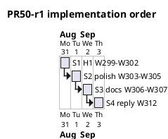

# PR 50 fix plan: review round 1 (comment 5476323432)

**Status:** ready to implement under **strict fine-grained TDD**
**PR:** https://github.com/tlkahn/vaultsync/pull/50 ("Issue 48: Push-time inventory bootstrap (C-PA)")
**Review comment:** https://github.com/tlkahn/vaultsync/pull/50#issuecomment-5476323432 (lgsunnyvale; severity-ordered; **H1 merge-gate**)
**Reviewed tip:** `aba739b` on `worktree-inventory-bootstrap-issue-48` (S1-S7 of issue 48; W263-W298)
**Work branch:** same PR branch; fixes land in place and update PR 50
**Reviewer verdict:** **request changes**. One **merge-blocking** correctness hole on the B1 Adopted success path (stale `file_entities` after warm refresh => final commit can clobber the winner's keys). Library H1-V cold commit, F2 split, B3 gates, and offline suite are otherwise strong.
**Work items:** continue the project W-series after issue #48 **W298**. This plan uses **W299-W312**.
**Planning file location:** authored at the repository-root planning path `doc/plans/pr-50-fix-5476323432.md` (this file). Keep an identical copy on the PR worktree branch under the same relative path (same convention as PR 46 / PR 41 / PR 39 fix plans). Landing this file on the branch is part of **W306** (with the cited issue-48 plan artifacts).

**Design refs:** issue #48, [doc/plans/issue-48-v2.md](issue-48-v2.md) (normative locks; IQ-refresh amended by this plan), [doc/plans/issue-48.md](issue-48.md) (v1 retained), review body 5476323432, [doc/inventory-manifest.md](../inventory-manifest.md) 7.4/7.7, [doc/cli.md](../cli.md) push-time bootstrap, PR 46 H1-V parent ([pr-46-fixes-5472028291-5472033449.md](pr-46-fixes-5472028291-5472033449.md)).

**Verified baseline (recorded at plan time):** tip `aba739b`. Gate on the PR worktree (re-confirm before W299):

```text
cargo test --offline --lib --bins  = 603 passed / 0 failed / 1 ignored
```

Reviewer also reported the suite green at review tip. Re-run clippy/fmt at first GREEN tip.

---

## Architecture overview

PR 50 already landed issue 48 S1-S7: shared `write_manifest_body`, H1-V cold `commit_manifest`, `ensure_remote_manifest` (`EnsureOutcome::{Written,Adopted,PreconditionFailed}`), `[inventory].bootstrap`, push B1 before transfers, `status --write-manifest`, and docs. This fix pass does **not** reopen B3 policy predicates, F2 abort/continue split, Q3/Q6, dry-run non-write, or the cold-commit H1-V fold (W291 stays).

The hole is a **refresh contract gap** on the Adopted success path: B1 correctly adopts (no put), CLI marks the base warm via etag only, and warm `commit_manifest` trusts stale cold `file_entities`. Fixing it is a narrow amendment of **IQ-refresh** so Adopted carries and installs the parsed file set before any final commit.

```plantuml
@startuml
title Component touch map PR50-r1

component "src/inventory.rs" as INV
component "src/cli.rs" as CLI
component "README.md" as README
component "doc/cli.md" as CLIDOC
component "doc/inventory-manifest.md" as INVDOC
component "doc/roadmap.md" as ROAD
component "doc/plans/issue-48-v2.md" as P48
component "doc/plans/pr-50-fix-5476323432.md" as P50

usecase "ColdPlan.Adopt + files" as U1
usecase "EnsureOutcome.Adopted + files" as U2
usecase "ensure maps Adopt files" as U3
usecase "head-size precheck in H1-V" as U4
usecase "write_manifest_body no clone" as U5
usecase "force arm Err not panic" as U6
usecase "apply_ensure_outcome helper" as U7
usecase "push/status call helper" as U8
usecase "race exit wording" as U9
usecase "IQ-refresh amendment" as U10
usecase "land plan artifacts" as U11

INV --> U1
INV --> U2
INV --> U3
INV --> U4
INV --> U5
INV --> U6
CLI --> U7
CLI --> U8
README --> U9
CLIDOC --> U9
INVDOC --> U10
P48 --> U10
ROAD --> U10
P48 --> U11
P50 --> U11
@enduml
```







| ID | Component | Role after this fix series |
| -- | --------- | -------------------------- |
| A1 | `src/cli.rs` `dispatch_plan` + status arm | Call shared refresh helper on Written/Adopted; push final commit sees complete base |
| A2 | `apply_ensure_outcome` (new, cli or inventory) | Single place: install etag/source; on Adopted also replace `file_entities` |
| A3 | `ensure_remote_manifest` | Return Adopted with parsed files (not only etag + count) |
| A4 | `resolve_cold_put_plan` | `ColdPlan::Adopt { etag, files, entry_count }`; optional head-size precheck (F1) |
| A5 | `commit_manifest` | **Unchanged algorithm**; becomes safe on Adopted because base files are complete |
| A6 | Remote `v1.json` | Authority unchanged; no new writer |
| A7 | `InventoryBase` | After Adopted refresh: warm + **their** file set |
| A8 | `write_manifest_body` | No forced `body.to_vec()` clone (F2) |
| A9 | Docs / plans | IQ-refresh amendment; README race split; land issue-48-v2 + this plan |

**Out of scope:** C-PB / #49 resume, `#42` plan progress, implementing status `--json` output, repair H1-V, changing F2 abort policy, N3 full test-double framework rewrite (optional later; not merge-bar).

---

## Finding disposition (comment 5476323432)

| Id | Severity | Finding | Disposition | W-items |
| -- | -------- | ------- | ----------- | ------- |
| **H1** | **Merge-blocking** | Adopted refresh warms etag only; warm final commit folds onto stale cold `file_entities` and can drop the winner's untouched keys | **Fix.** Carry adopted files on `ColdPlan::Adopt` + `EnsureOutcome::Adopted`; refresh `file_entities` on Written/Adopted install. Prefer carry-files over "leave cold" (keeps IQ-refresh / W278 one-fewer-HEAD). Amend IQ-refresh lock text. | **W299-W302** |
| **M1** | Medium | `doc/plans/issue-48-v2.md` cited as source of truth but not on the PR branch (untracked on main tree) | **Fix.** Commit `issue-48-v2.md` (+ v1 if linked; spike already on main as needed) and **this** fix plan onto the PR branch. | **W306** |
| **M2** | Medium / docs | README glues B1 PF abort (exit 1, no transfers) with final-commit Q2 (warn, exit 0) | **Fix.** Split the sentence; point at cli.md F2 table. | **W307** |
| **F1** | Low | H1-V validate probe skips warm load's head-size precheck; may stream up to soft cap | **Fix.** After HEAD in `resolve_cold_put_plan`, if `ent.size > MANIFEST_MAX_BYTES` treat as unusable (same Overwrite/heal as tripped writer) without GET body, or route through `head_then_get_manifest` shape. | **W303** |
| **F2** | Low | `write_manifest_body` always `body.to_vec()` | **Fix.** `Cursor::new(body)` over `&[u8]` (or take `Vec` by value once). | **W304** |
| **F3** | Low | Status mutates `inventory_base` dead; push/status duplicate match arms | **Fix with H1.** Shared `apply_ensure_outcome` (+ stderr print helper or return line kind). Status still prints plan from pre-B1 report; refresh remains correct for consistency and for any future post-status use. | **W301** (with H1 CLI) |
| **N1** | Nit | `ColdPlan::Adopt.etag: Option<String>` always `Some` | **Fix.** `etag: String` on Adopt (present+etag branch only). | **W305** |
| **N2** | Nit | repair force `unreachable!` on PreconditionFailed | **Fix.** Map to `Err(Error::PreconditionFailed(...))` or `Error::Other`. | **W305** |
| **N3** | Nit | Many near-duplicate `ObjectStore` test doubles | **Defer.** Record only; do not block merge. Optional follow-up if a later pin needs a new double. | **W312** record |
| **N4** | Nit | W278 pins Written->warm only; need Adopted->warm after H1 | **Fix.** CLI or library pin: Adopted refresh drives final commit retaining their keys (overlaps H1 RED; keep an explicit Adopted-named pin). | **W302** |
| **N5** | Nit | Decision log should note IQ-refresh amendment | **Fix.** Roadmap row + issue-48-v2 revision log. | **W306/W307** |

### Positives (no code action; acknowledge in W312 reply)

- H1-V cold `commit_manifest` + W291 their-keys pin is the right shape for the pre-existing blind-H1 hole.
- F2 split correctly implemented and tested (W276 abort, W277 continue, W284 status fail-closed, Q2 isolated via `bootstrap=Never`).
- Pure `should_push_b1` table; dry-run / never / list_head / warm / pull / default-status non-writes have teeth.
- Shared `write_manifest_body` with repair keeping retry/force/dry-run (F8); cache fill only on Written (W267).
- Honest TOCTOU adopt double (W296).
- cli.md + inventory-manifest 7.4/7.7 precise on H1-V / F2 / F4 / F6 / D-json.

---

## Scope decisions (locked for this fix series)

| ID | Question | Decision |
| -- | -------- | -------- |
| R50-h1-shape | How to make Adopted+commit safe? | **Carry adopted files** on the outcome and install them into `InventoryBase.file_entities` during refresh. Do **not** leave the base cold after Adopt (that would re-pay HEAD+GET and weaken W278). Do **not** re-GET inside `commit_manifest` when warm. |
| R50-h1-api | API shape | `ColdPlan::Adopt { etag: String, files: Vec<Entity>, entry_count: usize }` and `EnsureOutcome::Adopted { etag: Option<String>, files: Vec<Entity>, entry_count: usize }`. `etag` on EnsureOutcome stays `Option` for symmetry with Written (N5); ColdPlan Adopt uses `String` because the branch is present+etag only (N1). |
| R50-h1-entry-count | Source of N | Keep `entry_count` from parsed `their.entries.len()` (validated body). `files.len()` must equal `entry_count` after `manifest_to_file_entities` (assert in debug/test; production trusts codec). |
| R50-h1-written | Written refresh | Still etag/source only. `file_entities` already equal the body B1 wrote (`base.file_entities`). No need to return files on Written. |
| R50-h1-status | Status refresh | Still apply the same helper (F3). No final commit on status; correctness win is shared code + future-proofing. |
| R50-h1-alt-rejected | Leave-cold alternative | Rejected as primary fix. Allowed only as emergency fallback if carrying files proves invasive - it is not invasive. |
| R50-iq-refresh | Lock amendment | IQ-refresh becomes: after Written => set `source=Manifest{remote_etag}` + `manifest_etag=etag`; after Adopted => **also** `file_entities = adopted.files`. Document in issue-48-v2 revision log + inventory-manifest 7.7 + roadmap. |
| R50-f1-cap | Head-size on H1-V | After successful HEAD with etag, if `ent.size > MANIFEST_MAX_BYTES` => treat as invalid/unusable => `ColdPlan::Overwrite` with `apply_base` + live etag (B1 heal / commit heal). **No GET.** Same outcome family as tripped writer. Do not fail the whole ensure with Err solely for over-cap (heal is available). |
| R50-f2-cursor | Body clone | Prefer `Cursor::new(body)` where `body: &[u8]` and the store reads synchronously within the call. If a store impl requires `'static` or owned Read, take `body: Vec<u8>` by value once at the helper boundary (callers already have a Vec from serialize) - **no second clone inside**. |
| R50-f3-helper | Helper location | Prefer `pub(crate) fn apply_ensure_outcome(base: &mut InventoryBase, outcome: &EnsureOutcome) -> EnsureApply` in `inventory.rs` (pure, unit-testable) plus a thin CLI stderr printer; or one CLI private fn if inventory coupling feels wrong. **Locked preference:** pure inventory apply + CLI prints lines (library does not write stderr). |
| R50-f3-apply-enum | Apply result | Small enum or struct: `AppliedWritten { entry_count }`, `AppliedAdopted { entry_count }`, and callers map PreconditionFailed/Err before calling apply. Apply only sees success outcomes (Written/Adopted). |
| R50-m1-files | Which plan files land | On the PR branch: `doc/plans/issue-48-v2.md` (required), `doc/plans/issue-48.md` (v1 cross-ref; land if not already), `doc/plans/pr-50-fix-5476323432.md` (this file). Spike only if issue body links break without it (check; main may already have `doc/spikes/inventory-bootstrap-ideation.md`). |
| R50-n3 | Test double sprawl | **No rewrite** in this series. |
| R50-merge-bar | What blocks merge / re-review | **H1 (W299-W302) + M1 (W306) + M2 (W307).** F1/F2/N1/N2 preferred same PR while hot. N3 deferred. |
| R50-tdd | Method | **Strict fine-grained TDD** per [Method](#method-strict-fine-grained-tdd). One behavior per W-item where practical; RED before GREEN; mutation-check on safety pins; offline gate after every GREEN tip. |
| R50-deps | New crates | **None.** |
| R50-production-files | Primary edit surfaces | `src/inventory.rs`, `src/cli.rs`, `README.md`, `doc/cli.md`, `doc/inventory-manifest.md`, `doc/roadmap.md`, `doc/plans/issue-48-v2.md`, this plan. |

---

## Method: strict fine-grained TDD

Every behavior-facing change follows:

1. **RED** - write or extend the exposing test first. Run it. Observe the expected failure (assertion or compile) *before* production code changes when production must change. Record the failing assertion text in the commit body.
2. **GREEN** - smallest production change that turns that cycle's pins green.
3. **REFACTOR** - behavior-preserving cleanup only under green; no behavior change without a new RED.
4. Do **not** push a RED tree to the PR tip. A single commit may contain RED-verified tests plus the GREEN implementation, with local RED observations recorded in the commit message (same convention as PR 46 / issue 48).
5. **Characterization pins** for already-correct behavior: write the test first, confirm **GREEN on arrival**, then **mutation-check** (temporarily break the production path, observe RED, revert). Record "characterization: GREEN on arrival; mutation-checked: \<break\> re-fails \<assert\>; reverted" in the commit body.
6. Docs-only / plan-status / review-reply changes have no artificial RED; they land under the all-green gate.

Per-cycle gate (every commit tip):

```bash
cargo test --offline --lib --bins
cargo fmt --check
# at least once before re-review request:
cargo clippy --all-targets -- -D warnings
```

Commit message shape: `test|fix|refactor|docs: [50/48] <summary> (Wnnn)` with RED evidence in the body when applicable.

---

## Work items

### W299 - H1 RED: Adopted base + stale files + commit must keep winner keys

**Goal:** Expose H1 with a failing pin before any production API change.

**Where:** `src/inventory.rs` `mod tests` (library pin preferred: precise, no CLI TOCTOU noise).

**TDD cycle:**

1. **RED** - add `commit_after_adopted_refresh_keeps_their_untouched_keys` (name indicative):
   - Build live valid manifest body with keys `{a.md, c.md}` (c is the winner-only key); put at `MANIFEST_KEY`; capture `their_etag`.
   - Cold stale base: `InventoryBase { source: LiveListHead, file_entities: [a.md only], manifest_etag: None }`.
   - `ensure_remote_manifest` => must be `Adopted` (existing W268 behavior); today outcome has no files field - test will drive the API.
   - **Simulate production refresh as it exists today** (etag/source only) in a local block *or* call a not-yet-complete helper:
     - `base.source = Manifest { remote_etag: etag.clone() }`
     - `base.manifest_etag = etag`
     - **do not** replace `file_entities` (today's bug).
   - `commit_manifest(&store, &base, &[Upload(a.md')], None)`.
   - **Assert** `CommitOutcome::Written` and parsed live body keys == `{a.md, c.md}` (order-stable via codec sort).
   - Today under warm fold `apply([a], [Upload(a')])` the live body becomes `{a.md}` only => **assertion fails** (c.md missing). That is the RED.
2. Optional companion assertion: `entry_count == 2` on Written.
3. Run the new test; record failing assertion (`keys` missing `c.md` or `entry_count`).
4. **Do not** ship a red tip: pair with W300 in one commit if needed; keep logical RED-then-GREEN in the commit body.

**Mutation-check (after GREEN):** temporarily restore etag-only refresh in the test's "production refresh" path or break the new files install; watch `c.md` disappear; revert.

**Gate:** offline green after W300; this item alone is RED by design.

**Commit:** `test: [50/48] adopt refresh stale files clobber pin (W299)` (or combined W299-W300).

---

### W300 - H1 GREEN: Adopt carries files; ensure maps them

**Goal:** Adopted outcome includes the parsed file set so refresh can install a complete warm base.

**Where:** `src/inventory.rs` - `ColdPlan`, `resolve_cold_put_plan`, `EnsureOutcome`, `ensure_remote_manifest`, existing adopt tests.

**Production change (smallest):**

```text
ColdPlan::Adopt {
  etag: String,              # N1: was Option
  files: Vec<Entity>,        # NEW - from manifest_to_file_entities(&their)
  entry_count: usize,
}

EnsureOutcome::Adopted {
  etag: Option<String>,
  files: Vec<Entity>,        # NEW
  entry_count: usize,
}

# resolve valid + successes_opt None:
let files = manifest_to_file_entities(&their).expect("parsed maps cleanly");
ColdPlan::Adopt {
  etag: live_etag,
  files,
  entry_count: their.entries.len(),
}

# ensure:
ColdPlan::Adopt { etag, files, entry_count } =>
  Ok(EnsureOutcome::Adopted {
    etag: Some(etag),
    files,
    entry_count,
  })
```

**Update existing tests** that match on `Adopted { etag, entry_count }` to bind/ignore `files` (`..` or explicit). Strengthen W268 `ensure_adopts_concurrent_valid_with_zero_puts` to assert `files` keys == `{b.md}` (their body).

**TDD:** W299 pin goes GREEN when a **correct** refresh uses `files` (implement refresh in W300 test helper inline, or land `apply_ensure_outcome` here if small). Prefer:

- W300: API + ensure mapping + library pin uses correct refresh inline
- W301: production CLI calls shared helper

**Mutation-check:** drop `files` install in the pin's refresh => c.md lost => RED; restore.

**Gate:** offline green; W268/W267/W296 compile; W299 pin green.

**Commit:** `fix: [50/48] Adopted carries files for safe warm refresh (W300)`

---

### W301 - H1/F3 GREEN: `apply_ensure_outcome` + CLI push/status use it

**Goal:** One production refresh path; push final commit sees adopted files; status/push arms stop diverging.

**Where:** `src/inventory.rs` (pure apply) + `src/cli.rs` (push B1 arm + status `--write-manifest` arm).

**API sketch (normative):**

```text
pub enum EnsureApply {
  Written { entry_count: usize },
  Adopted { entry_count: usize },
}

pub fn apply_ensure_outcome(base: &mut InventoryBase, outcome: &EnsureOutcome) -> Option<EnsureApply> {
  match outcome {
    EnsureOutcome::Written { etag, entry_count } => {
      base.source = InventorySource::Manifest { remote_etag: etag.clone() };
      base.manifest_etag = etag.clone();
      // file_entities unchanged (already the written snapshot)
      Some(EnsureApply::Written { entry_count: *entry_count })
    }
    EnsureOutcome::Adopted { etag, files, entry_count } => {
      base.file_entities = files.clone();
      base.source = InventorySource::Manifest { remote_etag: etag.clone() };
      base.manifest_etag = etag.clone();
      Some(EnsureApply::Adopted { entry_count: *entry_count })
    }
    EnsureOutcome::PreconditionFailed => None,
  }
}
```

CLI:

```text
match ensure_remote_manifest(...) {
  Ok(outcome @ EnsureOutcome::Written { .. } | outcome @ EnsureOutcome::Adopted { .. }) => {
    match apply_ensure_outcome(&mut inventory_base, &outcome).expect("success outcome") {
      EnsureApply::Written { entry_count } => writeln!(err, "inventory: manifest bootstrap written ({entry_count} entries)"),
      EnsureApply::Adopted { entry_count } => writeln!(err, "inventory: manifest bootstrap adopted (already present, {entry_count} entries)"),
    }
  }
  Ok(PreconditionFailed) => { ... existing abort/exit ... }
  Err(e) => { ... existing F2 split ... }
}
```

Locked stderr substrings **unchanged**.

**TDD:**

1. **RED/characterize** - unit test `apply_ensure_outcome_adopted_replaces_file_entities`:
   - base files `[a]`, outcome Adopted with files `[a,c]` + etag
   - after apply: `file_entities` keys `{a,c}`, `manifest_etag == etag`, source Manifest
2. **RED/characterize** - `apply_ensure_outcome_written_preserves_file_entities`:
   - base files `[a,b]`, Written with new etag
   - files unchanged; etag/source updated
3. **GREEN** - implement apply; rewire both CLI arms; delete duplicated match bodies.
4. Existing CLI pins (W271, W272, W296, W281, ...) stay green without string changes.

**Gate:** offline green.

**Commit:** `fix: [50/48] apply_ensure_outcome shared refresh (W301)`

---

### W302 - N4/H1 CLI pin: Adopted refresh drives final commit keeping their keys

**Goal:** End-to-end pin so push path cannot regress to etag-only refresh.

**Where:** `src/cli.rs` `mod tests`.

**TDD cycle:**

1. **RED (expect GREEN if W299-W301 done; else fails):** `push_adopted_refresh_keeps_concurrent_keys_on_commit`:
   - Store double or seeded MemoryStore:
     - Remote bodies optional; valid manifest at `MANIFEST_KEY` with `{b.md, c.md}` (or `{a.md, c.md}`).
     - Force cold eligibility: TOCTOU first-head NotFound pattern (reuse `TofuAdoptStore` idea) **or** start with corrupt manifest that becomes valid before B1 - simplest honest path: TOCTOU head once NotFound, list empty or list without `c.md` if c exists only in manifest... **Careful:** if `c.md` is only in the manifest and not as a body, list+head will not show it - that is exactly the stale-base scenario.
   - Locked scenario:
     - Live manifest entries: `a.md`, `c.md` (c has no requirement to be listed if list is independent - for MemoryStore list returns put keys; put manifest only + put `a.md` body so list is `{a.md}` + manifest key filtered).
     - Local vault: `a.md` newer content so push uploads `a.md`.
     - First MANIFEST head NotFound => cold load lists `{a.md}` only => stale vs manifest `{a.md,c.md}`.
     - Later heads see valid manifest => B1 Adopted.
   - Assert stderr has `manifest bootstrap adopted`.
   - Assert exit 0.
   - Assert live manifest after push parses with **both** `a.md` and `c.md`.
2. Mutation-check: in apply, skip `file_entities = files` => pin loses `c.md` => RED; restore.

**Gate:** offline green.

**Commit:** `test: [50/48] push adopt refresh keeps their keys (W302)`

---

### W303 - F1: head-size precheck on H1-V present branch

**Goal:** Oversized present object does not stream up to the soft cap on every B1/cold commit validate.

**Where:** `src/inventory.rs` `resolve_cold_put_plan`.

**TDD cycle:**

1. **RED** - `resolve_or_ensure_oversize_present_skips_body_get` (library):
   - Custom store: `head(MANIFEST_KEY)` returns ok entity with `size = MANIFEST_MAX_BYTES + 1` and some etag; `get_to` **panics** or counts gets.
   - Cold base with one file; `ensure_remote_manifest` or `resolve_cold_put_plan(..., None)`.
   - Assert: no get (counter 0), outcome is Written heal (Overwrite path) **or** plan is Overwrite - not panic, not Adopted.
2. **GREEN** - after HEAD ok with etag, if `ent.size > MANIFEST_MAX_BYTES` => `ColdPlan::Overwrite { files: apply_base(...), etag: live_etag }` without GET.
3. Characterization: under-cap corrupt still GETs and heals (existing W265).

**Note:** head.size is advisory on some backends; keep CappedWriter belt-and-braces on the GET path when size is unknown/lying.

**Gate:** offline green.

**Commit:** `fix: [50/48] H1-V head-size precheck before validate GET (W303)`

---

### W304 - F2: `write_manifest_body` drops forced clone

**Goal:** Single body buffer per put attempt.

**Where:** `src/inventory.rs` `write_manifest_body`.

**TDD cycle:**

1. No new behavior pin required (characterization). Optionally assert existing commit/repair/ensure cache pins still green.
2. **GREEN** - change signature usage to avoid `body.to_vec()`:
   - Preferred: `let mut cursor = std::io::Cursor::new(body);` with `body: &[u8]` (Cursor implements Read over `&[u8]`).
   - Confirm `put_from_with` only reads within the call (all in-tree stores do).
3. **REFACTOR** under green only.

**Gate:** offline green; clippy clean.

**Commit:** `refactor: [50/48] write_manifest_body no body clone (W304)`

---

### W305 - N1 + N2: Adopt etag `String`; repair force no `unreachable!`

**Goal:** Close two nits while touching adjacent arms.

**Where:** `src/inventory.rs` (`ColdPlan::Adopt`, force repair arm).

**TDD cycle:**

1. **N1** - compile-driven after W300; any remaining `Some(live_etag)` constructors become bare `live_etag`. Tests update.
2. **N2 RED/characterize** - optional unit: store that returns `PreconditionFailed` on unconditional put; `repair_manifest(..., force: true)` must return `Err`, not panic. Today `unreachable!` panics.
3. **GREEN** - replace unreachable with:
   ```text
   WriteBodyOutcome::PreconditionFailed => Err(Error::PreconditionFailed(
     format!("unexpected precondition failure on force put of {}", MANIFEST_KEY),
   ))
   ```

**Gate:** offline green.

**Commit:** `fix: [50/48] Adopt etag String + force put no panic (W305)`

---

### W306 - M1 + N5: land plan artifacts; amend IQ-refresh in issue-48-v2

**Goal:** Cited source-of-truth paths exist on the PR branch; IQ-refresh lock matches code.

**Where:** `doc/plans/issue-48-v2.md`, `doc/plans/issue-48.md` (if missing on branch), `doc/plans/pr-50-fix-5476323432.md` (this file), optionally spike if links 404 on the branch.

**Docs changes (issue-48-v2):**

1. IQ-refresh row: after Adopted, refresh **`file_entities` from the adopted snapshot** in addition to source + etag.
2. D-ensure-outcome: Adopted fields include `files: Vec<Entity>` (or equivalent).
3. D-commit-when: "refreshed base" means complete file set after Adopted.
4. Revision log entry: `2026-08-31 | v2.1 PR50-r1 5476323432: IQ-refresh carries adopted files (H1)`.
5. Acceptance: add A24 (or amend A18) - Adopted + mutations retains winner untouched keys on final commit.

**Also:** copy/ensure this fix plan file is on the branch at `doc/plans/pr-50-fix-5476323432.md`.

**TDD:** docs-only; all-green gate; no code RED.

**Commit:** `docs: [50/48] land plans + IQ-refresh adopted files (W306)`

---

### W307 - M2 + docs honesty: README race split; inventory-manifest 7.7; roadmap row

**Goal:** Operators are not told B1 lost-race exits 0.

**Where:** `README.md`, `doc/inventory-manifest.md` 7.7 (if refresh text incomplete), `doc/roadmap.md` decision log, light `doc/cli.md` touch only if a cross-link helps.

**README replacement shape (normative intent, not exact bytes):**

```text
... A B1 lost conditional race aborts the push before transfers (exit 1; F2/F0).
A lost race on the final manifest commit warns (`manifest not committed... run
vaultsync repair if status looks wrong`) and exits 0 when the transfers
succeeded (Q2). ...
```

**Roadmap:** new decision-log row `PR50-r1` summarizing H1 adopt-files refresh + F1/F2/F3 nits disposition (pointer to this plan).

**inventory-manifest 7.7:** state explicitly that after Adopted the in-memory base file set becomes the adopted snapshot before transfers/final commit.

**Gate:** all-green.

**Commit:** `docs: [50/48] README F2 race split + roadmap PR50-r1 (W307)`

---

### W308-W311 - reserved / optional split points

Use only if a commit needs splitting for review clarity:

| Id | Use when |
| -- | -------- |
| W308 | Split W301 if apply helper and CLI rewire are large |
| W309 | Split W302 if TOCTOU store needs its own refactor commit |
| W310 | Extra docs pass (cli.md only) if W307 overflows |
| W311 | Clippy/fmt drive-bys discovered mid-series |

Do **not** invent work to fill these numbers.

---

### W312 - Review reply + plan status

**Goal:** Close the loop on comment 5476323432.

**Where:** GitHub PR comment (developer capacity `tlkahn`), this plan status line, optional short checklist in the reply.

**Reply contents (draft outline):**

1. Verdict response: H1 fixed by carrying adopted files + shared `apply_ensure_outcome`; pin W299/W302 mutation-checked.
2. M1: plans landed on branch at cited paths.
3. M2: README split done.
4. F1-F3 / N1-N2: done or explicitly deferred (N3 deferred with rationale).
5. Gate numbers at re-review tip.
6. Ask lgsunnyvale for re-review.

**Commit:** `docs: [50] pr-50-fix plan status implemented (W312)` if status flips in-tree; PR comment is not a git commit.

**Plan status field:** set to `implemented (W299-W307 ...; tip <sha>)` when merge bar is green.

---

## Implementation sequence (S-phases)

Execute in order (not raw numeric when noted):

| Phase | Items | Exit criteria |
| ----- | ----- | ------------- |
| **S1 H1 core** | W299 -> W300 -> W301 -> W302 | Adopted+commit cannot clobber; CLI shared refresh; offline green |
| **S2 polish** | W303 -> W304 -> W305 | head-size precheck; no body clone; nits N1/N2 |
| **S3 docs/plans** | W306 -> W307 | plans on branch; IQ-refresh amended; README F2 honest; roadmap row |
| **S4 close** | W312 | review reply; plan status implemented |

S1 is the merge bar with S3 M1/M2. S2 should ride along while hot unless a cycle explodes.



---

## Acceptance checklist (re-review bar)

| Id | Check | W |
| -- | ----- | -- |
| A-H1 | Library pin: adopt + stale list base + upload + commit retains winner-only key | W299/W300 |
| A-H1c | CLI pin: push Adopted path final manifest retains concurrent key | W302 |
| A-H1m | Mutation-check recorded: drop files install => pin RED | W300/W302 |
| A-F3 | Push and status both call `apply_ensure_outcome`; locked stderr substrings unchanged | W301 |
| A-F1 | Oversize head.size => no get_to on validate path | W303 |
| A-F2 | `write_manifest_body` has no `to_vec` clone on the happy path | W304 |
| A-N1 | `ColdPlan::Adopt.etag` is `String` | W305 |
| A-N2 | force repair + PF store returns Err, does not panic | W305 |
| A-M1 | `doc/plans/issue-48-v2.md` and this plan exist on the PR branch | W306 |
| A-M2 | README does not claim bootstrap lost-race exits 0 | W307 |
| A-IQ | issue-48-v2 IQ-refresh text requires adopted `file_entities` install | W306 |
| A-gate | `cargo test --offline --lib --bins` green; clippy `-D warnings`; fmt clean | each tip |

---

## Risk table

| Risk | Mitigation |
| ---- | ---------- |
| Cloning `files` on every apply (large vaults) | Accept one Vec clone per Adopted refresh (rare vs list+head cost). Could `std::mem::take` if EnsureOutcome is owned by match - prefer owned outcome consume: `apply_ensure_outcome(base, outcome: EnsureOutcome)` taking ownership to move files without clone. **Locked preference:** take `EnsureOutcome` by value in apply to move `files`. |
| Status refresh still "dead" for plan output | Accepted; shared helper is the win (F3). |
| head.size lying low then huge body | CappedWriter remains on GET path. |
| EnsureOutcome PartialEq + files makes test equality noisy | Compare fields explicitly or use `matches!` with `..`. |
| W296 TOCTOU store + W302 scenario interaction | Prefer distinct test names; share store helper only if stable. |
| Plan file drift main tree vs worktree | W306 commits from the worktree; root `~/Projects/vaultsync/doc/plans/` is the authoring path - copy onto branch. |

---

## Commit stacking (preferred)

```text
test/fix: [50/48] adopt refresh keeps winner keys (W299-W300)
fix:      [50/48] apply_ensure_outcome shared refresh (W301)
test:      [50/48] push adopt refresh keeps their keys (W302)
fix:      [50/48] H1-V head-size precheck (W303)
refactor:  [50/48] write_manifest_body no clone (W304)
fix:      [50/48] Adopt etag String + force no panic (W305)
docs:      [50/48] land plans + IQ-refresh adopted files (W306)
docs:      [50/48] README F2 race split + roadmap PR50-r1 (W307)
docs:      [50]    plan status implemented (W312)   # optional in-tree
```

Collapse W299-W300 if needed to keep the PR tip green. Do not collapse H1 with docs.

---

## Revision log

| Date | Change |
| ---- | ------ |
| 2026-08-31 | Initial plan from review 5476323432: H1 adopt-files refresh (W299-W302), F1-F3, N1-N2, M1-M2, N3 defer, strict TDD, plantUML architecture. W-series W299-W312. |
