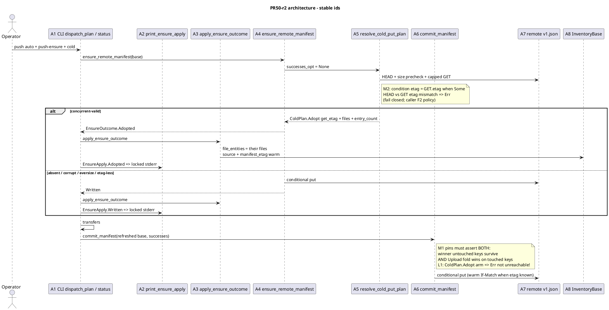
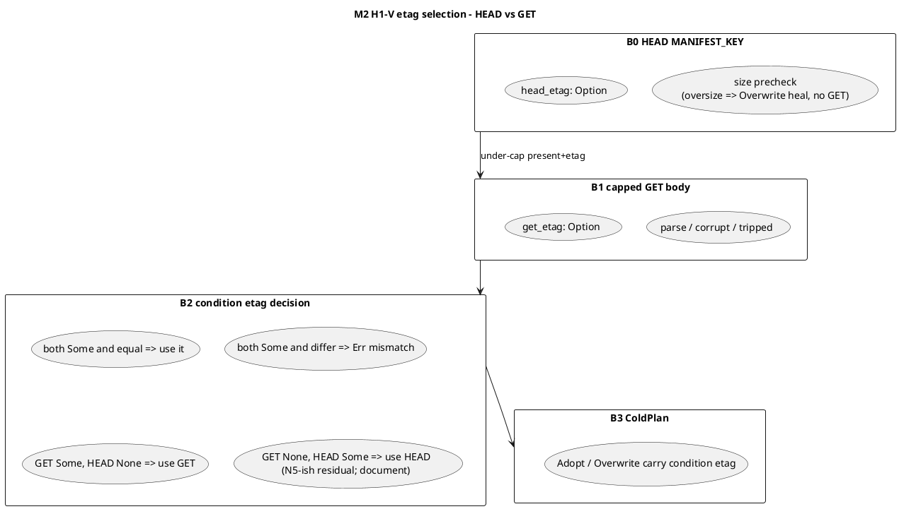
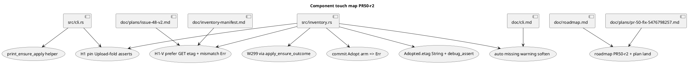
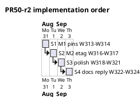

# PR 50 fix plan: review round 2 (comment 5476798257)

**Status:** planned
**PR:** https://github.com/tlkahn/vaultsync/pull/50 ("Issue 48: Push-time inventory bootstrap (C-PA)")
**Review comment:** https://github.com/tlkahn/vaultsync/pull/50#issuecomment-5476798257 (lgsunnyvale; round 2; **approve** with non-blocking findings)
**Reviewed tip:** `325c436` on `worktree-inventory-bootstrap-issue-48` (issue 48 S1-S7 + PR50-r1 W299-W312)
**Work branch:** same PR branch; fixes land in place and update PR 50 (or a fast follow if already merging - prefer same PR while hot)
**Reviewer verdict:** **approve.** Round-1 merge bar met. No new merge-blocking correctness hole. Remaining items are pin-strength, defense-in-depth, and polish.
**Work items:** continue the project W-series after PR50-r1 **W312**. This plan uses **W313-W324**.
**Planning file location:** authored at the repository-root planning path `doc/plans/pr-50-fix-5476798257.md` (this file). Keep an identical copy on the PR worktree branch under the same relative path (same convention as PR50-r1 / PR 46 / PR 41). Landing this file on the branch is part of **W322**.

**Design refs:** issue #48, [doc/plans/issue-48-v2.md](issue-48-v2.md) (normative locks; IQ-refresh already amended by PR50-r1), [doc/plans/pr-50-fix-5476323432.md](pr-50-fix-5476323432.md) (r1 parent), review body 5476798257, [doc/inventory-manifest.md](../inventory-manifest.md) 7.4/7.7, [doc/cli.md](../cli.md) push-time bootstrap.

**Verified baseline (recorded at plan time):** tip `325c436`. Gate on the PR worktree (re-confirm before W313):

```text
cargo test --offline --lib --bins  = 610 passed / 0 failed / 1 ignored
cargo clippy --all-targets -- -D warnings  = clean
cargo fmt --check  = clean
```

Reviewer reported the same gate at review tip. Re-run clippy/fmt at first GREEN tip of this series.

---

## Architecture overview

PR 50 already shipped issue 48 C-PA and closed the r1 merge-gate (Adopted refresh installs the winner file set via `apply_ensure_outcome`). Round 2 does **not** reopen B3 policy, F2 abort/continue, Q3/Q6, dry-run non-write, H1 carry-files shape, or cold-commit H1-V fold (W291).

This series tightens three surfaces:

1. **Pin fidelity (M1):** the H1 pins lock "their untouched keys survive" but not "our Upload fold wins on touched keys." Strengthen W299/W302 and route the library pin through production `apply_ensure_outcome`.
2. **H1-V etag hygiene (M2):** `resolve_cold_put_plan` pairs the HEAD etag with the GET body while the warm load path trusts the GET entity etag. Prefer GET etag; fail closed on HEAD/GET etag mismatch.
3. **Hardening / polish (L1, L2, nits):** commit Adopt arm no panic; auto-missing warning matches post-48 bootstrap language; `EnsureOutcome::Adopted.etag: String`; shared stderr printer for `EnsureApply`; `debug_assert` on files/count; this plan on branch + roadmap row.







| ID | Component | Role after this fix series |
| -- | --------- | -------------------------- |
| A1 | `src/cli.rs` push B1 + status `--write-manifest` | Call shared `print_ensure_apply` after `apply_ensure_outcome`; locked stderr substrings unchanged |
| A2 | `print_ensure_apply` (new, CLI private) | Single place for Written/Adopted bootstrap lines (finishes r1 F3) |
| A3 | `apply_ensure_outcome` | Unchanged algorithm; W299 library pin must call it; `debug_assert` files/count on Adopted |
| A4 | `ensure_remote_manifest` | Map `ColdPlan::Adopt.etag: String` through; `EnsureOutcome::Adopted.etag` becomes `String` (N1) |
| A5 | `resolve_cold_put_plan` | M2: condition etag from GET when present; HEAD/GET mismatch => `Err`; oversize/pre-GET path still HEAD etag |
| A6 | `commit_manifest` | L1: `ColdPlan::Adopt` => `Err(Error::Other(...))`, never `unreachable!` |
| A7 | Remote `v1.json` | Authority unchanged; no new writer policy |
| A8 | `InventoryBase` | Unchanged post-r1 contract |
| A9 | Auto missing warning | Softened post-48 wording; pin `auto_missing_manifest_warning_names_absent` stays honest |
| A10 | Docs / plans | D-h1v etag note; roadmap PR50-r2; this plan on branch |

**Out of scope:** C-PB / #49 resume, `#42` plan progress, implementing status `--json` output, repair H1-V, changing F2 abort policy, full ObjectStore test-double framework rewrite (r1 N3 / r2 N5 - still deferred), reopening r1 H1 carry-files design.

---

## Finding disposition (comment 5476798257)

| Id | Severity | Finding | Disposition | W-items |
| -- | -------- | ------- | ----------- | ------- |
| **M1** | Medium (non-blocking) | H1 pins W299/W302 lock "c.md survives" but not "Upload(a') folded"; W299 hand-rolls refresh instead of `apply_ensure_outcome` | **Fix.** Assert touched-key size/mtime (and CLI size) after commit; route W299 through `apply_ensure_outcome`. Mutation-check: skip `apply_commit_mutations` on warm path (or write pure adopted body) => pin RED. | **W313-W315** |
| **M2** | Medium/low (non-blocking) | H1-V uses HEAD etag and discards GET entity etag; warm load uses GET etag | **Fix.** Prefer GET etag when `Some`; if HEAD and GET etags both `Some` and differ => fail closed `Err` (caller F2 policy). Document residual when GET etag is None. Optional: note in inventory-manifest 7.4/7.7. Do **not** require full `head_then_get_manifest` merge this series (keep oversize precheck + capped GET as today; etag selection is the behavior change). | **W316-W317** |
| **L1** | Low | `commit_manifest` `unreachable!` on `ColdPlan::Adopt` | **Fix.** Map to `Err(Error::Other(...))` with a stable internal message. No panic after transfers. | **W318** |
| **L2** | Low | Auto missing warning still says "next push will create one" | **Fix.** Soften to post-48 language (create **or** adopt / ensure; bootstrap=never may not write on zero-mutation). Update `auto_missing_manifest_warning_names_absent` expectations. | **W319** |
| **N1** | Nit | `EnsureOutcome::Adopted.etag: Option<String>` always `Some` while `ColdPlan::Adopt.etag: String` | **Fix.** `Adopted.etag: String`; apply sets `manifest_etag = Some(etag)`. Written stays `Option` (etag-less Written path). | **W320** |
| **N2** | Nit | Push/status still duplicate Written/Adopted stderr match arms | **Fix.** Private `print_ensure_apply(err, EnsureApply)` in `cli.rs`; both arms call it. Locked substrings unchanged (existing W271/W272/W296/W281 pins stay green without string edits). | **W321** |
| **N3** | Nit | r1 fix-plan status banner cites tip `00d034c` vs `325c436` | **No edit required for correctness.** Optionally one-line tip fix on `pr-50-fix-5476323432.md` when touching docs; do not churn r1 plan otherwise. | **W322** optional |
| **N4** | Nit | `files.len() == entry_count` documented but no `debug_assert` | **Fix.** `debug_assert_eq!` at Adopt construct site in `resolve_cold_put_plan` and/or in `apply_ensure_outcome` Adopted arm. | **W320** (with N1) |
| **N5** | Nit | ObjectStore test-double soup / `AdoptRefreshStore` ~ `TofuAdoptStore` | **Defer.** Same as r1 N3. Record only. | **W324** record |

### Positives (no code action; acknowledge in W324 reply)

- r1 H1 carry-files + shared `apply_ensure_outcome` is the right lock-compatible shape; F1 claim holds for the full push pipeline.
- F2 split still has teeth after the refresh refactor (W276/W277/W284/Q2).
- Docs caught up (issue-48-v2 IQ-refresh/A24, inventory-manifest 7.7, README race split, roadmap PR50-r1).
- W303 oversize precheck + N2 force-put Err mapping landed cleanly.
- Offline gate 610 / clippy / fmt green at approve tip.

---

## Scope decisions (locked for this fix series)

| ID | Question | Decision |
| -- | -------- | -------- |
| R50r2-m1-assert | What must H1 pins assert beyond keys? | **Both halves of the fold:** (1) winner untouched key survives (`c.md` present); (2) our success wins on the touched key (`a.md` size/mtime from Upload / local body). W299: `size == 6`, `mtime_ms == Some(6)`. W302: `a.md` size == `b"newer-content".len() as u64` (mtime optional if executor mtime is wall-clock-flaky - prefer size). |
| R50r2-m1-w299-path | How does W299 refresh? | **Must call** `apply_ensure_outcome(&mut base, outcome)` on the real `EnsureOutcome::Adopted` from `ensure_remote_manifest`. Delete the hand-rolled source/etag/files install in that test. |
| R50r2-m1-mutation | Mutation-check for Upload-fold half | After GREEN: temporarily change warm `commit_manifest` to `let files = base.file_entities.clone();` (skip `apply_commit_mutations`) **or** in the test-only sense break the pin's expected size; observe W313/W314 RED on size assert; revert. Record in commit body. Do **not** leave the skip in tree. |
| R50r2-m2-etag | Which etag conditions Adopt/Overwrite after GET? | **Prefer GET entity etag when `Some`.** If HEAD etag and GET etag are both `Some` and **differ** => `Err(Error::Other(...))` fail closed (message names HEAD/GET mismatch + retry). If GET etag is `None` and HEAD was `Some` => use HEAD etag (residual etag-less-GET backend; document one line in code comment + optional inventory-manifest). Oversize path (no GET) still uses HEAD etag. |
| R50r2-m2-helper | Reuse `head_then_get_manifest`? | **Not required this series.** Keep resolve's own HEAD + size precheck + capped GET. Etag selection is the behavior change. A later refactor may unify helpers under green. |
| R50r2-m2-policy | Mismatch is Err not heal | **Err.** B1 push => F2 warn+continue cold; B1 status => exit 1; cold commit => existing commit Err warn arm. Do not If-Match a mixed pair. |
| R50r2-l1-shape | Adopt arm in commit | **`return Err(Error::Other("internal: commit cold resolve returned Adopt; please retry".into()))`** (or equivalent stable substring `commit cold resolve returned Adopt`). Never `unreachable!`. |
| R50r2-l1-tdd | How to RED L1? | **No artificial RED.** Arm is unreachable by construction today (`successes_opt: Some` never returns Adopt; empty successes return before resolve). Hardening under all-green gate + code inspection; existing commit pins stay green. Same method exception family as docs-only. |
| R50r2-l2-string | New auto missing warning | Locked intent (exact bytes may match style of neighboring warnings): `inventory manifest missing; falling back to list+head (next push may ensure a manifest via bootstrap or commit, or run vaultsync repair)`. Must still contain `missing`, must not say `corrupt`/`invalid`, must still mention `push` (existing pin). Drop the unconditional "will create one". |
| R50r2-n1-etag | Adopted.etag type | **`String`**. Construct site: move from `ColdPlan::Adopt.etag`. `apply_ensure_outcome`: `manifest_etag = Some(etag.clone())`, `source = Manifest { remote_etag: Some(etag) }`. |
| R50r2-n2-print | Stderr helper location | **CLI private** `fn print_ensure_apply(err: &mut dyn Write, apply: EnsureApply)` - library never writes stderr (existing rule). |
| R50r2-n4-assert | debug_assert sites | At least one of: (a) after `manifest_to_file_entities` in Adopt construct; (b) Adopted arm of `apply_ensure_outcome`. Prefer **both** (cheap). |
| R50r2-n5 | Test doubles | **No rewrite.** |
| R50r2-merge-bar | What this series requires before "r2 findings closed" | **M1 (W313-W315) + M2 (W316-W317).** L1/L2/N1/N2/N4 preferred same PR while hot. N5 deferred. Reviewer already approved - this series is polish, not a re-open of the approve. |
| R50r2-tdd | Method | **Strict fine-grained TDD** per [Method](#method-strict-fine-grained-tdd). One behavior per W-item where practical; RED before GREEN; mutation-check on safety/pin-strength items; offline gate after every GREEN tip. |
| R50r2-deps | New crates | **None.** |
| R50r2-production-files | Primary edit surfaces | `src/inventory.rs`, `src/cli.rs`, light docs (`doc/inventory-manifest.md`, `doc/roadmap.md`, optional `doc/cli.md` / `issue-48-v2.md` D-h1v note), this plan. |

---

## Method: strict fine-grained TDD

Every behavior-facing change follows:

1. **RED** - write or extend the exposing test first. Run it. Observe the expected failure (assertion or compile) *before* production code changes when production must change. Record the failing assertion text in the commit body.
2. **GREEN** - smallest production change that turns that cycle's pins green.
3. **REFACTOR** - behavior-preserving cleanup only under green; no behavior change without a new RED.
4. Do **not** push a RED tree to the PR tip. A single commit may contain RED-verified tests plus the GREEN implementation, with local RED observations recorded in the commit message (same convention as PR50-r1 / PR 46 / issue 48).
5. **Characterization pins** for already-correct behavior: write the test first, confirm **GREEN on arrival**, then **mutation-check** (temporarily break the production path, observe RED, revert). Record "characterization: GREEN on arrival; mutation-checked: \<break\> re-fails \<assert\>; reverted" in the commit body.
6. **Method exceptions (no artificial RED):** docs-only; L1 unreachable-by-construction hardening; pure stderr helper extract when existing pins already lock the strings (W321 - GREEN on arrival via existing bootstrap line pins; mutation-check by emptying the helper).
7. Docs-only / plan-status / review-reply changes land under the all-green gate.

Per-cycle gate (every commit tip):

```bash
cargo test --offline --lib --bins
cargo fmt --check
# at least once before reply / series close:
cargo clippy --all-targets -- -D warnings
```

Commit message shape: `test|fix|refactor|docs: [50/48] <summary> (Wnnn)` with RED/mutation evidence in the body when applicable.

---

## Work items

### W313 - M1 RED/GREEN: library H1 pin asserts Upload fold + uses `apply_ensure_outcome`

**Goal:** `commit_after_adopted_refresh_keeps_their_untouched_keys` locks **both** halves of the warm fold and cannot drift from production refresh.

**Where:** `src/inventory.rs` `mod tests` - existing W299 pin.

**TDD cycle:**

1. **RED (pin strength):** extend the existing pin:
   - After final parse, keep `keys == [a.md, c.md]` and `count == 2`.
   - **Add:** find `a.md` entry; `assert_eq!(a.size, 6)`; `assert_eq!(a.mtime_ms, Some(6))` with messages like `"our Upload must win on the touched key"`.
   - **Refactor the refresh block** to:
     ```rust
     let mut base = cold_base(vec![/* stale a.md only - same as today pre-ensure base */]);
     // ensure already returned Adopted above; rebuild outcome or call ensure once:
     let outcome = ensure_remote_manifest(...)?; // or reuse matched Adopted fields to rebuild EnsureOutcome::Adopted
     apply_ensure_outcome(&mut base, outcome).expect("Adopted applies");
     ```
     Prefer: run `ensure_remote_manifest` once, pass the `EnsureOutcome` **by value** into `apply_ensure_outcome` (no hand-rolled source/etag/files). Stale pre-ensure base must still start as cold list `[a.md]` so the helper's files install is what makes c.md appear.
   - On today's production code the size/mtime asserts should already be **GREEN on arrival** if warm commit applies mutations (characterization). If the test still hand-rolls refresh, first switch to `apply_ensure_outcome` under green, then add size asserts (also green).
2. **Mutation-check (required):** temporarily edit warm `commit_manifest` to skip `apply_commit_mutations` (`files = base.file_entities.clone()` only). Run the pin: size assert must RED (`left: 1` vs `right: 6` or similar). Revert. Record in commit body.
3. Optional second mutation: drop `base.file_entities = files` inside `apply_ensure_outcome` => keys assert RED (r1 already did this; re-confirm still true after refresh rewrite).

**Gate:** offline green.

**Commit:** `test: [50/48] H1 library pin asserts upload fold + apply helper (W313)`

---

### W314 - M1 RED/GREEN: CLI H1 pin asserts uploaded body folded

**Goal:** `push_adopted_refresh_keeps_concurrent_keys_on_commit` (W302) proves the final manifest carries the **new** `a.md` size, not only key set equality with the pre-upload winner.

**Where:** `src/cli.rs` `mod tests` - existing W302 pin.

**TDD cycle:**

1. **RED (pin strength):** after parse, keep `keys == [a.md, c.md]`.
   - **Add:** `let a = m.entries.iter().find(|e| e.key == "a.md").unwrap(); assert_eq!(a.size, b"newer-content".len() as u64, "uploaded body must be folded");`
   - Do **not** assert exact mtime unless the executor pin is stable (size is the durable signal).
2. Expect **GREEN on arrival** (production already folds). Mutation-check: if practical without wrecking the suite, temporarily skip warm apply in `commit_manifest` and observe this pin RED on size; revert. If mutation is too blunt for the whole suite, rely on W313's mutation-check as the primary fold proof and treat W314 as characterization + size lock.
3. Comment update: pin description must say both "c.md survives" and "a.md upload folded."

**Gate:** offline green.

**Commit:** `test: [50/48] H1 CLI pin asserts uploaded size folded (W314)`

---

### W315 - M1 docs touch (optional micro): pin IDs in fix-plan cross-ref only if needed

**Goal:** No production docs required for M1. Use this id only if W313/W314 need a split commit for comment-only updates inside `pr-50-fix-5476323432.md` or issue-48-v2 acceptance A24 clarifying "Upload fold wins."

**Default:** **skip** - fold any A24 one-liner into **W322** docs commit instead.

**Commit:** omit unless split needed.

---

### W316 - M2 RED: HEAD/GET etag mismatch fails closed

**Goal:** Expose mixed-pair refusal before production etag selection change (or with it in one commit if needed for green tip).

**Where:** `src/inventory.rs` `mod tests` - new pin near H1-V tests.

**TDD cycle:**

1. **RED** - add `resolve_head_get_etag_mismatch_fails_closed` (name indicative):
   - Mini `ObjectStore`: `head(MANIFEST_KEY)` returns entity with etag `Some("etag-head")`, size under cap, valid-looking size.
   - `get_to(MANIFEST_KEY)` writes a **valid** minimal manifest body and returns entity with etag `Some("etag-get")` (different).
   - `resolve_cold_put_plan(&store, &base_files, None)` => **`Err`** whose display contains a stable substring, e.g. `etag mismatch` or `HEAD/GET` (lock the substring in the test).
   - Today production discards GET etag and Adopts with HEAD etag => **Ok(Adopt)** => test RED.
2. Record failing pattern (`Ok(Adopt...)` vs `Err`).
3. Pair with W317 GREEN in the same commit if needed to keep tip green.

**Also add (same item or W317):** characterization pin `resolve_uses_get_etag_when_present` - HEAD etag `etag-head`, GET etag `etag-get` **equal** both `etag-x`, Adopt/Overwrite carries `etag-x`. For equal case today HEAD already equals GET so GREEN on arrival after W317; before W317 equal case already Adopts with head etag which equals get - still GREEN. The mismatch pin is the real RED.

**Oversize path:** existing W303 stays green (no GET; still HEAD etag).

**Gate:** offline green after W317.

**Commit:** `test: [50/48] H1-V HEAD/GET etag mismatch pin (W316)` (or combined W316-W317).

---

### W317 - M2 GREEN: prefer GET etag; mismatch => Err

**Goal:** Align H1-V condition etag with warm-load GET authority.

**Where:** `src/inventory.rs` `resolve_cold_put_plan` present+etag branch after successful `get_to`.

**Production change (smallest):**

```text
Ok(get_entity) => {
  if writer.tripped { ... Overwrite { etag: head_etag } }  # no trustworthy GET etag required

  let cond_etag = match (head_etag_str, get_entity.etag.as_deref()) {
    (h, Some(g)) if h == g => g.to_string(),
    (h, Some(g)) if h != g => return Err(Error::Other(
      format!("manifest HEAD/GET etag mismatch during conditional resolve ({h} vs {g}); please retry")
    )),
    (_, Some(g)) => g.to_string(),           # defensive; head was Some on this branch
    (h, None) => h.to_string(),              # GET etag-less: fall back to HEAD (comment N5-ish)
  };

  # all Adopt / valid Overwrite / corrupt Overwrite paths that ran GET use cond_etag
  # (corrupt heal and valid commit fold included)
}
```

Keep `live_etag`/`head_etag` only for: oversize pre-GET heal; tripped-writer heal (body unusable - HEAD etag is the If-Match target for replacing junk).

**Call sites / tests to update:** any pin that assumed HEAD etag when GET returns a different etag (should be only the new mismatch pin). Mock stores that return the same etag on head and get stay green.

**Docs (light, same commit or W322):** one sentence in `doc/inventory-manifest.md` 7.4 or 7.7: H1-V conditions on the GET generation when the validate probe returns an etag; HEAD/GET mismatch fails closed. Optional D-h1v note in issue-48-v2 revision log.

**Gate:** offline green; W316 GREEN; W303 still GREEN; W268/W291/W299 still GREEN.

**Commit:** `fix: [50/48] H1-V prefer GET etag; mismatch fail closed (W317)`

---

### W318 - L1: commit Adopt arm returns Err, not `unreachable!`

**Goal:** Invariant break surfaces as `Err` after transfers (warn path), never a panic.

**Where:** `src/inventory.rs` `commit_manifest` cold match on `ColdPlan::Adopt`.

**Production change:**

```rust
ColdPlan::Adopt { .. } => {
    return Err(Error::Other(
        "internal: commit cold resolve returned Adopt; please retry".to_string(),
    ));
}
```

**TDD:** method exception (unreachable by construction). No new pin required. Existing commit tests stay green. Optional: a `#[cfg(test)]` only seam is **rejected** (no production-surface pollution for an internal invariant).

**Gate:** offline green; `rg unreachable! src/inventory.rs` should no longer hit the commit Adopt arm (repair comments mentioning unreachable in prose are fine).

**Commit:** `fix: [50/48] commit Adopt arm Err not unreachable (W318)`

---

### W319 - L2: soften auto missing-manifest warning

**Goal:** Warning matches post-48 bootstrap reality.

**Where:** `src/inventory.rs` Auto `ManifestWarm::Missing` warning string; test `auto_missing_manifest_warning_names_absent`.

**TDD cycle:**

1. **RED:** update the pin to assert the new locked fragment (e.g. contains `may ensure` or `bootstrap` / `repair`) and assert it does **not** contain `will create one`.
2. Run: old string still has `will create one` => RED on the new negative/positive assert.
3. **GREEN:** change the production warning to the locked R50r2-l2-string intent.
4. Keep: contains `missing`, contains `push`, no `corrupt`, no `invalid`.

**Docs:** only if `doc/cli.md` or inventory-manifest quotes the old sentence - grep and update in this commit or W322.

**Gate:** offline green.

**Commit:** `fix: [50/48] auto missing warning post-48 ensure wording (W319)`

---

### W320 - N1 + N4: `EnsureOutcome::Adopted.etag: String` + `debug_assert` files/count

**Goal:** API honesty + debug belt on the H1 carry-files invariant.

**Where:** `src/inventory.rs` - `EnsureOutcome`, `ensure_remote_manifest` map site, `apply_ensure_outcome`, Adopt construct in `resolve_cold_put_plan`, tests matching `Adopted { etag: Some(...) }`.

**Production change:**

1. `Adopted { etag: String, files, entry_count }`.
2. Map: `etag` moved from `ColdPlan::Adopt` (no `Some(...)` wrap).
3. `apply_ensure_outcome` Adopted arm:
   ```rust
   debug_assert_eq!(files.len(), entry_count);
   base.file_entities = files;
   base.source = InventorySource::Manifest { remote_etag: Some(etag.clone()) };
   base.manifest_etag = Some(etag);
   ```
4. At Adopt construct after `manifest_to_file_entities`: `debug_assert_eq!(files.len(), their.entries.len());` (entry_count is `their.entries.len()`).

**TDD:** compile-driven. Update test pattern matches / struct literals that used `etag: Some("...")` on Adopted. Existing adopt pins stay behavior-green.

**Gate:** offline green; clippy clean (no unused Some wrappers).

**Commit:** `refactor: [50/48] Adopted.etag String + files/count debug_assert (W320)`

---

### W321 - N2: shared `print_ensure_apply` for push + status

**Goal:** Finish r1 F3 - one stderr printer for bootstrap success lines.

**Where:** `src/cli.rs` - private helper near `should_push_b1` / inventory helpers; push B1 arm; status `--write-manifest` arm.

**Production change:**

```rust
fn print_ensure_apply(err: &mut dyn Write, apply: crate::inventory::EnsureApply) {
    match apply {
        crate::inventory::EnsureApply::Written { entry_count } => {
            let _ = writeln!(err, "inventory: manifest bootstrap written ({entry_count} entries)");
        }
        crate::inventory::EnsureApply::Adopted { entry_count } => {
            let _ = writeln!(
                err,
                "inventory: manifest bootstrap adopted (already present, {entry_count} entries)"
            );
        }
    }
}
```

Both call sites: `apply_ensure_outcome(...)` then `print_ensure_apply(err, apply)` - delete duplicated match arms.

**TDD:** characterization - existing pins (W271 written line, W296 adopted line, W281 status written, etc.) stay GREEN on arrival without string edits. Mutation-check optional: empty the helper body => those pins RED; revert.

**Gate:** offline green; locked substrings unchanged.

**Commit:** `refactor: [50/48] print_ensure_apply shared bootstrap lines (W321)`

---

### W322 - Docs + plan land + roadmap PR50-r2 (+ optional r1 tip nit)

**Goal:** Citations resolve; decision log honest; this plan on the PR branch.

**Where:**

- `doc/plans/pr-50-fix-5476798257.md` (this file) on the branch
- `doc/roadmap.md` decision-log row `PR50-r2`
- Optional light: `doc/inventory-manifest.md` 7.4/7.7 GET-etag sentence if not done in W317; `doc/plans/issue-48-v2.md` revision log one-liner for M2; optional tip fix on `pr-50-fix-5476323432.md` status line (`325c436`)

**Roadmap row intent:**

```text
PR50-r2 | review 5476798257 (approve): M1 H1 pin Upload-fold asserts + apply_ensure_outcome in W299; M2 H1-V prefer GET etag / HEAD-GET mismatch fail closed; L1 commit Adopt Err; L2 auto missing warning; N1 Adopted.etag String; N2 print_ensure_apply; N4 debug_assert files/count; N5 doubles deferred. Plan: doc/plans/pr-50-fix-5476798257.md
```

**TDD:** docs-only; all-green gate.

**Commit:** `docs: [50/48] pr-50-r2 plan + roadmap + H1-V etag note (W322)`

---

### W323 - reserved split points

| Id | Use when |
| -- | -------- |
| W323a | Split W316/W317 if mismatch pin and etag selection need separate review commits |
| W323b | Split W320 if Adopted.etag String churn is large alone |
| W323c | Clippy/fmt drive-bys discovered mid-series |

Do **not** invent work to fill these numbers. Prefer collapsing W316+W317 and W313 as single tips when that keeps the branch greener.

---

### W324 - Review reply + plan status

**Goal:** Close the loop on comment 5476798257 (developer capacity `tlkahn`).

**Where:** GitHub PR comment; this plan status line.

**Reply contents (draft outline):**

1. Thanks for the approve; r2 findings addressed on tip `<sha>`.
2. **M1:** W299/W302 now assert Upload fold (size); W299 calls `apply_ensure_outcome`; mutation-checked.
3. **M2:** H1-V prefers GET etag; HEAD/GET mismatch fail closed (pin W316).
4. **L1/L2/N1/N2/N4:** done as listed; **N5** still deferred.
5. Gate numbers at series tip.
6. No re-review required unless reviewer wants a glance at M1/M2 pins (already approved).

**Commit:** `docs: [50] pr-50-r2 plan status implemented (W324)` when status flips in-tree; PR comment is not a git commit.

**Plan status field:** set to `implemented (W313-W322 ...; tip <sha>)` when the series gate is green.

---

## Implementation sequence (S-phases)

| Phase | Items | Exit criteria |
| ----- | ----- | ------------- |
| **S1 M1 pins** | W313 -> W314 | H1 pins lock both fold halves; W299 uses apply helper; mutation-checked |
| **S2 M2 etag** | W316 -> W317 | mismatch pin RED then GREEN; GET etag preferred; W303/W268/W291 still green |
| **S3 harden/polish** | W318 -> W319 -> W320 -> W321 | Err not panic; warning softened; Adopted.etag String; shared stderr printer |
| **S4 docs/close** | W322 -> W324 | plan on branch; roadmap row; reply; status implemented |

S1+S2 are the "r2 findings closed" bar. S3 should ride along while hot.



---

## Acceptance checklist (series close bar)

| Id | Check | W |
| -- | ----- | -- |
| A-M1a | Library H1 pin: keys `{a,c}` **and** `a.md` size/mtime from Upload | W313 |
| A-M1b | Library H1 pin calls `apply_ensure_outcome` (no hand-rolled install) | W313 |
| A-M1c | CLI H1 pin: keys `{a,c}` **and** `a.md` size == `newer-content` len | W314 |
| A-M1m | Mutation-check recorded: skip warm apply => size assert RED | W313 |
| A-M2a | HEAD/GET etag mismatch => `Err` with locked substring | W316/W317 |
| A-M2b | Valid equal etags still Adopt/Overwrite; W268/W291/W303 green | W317 |
| A-L1 | `commit_manifest` Adopt arm is `Err`, not `unreachable!` | W318 |
| A-L2 | Auto missing warning has no `will create one`; pin updated | W319 |
| A-N1 | `EnsureOutcome::Adopted.etag` is `String` | W320 |
| A-N2 | Push and status both call `print_ensure_apply`; locked substrings unchanged | W321 |
| A-N4 | `debug_assert_eq!(files.len(), entry_count)` on Adopt path | W320 |
| A-docs | This plan on branch; roadmap PR50-r2 row | W322 |
| A-gate | `cargo test --offline --lib --bins` green; clippy `-D warnings`; fmt clean | each tip |

---

## Risk table

| Risk | Mitigation |
| ---- | ---------- |
| M1 size assert flaky if mock/executor reports different size than local bytes | W302 uses `b"newer-content".len()` against manifest entry size written from Upload entity after put - executor already supplies remote Entity size from put result; pin the manifest entry, not a second GET of the file body. |
| M2 mismatch Err increases rare multi-writer abort/continue rate | Accepted: fail closed is safer than If-Match a mixed pair; F2 push continues cold on Err. |
| GET etag None on S3 (unexpected) falls back to HEAD | Document; same as pre-M2 for that backend shape. |
| W320 `etag: String` churn breaks many test struct literals | One commit; `rg Adopted` and fix literals; compile is the checklist. |
| `print_ensure_apply` format string drift | Do not edit locked strings; move bytes verbatim; existing pins are the lock. |
| L1 Err message never hit in production | Fine - defensive only; do not add cfg(test) injectors. |
| Plan file drift main tree vs worktree | Author at `~/Projects/vaultsync/doc/plans/`; W322 copies onto PR branch worktree. |
| Scope creep into head_then_get unify | Explicitly out of scope; etag selection only. |

---

## Commit stacking (preferred)

```text
test:     [50/48] H1 library pin asserts upload fold + apply helper (W313)
test:     [50/48] H1 CLI pin asserts uploaded size folded (W314)
test|fix:[50/48] H1-V GET etag + HEAD/GET mismatch fail closed (W316-W317)
fix:     [50/48] commit Adopt arm Err not unreachable (W318)
fix:     [50/48] auto missing warning post-48 ensure wording (W319)
refactor: [50/48] Adopted.etag String + files/count debug_assert (W320)
refactor: [50/48] print_ensure_apply shared bootstrap lines (W321)
docs:     [50/48] pr-50-r2 plan + roadmap + H1-V etag note (W322)
docs:     [50]    pr-50-r2 plan status implemented (W324)   # optional in-tree
```

Collapse W316-W317 always if that keeps the tip green. Do not collapse M1 pins with M2 production changes.

---

## Revision log

| Date | Change |
| ---- | ------ |
| 2026-08-31 | Initial plan from review 5476798257 (approve): M1 H1 pin Upload-fold + apply_ensure_outcome (W313-W314), M2 H1-V GET etag + mismatch fail closed (W316-W317), L1 commit Adopt Err (W318), L2 auto missing warning (W319), N1/N4 Adopted.etag String + debug_assert (W320), N2 print_ensure_apply (W321), docs/roadmap (W322), N5 doubles deferred, strict TDD, plantUML architecture. W-series W313-W324. |
