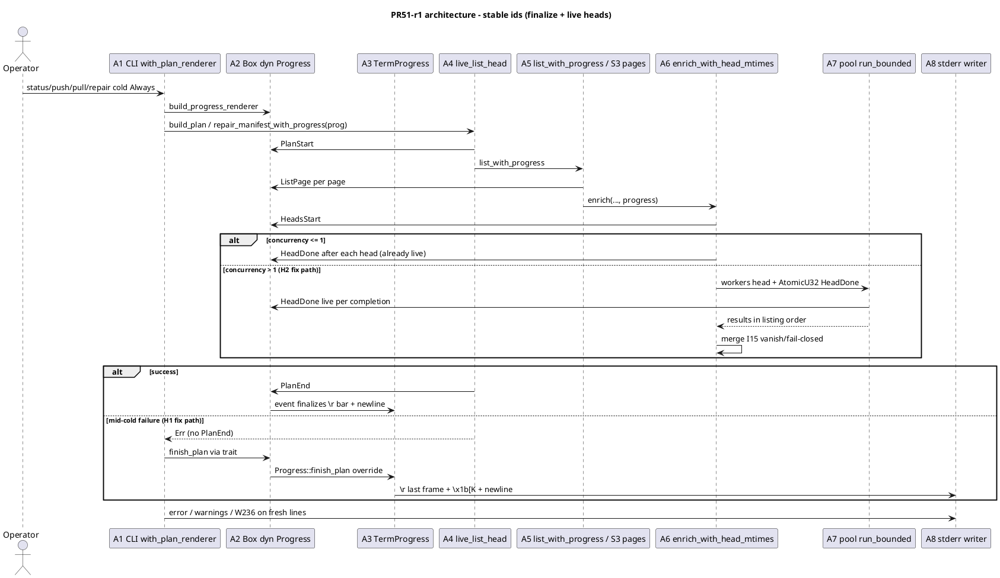
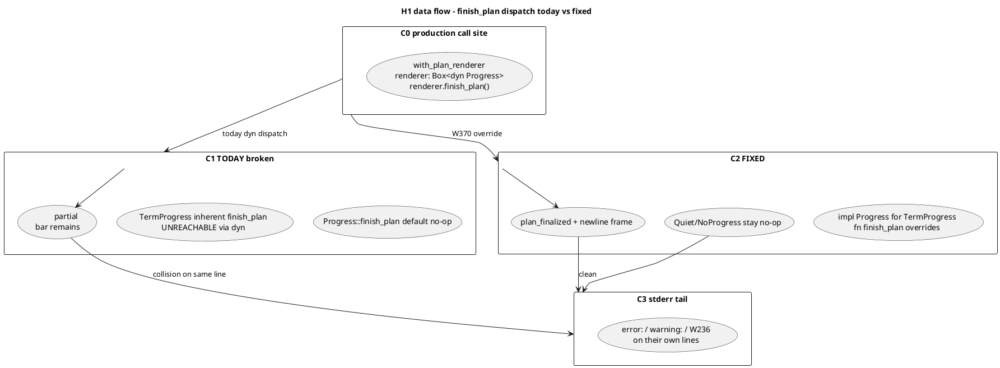
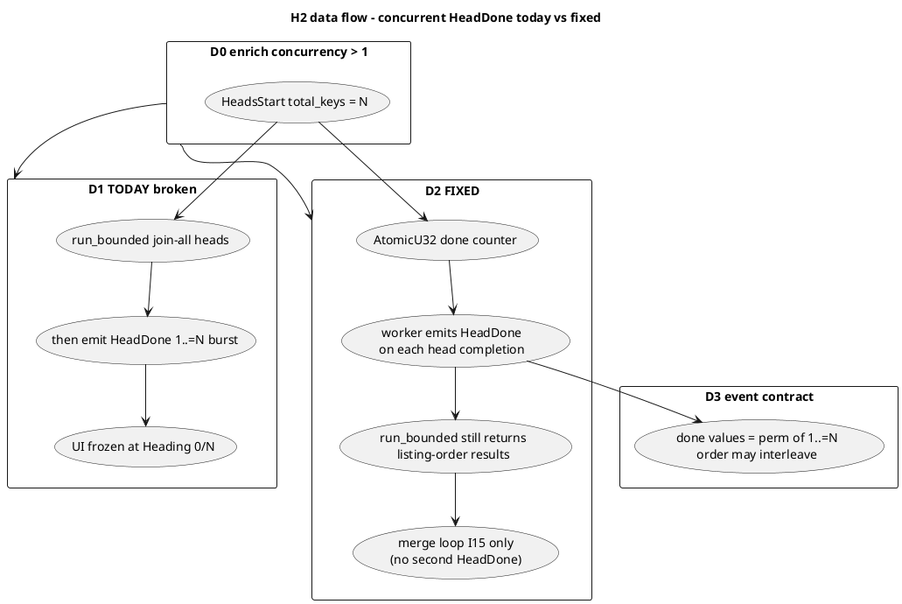
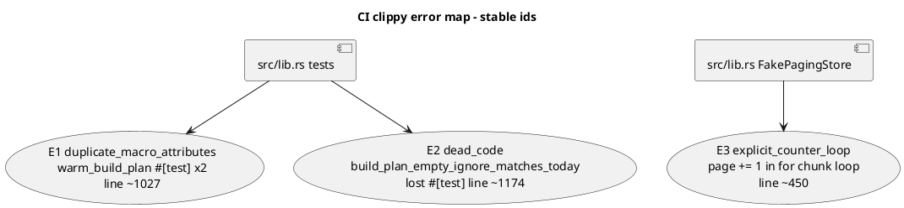

# PR 51 fix plan: review round 1 (comment 5478749681)

**Status:** implemented (W369-W384; tip `de73307` on `worktree-plan-progress-issue-42`; final gate 650 passed / 0 failed / 1 ignored, `cargo fmt --check` clean, `cargo clippy --all-targets --locked -- -D warnings` clean)
**PR:** https://github.com/tlkahn/vaultsync/pull/51 ("Issue 42: Plan-phase / cold-inventory progress on TTY")
**Review comment:** https://github.com/tlkahn/vaultsync/pull/51#issuecomment-5478749681 (`lgsunnyvale`; severity-ordered; **H1 merge-gate** + **H2 high functional**)
**Reviewed tip:** `8a48b03` on `worktree-plan-progress-issue-42` (issue 42 W325-W368)
**Work branch:** same PR branch; fixes land in place and update PR 51
**Reviewer verdict:** **request changes**. One **merge-blocking** correctness hole on I42-finalize (`finish_plan` dead through `Box<dyn Progress>`), plus a **high** live-progress gap on concurrent head enrichment (Heading bar freezes at `0/N` for the whole fan-out). Pre-existing W196 test lost its `#[test]` attribute. Architecture, warm-silence, additive seams, and success-path CLI pins otherwise strong.
**CI at reviewed tip (also merge-bar):** GitHub Actions run [33394432270](https://github.com/tlkahn/vaultsync/actions/runs/33394432270) on PR 51 - `test`/`msrv`/`integration (S3)` green; **`clippy` failed** ([job 99495448756](https://github.com/tlkahn/vaultsync/actions/runs/33394432270/job/99495448756?pr=51)); **`rustfmt` failed** ([job 99495448746](https://github.com/tlkahn/vaultsync/actions/runs/33394432270/job/99495448746?pr=51)). Local repro on tip matches CI. See [CI failures (clippy + rustfmt)](#ci-failures-clippy--rustfmt-run-33394432270).
**Work items:** continue the project W-series after issue #42 **W368**. This plan uses **W369-W384** (W383-W384 = CI hygiene; W377 absorbs the two attribute/dead_code clippy errors already tied to M1).
**Planning file location:** authored at the repository-root planning path `doc/plans/pr-51-fix-5478749681.md` (this file). Keep an identical copy on the PR worktree branch under the same relative path (same convention as PR 50 / PR 46 fix plans). Landing this file on the branch is part of **W381**.

**Design refs:** issue #42, [doc/plans/issue-42.md](issue-42.md) (normative locks I42-*; I42-finalize, I42-heads), review body 5478749681, [doc/cli.md](../cli.md) plan-phase progress, [doc/inventory-manifest.md](../inventory-manifest.md) 6.3, roadmap row `I42-plan-progress`.

**Verified baseline (recorded at plan time):** tip `8a48b03`. Gate on the PR worktree (re-confirm before W369):

```text
cargo test --offline --lib --bins  = 645 passed / 0 failed / 1 ignored
cargo fmt --check                 = FAIL (diffs in cli/inventory/lib/progress/store)
cargo clippy --all-targets --locked -- -D warnings  = FAIL (3 errors)
```

Clippy errors at tip (all `-D warnings` hard fails under CI): (1) `duplicate_macro_attributes` on `warm_build_plan_with_progress_silent` (`src/lib.rs:1027`), (2) `dead_code` on `build_plan_empty_ignore_matches_today` (`src/lib.rs:1174`, lost `#[test]` - M1), (3) `clippy::explicit_counter_loop` on `FakePagingStore::list_with_progress` page counter (`src/lib.rs:450`). Re-run clippy/fmt at every GREEN tip; W382 requires both clean.

---

## Architecture overview

PR 51 already landed issue 42 S1-S10: plan-phase `ProgressEvent` variants, pure `PlanProgressLine`, `TermProgress`/`QuietProgress` routing, additive `ObjectStore::list_with_progress`, S3 page + head emission, facade/plan/repair `*_with_progress` wrappers, CLI `with_plan_renderer` lifecycle, and docs. This fix pass does **not** reopen I42-max-keys, I42-warm-events, I42-walk, I15 fail-closed class, ProgressMode semantics, or the success-path PlanEnd/W236 ordering pins (W351-W358 stay).

The holes are:

1. **Trait-dispatch gap (H1):** `finish_plan` was added as an *inherent* method on `TermProgress` and as a *defaulted trait* method on `Progress`, but `impl Progress for TermProgress` never overrides it. CLI holds `Box<dyn Progress>`, so the defensive finalize is a no-op on mid-cold failure.
2. **Emission timing gap (H2):** concurrent `enrich_with_head_mtimes` waits for `run_bounded` to join-all before any `HeadDone`. Live head progress only exists on the concurrency=1 path; production concurrency freezes at `Heading 0/N`.
3. **Test hygiene (M1):** insertion of W348 stole `#[test]` from a pre-existing W196 pin (also a CI clippy hard-fail under `-D warnings`).
4. **CI hygiene:** tip fails `cargo fmt --check` and `cargo clippy --all-targets --locked -- -D warnings` (run 33394432270). Must be green before re-review; mechanical fmt + one real clippy counter-loop fix beyond M1.

```plantuml
@startuml
title Component touch map PR51-r1

component "src/progress.rs" as PROG
component "src/store/mod.rs" as STORE
component "src/cli.rs" as CLI
component "src/lib.rs" as LIB
component "doc/cli.md" as CLIDOC
component "doc/inventory-manifest.md" as INVDOC
component "doc/roadmap.md" as ROAD
component "doc/plans/issue-42.md" as P42
component "doc/plans/pr-51-fix-5478749681.md" as P51

usecase "Progress::finish_plan on TermProgress" as U1
usecase "PlanEnd sets plan_finalized even if empty" as U2
usecase "dyn finish_plan RED pin" as U3
usecase "CLI mid-cold Always finalize pin" as U4
usecase "worker AtomicU32 HeadDone" as U5
usecase "live concurrent head pin" as U6
usecase "restore W196 #[test]" as U7
usecase "docs live-head wording" as U8
usecase "land this plan + roadmap row" as U9

PROG --> U1
PROG --> U2
PROG --> U3
CLI --> U4
STORE --> U5
STORE --> U6
LIB --> U7
CLIDOC --> U8
INVDOC --> U8
ROAD --> U9
P42 --> U9
P51 --> U9
@enduml
```









| ID | Component | Role after this fix series |
| -- | --------- | -------------------------- |
| A1 | `src/cli.rs` `with_plan_renderer` | Unchanged call shape; becomes correct because trait dispatch works |
| A2 | `Box<dyn Progress>` | Carries real `finish_plan` for TermProgress; Quiet stays no-op |
| A3 | `TermProgress` | `impl Progress` overrides `finish_plan`; inherent method removed or thin-forwards to avoid drift |
| A4 | `live_list_head` | Unchanged brackets (PlanStart / PlanEnd-on-success only) |
| A5 | S3 `list_with_progress` / `fold_list_page` | Unchanged live `ListPage` emission |
| A6 | `enrich_with_head_mtimes` | Concurrent path emits live `HeadDone` from workers; merge stays listing-order I15 |
| A7 | `pool::run_bounded` | **Unchanged API**; workers gain progress side-effect via closure captures |
| A8 | stderr writer | Mid-cold failure and success both leave newline-clean tails before CLI lines |
| A9 | Docs / plans | Live-head wording; roadmap `PR51-r1` row; land this plan on the branch |

**Out of scope:** shrinking `max_keys`, walk counters (I42-walk), indicatif, new CLI flags, changing I15 fail-closed class, warm-path bars, multipart transfer progress, rewriting ObjectStore test-double framework, issue #49 resume.

---

## Finding disposition (comment 5478749681)

| Id | Severity | Finding | Disposition | W-items |
| -- | -------- | ------- | ----------- | ------- |
| **H1** | **Merge-blocking** | `finish_plan` inherent-only; `Box<dyn Progress>::finish_plan()` is trait default no-op; mid-cold failure leaves partial `\r` bar that collides with error/warning lines | **Fix.** Override `Progress::finish_plan` on `TermProgress`. RED pin through trait object. CLI mid-cold Always pin. | W369-W372 |
| **H2** | **High / should-fix-before-merge** | Concurrent enrich emits `HeadDone` only after `run_bounded` joins; Heading freezes at `0/N` for the multi-minute fan-out | **Fix.** Emit `HeadDone` inside pool workers via `AtomicU32`; merge loop does not re-emit. Live concurrent pin. | W373-W376 |
| **M1** | Medium (CI-blocking under clippy `-D warnings`) | `build_plan_empty_ignore_matches_today` lost `#[test]`; duplicate `#[test]` on W348; `dead_code` + `duplicate_macro_attributes` | **Fix.** Restore attribute; drop duplicate. Characterization that the W196 pin still runs. Closes clippy errors (1)+(2). | W377 |
| **M2** | Medium | I42-finalize has no failure-path pin at CLI/renderer boundary (why H1 shipped green) | **Fix via H1 pins** (W369 renderer + W371 CLI). No separate production change. | W369, W371 |
| **CI-clippy** | CI-blocking | `clippy::explicit_counter_loop` on `FakePagingStore::list_with_progress` (`page += 1` in `for` loop, `src/lib.rs:450`) | **Fix.** Rewrite to `(1_u32..).zip(chunks)` so page stays **1-based** (I42 ListPage lock). Do **not** take clippy's `(0_u32..)` help literally. | W383 |
| **CI-fmt** | CI-blocking | `cargo fmt --check` diffs across `src/cli.rs`, `src/inventory.rs`, `src/lib.rs`, `src/progress.rs`, `src/store/mod.rs` (issue-42 insertion style drift) | **Fix.** `cargo fmt` only; no behavior change. Verify with `cargo fmt --check` clean. | W384 |
| **L1** | Low | `PlanEnd` with empty render early-returns before `plan_finalized = true` | **Fix** while touching the plan-phase branch (same edit surface as H1). | W370 |
| **N1** | Nit | Dual renderer construction / executor clock restart | **Docs-only one-liner** optional in dispatch_plan comment; no behavior change. | W378 (optional fold) |
| **N2** | Nit | `FakePagingStore::put_from_with` already correct | **No change.** | - |
| **N3** | Nit | Docs describe per-completed-head Heading; true only after H2 | **Update** cli.md / inventory-manifest 6.3 after H2 GREEN. | W379 |

---

## Locked decisions for this fix series

| ID | Decision | Choice |
| -- | -------- | ------ |
| R51-h1-shape | How to make `finish_plan` reachable | **Override `Progress::finish_plan` on `TermProgress`.** Prefer a single body: either move the inherent method body into the trait impl and delete the inherent method, or keep a private `fn finalize_plan_bar(&self)` called from both (if an inherent remains for tests). **Locked preference:** trait impl is the only public finalize entry; no divergent inherent. |
| R51-h1-quiet | Quiet/NoProgress | Keep trait default no-op (or explicit empty override). `with_plan_renderer` may still call `finish_plan` under Quiet - must stay silent. |
| R51-h1-idempotent | Double finalize | Success path: `PlanEnd` sets `plan_finalized` and writes newline; subsequent `finish_plan` is no-op. Failure path: only `finish_plan` writes. Pin both. |
| R51-h1-empty | Empty partial bar | If no frame was ever rendered (`PlanStart` only), `finish_plan` writes nothing and may leave `plan_finalized` false (nothing to collide). If a non-empty frame exists, must newline-finalize. |
| R51-h1-cli-pin | CLI exposure | Prefer both: (a) pure renderer pin behind `Box<dyn Progress>` (precise dyn dispatch), (b) one CLI `run_with_io` pin with `S3LikeListStore::fail_head` under `ProgressMode::Always` asserting error line follows a `\n` and no orphan `\r` after the last newline before `error:`. |
| R51-h2-emit | Where HeadDone fires under concurrency | **Inside the `run_bounded` worker closure** after each `store.head` returns (success, NotFound, or hard error - count advances on completion of the attempt; hard errors still fail closed at merge). |
| R51-h2-counter | done value | `AtomicU32` fetch_add(1) + 1 => `done` in `1..=N`. Values are a permutation of `1..=N`; order may interleave. Do **not** re-emit in the merge loop (would double-count). |
| R51-h2-merge | I15 merge | Unchanged listing-order walk of results for vanish warning + first hard error. Progress is decoupled from merge order. |
| R51-h2-seq | concurrency <= 1 | Keep existing sequential emit path (already live). No AtomicU32 required there. |
| R51-h2-pin | Live emission proof | RED pin must fail on today's join-then-burst behavior. Technique: a head store that blocks until it has observed at least one `HeadDone` on the shared sink *before* unblocking the last head (or a weaker two-phase barrier: N-1 heads complete and assert `HeadDone` count >= N-1 while one head still blocked). See W373. |
| R51-h2-w337 | Existing W337 | Retarget: still `HeadsStart{20}` + exactly 20 `HeadDone` with unique `done` in `1..=20`; drop any accidental reliance on strict listing-order `done` sequence under concurrency > 1 (today's merge made done ordered; live emit will not). |
| R51-m1 | Lost test | Restore `#[test]` on `build_plan_empty_ignore_matches_today`; single `#[test]` on `warm_build_plan_with_progress_silent`. Gate warning-clean for these. Closes CI clippy errors (1)+(2). |
| R51-ci-clippy-page | FakePagingStore counter | Replace `let mut page = 0; for chunk ... { page += 1; ...}` with `for (page, chunk) in (1_u32..).zip(listing.entities.chunks(self.page_size))`. **Page stays 1-based** (ListPage / W327 / W340 lock). Clippy help text suggests `(0_u32..)` - **reject that**; 0-based pages would break every Listing pin that expects `page: 1` first. S3 production loop is a `loop { page += 1; ... }` (not a `for` counter) and is not flagged; leave it unless clippy later complains - then same 1-based discipline. |
| R51-ci-fmt | rustfmt | Run project `cargo fmt` (no custom rustfmt.toml arguments). Do not hand-edit whitespace to "match style" - let rustfmt own it. Re-run `cargo fmt --check` after every later edit tip that touches Rust sources (H1/H2 commits can re-dirty fmt if authors hand-wrap). |
| R51-ci-order | When to land CI fixes | **Prefer S0 first** (W377 + W383 + W384) so subsequent H1/H2 tips stay on a green CI baseline and local `clippy -D warnings` / `fmt --check` match Actions. May combine W377+W383+W384 into one hygiene commit if desired. |
| R51-l1 | PlanEnd empty | On `PlanEnd`, set `plan_finalized = true` even when `rendered.is_empty()` (no write needed). Prevents a later spurious finish attempt from racing a future non-empty state (defensive; cheap). |
| R51-merge-bar | What blocks merge / re-review | **H1 (W369-W372) + H2 (W373-W376) + M1/CI (W377, W383, W384).** L1 folded into H1 GREEN. Docs W379-W382 before re-review request. W382 must show clippy + fmt green, not only tests. |
| R51-tdd | Method | **Strict fine-grained TDD** per [Method](#method-strict-fine-grained-tdd). One behavior per W-item where practical; RED before GREEN; mutation-check on safety pins; offline gate after every GREEN tip. |
| R51-deps | New crates | **None.** std-only (I42-deps unchanged). |
| R51-production-files | Primary edit surfaces | `src/progress.rs`, `src/store/mod.rs`, `src/lib.rs` (test attr only), `src/cli.rs` (tests + optional comment), `doc/cli.md`, `doc/inventory-manifest.md`, `doc/roadmap.md`, `doc/plans/issue-42.md` (revision note), this plan. |

---

## Method: strict fine-grained TDD

Every behavior-facing change follows:

1. **RED** - write or extend the exposing test first. Run it. Observe the expected failure (assertion or compile) *before* production code changes when production must change. Record the failing assertion text in the commit body.
2. **GREEN** - smallest production change that turns that cycle's pins green.
3. **REFACTOR** - behavior-preserving cleanup only under green; no behavior change without a new RED.
4. Do **not** push a RED tree to the PR tip. A single commit may contain RED-verified tests plus the GREEN implementation, with local RED observations recorded in the commit message (same convention as PR 50 / issue 42).
5. **Characterization pins** for already-correct behavior: write the test first, confirm **GREEN on arrival**, then **mutation-check** (temporarily break the production path, observe RED, revert). Record "characterization: GREEN on arrival; mutation-checked: \<break\> re-fails \<assert\>; reverted" in the commit body.
6. Docs-only / plan-status / review-reply changes have no artificial RED; they land under the all-green gate.

Per-cycle gate (every commit tip):

```bash
cargo test --offline --lib --bins
cargo fmt --check
# at least once before re-review request:
cargo clippy --all-targets -- -D warnings
```

Commit message shape: `test|fix|refactor|docs: [51/42] <summary> (Wnnn)` with RED evidence in the body when applicable.

**Mutation-check requirement (H1/H2 safety pins):** after GREEN, briefly re-break the production path (comment out trait override; move HeadDone back after join) and confirm the new pin goes RED; revert before commit tip. Record in commit body.

---

## CI failures (clippy + rustfmt, run 33394432270)

**Source:** PR 51 Actions run [33394432270](https://github.com/tlkahn/vaultsync/actions/runs/33394432270) on tip `8a48b03` (same tip as the review). Jobs:

| Job | Result | Link |
| --- | ------ | ---- |
| test (ubuntu-latest) | success | - |
| test (macos-latest) | success | - |
| msrv (1.95) | success | - |
| integration (S3) | success | - |
| **clippy** | **failure** | [job 99495448756](https://github.com/tlkahn/vaultsync/actions/runs/33394432270/job/99495448756?pr=51) |
| **rustfmt** | **failure** | [job 99495448746](https://github.com/tlkahn/vaultsync/actions/runs/33394432270/job/99495448746?pr=51) |

CI commands (must match local gate):

```bash
cargo clippy --all-targets --locked -- -D warnings
cargo fmt --check
```

Local repro on the PR worktree at plan time matches CI exactly (3 clippy errors; fmt diffs in five Rust files).

### Clippy errors (3, all hard-fail under `-D warnings`)



| Id | Lint | Location | Root cause | Fix W-item |
| -- | ---- | -------- | ---------- | ---------- |
| **E1** | `duplicate_macro_attributes` | `src/lib.rs:1027` - second `#[test]` on `warm_build_plan_with_progress_silent` | W348 insertion left stacked `#[test]` / comment / `#[test]` | **W377** (drop duplicate) |
| **E2** | `dead_code` | `src/lib.rs:1174` - `fn build_plan_empty_ignore_matches_today` | W348 stole the pre-existing W196 `#[test]` so the fn is no longer a test and is "never used" | **W377** (restore `#[test]`) |
| **E3** | `clippy::explicit_counter_loop` | `src/lib.rs:450` - `FakePagingStore::list_with_progress` | `let mut page: u32 = 0; for chunk in ... { page += 1; ...}` | **W383** (zip with **`(1_u32..)`**, not `0`) |

**E3 production sketch (normative; keep 1-based pages):**

```rust
// BEFORE (clippy::explicit_counter_loop)
let mut keys_so_far: u64 = 0;
let mut page: u32 = 0;
for chunk in listing.entities.chunks(self.page_size) {
    page += 1;
    keys_so_far += chunk.len() as u64;
    progress.event(ProgressEvent::ListPage { page, keys_so_far });
}

// AFTER - page stays 1-based (I42 ListPage / W340 pins expect page 1 first).
// Reject clippy's suggested `(0_u32..)` help text.
let mut keys_so_far: u64 = 0;
for (page, chunk) in (1_u32..).zip(listing.entities.chunks(self.page_size)) {
    keys_so_far += chunk.len() as u64;
    progress.event(ProgressEvent::ListPage { page, keys_so_far });
}
```

**Characterization after W383:** existing `fake_paging_store_emits_list_pages` (W340) must stay GREEN with `pages == [(1,3),(2,6),(3,7)]` for N=7/P=3. If someone applies `(0_u32..)` that pin goes RED - good safety net; no new pin required unless W340 is weakened.

**S3 page loop note:** `list_prefix_objects_with_progress` uses `loop { ... page += 1; fold_list_page(...); }` - not a `for`-loop counter, so clippy did not flag it on tip. Leave alone in this series unless a later clippy version flags it; if it does, keep 1-based semantics.

### rustfmt failures

`cargo fmt --check` reports diffs (non-exhaustive sample from CI / local; full set is whatever `cargo fmt` rewrites):

| File | Representative drift |
| ---- | -------------------- |
| `src/cli.rs` | long fn signatures / multi-line `assert!` wrapping in issue-42 CLI pins (~1992, 2134, 2160, 2187, 2245) |
| `src/inventory.rs` | `load_remote_inventory_with_progress(...).unwrap()` call wrapping (~1396, 1422, 1448, 1474) |
| `src/lib.rs` | `build_plan_with_progress` wrapper args; `ListPage { page, keys_so_far }` struct-lit packing; assert_eq wrapping (~74, 450, 1157) |
| `src/progress.rs` | `ListPage { page: u32, keys_so_far: u64 }` variant packing; match arm formatting (~65, 277, 1327) |
| `src/store/mod.rs` | long `enrich_with_head_mtimes(..., &NoProgress)` call wrapping across many pre-existing tests touched by the progress-arg addition (~240 and many call sites) |

**Fix:** `cargo fmt` once at W384 (and again any time a later commit hand-edits Rust). No semantic judgment - rustfmt output is authoritative. Do not fight rustfmt with `#[rustfmt::skip]` unless there is a pre-existing project precedent (there is not for these sites).

### CI acceptance (merge-bar)

Before re-review / merge, all of the following must be green on the PR tip (local and Actions):

```bash
cargo test --offline --lib --bins
cargo fmt --check
cargo clippy --all-targets --locked -- -D warnings
```

W382 records the final counts and confirms Actions clippy + rustfmt jobs green on the push that requests re-review.

---

## Work items

### W369 - H1/M2 RED: `finish_plan` through `Box<dyn Progress>` must newline-finalize a partial plan bar

**Goal:** Expose H1 at the exact dispatch boundary the CLI uses, before any production fix.

**Where:** `src/progress.rs` `mod tests`.

**TDD cycle:**

1. **RED** - add `finish_plan_via_dyn_progress_finalizes_partial_bar` (name indicative):
   - `let mut buf = Vec::new();`
   - `let boxed: Box<dyn Progress> = Box::new(TermProgress::new(&mut buf));`
   - Feed a partial plan sequence **without** `PlanEnd`:
     - `PlanStart`
     - `ListPage { page: 1, keys_so_far: 1000 }`
     - optional second `ListPage` / `HeadsStart` + one `HeadDone` (at least one non-empty frame)
   - Call `boxed.finish_plan();`
   - Drop the box (release buf).
   - Assert:
     - `buf` as UTF-8 contains `"Listing"` or `"Heading"` (last frame state)
     - `buf` contains `\n` (finalize newline)
     - `buf` matches clear-to-EOL discipline (`\x1b[K` before the final newline on the finalize frame)
   - **Today:** `finish_plan` is trait default no-op => buffer has only `\r` refreshes and **no** trailing newline after the last frame => assertion fails. That is the RED.
2. Companion assertion (same test or sibling): after `finish_plan`, append `writeln!(buf2_sim)` by writing a marker line into a fresh scenario - simpler: assert the finalize frame itself ends with `\n` so a subsequent write would start clean.
3. Run the new test alone; record failing assertion (`no newline` / missing finalize).
4. **Do not** ship a red tip: pair with W370 in one commit if needed; keep logical RED-then-GREEN in the commit body.

**Also pin idempotency (can be same test's second phase or W370 characterization):**

- Feed partial + `finish_plan` + `finish_plan` again => exactly one trailing finalize newline (second call no-op via `plan_finalized`).
- Feed full sequence ending in `PlanEnd` (which finalizes) then `finish_plan` => still a single plan-line newline (no double blank).

**Gate:** offline green after W370; this item alone is RED by design.

**Commit:** `test: [51/42] dyn finish_plan partial bar pin (W369)` (or combined W369-W370).

---

### W370 - H1/L1 GREEN: `impl Progress for TermProgress` overrides `finish_plan`; PlanEnd marks finalized even if empty

**Goal:** Make the trait-object call path run the real finalize body; close L1 on the same edit surface.

**Where:** `src/progress.rs` - `TermProgress`, `impl Progress for TermProgress`.

**Production change (smallest):**

```text
impl Progress for TermProgress<'_> {
    fn event(&self, ev: ProgressEvent) { /* existing, plus L1 tweak below */ }

    fn finish_plan(&self) {
        // body currently on the inherent method:
        // lock, if plan_finalized return;
        // render; if empty return;
        // plan_finalized = true; write \r{rendered}\x1b[K\n; flush
    }
}

// Delete the public inherent `pub fn finish_plan` OR make it
// #[cfg(test)] / private thin forward - locked preference: delete inherent
// so there is one entry point (trait method) and no drift.
```

**L1 tweak in `event` plan-phase branch:**

```text
if is_plan_phase(&ev) {
    let finalize = matches!(ev, ProgressEvent::PlanEnd);
    ...
    inner.plan_line.on_event(ev);
    let rendered = inner.plan_line.render();
    if finalize {
        inner.plan_finalized = true;   // even when rendered is empty
    }
    if rendered.is_empty() {
        return;
    }
    let frame = if finalize { format!("\r{rendered}\x1b[K\n") } else { ... };
    ...
}
```

**QuietProgress / NoProgress:** no change required (default no-op). Optional explicit `fn finish_plan(&self) {}` for readability - not required.

**TDD:**

1. W369 pin goes GREEN.
2. Existing W331/W332/W357 success-path pins stay GREEN (PlanEnd still finalizes; `finish_plan` after is no-op).
3. **Mutation-check:** temporarily empty the trait override body; W369 RED; restore.
4. Optional micro-pin for L1: `PlanStart` + `PlanEnd` only => `plan_finalized` true (observe via second `ListPage` not rewriting without newline - harder; acceptable to cover L1 by code review + the empty-render branch ordering if a direct field assert is awkward). Prefer a test that calls `finish_plan` after `PlanStart`+`PlanEnd` and asserts still no panic / no extra frames, and a test that `PlanStart`+`ListPage` without PlanEnd + `finish_plan` writes `\n`.

**Gate:** offline green; W369 green; no new warnings.

**Commit:** `fix: [51/42] TermProgress Progress::finish_plan override (W370)`

---

### W371 - H1/M2 RED then GREEN: CLI mid-cold failure under Always finalizes before `error:`

**Goal:** End-to-end pin so `with_plan_renderer`'s `renderer.finish_plan()` cannot regress to a no-op without a red CLI test.

**Where:** `src/cli.rs` `mod tests`.

**TDD cycle:**

1. **RED (expect GREEN if W369-W370 done; else fails):** `status_cold_always_mid_cold_failure_finalizes_before_error`:
   - Temp vault dir with a local file (so status has work).
   - `S3LikeListStore` with a remote object + `fail_head` on that key (same pattern as lib W360) so cold list+head fails closed during enrichment after listing progress may have painted frames.
   - Optional stronger paint: if S3LikeListStore does not emit `ListPage`, seed enough that `HeadsStart` alone paints a Heading frame under Always (HeadsStart arms `0/total` non-empty when total > 0). That is enough for a non-empty plan frame before the hard head error.
   - `run_mode(Command::status(...), &store, ProgressMode::Always)` (inventory mode ListHead).
   - Assert exit code is the existing hard-error exit (1).
   - Assert stderr contains `error:` (or the locked unavailable message shape status already prints).
   - Assert: let `idx = err.find("error:").unwrap();` then `err[..idx].ends_with('\n')` (finalize newline before error line).
   - Assert: no `\r` after the last `\n` that precedes `error:` (same spirit as W357's `\r` ordering vs W236).
2. If W370 already landed, this pin should be GREEN on arrival - still **mutation-check** by temporarily stubbing `Progress::finish_plan` on TermProgress to no-op and watching the pin RED; restore.
3. If the store path fails before any non-empty frame (empty render), the pin would be weak - force at least `HeadsStart` by ensuring >=1 object row is headed. S3LikeListStore + one put + fail_head does this (W360 already proves PlanStart + no PlanEnd).

**Repair twin (optional same commit or W372):** `repair_cold_always_mid_cold_failure_finalizes_before_error` with the same store shape - repair also uses `with_plan_renderer`. One of status/repair is sufficient for merge bar; both preferred while hot.

**Gate:** offline green.

**Commit:** `test: [51/42] CLI mid-cold Always finish_plan pin (W371)`

---

### W372 - H1 REFACTOR: single finalize entry + comments; success-path idempotency characterization

**Goal:** Behavior-preserving cleanup under green; lock the dual-call contract in comments.

**Where:** `src/progress.rs`, brief comment at `with_plan_renderer` in `src/cli.rs`.

**Tasks:**

1. Ensure no inherent `pub fn finish_plan` remains on `TermProgress` (only trait method), unless a private helper is shared by `event(PlanEnd)` and `finish_plan` to avoid duplicating the write frame format string.
2. Preferred private helper sketch:

```text
fn write_plan_finalize(inner: &mut TermInner) {
    if inner.plan_finalized { return; }
    let rendered = inner.plan_line.render();
    inner.plan_finalized = true; // L1: mark even if empty
    if rendered.is_empty() { return; }
    let frame = format!("\r{rendered}\x1b[K\n");
    let _ = inner.writer.write_all(frame.as_bytes());
    let _ = inner.writer.flush();
}
```

   `event(PlanEnd)` and `finish_plan` both call it (PlanEnd still updates line state first via `on_event`).
3. Comment on `with_plan_renderer`: finish_plan is required because mid-cold failure omits PlanEnd; success path is idempotent.
4. Characterization pin (if not already in W369): `plan_end_then_finish_plan_is_idempotent` - PlanStart/ListPage/PlanEnd then finish_plan => single trailing plan newline.

**Gate:** offline green; fmt clean.

**Commit:** `refactor: [51/42] single plan finalize helper (W372)`

---

### W373 - H2 RED: concurrent enrich must emit `HeadDone` before `run_bounded` joins

**Goal:** Expose the join-then-burst hole with a pin that fails on tip `8a48b03`.

**Where:** `src/store/mod.rs` `mod tests` (enrich layer; precise).

**TDD cycle:**

1. **RED** - add `enrich_concurrent_headdone_streams_before_join` (name indicative):
   - Build a store double whose `head` blocks on all but a release protocol:
     - **Pattern A (preferred):** `BlockingHeadStore` with:
       - `started: AtomicUsize` / `Condvar` rendezvous
       - `progress: Arc<RecordingProgress>` shared with the test (or progress passed into enrich as today)
       - On each `head`: increment started; if this is not the designated "last" key, complete immediately; if it is the last key, **wait until `progress.events()` contains at least `HeadsStart` + `(N-1)` `HeadDone`**, then complete.
     - Call `enrich_with_head_mtimes(&store, listing_with_N_objects, concurrency=4, &prog)` with N>=4 (e.g. N=8).
     - If emission is post-join only, the last head waits forever for `N-1` HeadDone that never arrive before join => **test times out** OR use a timed wait and assert failure. Prefer a **bounded wait** (`wait_timeout` ~500ms-2s) on the last head: if HeadDone count < N-1 within timeout, last head still completes (to avoid hang) but the test asserts after enrich that a sample was observed mid-flight.
   - **Pattern B (simpler, still RED today):** instrument with a custom `Progress` sink that records timestamps/`phase` flags; inside `head`, if `HeadDone` count so far is 0 and this is not the first head under concurrency, set a `saw_head_without_prior_progress` flag... (weaker).
   - **Locked preference: Pattern A with wait_timeout:**
     1. Last head waits up to T for `HeadDone` count >= N-1.
     2. After enrich returns Ok, assert `last_head_observed_headdone_before_return == true` (flag set when wait succeeded).
     3. On today's code, wait times out => flag false => assertion fails (RED). On fixed code, workers emit live => wait succeeds (GREEN).
   - Also assert final event totals: `HeadsStart { N }` + exactly N `HeadDone` with unique done values covering `1..=N` (order free).
2. Run the new test; record RED (flag false / timeout path).
3. Do not hang the suite: always bound waits; never `wait` without timeout in test code.

**Reuse:** existing gauge/rendezvous helpers in `crate::testutil` if applicable (`OverlapGauge` etc.); otherwise a local test double next to `KeyFailStore`.

**Gate:** RED by design until W374.

**Commit:** `test: [51/42] concurrent HeadDone streams before join (W373)` (or combined W373-W374).

---

### W374 - H2 GREEN: emit `HeadDone` from pool workers via `AtomicU32`

**Goal:** Live heading progress under concurrency > 1 without changing I15 merge semantics.

**Where:** `src/store/mod.rs` `enrich_with_head_mtimes` concurrent branch.

**Production change (smallest):**

```text
} else {
    let object_rows: Vec<&Entity> =
        listing.entities.iter().filter(|e| !e.is_folder()).collect();
    let heads_done = std::sync::atomic::AtomicU32::new(0);
    let results = crate::pool::run_bounded(concurrency, &object_rows, |e| {
        let result = store.head(&e.key);
        // Emit on attempt completion (Ok, NotFound, or hard Err) so the bar
        // advances even when merge later fail-closes on a sibling.
        let done = heads_done.fetch_add(1, std::sync::atomic::Ordering::Relaxed) + 1;
        progress.event(crate::progress::ProgressEvent::HeadDone {
            done,
            total_keys: object_rows_total,
        });
        result
    });
    let mut results = results.into_iter();
    for e in listing.entities {
        if e.is_folder() {
            entities.push(e);
            continue;
        }
        match results.next().expect("one head result per object row") {
            Ok(h) => { /* existing override fields */ }
            Err(Error::NotFound(_)) => { vanished.push(e.key); }
            Err(err) => return Err(err),
        }
        // NO HeadDone here (already emitted in worker)
    }
}
```

**Hard-error note:** workers still run to completion today (run_bounded does not cancel). Emitting HeadDone on hard Err attempts is correct for "attempt finished"; merge still returns the listing-order first hard error. W336 partial-HeadDone-on-error remains valid (and may show more HeadDone than "successful merges" - totals still N attempts). Document in a one-line comment.

**Sequential path:** unchanged.

**TDD:**

1. W373 pin GREEN.
2. Retarget `enrich_head_progress_under_concurrency` (W337):
   - Still `HeadsStart { 20 }` first.
   - Exactly 20 `HeadDone`.
   - `done` values unique and equal to set `1..=20` (sort+dedup), **not** necessarily sorted in emission order.
3. Existing vanish/error enrich pins stay GREEN (event counts may include HeadDone for attempts that later fail-close - confirm W336 expectations still hold; adjust only if a pin assumed zero HeadDone before error in concurrent mode).
4. **Mutation-check:** move HeadDone back after join; W373 RED; restore.

**Gate:** offline green.

**Commit:** `fix: [51/42] live HeadDone under concurrent enrich (W374)`

---

### W375 - H2 characterization: sequential path still listing-order `done`; folders uncounted

**Goal:** Guard the concurrency=1 path and folder exclusion against accidental AtomicU32 refactors.

**Where:** `src/store/mod.rs` tests (extend existing `enrich_emits_head_progress` / W335 if needed).

**TDD:**

1. Characterization (GREEN on arrival): concurrency 1, 3 files + 1 folder => `HeadsStart { 3 }`, `HeadDone` done sequence exactly `[1,2,3]`.
2. Mutation-check optional: force concurrent path with concurrency 1 already separate.

**Gate:** offline green.

**Commit:** `test: [51/42] sequential head progress order characterization (W375)`

---

### W376 - H2 REFACTOR: comments + event-doc alignment; no behavior change

**Goal:** Align code comments / `HeadDone` rustdoc with live concurrent emission; remove stale "merge emits progress" wording if any.

**Where:** `src/store/mod.rs` enrich docs; `src/progress.rs` `HeadDone` variant docs (already says order may interleave - confirm still accurate).

**Gate:** offline green; fmt.

**Commit:** `docs: [51/42] HeadDone live-concurrent comments (W376)` (or `refactor:` if only code comments).

---

### W377 - M1 / CI-E1+E2 GREEN: restore `#[test]` on `build_plan_empty_ignore_matches_today`; drop duplicate attribute

**Goal:** Re-enable the W196 empty-ignore ingest pin; clear CI clippy errors **E1** (`duplicate_macro_attributes`) and **E2** (`dead_code`) from the W348 insertion.

**Where:** `src/lib.rs` `mod tests`.

**TDD cycle:**

1. **RED observation (compile/CI, not assert):** tip fails `cargo clippy --all-targets --locked -- -D warnings` with:
   - `duplicated attribute` at the stacked `#[test]` on `warm_build_plan_with_progress_silent` (~1027)
   - `function build_plan_empty_ignore_matches_today is never used` (~1174)
   - `cargo test build_plan_empty_ignore` runs 0 tests
2. **GREEN:**
   - Ensure exactly one `#[test]` immediately above `fn warm_build_plan_with_progress_silent`.
   - Ensure `#[test]` immediately above `fn build_plan_empty_ignore_matches_today`.
3. Run `cargo test --offline --lib build_plan_empty_ignore_matches_today` => 1 passed.
4. Confirm the W196 assertions still hold (should - no production change).
5. Re-run clippy: E1 and E2 gone (E3 may still fail until W383).

**Gate:** offline test green for this pin; E1+E2 cleared. Full gate test count should rise by 1 vs tip (645 -> 646) unless other edits intervene.

**Commit:** `test: [51/42] restore W196 empty-ignore #[test] (W377)`

**Note:** Part of **S0 CI hygiene**. May land earliest (before H1/H2) with no dependency; prefer bundling with W383+W384 in one hygiene tip if the operator wants a single CI-green baseline commit.

---

### W383 - CI-E3 GREEN: `FakePagingStore` page loop uses 1-based zip (clippy `explicit_counter_loop`)

**Goal:** Clear CI clippy error **E3** without breaking 1-based `ListPage.page` semantics.

**Where:** `src/lib.rs` `testutil::FakePagingStore::list_with_progress`.

**TDD cycle:**

1. **RED observation:** `cargo clippy --all-targets --locked -- -D warnings` fails with `the variable page is used as a loop counter` at the `for chunk in listing.entities.chunks(...)` site. Clippy help suggests `(0_u32..).zip(...)` - **do not apply 0-based pages**.
2. **Characterization safety net (already exists, GREEN on arrival):** `store::tests::fake_paging_store_emits_list_pages` (W340) asserts `pages == [(1, 3), (2, 6), (3, 7)]` for N=7/P=3. Keep it green after the rewrite. Optional mutation-check: temporarily use `(0_u32..)` and watch W340 RED on `page == 1`; revert.
3. **GREEN production change:**

```rust
let mut keys_so_far: u64 = 0;
for (page, chunk) in (1_u32..).zip(listing.entities.chunks(self.page_size)) {
    keys_so_far += chunk.len() as u64;
    progress.event(crate::progress::ProgressEvent::ListPage { page, keys_so_far });
}
```

4. Run W340 pin + any inventory/CLI pins that assert `ListPage { page: 1, ... }` first event from FakePagingStore.
5. `cargo clippy --all-targets --locked -- -D warnings` => clean **once W377 also landed** (E1+E2+E3 all gone).

**Gate:** clippy clean (with W377); W340 green; offline tests green. No new public API.

**Commit:** `fix: [51/42] FakePagingStore 1-based page zip for clippy (W383)`

**Note:** Mechanical lint fix with a semantic constraint (1-based). Not a behavior change vs tip's runtime page numbers - only the counter construction changes. Pair with W377/W384 in S0.

---

### W384 - CI-fmt GREEN: `cargo fmt` across issue-42 touched Rust sources

**Goal:** Clear the rustfmt CI job; make `cargo fmt --check` a no-op on the tip.

**Where:** whatever `cargo fmt` rewrites - observed on tip: `src/cli.rs`, `src/inventory.rs`, `src/lib.rs`, `src/progress.rs`, `src/store/mod.rs` (no docs/plan markdown).

**Method (no artificial RED):**

1. **RED observation:** `cargo fmt --check` exits non-zero (local + CI job 99495448746).
2. **GREEN:** run `cargo fmt` at the repo / worktree root (no extra flags).
3. `cargo fmt --check` => clean.
4. Re-run `cargo test --offline --lib --bins` once (fmt must not change behavior; expect identical pass count).
5. If W383 rewrote FakePagingStore in the same tip, fmt may further pack `ListPage { page, keys_so_far }` - that is expected; do fmt **after** the clippy code edit, or run fmt once at the end of the combined S0 commit.

**Do not:**

- Hand-apply the CI diff hunks selectively (easy to miss a file).
- Add `#[rustfmt::skip]`.
- Reformat markdown / plan files with rustfmt (it will not).

**Ongoing rule for later slices:** every H1/H2/docs-Rust commit tip must end with `cargo fmt --check` clean. W382 re-validates.

**Gate:** `cargo fmt --check` clean; tests still green.

**Commit:** `style: [51/42] cargo fmt (W384)` (or fold into the S0 hygiene commit with W377+W383).

---

### W378 - N1 optional: dispatch_plan comment on dual renderer / executor clock restart

**Goal:** One-line comment only; no behavior change.

**Where:** `src/cli.rs` `dispatch_plan` near the second `build_progress_renderer` for the executor phase.

**Text intent:** plan renderer is dropped after finalize so direct `err` writes stay borrow-safe; executor builds a fresh `TermProgress` (rate/ETA clock starts at executor phase by design).

**Gate:** offline green.

**Commit:** `docs: [51/42] dual renderer clock comment (W378)` - may fold into W372 or W381.

---

### W379 - N3 docs: live per-completed-head Heading under concurrency

**Goal:** After H2, docs must not imply heading only ticks after the full fan-out.

**Where:** `doc/cli.md` plan-phase section; `doc/inventory-manifest.md` 6.3.

**Edits (substance):**

- State that `Heading D/T` advances as each head **completes** (including under `[transfer].concurrency` > 1; order may interleave).
- Keep Listing cumulative page wording unchanged.
- Keep W236 finalize ordering + finish_plan belt-and-braces mention; add that mid-cold failure uses `Progress::finish_plan` on the TTY renderer (post-H1).

**Gate:** offline green (docs-only).

**Commit:** `docs: [51/42] live heading + finish_plan wording (W379)`

---

### W380 - roadmap decision-log row `PR51-r1`

**Goal:** Record fix-series locks next to `I42-plan-progress`.

**Where:** `doc/roadmap.md` decision log table.

**Row sketch:**

```text
| 2026-08-31 | PR51-r1 | PR 51 review round 1 (issuecomment-5478749681) + CI run 33394432270: **H1 (merge-gate)** - TermProgress overrides Progress::finish_plan so Box<dyn Progress> finalize works on mid-cold failure (inherent-only was dead). **H2** - concurrent enrich emits HeadDone from pool workers via AtomicU32 (live Heading; merge stays listing-order I15; no double-emit). **M1** - restore W196 #[test] stolen by W348 insertion (clippy E1/E2). **CI** - FakePagingStore 1-based page zip (clippy explicit_counter_loop E3); cargo fmt clean. **L1** - PlanEnd marks plan_finalized even on empty render. Pins: dyn finish_plan (W369), CLI mid-cold Always (W371), concurrent stream-before-join (W373). Plan: doc/plans/pr-51-fix-5478749681.md. |
```

**Gate:** offline green.

**Commit:** `docs: [51/42] roadmap PR51-r1 row (W380)`

---

### W381 - land this plan on the PR branch + issue-42 revision note

**Goal:** Branch carries `doc/plans/pr-51-fix-5478749681.md`; issue-42 plan gets a short revision-log line pointing at the fix series.

**Where:** this file on the worktree; `doc/plans/issue-42.md` revision log.

**issue-42.md revision log line sketch:**

```text
| 2026-08-31 | PR51-r1 fix series planned (W369-W384) for review 5478749681 + CI run 33394432270: finish_plan trait override; live concurrent HeadDone; restore W196 #[test]; FakePagingStore 1-based zip; cargo fmt. See pr-51-fix-5478749681.md. |
```

Mark this plan's **Status** line -> `implemented (W369-W384; tip <sha>)` only at W382 closeout (or leave `planned` until then and flip in W382).

**Gate:** file present on branch; offline green.

**Commit:** `docs: [51/42] land pr-51-fix-5478749681 plan (W381)`

---

### W382 - Full offline + CI gate sweep + plan status implemented

**Goal:** Merge-bar green (tests **and** clippy **and** rustfmt); plan status flip; ready to re-request review.

**Checks (all required):**

```bash
cargo test --offline --lib --bins
cargo fmt --check
cargo clippy --all-targets --locked -- -D warnings
```

Expected:

- all tests passed (baseline 645 + new pins + restored W196; record exact count in plan status), 0 failed, 1 ignored
- `cargo fmt --check` clean (W384 held through later slices)
- `cargo clippy --all-targets --locked -- -D warnings` clean - **no** E1/E2/E3 (`duplicate_macro_attributes`, `dead_code` on W196, `explicit_counter_loop` on FakePagingStore)
- Prefer confirming the GitHub Actions `clippy` + `rustfmt` jobs are green on the tip that requests re-review (run successor to 33394432270)

**Plan status line** update to implemented with tip sha and W369-W384 summary.

**Optional (not merge-bar):** brief reply on PR 51 summarizing H1/H2/M1/CI disposition (developer account `tlkahn` if posting as author).

**Commit:** `docs: [51/42] pr-51-r1 plan status implemented (W382)`

---

## Slice map (implementation order)

| Slice | W-items | Theme | Merge-bar? |
| ----- | ------- | ----- | ---------- |
| **S0** | **W377, W383, W384** | **CI hygiene first:** M1 `#[test]` restore, FakePagingStore 1-based zip, `cargo fmt` | **yes (CI)** |
| S1 | W369-W372 | H1 finish_plan trait dispatch + CLI pin + L1 | **yes** |
| S2 | W373-W376 | H2 live concurrent HeadDone | **yes** |
| S3 | W378-W382 | comments, docs, roadmap, plan land, full gate | yes before re-review |

Suggested commit granularity: one S0 hygiene commit (W377+W383+W384) is fine and preferred so H1/H2 start from CI-green; otherwise one commit per W-item. Combine RED+GREEN pairs (W369+W370, W373+W374) when that matches issue-42 convention. Re-run `cargo fmt` at the end of any commit that touches Rust if hand-edited.

**Dependency graph:**

```text
W377 -> W383 -> W384     (S0 CI; W383 independent of W377 in code, but both needed for clippy-clean;
                          W384 after any Rust edit in S0)
W369 -> W370 -> W371 -> W372
W373 -> W374 -> W375 -> W376
W370 + W374 -> W379 (docs after both fixes)
S0 + W372 + W376 + W379 -> W380 -> W381 -> W382
W378 optional anytime after W372
```

---

## Acceptance mapping (review finding / CI -> W)

| Review finding / CI | Acceptance | W-items |
| ------------------- | ---------- | ------- |
| H1 dyn finish_plan dead | `Box<dyn Progress>::finish_plan()` newline-finalizes partial bar; CLI mid-cold Always error line follows `\n`; PlanEnd then finish_plan idempotent | W369-W372 |
| H2 frozen Heading 0/N | Concurrent enrich emits HeadDone before join; pin proves stream-before-join; totals still N unique done values | W373-W376 |
| M1 lost #[test] / CI E1+E2 | `build_plan_empty_ignore_matches_today` runs; `duplicate_macro_attributes` + `dead_code` gone from clippy | W377 |
| CI E3 explicit_counter_loop | FakePagingStore uses `(1_u32..).zip(chunks)`; W340 still `page` 1-based; clippy clean | W383 |
| CI rustfmt job | `cargo fmt --check` clean on tip | W384 |
| M2 no failure pin | Covered by W369 + W371 | W369, W371 |
| L1 empty PlanEnd | plan_finalized set on PlanEnd even if empty render | W370 |
| N1 dual renderer comment | Optional comment | W378 |
| N3 docs live head | cli.md + inventory-manifest 6.3 updated | W379 |
| Process | roadmap row + plan on branch + tests/fmt/clippy green (local + Actions) | W380-W382 |

---

## Test inventory (minimum new / restored pins)

| Pin | Layer | W | Notes |
| --- | ----- | - | ----- |
| `finish_plan_via_dyn_progress_finalizes_partial_bar` | progress | W369 | **H1 primary RED** |
| `plan_end_then_finish_plan_is_idempotent` | progress | W369/W372 | success + belt-and-braces |
| `status_cold_always_mid_cold_failure_finalizes_before_error` | cli | W371 | **H1 E2E** |
| optional repair twin | cli | W371 | preferred |
| `enrich_concurrent_headdone_streams_before_join` | store | W373 | **H2 primary RED**; bounded wait |
| retarget `enrich_head_progress_under_concurrency` | store | W374 | unique done 1..=N, order free |
| sequential head order characterization | store | W375 | concurrency 1 |
| restored `build_plan_empty_ignore_matches_today` | lib | W377 | pre-existing W196 |

Existing pins that must stay green: W331-W333, W335-W338, W351-W358, W360, W337 (retargeted), quiet swallow, warm silent.

---

## Risks and mitigations

| Risk | Mitigation |
| ---- | ---------- |
| W373 hangs the suite | **Hard rule:** all test waits use `wait_timeout`; never unbounded `wait`. Fail the assert on timeout rather than block CI. |
| Double HeadDone if merge loop not stripped | Code review + W337 count assert (`exactly N HeadDone`); mutation would show 2N. |
| Hard error path emits HeadDone for failed attempts | Accepted; bar shows attempts completed. I15 still fail-closed at merge. Adjust W336 only if it assumed zero concurrent HeadDone before error. |
| Removing inherent `finish_plan` breaks a direct call site | `rg finish_plan` first; only CLI dyn path + tests should call it. |
| RecordingProgress / test doubles need finish_plan | Default no-op is correct for recorders; do not record finish_plan as an event unless a pin needs it. |
| Flaky concurrent pin | Use deterministic rendezvous (Atomics/Condvar) not `sleep`; N small (8); concurrency 4. |
| Clippy atomic ordering (H2) | `Relaxed` is enough for a monotonic counter with no other sync dependency on the value; if clippy complains, `Release`/`Acquire` pair is fine. |
| **W383 applies clippy's `(0_u32..)` help literally** | **Reject.** ListPage pages are 1-based (W327/W340). Use `(1_u32..)`. W340 pin is the safety net. |
| **fmt drifts again after H1/H2 hand-edits** | End every Rust-touching commit with `cargo fmt` + `cargo fmt --check`. W382 final gate. |
| S0 skipped; H1 tips still fail CI | Prefer S0 first so local clippy/fmt match Actions while implementing H1/H2. |
| Gate count drift | Record exact passed count at W382; expect +1 from M1 plus new pins. |

---

## Implementation notes (operator checklist)

1. Start from tip `8a48b03` (or later PR 51 tip); re-run baseline:
   - `cargo test --offline --lib --bins` (expect 645 + 1 ignored)
   - `cargo fmt --check` (expect FAIL - run 33394432270 / job 99495448746)
   - `cargo clippy --all-targets --locked -- -D warnings` (expect FAIL - 3 errors, job 99495448756)
2. **S0 CI hygiene first (preferred single commit):**
   - W377 restore W196 `#[test]` / drop duplicate `#[test]`
   - W383 FakePagingStore `(1_u32..).zip(...)` (not `0`)
   - W384 `cargo fmt`
   - Confirm: tests green (646+), `fmt --check` clean, `clippy ... -D warnings` clean
3. H1 pair: write W369 RED -> observe no newline -> W370 trait override -> GREEN -> mutation-check -> W371 CLI pin -> W372 helper cleanup -> `cargo fmt` if needed.
4. H2 pair: write W373 with **timeout-bounded** barrier -> observe RED on tip -> W374 worker emit -> GREEN -> mutation-check -> W375/W376 -> `cargo fmt` if needed.
5. Docs W379-W381; do not claim live concurrent heading in docs before W374 lands.
6. W382 full gate (`test` + `fmt --check` + `clippy --all-targets --locked -- -D warnings`); flip plan status; push; confirm Actions clippy + rustfmt green; request re-review.

**Manual smoke (optional, not merge-bar):** cold `status` against a large prefix under TTY - confirm Listing pages tick, Heading advances during heads (not only at end), and a forced credential/head failure still leaves the next shell prompt on a clean line.

---

## Out of scope (refuse if pulled into the PR)

- Shrinking `LIST_MAX_KEYS` / max_keys experiments
- Local walk progress counters (I42-walk)
- indicatif or new dependencies
- `--progress=` CLI flag
- Warm-path fake bars
- Changing I15 error class or vanish warning text
- Multipart / per-object transfer progress beyond existing I27
- ObjectStore test-double framework rewrite
- Issue #49 / C-PB resume work

---

## Revision log

| Date | Note |
| ---- | ---- |
| 2026-08-31 | Initial plan against tip `8a48b03` (645 offline tests + 2 warnings), review comment 5478749681. W369-W382. Locks R51-h1-* / R51-h2-* / R51-m1 / R51-l1. Merge bar = H1 + H2 + M1. |
| 2026-08-31 | Added **CI failures** section from Actions run 33394432270 (clippy job 99495448756, rustfmt job 99495448746). Clippy E1/E2 map to W377; new **W383** (`explicit_counter_loop` / 1-based zip) + **W384** (`cargo fmt`). Locks R51-ci-*. S0 hygiene slice first. Work items **W369-W384**. Merge bar adds CI clippy+fmt. |
| 2026-08-31 | Implemented at tip `de73307` (worktree-plan-progress-issue-42): S0 hygiene (W377/W383/W384), H1 (W369-W372), H2 (W373-W376), docs + plan land (W378-W381), full gate (W382). Final gate: 650 passed / 0 failed / 1 ignored; `cargo fmt --check` clean; `cargo clippy --all-targets --locked -- -D warnings` clean. |

---

## Open questions intentionally left to implementation-time micro-decisions (not blockers)

- Exact name of the private finalize helper (`write_plan_finalize` vs `finalize_plan_frame`).
- Whether W371 includes a repair twin in the same commit or only status.
- Pattern A barrier details (which key is "last"; Condvar vs park timeout).
- Whether inherent `finish_plan` is deleted outright or becomes `pub(crate)` test-only forward (locked preference: delete; use trait exclusively).
- Folding W378 into W372 vs standalone.
- Whether S0 is one commit (W377+W383+W384) or three - either is fine; one commit preferred for a single CI-green baseline.

None of these change the acceptance of H1/H2/M1/CI.
