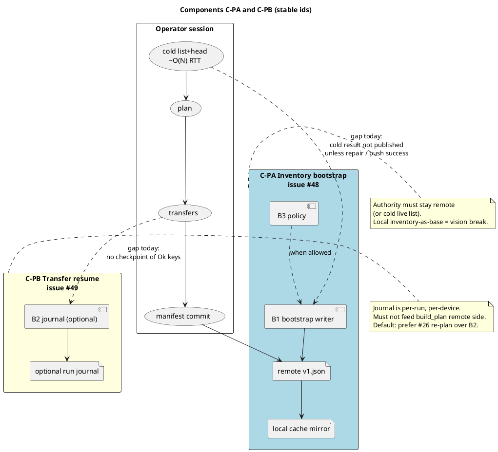
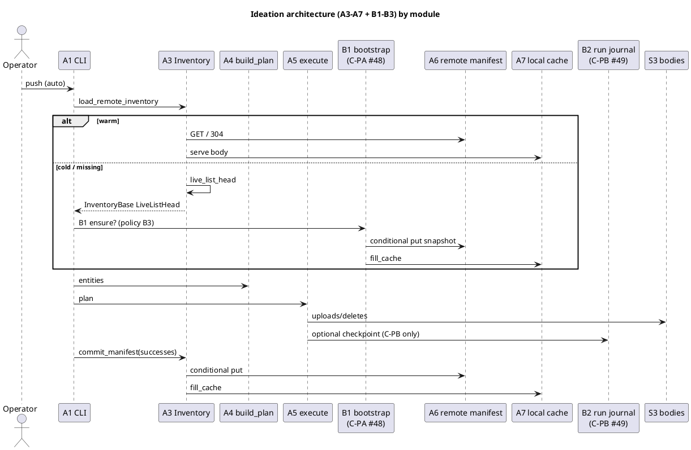
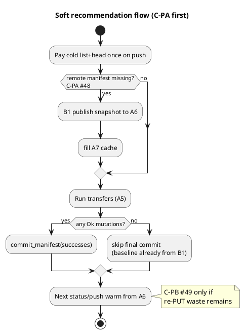

# Ideation: inventory bootstrap after cold plan (PR #46 follow-on)

**Status:** ideation / open discussion (not a locked design, not an implementation plan).  
**Context:** PR [#46](https://github.com/tlkahn/vaultsync/pull/46) (issue #45 inventory manifest) lands the warm path; operator comments + smoke test show a remaining gap: cold list+head cost can be re-paid forever until the first successful remote manifest write.  
**Parents:** [inventory-manifest.md](../inventory-manifest.md), [plans/issue-45.md](../plans/issue-45.md), vision "no local prev-sync DB", Q3 (no status auto-write).  
**Tracking:** [#47](https://github.com/tlkahn/vaultsync/issues/47)  
**Components:**

| Component | Issue | Module focus |
| --------- | ----- | ------------ |
| **C-PA / P-A** Inventory bootstrap | [#48](https://github.com/tlkahn/vaultsync/issues/48) | B1 writer + B3 policy - make later plans warm after one cold inventory |
| **C-PB / P-B** Transfer resume | [#49](https://github.com/tlkahn/vaultsync/issues/49) | B2 optional journal at A5 only - skip already-Ok PUTs on retry |

**Related:** [#42](https://github.com/tlkahn/vaultsync/issues/42) (cold plan-build latency / progress), [#26](https://github.com/tlkahn/vaultsync/issues/26) (re-plan-as-resume; constrains P-B).  
**Evidence:**

- Review thread: [comment 5472302524](https://github.com/tlkahn/vaultsync/pull/46#issuecomment-5472302524) (interrupted transfer / missing manifest; planner does not write).
- Smoke test: [comment 5472308083](https://github.com/tlkahn/vaultsync/pull/46#issuecomment-5472308083) (~1800 files on real AWS S3: warm status ~1.1s vs cold list+head ~35s, ~33-37x).

This note exists so we can **discuss and enrich** before locking Qs. Nothing here is normative until promoted into a design note + plan on the owning component issue. **Do not implement from this spike alone.**

---

## 1. Problem restatement

### 1.1 What #45 already fixed

Once `.vaultsync/manifest/v1.json` exists and is valid:

- `status` / `push` / `pull` plan from one GET (or 304 + local cache).
- Steady-state cost is flat in N (smoke: ~1s at 1800 files).
- Cold/repair remain I15-correct and fail-closed.
- Bodies first, manifest last; only successful mutations enter commit.

### 1.2 What still hurts

The remote manifest is written only by:

| Writer | Gate |
| ------ | ---- |
| `commit_manifest` after `push` | at least one successful remote mutation |
| `vaultsync repair` | explicit operator action |

The **planner never writes**. Q3 forbids auto-write after cold `status`. Local cache is filled only from a valid remote fetch, commit, or repair - never from a synthesized cold listing.

```text
push/status  ->  cold list+head (pay ~35s at 1.8k files)
             ->  transfers fail / Ctrl-C / zero Ok mutations
             ->  no remote v1.json
             ->  next run cold-lists again
```

### 1.3 Non-goals (carry forward unless reopened)

- No local-only planning authority.
- No prev-sync / deletion journal DB.
- No `pull` manifest write.
- No status-side remote mutation by default (Q3).
- Manifest remains a rebuildable snapshot, not a WAL.

---

## 2. Two components (modules)

Conflating these leads to the "local tracking manifest" trap. They ship as **separate issues** and **separate code seams**.

| Id | Component | Issue | Operator pain | Success metric | Ship stance |
| -- | --------- | ----- | ------------- | -------------- | ----------- |
| **C-PA** | Inventory bootstrap | [#48](https://github.com/tlkahn/vaultsync/issues/48) | Every plan redoes list+N heads because remote `v1.json` never landed | After one cold inventory, later plans are warm even if transfers failed | **Primary** |
| **C-PB** | Transfer resume | [#49](https://github.com/tlkahn/vaultsync/issues/49) | Large push dies mid-way; retry re-PUTs work already done | Failed run can skip already-Ok keys without re-planning remote inventory from scratch | **Deferred** after C-PA; reconcile with #26 |

**C-PA** is about *what the planner believes the remote file set is*.  
**C-PB** is about *which mutating actions the executor still owes*.

PR #46 partially touches C-PB at commit time (only Ok mutations upsert) but does not checkpoint mid-run and does not solve C-PA when zero mutations commit.



---

## 3. Architecture overview

Stable element ids for later plans to cross-reference. Module ownership in the rightmost column.

| Id | Element | Role | Module |
| -- | ------- | ---- | ------ |
| A3 | Inventory facade (`load_remote_inventory`) | Read path; today never writes from cold | shared read |
| A4 | `plan()` / `build_plan` | Unchanged consumer of entities | shared; **never reads B2** |
| A5 | `execute_plan` | Mutation source | C-PB may journal here |
| A6 | Remote `.vaultsync/manifest/v1.json` | Planning authority when valid | C-PA writes via B1 |
| A7 | Local `.vaultsync/cache/*` | 304 mirror only; never authority | filled after A6 put |
| B1 | **Bootstrap writer** | Publish A6 from cold `InventoryBase` without file-body successes | **C-PA** (#48) |
| B2 | **Run journal** (optional) | JSONL of per-key outcomes for one push | **C-PB** (#49) |
| B3 | CLI / config policy | When B1 may run | **C-PA** (#48) |



### Authority table (must hold for any option we keep)

| Source | May plan from? | May skip transfer from? | Multi-device shared? |
| ------ | -------------- | ----------------------- | ------------------- |
| A6 remote manifest (valid) | yes | n/a (plan only) | yes |
| Cold live list+head | yes | n/a | yes (live) |
| A7 local cache | only after validated against remote (304 / fingerprint) | no | no |
| Local full-inventory "tracker" | **no** (rejected) | no | no |
| B2 run journal | **no** | yes, only if #49 locks O4 | no |

---

## 4. C-PA module options (issue #48)

Owned end-to-end by [#48](https://github.com/tlkahn/vaultsync/issues/48). Goal: after one cold inventory on push, later plans are warm even when transfers fail.

### 4.1 O0 - Docs / operator only

Document "large vault: run `vaultsync repair` once before flaky push loops".

| | |
| - | - |
| Solves C-PA? | yes, if operator complies |
| Vision fit | perfect |
| Cost | zero code |

Ship this guidance in PR #46 docs even if O1 code comes later.

### 4.2 O1 - Push-time remote bootstrap (preferred)

On `push`, when the inventory base is cold because the remote manifest is **missing** (and maybe **invalid** under H1), publish A6 from `base.file_entities` **before transfers**, independent of mutation success.

```text
cold list+head
  -> B1 ensure_remote_manifest(base)   # shared write path with repair
  -> transfers
  -> commit_manifest(successes)        # existing S5
```

| Variant | Trigger | Write timing |
| ------- | ------- | ------------ |
| O1a | missing only | before transfers |
| O1b | missing or invalid | before transfers (align H1) |
| O1c | any `LiveListHead` base on push | before transfers (even `list_head` mode?) |
| O1d | missing only | **after** transfers always (even 0 successes) |

**O1a/O1b before transfers** maximizes interrupt survival: Ctrl-C during uploads still leaves a warm baseline.

Reuse: `commit_manifest` with empty successes is `SkippedNoMutations` today. B1 needs a sibling `publish_inventory_snapshot` / shared `write_manifest_body` with repair (no second list).

| | |
| - | - |
| Solves C-PA? | yes |
| Vision fit | good: remote SoT, no local authority |
| Q3 | intact if **status/pull never call B1** |
| Multi-device | other devices warm immediately after B1 |

### 4.3 O2 - Explicit bootstrap only

`repair` remains the only writer; optional sugar (`status --write-manifest`, config `bootstrap = never|repair|push-ensure`). Low surprise, weak default UX unless default is push-ensure (then it collapses to O1).

### 4.4 O3 - Local full-inventory tracker (**rejected** as planner input)

Writing a local remote-view after cold list and planning from it without revalidation is unsafe (stale Skip / silent under-upload) and breaks multi-device + vision. Document as anti-pattern only.

### C-PA open questions (lock on #48 before code)

| Id | Question | Strawman |
| -- | -------- | -------- |
| IQ1 | Default bootstrap policy? | `push-ensure` on missing |
| IQ2 | B1 on invalid/corrupt too? | missing + invalid (H1-aligned) |
| IQ3 | B1 before or after transfers? | **before** |
| IQ4 | B1 when `mode=list_head`? | **no** |
| IQ5 | Zero-mutation push that only B1: UX? | print one bootstrap line |
| IQ6 | Config knob in v1? | hardcode push-ensure first |
| IQ7 | Share code with repair how? | extract `write_manifest_body(...)` |
| IQ9 | `status --write-manifest`? | defer; repair enough |

### C-PA acceptance pins (if promoted to plan on #48)

1. Cold push, kill after B1 before transfers: remote A6 exists; next `status` warm (mock list-counter pin).
2. Status cold never writes (Q3); pull never writes (Q6).
3. B1 lost race: warning, no clobber; final commit still attempted.
4. B1 + partial Ok + final commit: entries = base ∪ successes.
5. `push --dry-run` must **not** B1.
6. Strict `mode=manifest` + missing: product choice on status error vs push-create.

---

## 5. C-PB module options (issue #49)

Owned by [#49](https://github.com/tlkahn/vaultsync/issues/49). **Deferred** until C-PA (#48) is measured. Related locks: [#26](https://github.com/tlkahn/vaultsync/issues/26) resume = re-plan, [#24](https://github.com/tlkahn/vaultsync/issues/24) SIGINT drain, [#25](https://github.com/tlkahn/vaultsync/issues/25) checksum skip.

### 5.1 O4 - Local run journal (optional fast-follow)

During `push`, append per-key outcomes under `<vault>/.vaultsync/run/`:

```text
{"v":1,"key":"a.md","op":"upload","state":"done","etag":"...","size":123,"mtime_ms":...}
```

Rules if ever locked:

1. Never feeds A4 remote inventory.
2. May filter A5 only with identity checks (size/mtime; optional etag).
3. Deleted on successful remote manifest commit (or `push --reset-run`).
4. Corrupt journal => ignore, full execute.
5. JSONL first; no new crate unless proven need.

**#26 tension:** #26 rejects action journals as correctness state. O4 must be locked as a **deletable advisory helper** under "wipe it and full live re-plan still converges", or rejected in favor of pure re-plan + #24/#25.

Default stance: **prefer no journal**; exhaust #48 + #26/#24/#25 first.

### 5.2 O5 - Mid-run remote commit (parked)

Conditional-commit every K successes. High race/complexity; usually worse ROI than O1 baseline + final commit. Park unless multi-hour pushes need other devices to see partial inventory live.

### C-PB open question

| Id | Question | Strawman |
| -- | -------- | -------- |
| IQ8 | Pursue O4 in same wave as #48? | **no - later on #49 only** |

---

## 6. Race matrix (both modules)

| Scenario | O1 (C-PA) | O3 local inventory | O4 journal (C-PB) |
| -------- | --------- | ------------------ | ----------------- |
| Ctrl-C mid-upload after B1 | A6 baseline warm; may lack new bodies until final commit | Avoids list on this device only; stale risk | Skips done keys on retry |
| Ctrl-C before B1 finishes | same as today | n/a | n/a |
| Second machine | sees A6 after B1 | blind | blind |
| Concurrent push | If-Match / If-None-Match; lost race warning + repair | two stale locals | two journals; commit still gated |
| External delete/console put | warm plan wrong until repair (already true for A6) | same, harder to notice | unaffected if plan from A6 |
| Partial Ok + commit fail | bodies ahead; existing repair story | - | journal may still list dones |

**Net:** O1 inherits #45 race model. O3 creates silent skip hazards. O4 is fine only under "journal is not inventory".

---

## 7. Interaction with locked #45 decisions (C-PA)

| Lock | Interaction if we pursue O1 on #48 |
| ---- | ---------------------------------- |
| Q1 `auto` default | cold missing -> B1 on push -> next loads warm |
| Q2 lost commit race exit 0 | B1 and final commit share warning shape |
| Q3 no status auto-write | **keep**; B1 is push-only |
| Q6 no pull write | **keep** |
| D-commit-order bodies first | B1 publishes *pre-transfer remote snapshot* only; does not claim in-flight uploads; final commit still applies successes last |
| Local cache never authority | B1 refreshes A7 only after successful A6 put |
| No local prev-sync DB | C-PB journal must stay out of plan remote side |
| Single-writer-per-prefix | unchanged |

---

## 8. Candidate policy sketch (C-PA product shape)

```toml
[inventory]
mode = "auto"           # existing
# ideation only on #48:
# bootstrap = "push-ensure" | "never" | "explicit"
```

```text
vaultsync repair              # already: full cold rebuild + write
vaultsync push                # may B1 under push-ensure (#48)
vaultsync status              # never writes remote (Q3)
```

```text
inventory: list+head (cold)
inventory: manifest bootstrap written (N entries)   # new on #48
inventory: manifest (N entries)
```

---

## 9. Soft recommendation

1. **Primary [#48](https://github.com/tlkahn/vaultsync/issues/48):** O1 push-time remote bootstrap (missing-first; consider invalid). Shared write helper with repair.
2. **Docs now:** O0 repair-once guidance on large vaults (PR #46 / cli note).
3. **Secondary [#49](https://github.com/tlkahn/vaultsync/issues/49):** O4 only if re-PUT waste remains after #48; default prefer #26 re-plan.
4. **Reject:** O3 as planner input.
5. **Park:** O5 chunked mid-run commits.



---

## 10. Discussion prompts

1. Is "push may write control plane even when no file transfer succeeds" acceptable, or must it be opt-in? (locks on #48)
2. Confirm `push --dry-run` must not B1.
3. For k/m-level vaults, is repair-once + docs enough, making O1 optional polish?
4. N5 backends without conditional PUT: B1 degrades like commit?
5. Ignore patterns: B1 should store unfiltered remote set (same as today).
6. Naming: `bootstrap` vs `ensure` vs `publish_snapshot` vs fold into `commit_manifest`?
7. For #49: is any on-disk journal acceptable under #26, or is re-plan + checksum skip the whole resume story?

---

## 11. Doc map / next steps

| Step | Artifact |
| ---- | -------- |
| This file | ideation (discussion) |
| Tracking | [#47](https://github.com/tlkahn/vaultsync/issues/47) |
| C-PA implementation track | [#48](https://github.com/tlkahn/vaultsync/issues/48) - lock IQs, then design addendum + `doc/plans/issue-48.md` |
| C-PB deferred track | [#49](https://github.com/tlkahn/vaultsync/issues/49) - after #48 outcome + #26 reconciliation |
| Code seams (C-PA) | `src/inventory.rs` (B1), `src/cli.rs` push arm, inventory/cli tests |
| Code seams (C-PB) | `execute_plan` only; never `build_plan` |

**Do not implement from this spike alone.** Promote locks on the component issue first.

---

## 12. Revision log

| Date | Change |
| ---- | ------ |
| 2026-08-31 | Initial ideation from PR #46 comments 5472302524 / 5472308083 (P-A/P-B split, O0-O5, soft recommend O1). |
| 2026-08-31 | Simplify into modules C-PA / C-PB; open component issues #48 / #49; parent tracking #47; slim option space per module. |
